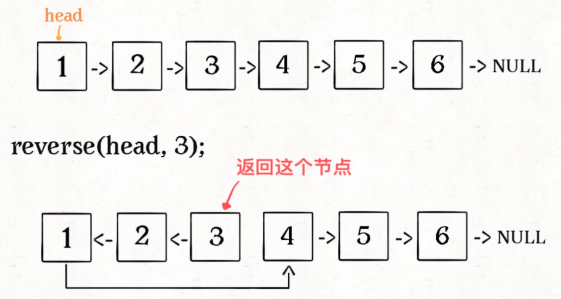
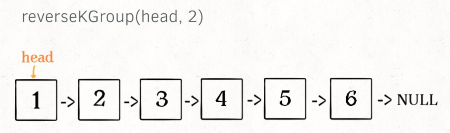
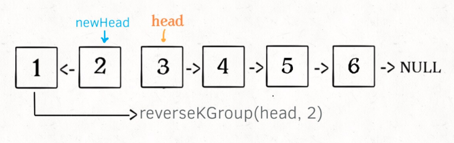
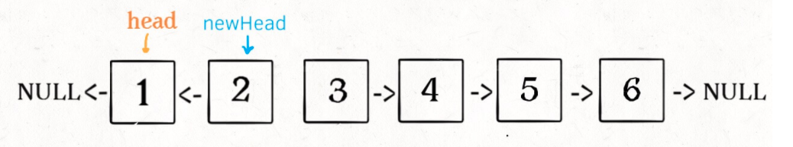
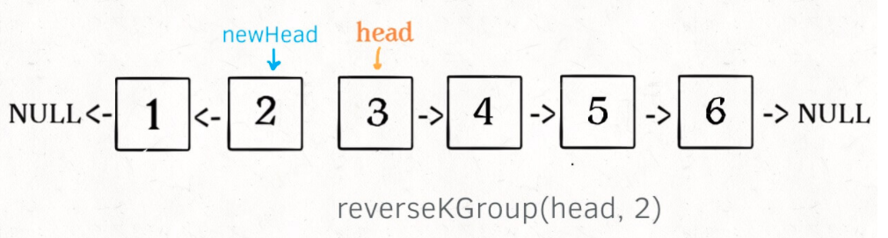
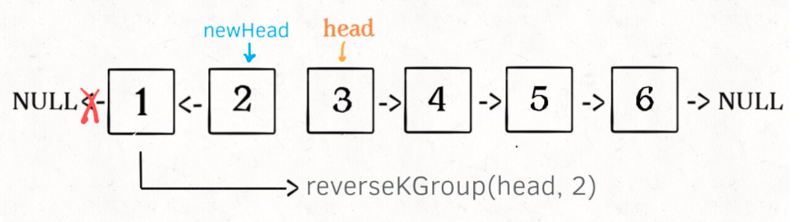

## 递归 `Recursion`

递归算法是我最早学习的算法，但也是掌握难度相对来说比较大的算法。

在数学与计算机科学中，**递归(Recursion)是指在函数的定义中使用函数自身的方法。**在算法中递归应用之广毋庸置疑`回溯，分治，动态规划，贪心算法`中都推导的过程中可能用到递归算法。比如实际上，递归，顾名思义，其包含了两个意思：**递** 和 **归**，这正是递归思想的精华所在：

**递归就是有去（递去）有回（归来）：**

- **“有去”**是指：递归问题必须可以分解为若干个规模较小，与原问题形式相同的子问题，这些子问题可以用相同的解题思路来解决，就像上面例子中的钥匙可以打开后面所有门上的锁一样
- **“有回”**是指 : 这些问题的演化过程是一个从大到小，由近及远的过程，并且会有一个明确的终点(临界点)，一旦到达了这个临界点，就不用再往更小、更远的地方走下去

### 递归的技巧

上面阐述递归思想好像很有道理，但终究是比较宏观的概念，如果没有很好的技巧很难使用递归来解决算法问题，初学者常见的误区就是跳进递归的迭代过程，用自己有限的大脑🧠来模拟递归，这显然是完全不可取的。

设计递归算法的时候，主要流程设计分四步走：

+ **第一步**要做的是分析你想拆分出来的子问题，举个例子，比如要用递归反转一个链表，每次要做的是更改当前节点的指针。
+ **第二步**分析出子问题之后要做的就是设计递归的方向，并且确定你是要先操作再递归还是先递归再操作。这里我们在下面具体到问题中解释，因为链表和树的结构在这里差很多。
+ **第三步**设计返回条件，并且根据根据你设计的递归方向和操作顺序，前进到递归第一个处理的节点(子问题)，再那个子问题上设计解决子问题的算法。
+ **第四步**坚信你的算法能`a`题 — 运行！。

当然还有其他的技巧：

+ 递归每次只能向上返回一个值，如果在递归的过程中用到了或者想记录某些值，那完全可以使用全局变量，还可以配合闭包让写法更优雅。

## 链表问题

用递归解决链表类问题，往往并不是最好的选择，因为递归的过程中创建的函数调用栈导致算法的空间复杂度往往是 `O(n)`效率不如迭代来的实在，但是总还是要会的。

**链表递归的技巧：**

对于链表递归一般有两种写法：

第一种写法，先处理子问题再递归向前，第二种则是先递归向前到最后要处理的节点，再处理子问题。

```ts
function recursion(node: ListNode) {
  if (xxx) return node;
  // style1: do something;
  recursion(node.next);
  // style2: do something;
}
```

这两种写法解决的问题往往不同，不过不管是哪个都要遵循上面我们写的规则，第一种往往在第一个节点就设计子问题算法，第二种则在深入的最后的一个节点设计子问题。

#### [206. 反转链表](https://leetcode-cn.com/problems/reverse-linked-list/)

**题目描述**

反转一个单链表：

```ts
输入: 1->2->3->4->5->NULL
输出: 5->4->3->2->1->NULL
```

**算法设计**

反转链表这道题大家再熟不过了，但是用递归来实现还是有一点点难度的。按照我们上面的四步走：

+ 首先我们分析子问题，子问题就是怎么反转单个节点的指针，直接写出来：

  ```TS
  node.next.next = node;
  node.next = null
  ```

+ 但是在算法里面我们发现了问题，`next`指针会丢失，为了解决这个问题我们走到了第二步，设计方向，既然前进的指针会丢失，我们就先前进到最后一个节点在处理子问题，这样在递归出栈的过程中我们不用指针也能遍历所有节点。

  在这个节点模拟一下子问题算法执行过程，发现好像可以：

  ```ts
  let ret = reverseList(head.next);
  ```

+ 走到第三部，因为这道题子问题比较简单，在上面已经处理完了，我们可以直接写出我们的算法，然后坚信它能运行成功了：

```ts
function reverseList(head: ListNode | null): ListNode | null {
    if (!head || !head.next) {
        return head;
    }
    let ret = reverseList(head.next);

		head.next.next = head;
    head.next = null;
    return ret;
};
```

> [结语：]()这道题的返回值的设计还是很精妙的。

#### [92. 反转链表 II](https://leetcode-cn.com/problems/reverse-linked-list-ii/)

**题目描述**

反转从位置 *m* 到 *n* 的链表`(1 ≤ m ≤ n ≤ 链表长度)`，请使用一趟扫描完成反转。

```ts
输入: 1->2->3->4->5->NULL, m = 2, n = 4
输出: 1->4->3->2->5->NULL
```

**算法设计**

想要解决这道题需要很高的技巧性，我们可以先把这个问题分解成两个子问题：递归前进到第一个要被反转的节点、在那个节点反转 `n-m`个节点：

先来解决第二个问题，反转 `n-m` 个链表(反转前 `x` 个链表)：

```TS
// 将链表的前 n 个节点反转（n <= 链表长度）
ListNode reverseN(ListNode head, int n)
```

比如说对于下图链表，执行 `reverseN(head, 3)`：



因为上面我们已经写过反转链表的代码，这个子问题肯定难不住我们，只不过我们要进行一个节点的衔接，原来 `1.next` 应该是`null` 但是这里应该是 `4`，所以我们使用一个额外变量记录这个 `4`(==这就用到上面提到的额外技巧==)并且进行衔接：

```ts
let successor = null;
function reverseN(head: ListNode | null, n: number): ListNode | null {
  if (n === 1) {
    successor = head.next;
    // 记录后继节点
    return head;
  }
  let newHead = reverseN(head.next, n - 1);
  head.next.next = head;
  head.next = successor;
  return newHead;
}
```

然后解决第二个子问题，这个就更简单了，我们可以注意到 `reverseN` 返回的就是新的头节点，所以我们能写出下面的代码：

```ts
function reverseBetween(head: ListNode | null, left: number, right: number): ListNode | null {
    if (left === 1) {
        return reverseN(head, right)
    }
    head.next = reverseBetween(head.next, left - 1, right - 1);
    return head;
};
```

#### [25. K 个一组翻转链表`fucking hard`](https://leetcode-cn.com/problems/reverse-nodes-in-k-group/)

**题目描述**

给你一个链表，每 `k` 个节点一组进行翻转，请你返回翻转后的链表

+ `k` 是一个正整数，它的值小于或等于链表的长度；
+ 如果节点总数不是 k 的整数倍，那么请将最后剩余的节点保持原有顺序；


```
输入：head = [1,2,3,4,5], k = 2
输出：[2,1,4,3,5]
```

**算法设计**

认真思考一下可以发现**这个问题具有递归性质**。什么叫递归性质？直接上图理解，比如说我们对这个链表调用 `reverseKGroup(head, 2)`，即以 2 个节点为一组反转链表：



如果我设法把前 2 个节点反转，那么后面的那些节点怎么处理？后面的这些节点也是一条链表，而且规模（长度）比原来这条链表小，这就叫**子问题**：



我们可以直接递归调用 `reverseKGroup(cur, 2)`，因为子问题和原问题的结构完全相同，这就是所谓的递归性质。发现了递归性质，就可以得到大致的算法流程：

1. 先反转以 `head` 开头的 `k` 个元素。
2. 将第 `k + 1` 个元素作为 `head` 递归调用 `reverseKGroup` 函数。
3. 将上述两个过程的结果连接起来。

```ts
function reverseBetween(left: ListNode, right: ListNode) {
    let pre = null; 
    let cur = left; 
    let nxt = left;

    while (cur !== right) {
        nxt = cur.next;
        cur.next = pre;
        pre = cur;
        cur = nxt;
    }

    return pre;
}
```

现在我们迭代实现了反转部分链表的功能，接下来就按照之前的逻辑编写 `reverseKGroup` 函数即可：

```ts
function reverseKGroup(head: ListNode | null, k: number): ListNode | null {
    let left = head;
    let right = head;
    for (let i = k; i > 0; i--) {
        if (right == null) return head;
        right = right.next;
    }
    let newHead = reverseBetween(left, right);
    left.next = reverseKGroup(right, k)
    return newHead;
};
```

#### [234. 回文链表](https://leetcode-cn.com/problems/palindrome-linked-list/)

**题目描述**

请判断一个链表是否为回文链表：

```
输入: 1->2
输出: false
输入: 1->2->2->1
输出: true
```

**算法设计**

同样按照上面的四步走：

+ 第一步分析子问题，子问题就是对比前后镜像的两个节点。
+ 第二步分析递归反向，既然要前后对比肯定是先走到最后，再前后对比，所以先向前后解决子问题。
+ 第三步我们再最后一个位置设计子问题算法的时候发现，拿不到镜像的节点，这个时候怎么办呢，很简单，用到额外技巧，缓存一下第一个节点，在函数调用栈反向遍历的同时正向移动这个缓存的指针，前后对比：

代码不就写出来了么。只不过，这个算法效率不是很好，进行了重复比较，这个问题可以通过快慢指针标记中间节点解决，但是在这里就不多做探讨了：

```ts
function isPalindrome(head: ListNode | null): boolean {
    let left = head;
    function dfs(right: ListNode | null): boolean {
        if (!right) return true;

        let res: boolean = dfs(right.next);
        res = res && (left.val === right.val);
        left = left.next;
        return res;
    }
    return dfs(head);
};
```

## 树问题

前面我们讲的关于链表的遍历，只有一种递归的方向就是一往无前对应两个操作时机：`前序遍历时操作`和`后续返回时操作`。

但是树就不一样了，树每次遍历有两个方向，操作可以插在三个不同的位置产生三种遍历方式(操作时机)：`前序遍历时`、`中序遍历时`、`后续遍历时`：

```ts
function traverse(root: ListNode) {
    // 前序遍历 do something
    traverse(root.left)
    // 中序遍历 do something
    traverse(root.right)
    // 后序遍历 do something
}
```

分析出这三种不同的遍历方式，我们在解题的时候还是先设计子问题，然后分析选用的操作顺序，然后移动到第一个操作的节点，设计子问题解决算法。

#### [226. 翻转二叉树](https://leetcode-cn.com/problems/invert-binary-tree/)

**题目描述**

翻转一棵二叉树。

```js
     4						 	4
   /   \		   		/   \
  2     7	  ->	 7     2
 / \   / \	 		/ \   / \
1   3 6   9		 9   6 3   1
```
**算法设计**

老四步走，第一步分析子问题：交换每个节点的左右节点。第二步分析操作顺序，果断的前序遍历。第三步直接写代码了：

```ts
function invertTree(root: TreeNode | null): TreeNode | null {
    if (!root) return null;
    [root.left, root.right] = [root.right, root.left];
    invertTree(root.left)
    invertTree(root.right)
    return root;
};
```

#### [114. 二叉树展开为链表](https://leetcode-cn.com/problems/flatten-binary-tree-to-linked-list/)

**题目描述**

给你二叉树的根结点 `root` ，请你将它展开为一个单链表：

+ 展开后的单链表应该同样使用 `TreeNode` ，其中 `right` 子指针指向链表中下一个结点，而左子指针始终为 `null` 。
+ 展开后的单链表应该与二叉树 先序遍历 顺序相同。


```
输入：root = [1,2,5,3,4,null,6]
输出：[1,null,2,null,3,null,4,null,5,null,6]
```

**算法设计**

这道题值得仔细分析一下，还是四步走：

+ 第一步分析子问题，子问题是每一轮如何挪动节点构造一个链表，就第一个节点分析，我们发现过程是先 `flatten` 左子树，再将处理好的左子树挂到右子树上，然后遍历到最后一个节点，`flatten`右子树并拼接。
+ 根据第一步我们分析出了操作顺序：中序遍历。
+ 最后设计子算法。

```ts
function flatten(root: TreeNode | null): void {
    function dfs(root: TreeNode | null): TreeNode | null {
        if (!root || (!root.left && !root.right)) {
            return root;
        }
        let rBranch = root.right;
        root.right = dfs(root.left);
        root.left = null;
        let node = root
        while (node.right !== null) {
            // get last right node
            node = node.right;
        }
        node.right = dfs(rBranch)
        return root;
    }
    dfs(root);
};
```

#### [116. 填充每个节点的下一个右侧节点指针](https://leetcode-cn.com/problems/populating-next-right-pointers-in-each-node/)

#### 题目描述

给定一个 完美二叉树 ，其所有叶子节点都在同一层，每个父节点都有两个子节点。二叉树定义如下：

```ts
struct Node {
  int val;
  Node *left;
  Node *right;
  Node *next;
}
```

填充它的每个 next 指针，让这个指针指向其下一个右侧节点。如果找不到下一个右侧节点，则将 next 指针设置为 NULL。


初始状态下，所有 next 指针都被设置为 NULL。

#### 算法设计

这是一道变式题，首先我们发现不管哪种遍历顺序，我们发现我们都会丢失一个指针即 `2->3` 这一类的指针，所以这个时候思维需要变通，三线同时向下递归：

```ts
function connect(root: INode | null): INode | null {
    if (!root) return null;
    connectDouble(root.left, root.right);
    return root;
};

function connectDouble(left: INode, right: INode) {
    if (left === null || right === null) return
    left.next = right;
    connectDouble(left.left, left.right);
    connectDouble(left.right, right.left);
    connectDouble(right.left, right.right);
}
```

