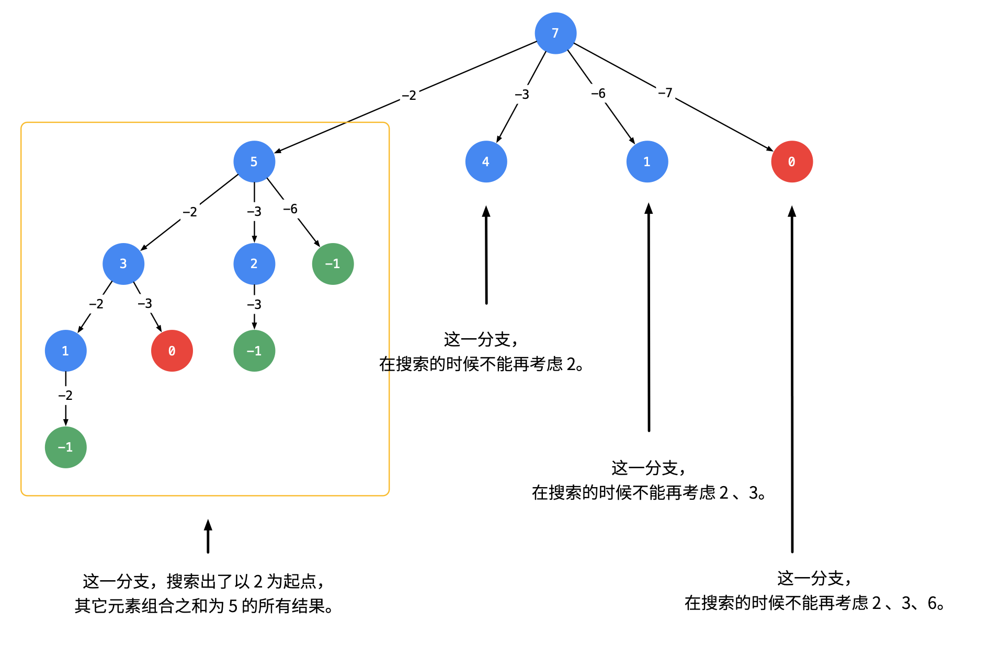

# 回溯算法

回溯算法实际上一个类似枚举的搜索尝试过程，是穷举的子集，主要是在搜索尝试过程中寻找问题的解，当发现已不满足求解条件时，就“回溯”返回，尝试别的路径。

**所谓的回溯，其实就是利用了for循环的执行先后顺序，比如同一层循环中，某一次循环断裂掉了，那么下一次循环一定会执行，也就是所谓的回溯，回到之前的状态。**

回溯法是一种系统**搜索**问题**解空间**的方法。为了实现回溯，需要给问题定义一个**解空间**。说到底它是一种**搜索算法**。只是这里的搜索是在一个叫做**解空间**的地方搜索。而往往所谓的**dfs**，**bfs**都是在图或者树这种数据结构上的搜索。

## 用回溯算法解决问题的一般步骤：

**回溯算法也叫试探法，它是一种系统地搜索问题的解的方法。**

1、 针对所给问题，定义问题的解空间，它至少包含问题的一个（最优）解。

2 、确定易于搜索的解空间结构,使得能用[回溯法](https://baike.baidu.com/item/回溯法)方便地搜索整个解空间 。

3 、以**深度优先DFS**的方式搜索解空间，并且在搜索过程中用剪枝函数避免无效搜索。

确定解空间的组织结构，回溯法就从开始根结点出发，以深度优先的方式搜索整个解空间。这个`开始结点`就成为一个`活结点`，同时也成为当前的扩展结点。在当前的`扩展结点`处，搜索向纵深`方向移至一个新结点`。这个新结点就成为一个`新的活结点`，并成为当前扩展结点。如果在当前的扩展结点处不能再向纵深方向移动，则当前扩展结点就成为`死结点`。此时，应往回移动（回溯）至`最近的一个活结点`处，并使这个[活结点成为当前的扩展结点]()。[回溯法](https://baike.baidu.com/item/回溯法)即以这种工作方式[递归](https://baike.baidu.com/item/递归)地在解空间中搜索，直至找到`所要求的解或解空间中已没有活结点`时为止。

### 什么是解空间

就是形如数组的一个向量**[a1,a2,....,an]**。这个向量的每个元素都是问题的部分解，只有当这个数组的每一个元素都**填满**(得到全部解)的时候，才表明这个问题得到了解答，又譬如N皇后问题中的解集（图中显示不全包括死结点level2应该有16种情况）。


### 横向搜索

搜索直白的说就是有目的的穷尽，最简单的就是`for`循环，上面的向量有`n`个维度，因此就是`n`个`for`循环。

**形如：**

```go
for(求a1位置上的解)
   for(求a2位置上的解)
      for(求a3位置上的解)
       ......
       ......
       for(求an位置上的解)
```

**但是如果n是100？n是100000？那么如何回溯？**

当然也可以写`n`个`for`循环，但是这样的程序会惨不忍睹。而且似乎`10000`个(不过往往回溯的时间复杂度太大，一般`n`不会这么大)`for`循环也很难写出来，因此我们需要一种全新的书写回溯的方法。

**形如：**

其实其本质就是一个递归，而且还是很简单的递归，只是为我们省去了书写重复for循环的过程。

```go
func backtrack(i int, n int, other parameters){
    if( distinct one ){
        //最优解条件
        record answer;
        return;
    }
    //下面的意思是求解空间第i个位置上的下一个解
    for next ans in position i of solution space {
        if other distinct {
            //这里的other distinct说的就是上面的剪枝函数。
        	backtrack(i+1, n, other parameters);
        }
    }
}

```

### 纵向搜索

上面的横向搜索过程每次我们都会在某个解空间位置上遍历所有可能值，直到最后有符合条件的解得出。其实我们还可以选择另一种遍历思路，每次我们只对一个可能值做选择 — **取或者不取**，从上而下构造一颗二叉树，二叉树的叶子节点就代表了所有的解。

这种搜索思路的编程范式如下，每次递归都会产生二叉树的两个子叶：

```go
func backtrack(i int, n int, other parameters){
    if( distinct one ){
        //最优解条件
        record answer;
        return;
    }
  	backtrack(i+1, n, other parameters);
  	// 不取当前可能值
  	backtrack(i+1, n - calculate i, other parameters);
  	// 取当前可能值，记录其对 n 的影响
}
```

其中如果某个位置的可能值可以无穷尽的选取，那么我们在不取的 `case` 上不移动 `i` 指针：

```ts
backtrack(i, n, other parameters);
// 不取当前可能值，且不移动指针
```

## N皇后问题

八皇后问题在学习回溯算法之前可以说是很难得但是在得到了上面的回溯算法公式之后就再简单不过了。

### 概述

*n* 皇后问题研究的是如何将 *n* 个皇后放置在 *n*×*n* 的棋盘上，并且使皇后彼此之间不能相互攻击。


### 思路分析

n皇后的解空间很好分析，就是N个循环次数为N的for循环，如果不加上剪枝函数的话那么需要进行搜索的次数就是n的n次幂，不过如下图我们使用了剪枝函数之后搜索的次数就会大大降低，而且我们要知道for循环之间创造的递归都是独立的。


### 实现

calcQueues函数用来计算摆放的所有可能，因为位置关系特殊，所以我们可以使用一个一维数组储存一次排放顺序，通过数组的长度来映射棋盘的行，对应的数据记录数组的列，最后使用一个二维数组来记录所有的解。

```go
func solveNQueens(n int) [][]string {
	answers := [][]string{}
    //储存答案的数组
	checkboard := make([]int, n)
    //记录棋盘的数组。
	calcQueues(&answers,n,checkboard,0)
	return ans
}
```

**确定最优解**

之后就是类似上面的公式了，如果说我们的行数（其实是下标所以计算时要加一）等于了N，那就说明前八行的皇后们成功兼容排列，也就是问题的最优解之一了，我们就把他记录下来，同时也作为递归出口。

**搜索**

然后作为搜索部分，我们使用了一个剪枝函数`isValid`来在发现皇后位置冲突的时候及时的消去分支，避免无意义的深度遍历。

```go
func calcQueues(ans *[][]string,n int,nums []int,row int) {
	if row == n {
		q := printQ(nums, n)
		*ans = append(*ans, q)
		return
	}

	for col := 0; col < n; col++ {
		nums[row] = col
		if isValid(nums,row) {
			calcQueues(ans,n,nums,row+1)
		}
	}
}
```

**剪枝函数**

想要判断是皇后位置冲突其实很简单，只要两皇后行列位置之差的绝对值相等或者时在同一列上，就是位置冲突。

```go
func isValid(nums []int,row int) bool {
	for i := 0;i < row; i++ {
        //这里我们注意我传入的是下标所以就不会发生皇后自身和自身的比较。
		if nums[i] == nums[row] || math.Abs(float64(row-i)) == math.Abs(float64(nums[row] - nums[i])){
			return false
		}
	}
	return true
}
```

### leetcode题解

`n 皇后`问题研究的是如何将 n 个皇后放置在 `n×n` 的棋盘上，并且使皇后彼此之间不能相互攻击，给定一个整数 `n`，返回所有不同的 `n 皇后`问题的解决方案，每一种解法包含一个明确的 `n` 皇后问题的棋子放置方案，该方案中 `'Q' 和 '.'` 分别代表了皇后和空位。


**完整代码**

```go
package main

import (
	"fmt"
	"math"
)

func solveNQueens(n int) [][]string {
	ans := [][]string{}
	checkboard := make([]int, n)
	calcQueues(&ans,n,checkboard,0)
	return ans
}

func calcQueues(ans *[][]string,n int,nums []int,row int) {
	if row == n {
		q := printQ(nums, n)
		*ans = append(*ans, q)
		return
	}

	for col := 0; col < n; col++ {
		nums[row] = col
		if isValid(nums,row) {
			calcQueues(ans,n,nums,row+1)
		}
	}
}

func isValid(nums []int,row int) bool {
	for i := 0;i < row; i++ {
		if nums[i] == nums[row] || math.Abs(float64(row-i)) == math.Abs(float64(nums[row] - nums[i])){
			return false
		}
	}
	return true
}

func printQ(res []int, n int) []string {
	s := []string{}
	for _, v := range res {
		str := ""
		for i := 0; i < n; i++ {
			if i == v {
				str += "Q"
			} else {
				str += "."
			}
		}
		s = append(s, str)
	}
	return s
}

func main() {
	for _,col := range solveNQueens(4) {
		for _,row := range col{
			fmt.Println(row)
		}
	}
}
```

## [39. 组合总和](https://leetcode-cn.com/problems/combination-sum/)

给定一个无重复元素数组 `candidates` 和一个目标数 `target` ，找出 `candidates` 中所有可以使数字和为 `target` 的组合。

+ 所有数字（包括 `target`）都是正整数。
+ 解集不能包含重复的组合。 
+ `candidates` 中的数字可以无限制重复被选取。

**示例 1：**

```ts
输入：candidates = [2,3,6,7], target = 7,
所求解集为：
[
  [7],
  [2,2,3]
]
```

### 算法策略

对于这道题解空间就是相加为 `target` 的 `candidates` 元素组合集，我们要做的就是在 `candidates` 上搜索，而这道题的重点在于不能包含重复的组合，由于 `candidates` 上不包含重复元素，所以我们在遍历的过程中只要不逆向(先前再后)就不会重复。基本算法框架定好了，我们可以选择两种搜索思路：

###### 纵向搜索

我们定义递归函数 `dfs(target, combine, idx)` 表示当前在 `candidates` 数组的第 `idx` 位，还剩 `target` 要组合，已经组合的列表为 `combine`。递归的终止条件为 `target <``= 0` 或者 `candidates` 数组被全部用完。那么在当前的函数中，每次我们可以选择跳过不用第 `idx` 个数，即执行 `dfs(target, combine, idx` + `1)`。也可以选择使用第 `idx` 个数，即执行 `dfs(target - candidates`[`idx`], `combine, idx)`，注意到每个数字可以被无限制重复选取，因此搜索的下标仍为 `idx`。

更形象化地说，如果我们将整个搜索过程用一个树来表达，即如下图呈现，每次的搜索都会延伸出两个分叉，直到递归的终止条件，这样我们就能不重复且不遗漏地找到所有可行解：


代码如下：

```ts
var combinationSum = function(candidates, target) {
    const ans = [];
    const dfs = (target, combine, idx) => {
        if (idx === candidates.length) {
            return;
        }
        if (target === 0) {
            ans.push(combine);
            return;
        }
        // 直接跳过
        dfs(target, combine, idx + 1);
        // 选择当前数
        if (target - candidates[idx] >= 0) {
            dfs(target - candidates[idx], [...combine, candidates[idx]], idx);
        }
    }

    dfs(target, [], 0);
    return ans;
};
```

###### 横向搜索

横向搜索没什么好说的，每次选取从 `i` 往后的所有可能解作为当前节点的子叶向下扩展，直到有路径上的所有解累加值为 `target`就添加到解集并且结束那个节点的扩展，递归树如下(这是一个累减的递归树不过同理)：


我们可以进行排序优化，如果当前 `curVal` 已经大于 `target` 那后面的所有分支都可以被修剪：



最后得出的代码如下：

```ts
function combinationSum(candidates: number[], target: number): number[][] {
    let res = [];
    candidates.sort((a, b) => a - b);
    function dfs(i: number, curVal: number, curRes: number[]) {
        if (curVal === target) {
            res.push(curRes);
        }

        for (; i < candidates.length; i++) {
            let nextVal = curVal + candidates[i];
            if (nextVal > target) {
                break;
            }
            let nextRes = curRes.slice();
            nextRes.push(candidates[i]);
            dfs(i, curVal + candidates[i], nextRes)
        }
    }

    dfs(0, 0, []);

    return res;
};
```

## [40. 组合总和 II](https://leetcode-cn.com/problems/combination-sum-ii/)

给定一数组 `candidates` 和一个目标数 `target` ，找出 `candidates` 中所有可以使数字和为 `target` 的组合。

+ 所有数字（包括 `target`）都是正整数。
+ 解集不能包含重复的组合。 
+ `candidates` 中的每个数字在每个组合中只能使用一次。

**示例 1：**

```ts
输入: candidates = [10,1,2,7,6,1,5], target = 8,
所求解集为:
[
  [1, 7],
  [1, 2, 5],
  [2, 6],
  [1, 1, 6]
]
```

### 算法策略

这道组合问题去掉了无重复数组和重复使用数字的条件，重点落在了不能包含重复的组合，由于数组中出现了重复的的数字所以最后的解有可能是相同的比如：

```ts
7
|\
1 1
// [[7, 1], [7, 1]]
```

这个时候我们就需要冷静的分析什么样的解是重复且无意义，首先我们对数组进行排序，这样方便我们过滤数字，根据下面这张图我们就知道了，多个连续的重复可能值，只有第一个是有意义的，后面的所有重复值都可以被剪枝：

```ts
 nil
 /|\
1 1 2...
	x
```

于是我们就写出了这样的剪枝函数：

```ts
if (i != start && candidates[i] === candidates[i - 1]) {
  continue;
}   
```

最后的算法就长这个样子：

```ts
function combinationSum2(candidates: number[], target: number): number[][] {
    let res = [];
    candidates.sort((a, b) => a - b);
    function dfs(i: number, curVal: number, curRes: number[]) {
        if (curVal === target) {
            res.push(curRes);
        }
        let s = i;
        for (; i < candidates.length; i++) {
            if (i != s && candidates[i] === candidates[i - 1]) {
                continue;
            }        
            let nextVal = curVal + candidates[i];
            if (nextVal > target) {
                break;
            }
            let nextRes = curRes.slice();
            nextRes.push(candidates[i]);
            dfs(i + 1, curVal + candidates[i], nextRes)
        }
    }

    dfs(0, 0, []);
    return res;
};
```

涉及重复解过滤的回溯问题我一般使用横向遍历，因为纵向遍历不方便记忆前一个可能值来过滤重复路径。

## [216. 组合总和 III](https://leetcode-cn.com/problems/combination-sum-iii/)

找出所有相加之和为 ``n`` 的 *``k``* 个数的组合*。*组合中只允许含有 ``1 - 9`` 的正整数，并且每种组合中不存在重复的数字。

+ 所有数字都是正整数。
+ 解集不能包含重复的组合。 

```
输入: k = 3, n = 9
输出: [[1,2,6], [1,3,5], [2,3,4]]
```

### 算法策略

这道题的变式是要控制的指针由一个变成了两个，第一个是 `i` 表示 `1-9` 的选取下标，第二个是 `k_i` 表示第 `k_i`个数，不多说直接上算法：

```ts
function combinationSum3(k: number, n: number): number[][] {
    let res = [];
    function dfs(i: number, r: number, curSum: number, curRes: number[]) {
        if (curSum === n) {
            res.push(curRes);
        }

        for (; i < 10; i++) {
            let nextVal = curSum + i;
            if (nextVal > n || (nextVal === n && r !== k)) {
                break;
            }
            let nextRes = curRes.slice();
            nextRes.push(i);
            dfs(i + 1, r + 1, curSum + i, nextRes);
        }
    }
    dfs(1, 1, 0, []);
    return res;
};
```

## [46. 全排列](https://leetcode-cn.com/problems/permutations/)

给定一个不含重复数字的数组`nums` ，返回其 所有可能的全排列 。你可以 按任意顺序 返回答案。

```ts
输入：nums = [1,2,3]
输出：[[1,2,3],[1,3,2],[2,1,3],[2,3,1],[3,1,2],[3,2,1]]
```

### 算法策略

这个问题可以看作有 `n` 个排列成一行的空格，我们需要从左往右依此填入题目给定的 `n` 个数，每个数只能使用一次。

我们可以将题目给定的 `n` 个数的数组 `nums` 划分成左右两个部分，左边的表示已经填过的数，右边表示待填的数，我们在回溯的时候只要动态维护这个数组即可。

具体来说，假设我们已经填到第`first`个位置，那么`nums`数组中 [`0`,`first-1`] 是已填过的数的集合，[`first, n-1`] 是待填的数的集合。我们肯定是尝试用 [`first, n-1`]  里的数去填第`first`个数，假设待填的数的下标为 `i` ，那么填完以后我们将第 `i` 个数和第`first`个数交换。不断的计算递归我们就能得到下面的递归树：


算法如下：

```ts
function permute(nums: number[]): number[][] {
    let res = [];
    function dfs(i: number, curRule: number[]) {
        if (i === nums.length - 1) {
            res.push(curRule);
        }
        for (let j = i; j < nums.length; j++) {
            let nextRule = curRule.slice();
            [nextRule[i], nextRule[j]] = [nextRule[j], nextRule[i]];
            dfs(i + 1, nextRule);
        }
    }
    dfs(0, nums);
    return res;
};
```

## [78. 子集](https://leetcode-cn.com/problems/subsets/)

给你一个整数数组 `nums` ，数组中的元素 **互不相同** 。返回该数组所有可能的子集（幂集）。

解集 **不能** 包含重复的子集。你可以按 **任意顺序** 返回解集。

**示例 1：**

```
输入：nums = [1,2,3]
输出：[[],[1],[2],[1,2],[3],[1,3],[2,3],[1,2,3]]
```

### 算法策略

这道题用纵向搜索的解法非常的简单，对于第 `i` 个可能解，我们的选择可以是选或者不选的两个分支，就这样一层一层的构造二叉树，叶子节点就是所有的可能解：


通过这道题我们可以理解一下回溯的含义，为什么要回溯？

+ 因为不是找到一个子集就完事。
+ 找到一个子集，结束递归，要撤销当前的选择，回到选择前的状态，做另一个选择——不选当前的数，基于不选，往下递归，继续生成子集。
+ 回退到上一步，才能在包含解的空间树中把路走全，回溯出所有的解。

这个过程就是回溯：


当然，最后的代码如下：

```ts
function subsets(nums: number[]): number[][] {
    let n = nums.length;
    let res = [];
    /**
     * @params i 第i个数
     */
    function dfs(i: number, subSet: number[]) {
        if (i === n) {
            res.push(subSet);
            return;
        }
        // 当前位不取数字的情况
        dfs(i + 1, subSet.slice());

        let copy = subSet.slice();
        copy.push(nums[j]);
        dfs(i + 1, copy);
    }
    dfs(0, []);
    return res;
};
```

## [90. 子集 II](https://leetcode-cn.com/problems/subsets-ii/)

给你一个整数数组 `nums` ，其中可能包含重复元素，请你返回该数组所有可能的子集（幂集）。

解集 **不能** 包含重复的子集。返回的解集中，子集可以按 **任意顺序** 排列。

**示例 1：**

```ts
输入：nums = [1,2,2]
输出：[[],[1],[1,2],[1,2,2],[2],[2,2]]
```

### 算法策略

涉及到去重了，我们就不能使用老办法(纵向遍历)了，横向遍历才能更好的过滤重复解，重复解的过滤思路如下，这道题的重点是每一个节点都是一个可能解（所以节点都满足答案）：


算法代码如下：

```ts
function subsetsWithDup(nums: number[]): number[][] {
    let n = nums.length;
    nums.sort();
    let res = [];
    /**
     * @params k 第k位数
     */
    function dfs(k: number, subSet: number[]) {
        res.push(subSet);
        
        for (let i = k; i < n; i++) {
            if (i !== k && nums[i] === nums[i - 1]) {
                continue;
            }
            let copy = subSet.slice();
            copy.push(nums[i]);
            dfs(i + 1, copy);
        }
    }
    dfs(0, []);
    return res;
};
```

