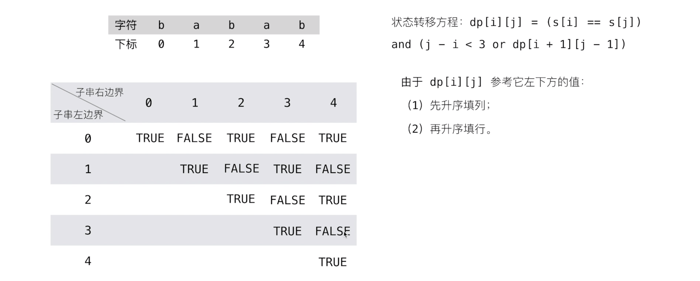
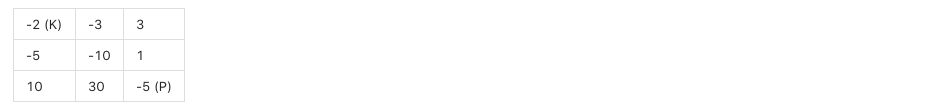

# 线性模型🌾

**两个变量之间存在一次方函数关系，就称它们之间存在线性关系。**在线性结构上进行状态转移DP，统称线性DP，注意问题中的未知数只有两个那就是n和f(n)，比如说分金币问题中的coins总数和charge次数。下面拿实际问题来举例子。

**注意**：已知量数组不属于变量，比如说金币面额。

## 	切木棍🌿

给定一段长度为n英寸的钢条和一个价格表pi(i=1，2，...，n)，求解切割钢条方案，使得销售收益rn最大。注意，如果长度为n英寸的钢条价格pn足够大，最优解可能就是完全不需要切割。


#### 思路🍀

考虑n=4的情况，我们所有可能的切割方案如下


我们将钢条从左边切割长度为i的一段，只对右边剩下的长度为n-i的一段继续进行切割（递归求解），对左边的一段则不再进行切割。即问题分解为：将长度为n的钢条分解为左边开始一段，以及对剩余部分继续分解的结果。这样，不做任何切割的方案可以描述为：第一段的长度为n，收益为pn，剩余部分长度为0，对应收益为r0=0。

#### 动态转移方程🍁

$$
f(l) = max(p^i + f(l-r^i))
$$

#### 暴力递归🥀

```go
func CutSteel(value []int, length int) int {
	if length == 0 {
		return 0
	}

	bestValue := math.MinInt64

	for i := 1; i <= length; i++ {
		preValue := value[i-1]+CutSteel(value,length-i)
		bestValue = int(math.Max(float64(preValue),float64(bestValue)))
	}
	return bestValue
}
```

####  动态规划写法🌷

对于rn（n1）,可以用更短地钢条的最优收割收益来描述它：
$$
rn = max(p^n，r^1 + r^n-1 ，r^2 + r^n-2，...，r^n-1 + r^1)
$$

- pn对应不切割，直接出售长度为n英寸的钢条方案
- 其他n-1个参数对应另外n-1种切割方案：对每个i=1，2，...，n-1，首先将钢条切割长度为i和n-i的两段，接着求解这两段的最优收益ri和rn-i（每种方案的最优收益为两段的最优收益之和）

```go
func BottomUpCutSteel(v []int, n int) int {
	r := make([]int, n+1)
	/*
		创建备忘录，用于记录长度为i的时候的最优解。
		我们只要拿到了上一轮的最优解，下一轮只需要比较之前最优解的组合外加上当前长度不切割的价值就可以了，依此递推，
	*/
	for i := 1; i <= n; i++  {
		bestChoice := -1
		for j := 1; j <= i; j++ {
			bestChoice = int(math.Max(float64(bestChoice), float64(v[j-1] + r[i-j])))
		}
		r[i] = bestChoice
	}
	return r[len(r)-1]
}
```

## lis🌼

`longest increasing substring` 最长递增子序列，给定数组`arr`，返回`arr`的最长递增子序列。

#### 动态转移方程🌽

f(n)表示以下标为n结尾的数组的最长递增子序列的长度。
$$
f(n) = max(f(n-i) + 1) ~~~~(~arr[n] > arr[n-i]~)
$$

#### 暴力递归🍏

注意最后一位不一定就是最长递增子序列的结尾，所以要遍历每一位。

```go
func lisRecusive (arr []int) int {
	bestAns := math.MinInt64
	for i := len(arr)-1;i >= 0 ;i--  {
		bestAns = int(math.Max(float64(bestAns),float64(lis(arr,i))))
	}

	return bestAns
}

func lis(arr []int,n int) int {
	if n == 0 {
		return 1
	}

	bestAns := math.MinInt64

	for i := n ;i > 0 ;i-- {
		if arr[n] > arr[n-i] {
			bestAns = int(math.Max(float64(bestAns),float64(lis(arr,n-i)+1)))
		}
	}

	return bestAns
}
```

#### 动态规划解决🍐

#### 

```go
func lisDynamic (arr []int) int {
	memory := make([]int,len(arr))
	memory[0] = 1
	for i := 1;i < len(arr);i++  {		//控制n
		for j := 0;j < i ;j++  {		//控制i
			if arr[j] < arr[i] {
				memory[i] = int(math.Max(float64(memory[j]+1),float64(memory[i])))
			}
		}
	}
	max := 0
	for _,item := range memory {
		max = int(math.Max(float64(item),float64(max)))
	}
	return max
}
```

## lcs🌻

`longest common substring` 最长公共子序列   给定数组`arr1，arr2`， 最长公共子序列。

#### 动态转移方程🍅


#### 暴力递归🍓

根据动态转移方程我们可以很轻松的写出递归方法

```go
func lcsRecursive(m,n []int,i,j int) int {
	if i == 0 || j == 0 {
		return 1
	}
	if m[i] == n[j] {
		return 1 + lcsRecursive(m,n,i-1,j-1)
	}else{
		return int(math.Max(float64(lcsRecursive(m,n,i-1,j)),float64(lcsRecursive(m,n,i,j-1))))
	}
}
```

#### 动态规划解决🍒

根据我们对dp数组进行分析不难推敲出规律，做出从下而上的动态规划解决方案即可。


```go
func lcsRynamic(m,n []int) int {
	if len(m) == 0 || len(n) == 0 {
		return 0
	}

	linear_dp := make([][]int, len(m)+1)

	for idx := range linear_dp {
		linear_dp[idx] = make([]int, len(n)+1)
	}

	for i := 1; i < len(linear_dp); i++  {
		for j := 1; j < len(linear_dp[i]); j++  {
			if m[i-1] == n[j-1] {
				linear_dp[i][j] = linear_dp[i-1][j-1] + 1
			}else{
				linear_dp[i][j] = int(math.Max(float64(linear_dp[i-1][j]),float64(linear_dp[i][j-1])))
			}
		}
	}
	for idx := range linear_dp {
		fmt.Println(linear_dp[idx])
	}
	return linear_dp[len(m)][len(n)]
}
```

# 区间模型🌺

所谓区间dp，顾名思义就是在一段区间上的动态规划。它既要满足dp问题的最优子结构和无后效性外，还应该符合在区间上操作的特点。我的理解是往往会对区间进行合并操作。抑或是单个元素（可看成一个小区间）跨区间进行操作。例如括号匹配问题，石子合并问题（通过多次的相邻合并，最后实质上会产生跨区间的合并，如果你把其中的石子看作参考系的话就很容易感觉出来），还有在整数中插入运算符号的问题（利用运算符的优先级以及交换律可看出），这样以来，如果我们要得知一个大区间的情况，由于它必定是由从多个长度不一的小区间转移而来（转移情况未知），我们可以通过求得多个小区间的情况，从而合并信息，得到大区间。

**对于一个长度为n的区间，确定它的子区间需要首尾两个指针，显然子区间数量级为n2，那区间dp的复杂度也就为n2**

### 范式🌴

区间 dp 的遍历顺序一般是竖向遍历，因为dp数组一般 y 轴为 i，x 轴为 j， 下面是一个列遍历的范式，len 为区间跨度：


```go
for len := 0; len < n; len++  {		
    for i := 0; i+l < n ; i++  {			/* 枚举起点，从1开始到n，i表示起点下标，j表示终点下标， */
        j := i + l										/* 计算终点坐标 */
      	/** 
	      	// do something such as 			/* 枚举区间分割点 */
      	  // for k := i; k < j ; k++  {		
            	//do something
        	// }
      	**/

    }
}
```

## 石子合并问题🌹

有N堆石子排成一排，每堆石子有一定的数量。现要将N堆石子并成为一堆。合并的过程只能每次将相邻的两堆石子堆成一堆，每次合并花费的代价为这两堆石子的和，经过N-1次合并后成为一堆。求出总的代价最小值。

#### 动态转移方程🌳

$$
dp[i][j]=min(dp[i][j],dp[i][k]+dp[k+1][j]+w[i][j]);
$$

#### 递归穷举解决🍃

递归的方法我们通过动态转移方程和容易就能写出来，不过这里我们要注意我注释的部分。

```go
func mergeStoneRecursive(sum []int, i, j int) int {
	if i == j {
		return 0
	}

	if j == i + 1 {
		return sum[j+1] - sum[i]
	}

	bestChoice := math.MaxInt64

	for k := i+1; k < j ; k++ {
		l := mergeStoneRecursive(sum,i,k-1) + mergeStoneRecursive(sum,k,j) + sum[j+1] - sum[i]
		r := mergeStoneRecursive(sum,i,k) + mergeStoneRecursive(sum,k+1,j) + sum[j+1] - sum[i]
		cbs := int(math.Min(float64(l),float64(r)))
		// 就以2，3，1为例，先合并2和3与先合并3和1的结果是不同的我们要取最小值。
		bestChoice = int(math.Min(float64(cbs),float64(bestChoice)))
	}

	if bestChoice == math.MaxInt64 {
		return 0
	}else{
		return bestChoice
	}
}
```

#### 备忘录优化🍂

如上文所说区间dp的数组是二维关于i和j的。

```go
func mergeStoneRecursiveMemorized(sum []int, memory [][]int, i, j int) int {
   if i == j {
      return 0
   }

   if memory[i][j] != 0 {
      return memory[i][j]
   }

   if j == i + 1 {
      memory[i][j] = sum[j+1] - sum[i]
      return memory[i][j]
   }

   bestChoice := math.MaxInt64

   for k := i+1; k < j ; k++ {
      l := mergeStoneRecursiveMemorized(sum,memory,i,k-1) + mergeStoneRecursiveMemorized(sum,memory,k,j) + sum[j+1] - sum[i]
      r := mergeStoneRecursiveMemorized(sum,memory,i,k) + mergeStoneRecursiveMemorized(sum,memory,k+1,j) + sum[j+1] - sum[i]
      cbs := int(math.Min(float64(l),float64(r)))
      bestChoice = int(math.Min(float64(cbs),float64(bestChoice)))
   }

   if bestChoice == math.MaxInt64 {
      return 0
   }else{
      memory[i][j] = bestChoice
      return bestChoice
   }
}
```

#### 动态规划解决🌱

设计动态规划写法之前，我们先分析一下上文的备忘录的结构。


首先`i==j`时，合并次数为`0`，`j<i`时合并次数为`0`，`j = j+1`时合并次数为`sum[j]-sum[i-1]`，我更倾向于让数组最外面留一层作为初始值，所以i的下标从`1`开始，但是实际上区间是没有必要多出一圈的。

```go
func mergeStone(n int,w []int) int   {
	dp := make([][]int,n+1)
	for  i := 0; i < n+1 ; i ++  {
		dp[i] = make([]int,n+1)
	}
	/*声明dp数组*/
	sum := make([]int, n+1)
	for idx := 1; idx < len(sum); idx++ {
		for i := 1; i <= idx ; i++  {
			sum[idx] += w[i-1]
		}
	}
	/*计算组合石头花费（从0开始，0表示没有石头）*/
	for len := 2; len < n+1; len++  {		/* 区间长度，在这道题里指的就是第1个到第n个。 */
		for i := 1; i < n+1 ; i++  {		/* 枚举起点，从1开始到n，i表示起点下标，j表示终点下标， */
			j := i + len -1					/* 计算终点坐标 */
			if j > n {						/* 省去越界的部分 */
				continue
			}
			for k := i; k < j ; k++  {		/* 枚举区间分割点 */
				if dp[i][j] == 0 {			/* 这里我们要避免前值为0 */
					dp[i][j] = dp[i][k]+dp[k+1][j]+sum[j]-sum[i-1]
				}else{
					dp[i][j] = int(math.Min(float64(dp[i][j]),float64(dp[i][k]+dp[k+1][j]+sum[j]-sum[i-1])))
				}

			}
		}
	}
	util.Print2DArray(dp)
	return dp[1][n]
}
```

## [最长回文子串](https://leetcode-cn.com/problems/longest-palindromic-substring/)

给定一个字符串 `s`，找到 `s` 中最长的回文子串。你可以假设 `s` 的最大长度为 1000。

**示例 1：**

```
输入: "babad"
输出: "bab"
注意: "aba" 也是一个有效答案。
```

#### 动态转移方程🌳

$$
dp[i][j]=(dp[i] == dp[j]) ~~\&\&~~ dp[i+1][j-1];
$$

#### 动态规划🍂



`dp[i+1][j-1]`位于`dp[i][j]`的左下，所以我们必须列遍历，刚好这复合区间dp的通用范式，之后就没有什么好说的了。

```js
func longestPalindrome(s string) string {
	n := len(s)
	dp := make([][]int, n)
	for idx := range dp {
		dp[idx] = make([]int, n)
	}

	ans := ""
	for l := 0; l < n; l++ {
		for i := 0; i+l < n; i++ {
			j := i + l
      // do somthing...
			if l == 0 {
				dp[i][j] = 1			// 防止只有一位。
			} else if l == 1 {	// 跨度为一直接判断两端是否相等。
				if s[i] == s[j] {
					dp[i][j] = 1
				}
			} else {
				if s[i] == s[j] {
					dp[i][j] = dp[i+1][j-1]
				}
			}
			if dp[i][j] > 0 && l+1 > len(ans) {	// 判断是否为最长
				ans = s[i : j+1]
			}
      // ...
		}
	}
	return ans
}
```

# 背包模型💐

为什么背包模型不属于线性模型？因为在01背包中物品只有一件，拿完之后 物品的种类会随之变化，所以说可以看作是有三个变量存在所以不能使用线性模型。


# 非递归模型

非递归模型即指不易于用递归的方式推敲出答案的动态规划问题，之前我们的动态规划解法都是由递归方法的dp数组推出来的，这里我们来看看如何直接对状态进行枚举。

## [174. 地下城游戏](https://leetcode-cn.com/problems/dungeon-game/)

一些恶魔抓住了公主（**P**）并将她关在了地下城的右下角。地下城是由 M x N 个房间组成的二维网格。我们英勇的骑士（**K**）最初被安置在左上角的房间里，他必须穿过地下城并通过对抗恶魔来拯救公主。

骑士的初始健康点数为一个正整数。如果他的健康点数在某一时刻降至 0 或以下，他会立即死亡。

有些房间由恶魔守卫，因此骑士在进入这些房间时会失去健康点数（若房间里的值为*负整数*，则表示骑士将损失健康点数）；其他房间要么是空的（房间里的值为 *0*），要么包含增加骑士健康点数的魔法球（若房间里的值为*正整数*，则表示骑士将增加健康点数）。

为了尽快到达公主，骑士决定每次只向右或向下移动一步，编写一个函数来计算确保骑士能够拯救到公主所需的最低初始健康点数。

例如，考虑到如下布局的地下城，如果骑士遵循最佳路径 右 -> 右 -> 下 -> 下，则骑士的初始健康点数至少为 7。



#### 解题思路

这道题不禁让我反思，首先如果从`[0, 0]`递推，那么无法确定正确的解，因为不能确定剩余生命最多和收到伤害最小那个是当前轮次的最优解，其次就是我们在构建`dp`数组的时候最好额外加一层初始情况，而不是在循环里添加判断。

 ```tsx
function calculateMinimumHP(dungeon: number[][]): number {
    let n = dungeon.length;
    if (!n) return 0;
    let m = dungeon[0].length;

    let dp: number[][] = new Array(n);
    for (let i = 0; i < n + 1; i++) {
        dp[i] = new Array(m + 1).fill(Number.MAX_VALUE);
    }
    dp[n - 1][m] = dp[n][m - 1] = 1;

    for (let i = n - 1; i >= 0; i--) {
        for (let j = m - 1; j >= 0; j--) {
            let bestChoice = Math.min(dp[i + 1][j], dp[i][j + 1]);
            dp[i][j] = Math.max(bestChoice - dungeon[i][j], 1);
        }
    }
    return dp[0][0]
}
 ```

## [123. 买卖股票的最佳时机 III](https://leetcode-cn.com/problems/best-time-to-buy-and-sell-stock-iii/)

给定一个数组，它的第 i 个元素是一支给定的股票在第 i 天的价格，设计一个算法来计算你所能获取的最大利润。你最多可以完成 两笔交易。

> 注意: 你不能同时参与多笔交易（你必须在再次购买前出售掉之前的股票）。

**示例 1:**

```js
输入: [3,3,5,0,0,3,1,4]
输出: 6
解释: 在第 4 天（股票价格 = 0）的时候买入，在第 6 天（股票价格 = 3）的时候卖出，这笔交易所能获得利润 = 3-0 = 3 。
     随后，在第 7 天（股票价格 = 1）的时候买入，在第 8 天 （股票价格 = 4）的时候卖出，这笔交易所能获得利润 = 4-1 = 3 。
```

### 1. 穷举框架

首先，还是一样的思路：如何穷举？这里的穷举思路和递归的思想不太一样。

递归其实是符合我们思考的逻辑的，一步步推进，遇到无法解决的就丢给递归，一不小心就做出来了，可读性还很好。缺点就是一旦出错，你也不容易找到错误出现的原因。比如上篇文章的递归解法，肯定还有计算冗余，但确实不容易找到。

而这里，我们不用递归思想进行穷举，而是利用「状态」进行穷举。我们具体到每一天，看看总共有几种可能的「状态」，再找出每个「状态」对应的「选择」。我们要穷举所有「状态」，穷举的目的是根据对应的「选择」更新状态。听起来抽象，你只要记住「状态」和「选择」两个词就行，下面实操一下就很容易明白了。

```js
for 状态1 in 状态1的所有取值：
    for 状态2 in 状态2的所有取值：
        for ...
            dp[状态1][状态2][...] = 择优(选择1，选择2...)
```

比如说这个问题，每天都有三种「选择」：买入、卖出、无操作，我们用 buy, sell, rest 表示这三种选择。但问题是，并不是每天都可以任意选择这三种选择的，因为 sell 必须在 buy 之后，buy 必须在 sell 之后。那么 rest 操作还应该分两种状态，一种是 buy 之后的 rest（持有了股票），一种是 sell 之后的 rest（没有持有股票）。而且别忘了，我们还有交易次数 k 的限制，就是说你 buy 还只能在 k > 0 的前提下操作。

很复杂对吧，不要怕，我们现在的目的只是穷举，你有再多的状态，老夫要做的就是一把梭全部列举出来。这个问题的「状态」有三个，第一个是天数，第二个是允许交易的最大次数，第三个是当前的持有状态（即之前说的 rest 的状态，我们不妨用 1 表示持有，0 表示没有持有）。然后我们用一个三维数组就可以装下这几种状态的全部组合：

```js
dp[i][k][0 or 1]
0 <= i <= n-1, 1 <= k <= K
n 为天数，大 K 为最多交易数
此问题共 n × K × 2 种状态，全部穷举就能搞定。

for 0 <= i < n:
    for 1 <= k <= K:
        for s in {0, 1}:
            dp[i][k][s] = max(buy, sell, rest)
```

而且我们可以用自然语言描述出每一个状态的含义，比如说 dp[3][2][1] 的含义就是：今天是第三天，我现在手上持有着股票，至今最多进行 2 次交易。再比如 dp[2][3][0] 的含义：今天是第二天，我现在手上没有持有股票，至今最多进行 3 次交易。很容易理解，对吧？

我们想求的最终答案是 dp[n - 1][K][0]，即最后一天，最多允许 K 次交易，最多获得多少利润。读者可能问为什么不是 dp[n - 1][K][1]？因为 [1] 代表手上还持有股票，[0] 表示手上的股票已经卖出去了，很显然后者得到的利润一定大于前者。

记住如何解释「状态」，一旦你觉得哪里不好理解，把它翻译成自然语言就容易理解了。

### 2. 状态转移框架

现在，我们完成了「状态」的穷举，我们开始思考每种「状态」有哪些「选择」，应该如何更新「状态」。只看「持有状态」，可以画个状态转移图。


通过这个图可以很清楚地看到，每种状态（0 和 1）是如何转移而来的。根据这个图，我们来写一下状态转移方程：

```js
dp[i][k][0] = max(dp[i-1][k][0], dp[i-1][k][1] + prices[i])
              max(   选择 rest  ,           选择 sell      )

解释：今天我没有持有股票，有两种可能：
要么是我昨天就没有持有，然后今天选择 rest，所以我今天还是没有持有；
要么是我昨天持有股票，但是今天我 sell 了，所以我今天没有持有股票了。

dp[i][k][1] = max(dp[i-1][k][1], dp[i-1][k-1][0] - prices[i])
              max(   选择 rest  ,           选择 buy         )

解释：今天我持有着股票，有两种可能：
要么我昨天就持有着股票，然后今天选择 rest，所以我今天还持有着股票；
要么我昨天本没有持有，但今天我选择 buy，所以今天我就持有股票了。
```

这个解释应该很清楚了，如果 buy，就要从利润中减去 prices[i]，如果 sell，就要给利润增加 prices[i]。今天的最大利润就是这两种可能选择中较大的那个。而且注意 k 的限制，我们在选择 buy 的时候，把 k 减小了 1，很好理解吧，当然你也可以在 sell 的时候减 1，一样的。

现在，我们已经完成了动态规划中最困难的一步：状态转移方程。如果之前的内容你都可以理解，那么你已经可以秒杀所有问题了，只要套这个框架就行了。不过还差最后一点点，就是定义 base case，即最简单的情况。

```js
dp[-1][k][0] = 0
解释：因为 i 是从 0 开始的，所以 i = -1 意味着还没有开始，这时候的利润当然是 0 。
dp[-1][k][1] = -infinity
解释：还没开始的时候，是不可能持有股票的，用负无穷表示这种不可能。
dp[i][0][0] = 0
解释：因为 k 是从 1 开始的，所以 k = 0 意味着根本不允许交易，这时候利润当然是 0 。
dp[i][0][1] = -infinity
解释：不允许交易的情况下，是不可能持有股票的，用负无穷表示这种不可能。
```

把上面的状态转移方程总结一下：

```js
base case：
dp[-1][k][0] = dp[i][0][0] = 0
dp[-1][k][1] = dp[i][0][1] = -infinity

状态转移方程：
dp[i][k][0] = max(dp[i-1][k][0], dp[i-1][k][1] + prices[i])
dp[i][k][1] = max(dp[i-1][k][1], dp[i-1][k-1][0] - prices[i])
```

读者可能会问，这个数组索引是 -1 怎么编程表示出来呢，负无穷怎么表示呢？这都是细节问题，有很多方法实现。现在完整的框架已经完成，下面开始具体化。

### 3. 题解

```go
func maxProfit(prices []int) int {
	n := len(prices)
    if n == 0 {
        return 0
    }
	max_k := 2
	dp := make([][][]int, n)
	for idx := range dp {
		dp[idx] = make([][]int, max_k+1)
		for iidx := range dp[idx] {
			dp[idx][iidx] = make([]int, 2)
		}
	}
	for i := 0; i < n; i++ {
		for k := max_k; k >= 1; k-- {		// 这里 k 从 0 开始 表示 0 交易利润为 0。
			if i-1 == -1 {
        dp[i][k][0] = 0							// basecase	max(0, -∞)
        dp[i][k][1] = -prices[i]		// basecase	max(-price[i], -∞)
        continue;
			}
			dp[i][k][0] = max(dp[i-1][k][0], dp[i-1][k][1]+prices[i])
			dp[i][k][1] = max(dp[i-1][k][1], dp[i-1][k-1][0]-prices[i])
		}
	}
	return dp[n-1][max_k][0]
}

func max(a, b int) int {
	if a > b {
		return a
	}
	return b
}

```


