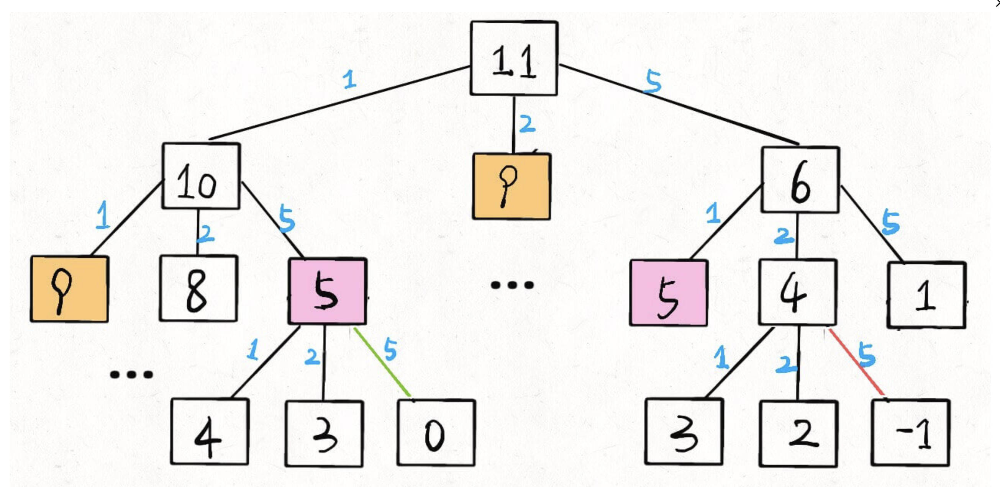

# 动态规划

动态规划`（Dynamic Programming）`，求解的问题必须有两个性质：`最优子结构`和`子问题重叠`，和分治法的思想相同，动态规划的思路也是先将大问题分解成若干个规模相同的子问题，但是动态规划的问题是重叠的，想要理解一个动态规划就要理解一个它的核心，动态规划算法的核心是下面的一张图片和一个小故事。

```
A :  "1+1+1+1+1+1+1+1 =？" 
A :  "上面等式的值是多少"
B :  "8!"
A :  在上面等式的左边写上 "1+"
A :  "此时等式的值为多少"
B :  (quickly) "9!"
A :  "你怎么这么快就知道答案了"
A :  "只要在8的基础上加1就行了"
A :  "所以你不用重新计算,因为你记住了第一个等式的值为8!
-->   动态规划算法也可以说是 '记住求过的解来节省时间'。
```

由上面的图片和小故事可以知道动态规划算法的核心就是记住已经解决过的子问题的解，动态规划通过备忘录来解决子问题重叠。

## 设计策略

**首先，动态规划问题的一般形式就是求最值**。动态规划其实是运筹学的一种最优化方法，只不过在计算机问题上应用比较多，比如说让你求**最长**递增子序列呀，**最小**编辑距离呀等等。

既然是要求最值，核心问题是什么呢？**求解动态规划的核心问题是穷举**。因为要求最值，肯定要把所有可行的答案穷举出来，然后在其中找最值呗。

动态规划这么简单，就是穷举就完事了？我看到的动态规划问题都很难啊！

首先，动态规划的穷举有点特别，因为这类问题**存在「重叠子问题」**，如果暴力穷举的话效率会极其低下，所以需要「备忘录」或者「DP table」来优化穷举过程，避免不必要的计算。

而且，动态规划问题一定会**具备「最优子结构」**，才能通过子问题的最值得到原问题的最值。

另外，虽然动态规划的核心思想就是穷举求最值，但是问题可以千变万化，穷举所有可行解其实并不是一件容易的事，只有列出**正确的「状态转移方程」**，才能正确地穷举。

以上提到的重叠子问题、最优子结构、状态转移方程就是动态规划三要素。具体什么意思等会会举例详解，但是在实际的算法问题中，**写出状态转移方程是最困难的**，这也就是为什么很多朋友觉得动态规划问题困难的原因，我来提供我研究出来的一个思维框架，辅助你思考状态转移方程：

**明确 base case -> 明确「状态」-> 明确「选择」 -> 定义 dp 数组/函数的含义 ->状态转移方程**。

按上面的套路走，最后的结果就可以套这个框架：

```ts
# 初始化 base case
dp[0][0][...] = base
# 进行状态转移
for 状态1 in 状态1的所有取值：
    for 状态2 in 状态2的所有取值：
        for ...
            dp[状态1][状态2][...] = 求最值(选择1，选择2...)
```

我喜欢把动态规划分为两种，很容易写出 `dp` 数组的动规，和很容易写出状态转移方程但是不容易设计 `dp` 数组的动态规划，对于前者我们可以使用上面的设计策略，而对于后者我一般采用下面的设计过程：

动态规划遵循一套固定的流程：**状态转移方程-> 递归的暴力解法 -> 带备忘录的递归解法 -> 非递归的动态规划解法**。这个过程是层层递进的解决问题的过程，以下，先通过两个个比较简单的例子：斐波那契和凑零钱问题，揭开动态规划的神秘面纱，描述上述三个流程。后续还会写几篇文章探讨如何使用动态规划技巧解决比较复杂的经典问题。

- **根据问题写出状态转移方程**
- **递归的暴力解法（选取最子结构）**
- **自顶向下的备忘录法（递归）** 
- **自底向上的动态规划**

## EasyDpArray

先来看几道状态明确，能够轻松构建 `dp` 数组的动态规划问题，

### 1.买卖股票的最佳时机[IV](https://leetcode-cn.com/problems/best-time-to-buy-and-sell-stock-iv/)

给定一个整数数组 `prices` ，它的第 `i` 个元素 `prices`[`i`] 是一支给定的股票在第 `i` 天的价格。设计一个算法来计算你所能获取的最大利润。你最多可以完成 `k` 笔交易。

**注意：**你不能同时参与多笔交易（你必须在再次购买前出售掉之前的股票）。

**示例 1：**

```ts
输入：k = 2, prices = [2,4,1]
输出：2
解释：在第 1 天 (股票价格 = 2) 的时候买入，在第 2 天 (股票价格 = 4) 的时候卖出，这笔交易所能获得利润 = 4-2 = 2 。
```

#### 状态和选择

**这个问题的「状态」有三个**，第一个是天数，第二个是当天允许交易的最大次数，第三个是当前的持有状态（即之前说的 rest 的状态，我们不妨用 1 表示持有，0 表示没有持有）。

同时**每天都有三种「选择」**：买入、卖出、无操作，我们用 `buy`,` sell`, `rest` 表示这三种选择。

#### 状态转移方程

因为我们的选择是 `buy, sell, rest`，而这些选择是和「持有状态」相关的，所以只看「持有状态」，可以画个状态转移图。


通过这个图可以很清楚地看到，每种状态（`0` 和 `1`）是如何转移而来的。根据这个图，我们来写一下状态转移方程：


这个解释应该很清楚了，如果 `buy`，就要从利润中减去 `prices`[`i`]，如果 `sell`，就要给利润增加 `prices`[`i`]。今天的最大利润就是这两种可能选择中较大的那个。而且注意 `k` 的限制，我们在选择 `buy` 的时候，把最大交易数 `k` 减小了 `1`，很好理解吧，当然你也可以在 `sell` 的时候减 `1`，一样的。

最后我们还需要确定 `base case`，即最简单的情况。


把上面的状态转移方程总结一下：


读者可能会问，这个数组索引是 `-1` 怎么编程表示出来呢，很简单只要再索引`i`为 `0`的时候直接返回 `0` 或者负无穷即可，而负无穷怎么表示呢？很简单 `-price[i]`。

#### 算法编写

上面都交代这么多了，下面我们就将以得出的结论用代码表示出来就可以了：

```ts
function maxProfit(k: number, prices: number[]): number {
    let n = prices.length;
    if (n === 0 || k <= 0) {
        return 0;
    }

    // init dp
    let dp = new Array(n);
    for (let i = 0; i < n; i++) {
        dp[i] = new Array(k + 1);
        for (let j = 0; j < k + 1; j++) {
            dp[i][j] = new Array(2).fill(0);
        }
    }

    for (let i = 0; i < n; i++) {
        for (let j = k; j >= 1; j--) {
            if (i === 0) {
                dp[i][j][0] = 0;
                dp[i][j][1] = -prices[i];
                continue;
            }

            dp[i][j][0] = Math.max(dp[i - 1][j][0], dp[i - 1][j][1] + prices[i]);
            dp[i][j][1] = Math.max(dp[i - 1][j][1], dp[i - 1][j - 1][0] - prices[i]);
        }
    }

    return dp[n - 1][k][0];
};
```

### [打家劫舍](https://leetcode-cn.com/problems/house-robber/)

你是一个专业的小偷，计划偷窃沿街的房屋。每间房内都藏有一定的现金，影响你偷窃的唯一制约因素就是相邻的房屋装有相互连通的防盗系统，如果两间相邻的房屋在同一晚上被小偷闯入，系统会自动报警。

给定一个代表每个房屋存放金额的非负整数数组，计算你 不触动警报装置的情况下 ，一夜之内能够偷窃到的最高金额。

**示例 1：**

```ts
输入：[1,2,3,1]
输出：4
解释：偷窃 1 号房屋 (金额 = 1) ，然后偷窃 3 号房屋 (金额 = 3)。
     偷窃到的最高金额 = 1 + 3 = 4 。
```

#### 状态转移方程

假想你就是这个专业强盗，从左到右走过这一排房子，在每间房子前都有两种**选择**：抢或者不抢。

如果你抢了这间房子，那么你肯定不能抢相邻的下一间房子了，只能从**下下间**房子开始做选择。

如果你不抢这间房子，那么你可以走到**下一间**房子前，继续做选择。

当你走过了最后一间房子后，你就没得抢了，能抢到的钱显然是 0（**base case**）。

以上的逻辑很简单吧，其实已经明确了「状态」和「选择」：**你面前房子的索引就是状态，抢和不抢就是选择**。


在两个选择中，每次都选更大的结果，最后得到的就是最多能抢到的 money：

#### 算法编写

```c
 int rob(int[] nums) {
    int n = nums.length;
    // dp[i] = x 表示：
    // 从第 i 间房子开始抢劫，最多能抢到的钱为 x
    // base case: dp[n] = 0
    int[] dp = new int[n + 2];
    for (int i = n - 1; i >= 0; i--) {
        dp[i] = Math.max(dp[i + 1], nums[i] + dp[i + 2]);
    }
    return dp[0];
}
```

### [3. 地下城游戏](https://leetcode-cn.com/problems/dungeon-game/)

一些恶魔抓住了公主（**P**）并将她关在了地下城的右下角。地下城是由 M x N 个房间组成的二维网格。我们英勇的骑士（**K**）最初被安置在左上角的房间里，他必须穿过地下城并通过对抗恶魔来拯救公主。

骑士的初始健康点数为一个正整数。如果他的健康点数在某一时刻降至 0 或以下，他会立即死亡。

有些房间由恶魔守卫，因此骑士在进入这些房间时会失去健康点数（若房间里的值为*负整数*，则表示骑士将损失健康点数）；其他房间要么是空的（房间里的值为 *0*），要么包含增加骑士健康点数的魔法球（若房间里的值为*正整数*，则表示骑士将增加健康点数）。

为了尽快到达公主，骑士决定每次只向右或向下移动一步，编写一个函数来计算确保骑士能够拯救到公主所需的最低初始健康点数。

例如，考虑到如下布局的地下城，如果骑士遵循最佳路径 右 -> 右 -> 下 -> 下，则骑士的初始健康点数至少为 7。


#### 解题思路

这道题不禁让我反思，首先如果从`[0, 0]`递推，那么无法确定正确的解，因为不能确定剩余生命最多和收到伤害最小那个是当前轮次的最优解，其次就是我们在构建`dp`数组的时候最好额外加一层初始情况，而不是在循环里添加判断。

```
 function calculateMinimumHP(dungeon: number[][]): number {
     let n = dungeon.length;
     if (!n) return 0;
     let m = dungeon[0].length;
 
     let dp: number[][] = new Array(n);
     for (let i = 0; i < n + 1; i++) {
         dp[i] = new Array(m + 1).fill(Number.MAX_VALUE);
     }
     dp[n - 1][m] = dp[n][m - 1] = 1;
 
     for (let i = n - 1; i >= 0; i--) {
         for (let j = m - 1; j >= 0; j--) {
             let bestChoice = Math.min(dp[i + 1][j], dp[i][j + 1]);
             dp[i][j] = Math.max(bestChoice - dungeon[i][j], 1);
         }
     }
     return dp[0][0]
 }
```

## HardDpArray

### 1. 斐波那契数🏹

为了说明动态规划的这两种方法，举一个最简单的例子：求斐波拉契数列**Fibonacci** 。严格的说斐波那契数列并不算是一个动态规划问题，但是它却能很好的诠释子问题重叠。

```go
Fibonacci (n) = 1;   n = 0
Fibonacci (n) = 1;   n = 1
Fibonacci (n) = Fibonacci(n-1) + Fibonacci(n-2)
```

#### 状态转移方程🚢

这里，引出 **「状态转移方程」** 这个名词，实际上就是描述问题结构的数学形式：


为啥叫**「状态转移方程」**？为了听起来高端。你把 f(n) 想做一个状态 n，这个状态 n 是由状态 n - 1 和状态 n - 2 相加转移而来，这就叫状态转移，仅此而已。

就具体问题而言，f(n)表示问题的最优解，n表示总问题的量，比如说斐波那契中：f(n) 表示要求的斐波那契数，  n表示第i个斐波那契数。

你会发现，上面的几种解法中的所有操作，都是围绕这个方程式的不同表现形式。可见列出「状态转移方程」的重要性，它是解决问题的核心。很容易发现，其实状态转移方程直接代表着暴力解法。**千万不要看不起暴力解，动态规划问题最困难的就是写出状态转移方程，即这个暴力解**。优化方法无非是用备忘录或者 DP table，再无奥妙可言。

#### 暴力递归🏭

这个算法使用递归十分的简单。先使用递归版本来实现这个算法：

```go
func fib(n int) int{
    if n<=0 {
        return 0
    }
    if n==1 {
        return 1        
    }
	return fib(n-1) + fib(n-2)
}
//输入6 -> 输出：8
```

先来分析一下递归算法的执行流程，假如输入6，那么执行的递归树如下：


**PS**：**但凡遇到需要递归的问题，最好都画出递归树，这对你分析算法的复杂度，寻找算法低效的原因都有巨大帮助。**

上面的递归树中的每一个子节点都会执行一次，很多重复的节点被执行，`fib(2)`被重复执行了`5`次。由于调用每一个函数的时候都要保留上下文，所以空间上开销也不小。这么多的子节点被重复执行，如果在执行的时候把执行过的子节点保存起来，后面要用到的时候直接查表调用的话可以节约大量的时间。下面就看看动态规划的两种方法怎样来解决斐波拉契数列`Fibonacci` 数列问题。

#### 自顶而下的备忘录递归解法🚞

备忘录法也是比较好理解的，创建了一个n+1大小的数组来保存求出的斐波拉契数列中的每一个值，在递归的时候如果发现前面fib（n）的值计算出来了就不再计算，如果未计算出来，则计算出来后保存在Memo数组中，下次在调用fib（n）的时候就不会重新递归了。之所以要用容量为n+1的数组是因为我们输入的**index**不是真正的**index**，而**index+1**。

```go
func fib (n int) int {
	if n <= 0 {
		return n
	}
	arr := make([]int ,n+1)
	for idx := range arr {
		arr[idx] = -1
	}
	return fibDypBackward(arr,n)
}

func fibDypBackward(arr []int, n int) int {
	if arr[n] != -1 {
		return arr[n]
	}
	if n <= 2 {
		return 1
	}
	arr[n] = fibDypBackward(arr, n-1) + fibDypBackward(arr, n-2)
	return arr[n]
}
```

比如上面的递归树中在计算`fib`（`6`）的时候先计算`fib`（`5`），调用`fib`（`5`）算出了`fib`（`4`）后，`fib`（`6`）再调用`fib`（`4`）就不会在递归`fib`（`4`）的子树了，因为`fib`（`4`）的值已经保存在`Memo`[`4`]中。


解决一个子问题的时间，同上，没有什么循环，时间为 O(1)。所以，本算法的时间复杂度是 O(n)。比起暴力算法，是降维打击。

> [至此，带备忘录的递归解法的效率已经和动态规划一样了。实际上，这种解法和动态规划的思想已经差不多了，只不过这种方法叫做**「自顶向下」**，动态规划叫做**「自底向上」**。]()
>
> - 啥叫**「自顶向下」**？注意我们刚才画的递归树（或者说图），是从上向下延伸，都是从一个规模较大的原问题比如说 f(20)，向下逐渐分解规模，直到 f(1) 和 f(2) 触底，然后逐层返回答案，这就叫「自顶向下」。
> - 啥叫**「自底向上」**？反过来，我们直接从最底下，最简单，问题规模最小的 f(1) 和 f(2) 开始往上推，直到推到我们想要的答案 f(20)，这就是动态规划的思路，这也是为什么动态规划一般都脱离了递归，而是由循环迭代完成计算。

#### 自上而下的动态规划🚈

备忘录法还是利用了递归，上面算法不管怎样，计算fib（6）的时候最后还是要计算出`fib(1)，fib(2)，fib(3)`,那么何不先计算出`fib(1)，fib(2)，fib(3)`呢？这也就是动态规划的核心，先计算子问题，再由子问题计算父问题。

```go
func fibDyp(n int) int {
	if n <= 0 {
		return n
	}
	arr := make([]int ,n+1)
	arr[1] = 1
	for i := 3; i <= n; i++ {
		arr[i] = arr[i-1] + arr[i-2]
	}
	return arr[n]
}
```


实际上，带备忘录的递归解法中的「备忘录」，最终完成后就是这个 `DP table`，所以说这两种解法其实是差不多的，大部分情况下，效率也基本相同。

### 2. 凑零钱问题🌉

刚刚的斐波那契数列并不能很好的诠释最优子结构这个特点，接下来我们用另一道经典的例题来描述一下。

**题目**：给你 `k` 种面值的硬币，面值分别为 `c1, c2 ... ck`，再给一个总金额 `n`，问你最少需要几枚硬币凑出这个金额，如果不可能凑出，则回答 `-1` 。比如说，k = 3，面值分别为 1，2，5，总金额 n = 11，那么最少需要 3 枚硬币，即 11 = 5 + 5 + 1 。下面走流程。

那么下面我们开始解答：

#### 状态转移方程🚏

来看看状态转移方程，`f(n)`表示问题的最优解，`n`表示总问题的量，比如说此问题中：`f(n)` 表示要多少次， `n`表示剩余要凑的金额。


其实，这个方程就用到了「最优子结构」性质：原问题的解由子问题的最优解构成。即 `f(11)` 由 `f(10), f(9), f(6)` 的最优解转移而来。

记住，要符合「最优子结构」，**子问题间必须互相独立**。什么叫相互独立？对于这个零钱问题来说，我们处理 `f(10), f(9), f(6)`他们之间都是毫无关系的，没有相互制约，而是互相独立的。所以这个状态转移方程是可以得到正确答案的。

#### 暴力递归🎲

拿到状态转移方程之后我们就可以书写递归的程序，要做递归一定要画递归树，太重要了。



```go
func coinCharge(coins []int, account int) int {
	if account == 0 {
		return 0
	}

	ans := math.MaxInt64

	for _, coin := range coins {	        
		if account - coin < 0 {continue}					/*当凑不齐的时候可以看到我们是不分支的*/
		subPro := coinCharge(coins,account-coin)	/*构造递归树中的同级的三种情况*/
		if subPro == -1 {continue}					     	/*当子程序不能不能凑整的时候我们也跳过这个分支*/
		ans = int(math.Min(float64(ans),float64(subPro)+1))	/*本轮比较*/
	}

	if ans == math.MaxInt64 {
		return -1
	}else{
		return ans
	}
}
```

#### 带备忘录的递归算法👩‍💻

```go
func coinMemorizeCharge(coins []int, memory []int, account int) int {
	if memory[account] != -2 {
		return memory[account]
	}
	if account == 0 {
		return 0
	}
	ans := math.MaxInt64
	for _,coin := range coins {
		if account - coin < 0 {
			continue
		}
		pre := coinMemorizeCharge(coins,memory,account-coin)
		if pre == -1 {
			continue
		}
		ans = int(math.Max(float64(pre)+1,float64(ans)))
	}

	if ans != math.MaxInt64 {
		memory[account] = ans
		return ans
	}else{
		return -1
	}
}
```

很显然「备忘录」大大减小了子问题数目，完全消除了子问题的冗余，所以子问题总数不会超过金额数 ``n``，即子问题数目为 ``O(n)``。处理一个子问题的时间不变，仍是 ``O(k)``，所以总的时间复杂度是 ``O(kn)``。

#### 动态规划🎐

```go
func coinDynamiccharge(coins []int, account int) int {
	dp := make([]int, account+1)
	for  j := 1; j < len(dp); j++  {
		dp[j] = -1
	}

	for i := 1; i <= account; i++ {
		for _,coin := range coins {
			if coin <= i {
				dp[i] = int(math.Min(float64(dp[i]),float64(dp[i-coin]+1)))
			}
		}
	}
	if dp[account] == -1 {
		return -1
	}else{
		return dp[account]
	}
}
```


计算机解决问题其实没有任何奇技淫巧，它唯一的解决办法就是穷举，穷举所有可能性。算法设计无非就是先思考“如何穷举”，然后再追求“如何聪明地穷举”。

列出动态转移方程，就是在解决“如何穷举”的问题。之所以说它难，一是因为很多穷举需要递归实现，二是因为有的问题本身的解空间复杂，不那么容易穷举完整。

备忘录、`DP` 就是在追求“如何聪明地穷举”。用空间换时间的思路，是降低时间复杂度的不二法门，除此之外，试问，还能玩出啥花活？

## 动态规划细谈🥜

虽然已经用动态规划方法解决了上面两个问题，但是大家可能还跟我一样并不知道什么时候要用到动态规划。总结一下上面的斐波拉契数列和找零钱问题，发现两个问题都涉及到了重叠子问题，和最优子结构。

#### ① 推导过程

上面我们都是先根据递归树写出状态转移方程、然后推敲出递归写法、通过 `dp` 数组优化递归、最后根据 ` dp` 数组规律写出自底而上的动态规划写法。所以这个推导过程是万能的吗，又或者是这个推导过程是必须的吗？

答案是否定的，面对不同的问题动态规划的思路是变通的。有些问题通过递归树可以很快的推导出状态转移方程，但是对于另一些问题 `dp` 数组以及其规律可能是很容易推敲出来的，对应的状态转移方程也可以直接得出。所以是否遵守上面的推导过程取决于题目的类型。

#### ② 最优子结构

用动态规划求解最优化问题的第一步就是刻画最优解的结构，如果一个问题的解结构包含其子问题的最优解，就称此问题具有最优子结构性质。比如 `fib(5)` 就包含 `fib(3) + fib(4)` 的解结构。

因此，某个问题是否适合应用动态规划算法，它是否具有最优子结构性质是一个很好的线索。使用动态规划算法时，用子问题的最优解来构造原问题的最优解。因此必须考查最优解中用到的所有子问题。

**🌰栗子**

来举个很容易理解的例子：假设你们学校有 10 个班，你已经计算出了每个班的最高考试成绩。那么现在我要求你计算全校最高的成绩，你会不会算？当然会，而且你不用重新遍历全校学生的分数进行比较，而是只要在这 10 个最高成绩中取最大的就是全校的最高成绩。

我给你提出的这个问题就**符合最优子结构**：可以从子问题的最优结果推出更大规模问题的最优结果。让你算**每个班**的最优成绩就是子问题，你知道所有子问题的答案后，就可以借此推出**全校**学生的最优成绩这个规模更大的问题的答案。

你看，这么简单的问题都有最优子结构性质，只是因为显然没有**重叠子问题**，所以我们简单地求最值肯定用不出动态规划。

再举个例子：假设你们学校有 10 个班，你已知每个班的最大分数差（最高分和最低分的差值）。那么现在我让你计算全校学生中的最大分数差，你会不会算？可以想办法算，但是肯定不能通过已知的这 10 个班的最大分数差推到出来。因为这 10 个班的最大分数差不一定就包含全校学生的最大分数差，比如全校的最大分数差可能是 3 班的最高分和 6 班的最低分之差。

这次我给你提出的问题就**不符合最优子结构**，因为你没办通过每个班的最优值推出全校的最优值，没办法通过子问题的最优值推出规模更大的问题的最优值。

想满足最优子结，子问题之间必须互相独立。全校的最大分数差可能出现在两个班之间，显然子问题不独立，所以这个问题本身不符合最优子结构。

#### ③ 重叠子问题

在斐波拉契数列和钢条切割结构图中，可以看到大量的重叠子问题，比如说在求`fib`（`6`）的时候，`fib`（`2`）被调用了`5`次，在求`cut`（`4`）的时候`cut`（`0`）被调用了`4`次。如果使用递归算法的时候会反复的求解相同的子问题，不停的调用函数，而不是生成新的子问题。如果递归算法反复求解相同的子问题，就称为具有重叠子问题（`overlapping subproblems`）性质。在动态规划算法中使用数组来保存子问题的解，这样子问题多次求解的时候可以直接查表不用调用函数递归。

#### ④ 遍历方向

做动态规划问题时，肯定会对`dp`数组的遍历顺序有些头疼。我们拿二维`dp`数组来举例，有时候我们是正向遍历：

```java
int[][] dp = new int[m][n];
for (int i = 0; i < m; i++)
    for (int j = 0; j < n; j++)
        // 计算 dp[i][j]
```

有时候我们反向遍历：

```java
for (int i = m - 1; i >= 0; i--)
    for (int j = n - 1; j >= 0; j--)
        // 计算 dp[i][j]
```

有时候可能会斜向遍历：

```java
// 斜着遍历数组
for (int l = 2; l <= n; l++) {
    for (int i = 0; i <= n - l; i++) {
        int j = l + i - 1;
        // 计算 dp[i][j]
    }
}
```

甚至更让人迷惑的是，有时候发现正向反向遍历都可以得到正确答案，比如我们在 [团灭 LeetCode 股票买卖问题](http://mp.weixin.qq.com/s?__biz=MzAxODQxMDM0Mw==&mid=2247484508&idx=1&sn=42cae6e7c5ccab1f156a83ea65b00b78&chksm=9bd7fa54aca07342d12ae149dac3dfa76dc42bcdd55df2c71e78f92dedbbcbdb36dec56ac13b&scene=21#wechat_redirect) 中有的地方就正反皆可。

那么，如果仔细观察的话可以发现其中的原因的。你只要把住两点就行了：

**1、遍历的过程中，所需的状态必须是已经计算出来的**。

**2、遍历的终点必须是存储结果的那个位置**。