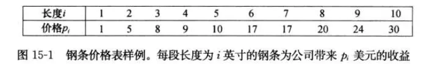
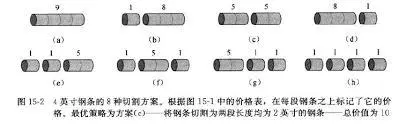
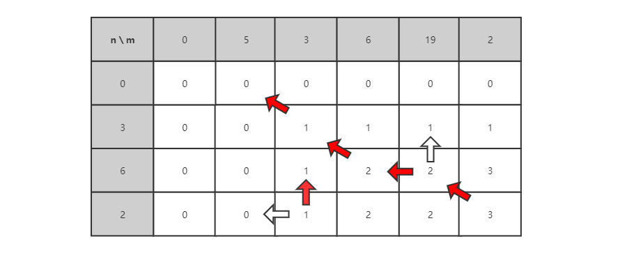

# 线性模型 🌾

两个变量之间存在一次方函数关系，就称它们之间存在线性关系。在线性结构上进行状态转移`DP`，统称线性`DP`，注意问题中的未知数只有两个那就是`n`和`f(n)`，比如说分金币问题中的`coins`总数和`charge`次数。下面拿实际问题来举例子。

**注意**：已知量数组不属于变量，比如说金币面额。

## 	切木棍🌿

给定一段长度为n英寸的钢条和一个价格表pi(i=1，2，...，n)，求解切割钢条方案，使得销售收益rn最大。注意，如果长度为n英寸的钢条价格pn足够大，最优解可能就是完全不需要切割。



#### 思路🍀

考虑n=4的情况，我们所有可能的切割方案如下



我们将钢条从左边切割长度为i的一段，只对右边剩下的长度为n-i的一段继续进行切割（递归求解），对左边的一段则不再进行切割。即问题分解为：将长度为n的钢条分解为左边开始一段，以及对剩余部分继续分解的结果。这样，不做任何切割的方案可以描述为：第一段的长度为n，收益为pn，剩余部分长度为0，对应收益为r0=0。

#### 动态转移方程🍁

$$
f(l) = max(p_i + f(l-r_i))
$$

#### 暴力递归🥀

```go
func CutSteel(value []int, length int) int {
	if length == 0 {
		return 0
	}

	bestValue := math.MinInt64

	for i := 1; i <= length; i++ {
		preValue := value[i-1]+CutSteel(value,length-i)
		bestValue = int(math.Max(float64(preValue),float64(bestValue)))
	}
	return bestValue
}
```

####  动态规划写法🌷

对于`rn`，可以用更短地钢条的最优收割收益来描述它：
$$
rn = max(p^n，r^1 + r^n-1 ，r^2 + r^n-2，...，r^n-1 + r^1)
$$

- `pn`对应不切割，直接出售长度为`n`英寸的钢条方案
- 其他``n-1``个参数对应另外``n-1``种切割方案：对每个``i=1``，``2``，...，``n-1``，首先将钢条切割长度为``i``和``n-i``的两段，接着求解这两段的最优收益``ri``和``rn-i``（每种方案的最优收益为两段的最优收益之和）

```go
func BottomUpCutSteel(v []int, n int) int {
	r := make([]int, n+1)
	/*
		创建备忘录，用于记录长度为i的时候的最优解。
		我们只要拿到了上一轮的最优解，下一轮只需要比较之前最优解的组合外加上当前长度不切割的价值就可以了，依此递推，
	*/
	for i := 1; i <= n; i++  {
		bestChoice := -1
		for j := 1; j <= i; j++ {
			bestChoice = int(math.Max(float64(bestChoice), float64(v[j-1] + r[i-j])))
		}
		r[i] = bestChoice
	}
	return r[len(r)-1]
}
```

## lis🌼

`longest increasing substring` 最长递增子序列，给定数组`arr`，返回`arr`的最长递增子序列。

#### 动态转移方程🌽

f(n)表示以下标为n结尾的数组的最长递增子序列的长度。
$$
f(n) = max(f(n-i) + 1) ~~~~(~arr[n] > arr[n-i]~)
$$

#### 暴力递归🍏

注意最后一位不一定就是最长递增子序列的结尾，所以要遍历每一位。

```go
func lisRecusive (arr []int) int {
	bestAns := math.MinInt64
	for i := len(arr)-1;i >= 0 ;i--  {
		bestAns = int(math.Max(float64(bestAns),float64(lis(arr,i))))
	}

	return bestAns
}

func lis(arr []int,n int) int {
	if n == 0 {
		return 1
	}

	bestAns := math.MinInt64

	for i := n ;i > 0 ;i-- {
		if arr[n] > arr[n-i] {
			bestAns = int(math.Max(float64(bestAns),float64(lis(arr,n-i)+1)))
		}
	}

	return bestAns
}
```

#### 动态规划解决🍐

#### 

```go
func lisDynamic (arr []int) int {
	memory := make([]int,len(arr))
	memory[0] = 1
	for i := 1;i < len(arr);i++  {		//控制n
		for j := 0;j < i ;j++  {		//控制i
			if arr[j] < arr[i] {
				memory[i] = int(math.Max(float64(memory[j]+1),float64(memory[i])))
			}
		}
	}
	max := 0
	for _,item := range memory {
		max = int(math.Max(float64(item),float64(max)))
	}
	return max
}
```

## lcs🌻

`longest common substring` 最长公共子序列   给定数组`arr1，arr2`， 最长公共子序列。

#### 动态转移方程🍅


#### 暴力递归🍓

根据动态转移方程我们可以很轻松的写出递归方法

```go
func lcsRecursive(m,n []int,i,j int) int {
	if i == 0 || j == 0 {
		return 1
	}
	if m[i] == n[j] {
		return 1 + lcsRecursive(m,n,i-1,j-1)
	}else{
		return int(math.Max(float64(lcsRecursive(m,n,i-1,j)),float64(lcsRecursive(m,n,i,j-1))))
	}
}
```

#### 动态规划解决🍒

根据我们对dp数组进行分析不难推敲出规律，做出从下而上的动态规划解决方案即可。



```go
func lcsRynamic(m,n []int) int {
	if len(m) == 0 || len(n) == 0 {
		return 0
	}

	linear_dp := make([][]int, len(m)+1)

	for idx := range linear_dp {
		linear_dp[idx] = make([]int, len(n)+1)
	}

	for i := 1; i < len(linear_dp); i++  {
		for j := 1; j < len(linear_dp[i]); j++  {
			if m[i-1] == n[j-1] {
				linear_dp[i][j] = linear_dp[i-1][j-1] + 1
			}else{
				linear_dp[i][j] = int(math.Max(float64(linear_dp[i-1][j]),float64(linear_dp[i][j-1])))
			}
		}
	}
	for idx := range linear_dp {
		fmt.Println(linear_dp[idx])
	}
	return linear_dp[len(m)][len(n)]
}
```

