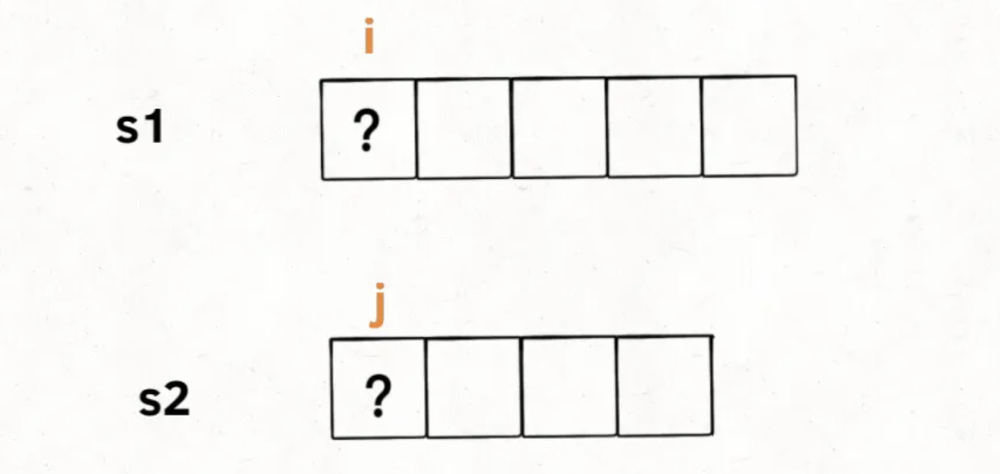
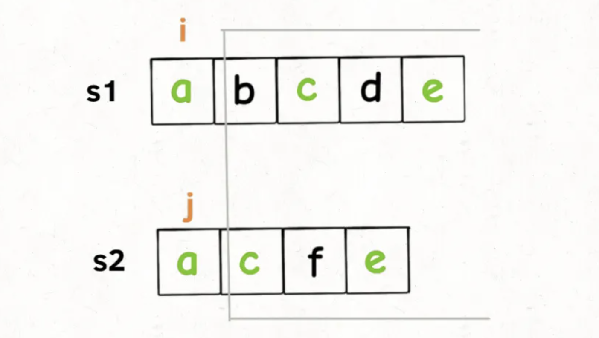
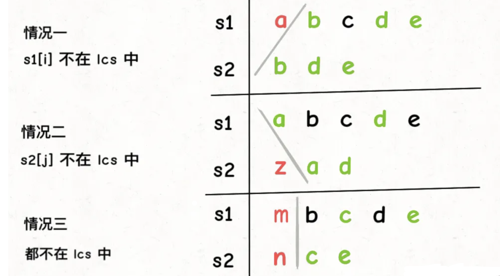
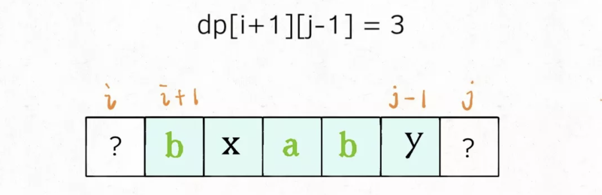
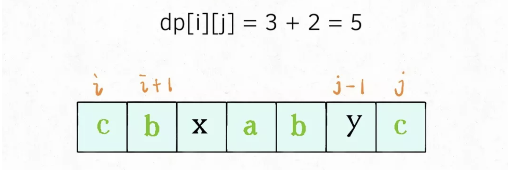
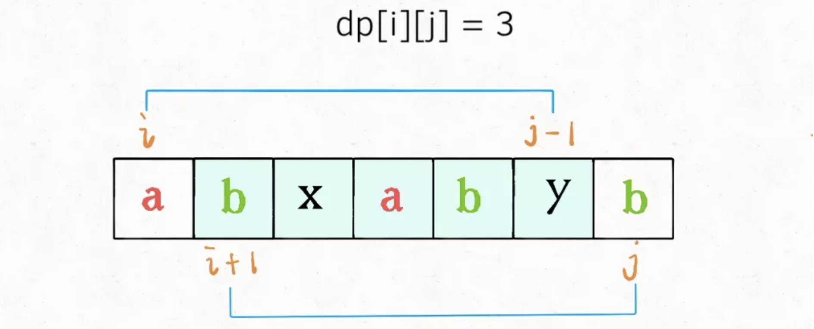
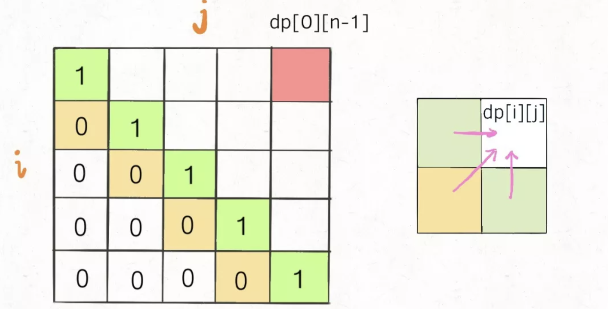
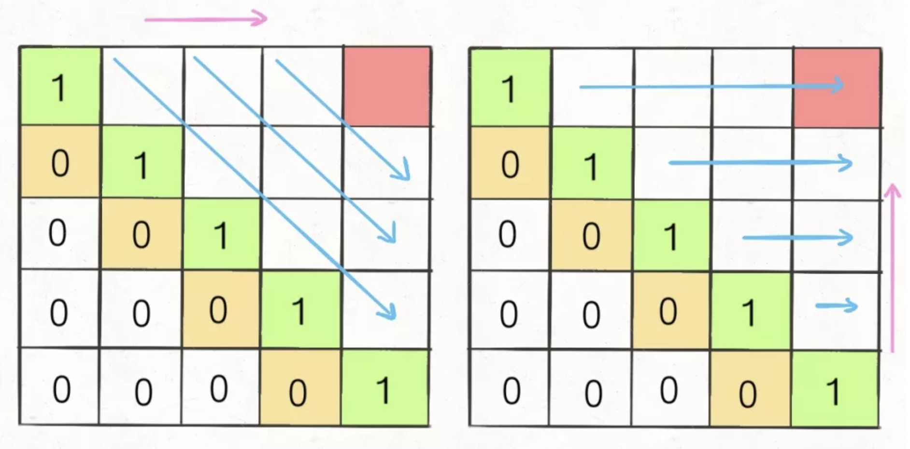
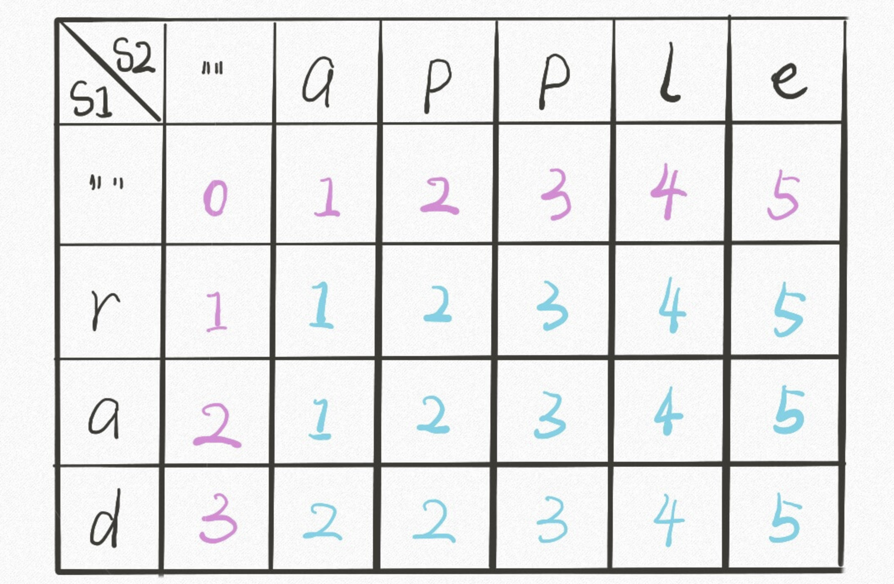

# 子序列模型

一个字符串的 子序列 是指这样一个新的字符串：它是由原字符串在不改变字符的相对顺序的情况下删除某些字符（也可以不删除任何字符）后组成的新字符串。

+ 例如，"`ace`" 是 "`abcde`" 的子序列，但 "`aec`" 不是 "`abcde`" 的子序列。

子序列问题本身就相对子串、子数组更困难一些，因为前者是不连续的序列，而后两者是连续的，就算穷举都不容易，更别说求解相关的算法问题了。

而且，子序列问题很可能涉及到两个字符串，比如让你求两个字符串的 [最长公共子序列](http://mp.weixin.qq.com/s?__biz=MzAxODQxMDM0Mw==&mid=2247484486&idx=1&sn=0bdcb94c6390307ea32427757ec0072c&chksm=9bd7fa4eaca073583623cdb93b05dc9e1d0757b25697bb40b29b3e450124e929ff1a8eaac50f&scene=21#wechat_redirect)，如果没有一定的处理经验，真的不容易想出来。所以本文就来扒一扒子序列问题的套路，**其实就有两种模板，相关问题只要往这两种思路上想，十拿九稳。**

一般来说，这类问题都是让你求一个**最长**子序列，因为最短子序列就是一个字符嘛，没啥可问的。一旦涉及到子序列和最值，那几乎可以肯定，**考察的是动态规划技巧，时间复杂度一般都是 O(n^2)**。

> [答疑：]()严格的来说子序列问题可能属于线性模型，也可能属于区间模型，只是因为 `dp` 数组设计思路相对来说比较固定相似，所以被单独归类成一种设计模型。

## 两种思路

#### 一维的 dp

```java
int n = array.length;
int[] dp = new int[n];

for (int i = 1; i < n; i++) {
    for (int j = 0; j < i; j++) {
        dp[i] = 最值(dp[i], dp[j] + ...)
    }
}
```

举个我们写过的例子 [最长递增子序列](http://mp.weixin.qq.com/s?__biz=MzAxODQxMDM0Mw==&mid=2247484498&idx=1&sn=df58ef249c457dd50ea632f7c2e6e761&chksm=9bd7fa5aaca0734c29bcf7979146359f63f521e3060c2acbf57a4992c887aeebe2a9e4bd8a89&scene=21#wechat_redirect)，在这个思路中 dp 数组的定义是：在子数组`array`[`0..i`]中，以`array`[`i`]结尾的目标子序列（最长递增子序列）的长度是`dp`[`i`]。

这种 `dp` 的设计使用状态转移方程，从 `[0...0]` 到`[0...n]` 逐步推敲。

#### 二维的 dp

```java
int n = arr.length;
int[][] dp = new dp[n][n];

for (int i = 0; i < n; i++) {
    for (int j = 1; j < n; j++) {
        if (arr[i] == arr[j]) 
            dp[i][j] = dp[i][j] + ...
        else
            dp[i][j] = 最值(...)
    }
}
```

这种思路运用相对更多一些，尤其是涉及两个字符串/数组的子序列。本思路中 `dp` 数组含义又分为**「只涉及一个字符串」**和**「涉及两个字符串」**两种情况：

+ **[å]() 涉及两个字符串/数组时**（比如最长公共子序列），dp 数组的含义如下：
  + 在子数组`arr1[0..i]`和子数组`arr2[0..j]`中，我们要求的子序列（最长公共子序列）长度为`dp[i][j]`。

+ **[ß]() 只涉及一个字符串/数组时**（比如本文要讲的最长回文子序列），dp 数组的含义如下：
  + 在子数组`array[i..j]`中，我们要求的子序列（最长回文子序列）的长度为`dp[i][j]`。

下面我们通过几道例题来具体分析：

## 最长递增子序列

给你一个整数数组 ``nums`` ，找到其中最长严格递增子序列的长度。

子序列是由数组派生而来的序列，删除（或不删除）数组中的元素而不改变其余元素的顺序。例如，[``3,6,2,7``] 是数组 [``0,3,1,6,2,2,7``] 的子序列。

**示例 1：**

```ts
输入：nums = [10,9,2,5,3,7,101,18]
输出：4
解释：最长递增子序列是 [2,3,7,101]，因此长度为 4 。
```

#### 思路分析

动态规划的核心设计思想是数学归纳法。

相信大家对数学归纳法都不陌生，高中就学过，而且思路很简单。比如我们想证明一个数学结论，那么**我们先假设这个结论在 `k<n` 时成立，然后根据这个假设，想办法推导证明出 `k=n` 的时候此结论也成立**。如果能够证明出来，那么就说明这个结论对于 `k` 等于任何数都成立。

对于 `lis` 这道题**我们的定义是这样的：`dp[i]` 表示以 `nums[i]` 这个数结尾的最长递增子序列的长度。**

根据这个定义，我们就可以推出 base case：`dp[i]` 初始值为 1，因为以 `nums[i]` 结尾的最长递增子序列起码要包含它自己。

算法演进的过程是这样的，我们遍历数组，根据已有的状态计算当前下标对应的最长递增子序列长度：


根据这个定义，我们的最终结果（子序列的最大长度）应该是 `dp` 数组中的最大值。

#### 算法实现

这道题相对来说比较简单，直接写出实现即可：

```ts
function lengthOfLIS(nums: number[]): number {
    let n = nums.length;

    let dp = new Array(n).fill(1);
    let max = 0;

    for (let i = 0; i < n; i++) {
        for (let j = i - 1; j >= 0; j--) {
            if (nums[j] < nums[i]) {
                dp[i] = Math.max(dp[j] + 1, dp[i]);
            }
            
        }
        max = Math.max(max, dp[i])
    }
   
    return max;
};
```

## 最长公共子序列

#### 题目描述

计算最长公共子序列（`Longest Common Subsequence`，简称 `LCS`）是一道经典的动态规划题目，大家应该都见过：

给你输入两个字符串`s1`和`s2`，请你找出他们俩的最长公共子序列，返回这个子序列的长度。比如说输入`s1 = "zabcde", s2 = "acez"`，它俩的最长公共子序列是`lcs = "ace"`，长度为 3，所以算法返回 3。

#### 思路分析

一看到两个子序列，我们大概能推敲出 `dp` 数组设计思路，二维数组：`[0...i]` 表示字符串`1`，`[0...j]` 表示字符串`2`。具体到每一个字符，我们来看看遍历的过程：



只看`s1[i]`和`s2[j]`，**如果`s1[i] == s2[j]`，说明这个字符一定在`lcs`中**：



而**`s1[i] != s2[j]`意味着，`s1[i]`和`s2[j]`中至少有一个字符不在`lcs`中**：



如上图，总共可能有三种情况，我怎么知道具体是那种情况呢？

其实我们也不知道，那就把这三种情况的答案都算出来，取其中结果最大的那个，因为题目让我们算「最长」公共子序列的长度。

由此我们就可以推敲出状态转移方程了：

```ts
if (text1[i - 1] === text2[j - 1]) {
  dp[i][j] = dp[i - 1][j - 1] + 1;
} else {
  dp[i][j] = Math.max(
    dp[i - 1][j], 
    dp[i][j - 1]
  );
}
```

注意由于情况三其实被情况一和二所包含，所以状态转移方程里没有它的分支。

#### 算法实现

这里我故意给 `dp` 多加了一行一列，用于表示 `base case`，代表 `t1` 或者 `t2` 索引下标为 `-1` 时的公共子序列长度(必然是 `0`)。原因很简单，因为索引下标为零的时候对应子序列长度是不可确定的。

```ts
function longestCommonSubsequence(text1: string, text2: string): number {
    let n1 = text1.length;
    let n2 = text2.length;
    
    // build dp array
    let dp = new Array(n1 + 1);
    for (let i = 0; i < n1 + 1; i++) {
        // set base case
        dp[i] = new Array(n2 + 1).fill(0);
    }

    // travel
    for (let i = 1; i < n1 + 1; i++) {
        for (let j = 1; j < n2 + 1; j++) {
            if (text1[i - 1] === text2[j - 1]) {
                dp[i][j] = dp[i - 1][j - 1] + 1;
            } else {
                dp[i][j] = Math.max(dp[i - 1][j], dp[i][j - 1]);
            }
        }
    }
    
    // return result
    return dp[n1][n2];
};
```

## 最长回文子序列

#### 题目描述

给定一个字符串 `s` ，找到其中最长的回文子序列，并返回该序列的长度。可以假设 `s` 的最大长度为 `1000` 。

**示例 :**
输入:

```c
"bbbab"
```

输出:

```c
4 
// 一个可能的最长回文子序列为 "bbbb"。
```

#### 思路分析

我们说这个问题对 dp 数组的定义是：**在子串`s[i..j]`中，最长回文子序列的长度为`dp[i][j]`**。一定要记住这个定义才能理解算法。

为啥这个问题要这样定义二维的 dp 数组呢？我们前文多次提到，**找状态转移需要归纳思维，说白了就是如何从已知的结果推出未知的部分**，这样定义容易归纳，容易发现状态转移关系。

具体来说，如果我们想求`dp[i][j]`，假设你知道了子问题`dp[i+1][j-1]`的结果（`s[i+1..j-1]`中最长回文子序列的长度），你是否能想办法算出`dp[i][j]`的值（`s[i..j]`中，最长回文子序列的长度）呢？



可以！**这取决于`s[i]`和`s[j]`的字符**：

**如果它俩相等**，那么它俩加上`s[i+1..j-1]`中的最长回文子序列就是`s[i..j]`的最长回文子序列：



**如果它俩不相等**，说明它俩**不可能同时**出现在`s[i..j]`的最长回文子序列中，那么把它俩**分别**加入`s[i+1..j-1]`中，看看哪个子串产生的回文子序列更长即可：



以上两种情况写成代码就是这样：

```java
if (s[i] == s[j])
    // 它俩一定在最长回文子序列中
    dp[i][j] = dp[i + 1][j - 1] + 2;
else
    // s[i+1..j] 和 s[i..j-1] 谁的回文子序列更长？
    dp[i][j] = max(dp[i + 1][j], dp[i][j - 1]);
```

至此，状态转移方程就写出来了，根据 dp 数组的定义，我们要求的就是`dp[0][n - 1]`，就是整个`s`的最长回文子序列长度。

#### 算法实现

首先明确一下 base case，如果只有一个字符，显然最长回文子序列长度是 1，也就是`dp[i][j] = 1,(i == j)`。

因为`i`肯定小于等于`j`，所以对于那些`i > j`的位置，根本不存在什么子序列，应该初始化为 0。

另外，看看刚才写的状态转移方程，想求`dp[i][j]`需要知道`dp[i+1][j-1]`，`dp[i+1][j]`，`dp[i][j-1]`这三个位置；再看看我们确定的 base case，填入 dp 数组之后是这样：



**为了保证每次计算`dp[i][j]`，左、下、左下三个方向的位置已经被计算出来，只能斜着遍历或者反着遍历**：



斜着遍历的写法有点反人类，我们选择反着遍历：

```ts
function longestPalindromeSubseq(s: string): number {
    let n = s.length;
    // init dp array
    let dp = new Array<number[]>(n);
    for (let i = 0; i < n; i++) {
        dp[i] = new Array<number>(n).fill(0);
        // set base case
        dp[i][i] = 1;
    }
    // begin map
    for (let i = n - 2; i >= 0; i--) {
        for (let j = i + 1; j < n; j++) {
            if (s[i] === s[j]) {
                dp[i][j] = dp[i + 1][j - 1] + 2;
            } else {
                dp[i][j] = Math.max(dp[i + 1][j], dp[i][j - 1]);
            }
        }        
    }
    // get result
    return dp[0][n - 1];
};
```

## 编辑举例 [`hard`]

给你两个单词 ``word1`` 和 ``word2``，请你计算出将 ``word1`` 转换成 ``word2`` 所使用的最少操作数 。

你可以对一个单词进行如下三种操作：

+ 插入一个字符
+ 删除一个字符
+ 替换一个字符

**示例 1：**

```ts
输入：word1 = "horse", word2 = "ros"
输出：3
解释：
// horse -> rorse (将 'h' 替换为 'r')
// rorse -> rose (删除 'r')
// rose -> ros (删除 'e')
```

#### 思路分析

编辑距离问题就是给我们两个字符串 `s1` 和 `s2`，只能用三种操作，让我们把 `s1` 变成 `s2`，求最少的操作数。需要明确的是，不管是把 `s1` 变成 `s2` 还是反过来，结果都是一样的，所以后文就以 `s1` 变成 `s2` 举例。

前文「最长公共子序列」说过，解决两个字符串的动态规划问题，一般都是用两个指针 `i,j` 分别指向两个字符串的最后，然后一步步往前走，缩小问题的规模。

设两个字符串分别为 “`rad`” 和 “`apple`”，为了把 `s1` 变成 `s2`，算法会这样进行：


根据上面的 `GIF`，可以发现操作不只有三个，其实还有第四个操作，就是什么都不要做（`skip`）。比如这个情况：

因为这两个字符本来就相同，为了使编辑距离最小，显然不应该对它们有任何操作，直接往前移动 `i,j` 即可。

还有一个很容易处理的情况，就是 `j` 走完 `s2` 时，如果 `i` 还没走完 `s1`，那么只能用删除操作把 `s1` 缩短为 `s2`。

综上，基本的思路就有了：

```ts
if s1[i] == s2[j]:
    啥都别做（skip）
    i, j 同时向前移动
else:
    三选一：
        插入（insert）
        删除（delete）
        替换（replace）
```

有这个框架，问题就已经解决了。读者也许会问，这个「三选一」到底该怎么选择呢？很简单，全试一遍，哪个操作最后得到的编辑距离最小，就选谁。这里需要递归技巧，理解需要点技巧，先看下代码：

```python
def minDistance(s1, s2) -> int:

    def dp(i, j):
        # base case
        if i == -1: return j + 1
        if j == -1: return i + 1
        
        if s1[i] == s2[j]:
            return dp(i - 1, j - 1)  # 啥都不做
        else:
            return min(
                dp(i, j - 1) + 1,    # 插入
                dp(i - 1, j) + 1,    # 删除
                dp(i - 1, j - 1) + 1 # 替换
            )
    
    # i，j 初始化指向最后一个索引
    return dp(len(s1) - 1, len(s2) - 1)
```

下面来详细解释一下这段递归代码，base case 应该不用解释了，主要解释一下递归部分。

都说递归代码的可解释性很好，这是有道理的，只要理解函数的定义，就能很清楚地理解算法的逻辑。我们这里 dp(i, j) 函数的定义是这样的：

```python
def dp(i, j) -> int
# 返回 s1[0..i] 和 s2[0..j] 的最小编辑距离
```

**记住这个定义**之后，先来看这段代码：

```python
if s1[i] == s2[j]:
    return dp(i - 1, j - 1)  # 啥都不做
# 解释：
# 本来就相等，不需要任何操作
# s1[0..i] 和 s2[0..j] 的最小编辑距离等于
# s1[0..i-1] 和 s2[0..j-1] 的最小编辑距离
# 也就是说 dp(i, j) 等于 dp(i-1, j-1)
```

如果 `s1[i]！=s2[j]`，就要对三个操作递归了，稍微需要点思考：

```python
dp(i, j - 1) + 1,    # 插入
# 解释：
# 我直接在 s1[i] 插入一个和 s2[j] 一样的字符
# 那么 s2[j] 就被匹配了，前移 j，继续跟 i 对比
# 别忘了操作数加一

dp(i - 1, j) + 1,    # 删除
# 解释：
# 我直接把 s[i] 这个字符删掉
# 前移 i，继续跟 j 对比
# 操作数加一

dp(i - 1, j - 1) + 1 # 替换
# 解释：
# 我直接把 s1[i] 替换成 s2[j]，这样它俩就匹配了
# 同时前移 i，j 继续对比
# 操作数加一
```

现在，你应该完全理解这段短小精悍的代码了。还有点小问题就是，这个解法是暴力解法，存在重叠子问题，需要用动态规划技巧来优化。

首先明确 dp 数组的含义，dp 数组是一个二维数组，长这样：




dp 函数的 base case 是 `i,j` 等于 -1，而数组索引至少是 0，所以 dp 数组会偏移一位。

既然 dp 数组和递归 dp 函数含义一样，也就可以直接套用之前的思路写代码，**唯一不同的是，DP table 是自底向上求解，递归解法是自顶向下求解**：

不过这是代码的执行过程，而函数的书写过程对于两种写法是一样的。

#### 算法实现

很简单：

```ts
function minDistance(word1: string, word2: string): number {
    // init dp
    let m = word1.length + 1;
    let n = word2.length + 1;

    let dp = new Array(m);
    for (let i = 0; i < m; i++) {
        dp[i] = new Array(n);
        dp[i][0] = i;
        if (i == 0) {
            for (let j = 0; j < n; j++) {
                dp[i][j] = j;
            }
        }
    }

    for (let i = 1; i < m; i++) {
        for (let j = 1; j < n; j++) {
            if (word1[i - 1] === word2[j - 1]) {
                dp[i][j] = dp[i - 1][j - 1];
            } else {
                dp[i][j] = Math.min(
                    dp[i][j - 1] + 1,
                    dp[i - 1][j] + 1,
                    dp[i - 1][j - 1] + 1,
                    )
            }
        }
    }
    
    return dp[m - 1][n - 1];
};
```

