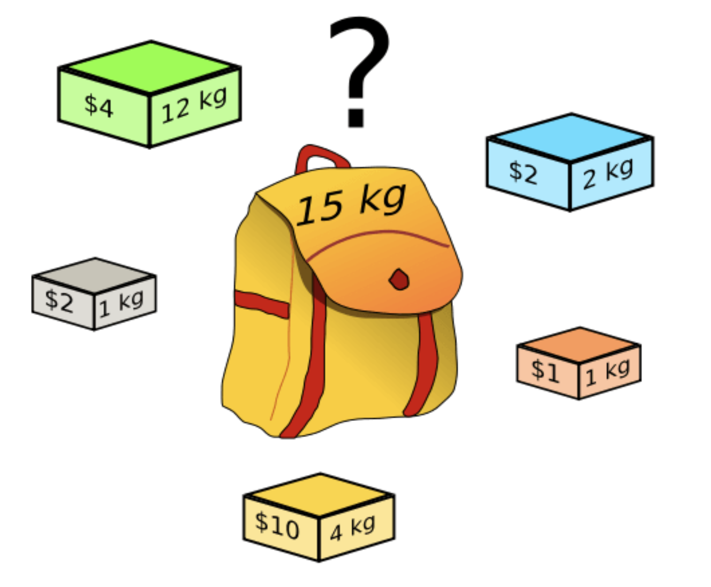

# 背包模型

背包模型一般指同时存在多个变量的动态规划模型，比如 `01` 背包中的物品和容量两个变量，由于同时存在两个未知量所以不属于前面的线性模型，当然也不属于子序列模型，但是其 `dp` 数组结构却和子序列模型中的二维 `dp` 很相似，不过代表的数据量以及迭代策略完全不同。

## 01 背包

`01` 背包是很经典的背包模型，问题的描述很简单：给你一个可装载重量为 `W` 的背包和 `N` 个物品，每个物品有重量和价值两个属性。其中第 `i` 个物品的重量为 `wt[i]`，价值为 `val[i]`，现在让你用这个背包装物品，最多能装的价值是多少？




举个简单的例子，输入如下：

```js
N = 3, W = 4
wt = [2, 1, 3]
val = [4, 2, 3]
```

算法返回 6，选择前两件物品装进背包，总重量 3 小于`W`，可以获得最大价值 6。

题目就是这么简单，一个典型的动态规划问题。**这个题目中的物品不可以分割，要么装进包里，要么不装，不能说切成两块装一半。**这也许就是 0-1 背包这个名词的来历。

### 算法策略

`01` 背包的解法很简单，和大部分动态规划的设计过程一样，明确『状态』和『选择』。

明白了状态和选择，动态规划问题基本上就解决了，只要往这个框架套就完事儿了：

```ts
for 状态1 in 状态1的所有取值：
    for 状态2 in 状态2的所有取值：
        for ...
            dp[状态1][状态2][...] = 择优(选择1，选择2...)
```

[状态：]()

背包问题的状态有两个，**就是「背包的容量」和「可选择的物品」**。

确定了状态之后就很好设计 `dp` 数组了，状态有两个所以 `dp` 数组应该是二维的，一维表示可选择的物品，一维表示背包的容量。**`dp[i][w]`的定义如下：对于前`i`个物品，当前背包的容量为`w`，这种情况下可以装的最大价值是`dp[i][w]`。**

**根据这个定义，我们想求的最终答案就是**`dp[N][W]`。base case 就是`dp[0][..] = dp[..][0] = 0`，因为没有物品或者背包没有空间的时候，能装的最大价值就是 0。

[选择：]()

再说选择，也很容易想到啊，对于每件物品，你能选择什么？**选择就是「装进背包」或者「不装进背包」嘛**。

**如果你没有把这第**`i`个物品装入背包，那么很显然，最大价值`dp[i][w]`应该等于`dp[i-1][w]`。你不装嘛，那就继承之前的结果。

**如果你把这第**`i`个物品装入了背包，那么`dp[i][w]`应该等于`dp[i-1][w-wt[i-1]] + val[i-1]`。

分析完毕状态转移方程就可以得出：

```ts
for i in [1..N]:
    for w in [1..W]:
        dp[i][w] = max(
            dp[i-1][w],
            dp[i-1][w - wt[i-1]] + val[i-1]
        )
return dp[N][W]
```

### 代码实现

得到的内容已经足够了，动态规划的代码本身并不难写：

```ts
function knapsack01(
    capacity: number,
    n: number,
    weights: number[],
    values: number[]
): number {
    let dp = new Array(capacity + 1);
    for (let i = 0; i < capacity + 1; i++) {
        dp[i] = new Array(n + 1).fill(0);
    }

    for (let i = 1; i <= capacity; i++) {
        for (let j = 1; j <= n; j++) {
            if (weights[j - 1] <= i) {
                dp[i][j] = Math.max(
                    dp[i - weights[j - 1]][j - 1] + values[j - 1],
                    dp[i][j - 1]
                );
            } else {
                dp[i][j] = dp[i][j - 1];
            }
        }
    }
    return dp[capacity][n];
}
```

## 子集背包

`01` 背包是求一定容量内的最大价值，而子集背包则是求用东西将背包装满的策略。

#### [分割等和子集](https://leetcode-cn.com/problems/partition-equal-subset-sum/)

给你一个 只包含正整数 的 非空 数组 nums 。请你判断是否可以将这个数组分割成两个子集，使得两个子集的元素和相等。

 ```tsx
输入：nums = [1,5,11,5]
输出：true
解释：数组可以分割成 [1, 5, 5] 和 [11] 。
 ```

### 算法策略

对于这个问题，我们可以先对集合求和，得出 `sum`，把问题转化为背包问题：

**给一个可装载重量为** **`sum / 2`** **的背包和** **`N`** **个物品，每个物品的重量为** **`nums[i]`**。现在让你装物品，是否存在一种装法，能够恰好将背包装满？这样这个问题就转换为了一个子集背包。

[状态：]()

子集背包和 `01` 背包的状态有些不同，子集背包的状态有两个，背包容量和物品数量，背包容量就是 `sum/2` 而 物品数量就是 `n`。

[选择：]()

如果不把 `nums[i]` 算入子集，**或者说你不把这第** **`i`** **个物品装入背包**，那么是否能够恰好装满背包，取决于上一个状态 `dp[i-1][j]`，继承之前的结果。

如果把 `nums[i]` 算入子集，**或者说你把这第** **`i`** **个物品装入了背包**，那么是否能够恰好装满背包，取决于状态 `dp[i-1][j-nums[i-1]]`。

首先，由于 `i` 是从 1 开始的，而数组索引是从 0 开始的，所以第 `i` 个物品的重量应该是 `nums[i-1]`，这一点不要搞混。

`dp[i - 1][j-nums[i-1]]` 也很好理解：你如果装了第 `i` 个物品，就要看背包的剩余重量 `j - nums[i-1]` 限制下是否能够被恰好装满。

### 代码实现

得到的内容已经足够了，动态规划的代码本身并不难写：

```ts
function canPartition(nums: number[]): boolean {
    let n = nums.length;
    let sum = 0;
    for (let i = 0; i < n; i++) {
        sum += nums[i];
    }

    if (sum % 2 !== 0) {
        return false;
    }

    sum /= 2;

    let dp = new Array(sum + 1);
    for (let i = 0; i < sum + 1; i++) {
        dp[i] = new Array(n + 1).fill(false);
    }

    for (let s = 1; s < sum + 1; s++) {
        for (let i = 1; i < n + 1; i++) {
            if (s - nums[i - 1] === 0) {
                dp[s][i] = true;
            } else if (s - nums[i - 1] > 0) {
                dp[s][i] = (dp[s - nums[i - 1]][i - 1] || dp[s][i - 1]);
            } else  {
                dp[s][i] = dp[s][i - 1];
            }
        }
    }

    return dp[sum][n];
};
```

## 完全背包

完全背包是子集背包的一种变形，在将背包装满的同时，每件物品的数量是无限的，一般用于求取所有可能，这就是完全背包问题。

#### [零钱兑换 II](https://leetcode-cn.com/problems/coin-change-2/)

给定不同面额的硬币和一个总金额。写出函数来计算可以凑成总金额的硬币组合数。假设每一种面额的硬币有无限个。 

 ```ts
输入: amount = 5, coins = [1, 2, 5]
输出: 4
解释: 有四种方式可以凑成总金额:
5=5
5=2+2+1
5=2+1+1+1
5=1+1+1+1+1
 ```

### 算法策略

[状态：]()

并且之前的状态，`dp[i][j]` 的定义如下：若只使用前 `i` 个物品，当背包容量为 `j` 时，有 `dp[i][j]` 种方法可以装满背包。

base case 为 `dp[0][..] = 0， dp[..][0] = 1`。因为如果不使用任何硬币面值，就无法凑出任何金额；如果凑出的目标金额为 0，那么”空无一物“就是唯一的一种凑法。

我们最终想得到的答案就是 `dp[N][amount]`，其中 `N` 为 `coins` 数组的大小。

[选择：]()

**如果你不把这第** **`i`** **个物品装入背包**，也就是说你不使用 `coins[i]` 这个面值的硬币，那么凑出面额 `j` 的方法数 `dp[i][j]` 应该等于 `dp[i-1][j]`，继承之前的结果。

**如果你把这第** **`i`** **个物品装入了背包**，也就是说你使用 `coins[i]` 这个面值的硬币，那么 `dp[i][j]` 应该等于 `dp[i][j-coins[i-1]]`。

首先由于 `i` 是从 1 开始的，所以 `coins` 的索引是 `i-1` 时表示第 `i` 个硬币的面值。

`dp[i][j-coins[i-1]]` 也不难理解，如果你决定使用这个面值的硬币，那么就应该关注如何凑出金额 `j - coins[i-1]`。

### 算法实现

得到的内容已经足够了，动态规划的代码本身并不难写：

```ts
function change(amount: number, coins: number[]): number {
    let n = coins.length;
    let dp = new Array(n + 1);
    for (let i = 0; i < n + 1; i++) {
        dp[i] = new Array(amount + 1).fill(0);
        dp[i][0] = 1;
    }

    for (let c = 1; c < n + 1; c++) {
        for (let i = 1; i < amount + 1; i++) {
            if (i - coins[c - 1] >= 0) {
                dp[c][i] = dp[c][i - coins[c - 1]] + dp[c - 1][i];
            } else {
                dp[c][i] = dp[c - 1][i];
            }
        }
    }

    return dp[n][amount];
};
```

