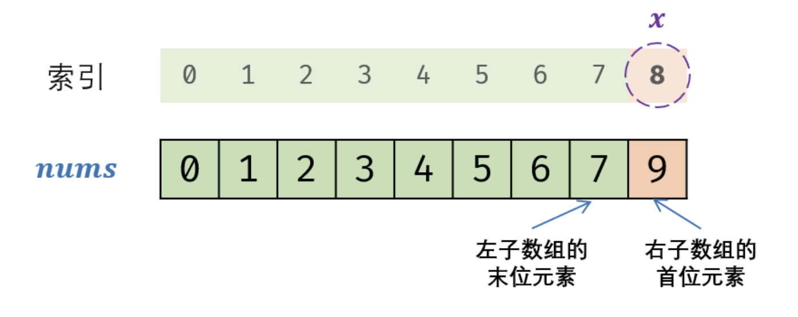

# 二分查找

我周围的人几乎都认为二分查找很简单，但事实真的如此吗？二分查找真的很简单吗？并不简单。看看 Knuth 大佬（发明 KMP 算法的那位）怎么说的：

>   Although the basic idea of binary search is comparatively straightforward, the details can be surprisingly tricky…

## 基本思想

二分查找算法的前置条件是，一个已经排序好的序列，这样在查找所要查找的元素时，首先与序列中间的元素进行比较，如果大于这个元素，就在当前序列的后半部分继续查找，如果小于这个元素，就在当前序列的前半部分继续查找，直到找到相同的元素，或者所查找的序列范围为空为止。


用伪代码来表示， 二分查找算法大致是这个样子的:

```c
left = 0， right = n -1
while (left <= right)
  mid = (left + right) / 2
  case
    x[mid] < t:  left = mid + 1;
    x[mid] = t:  p = mid; break;
    x[mid] > t:  right = mid -1;

return -1;
```

## 边界问题

二分查找算法的边界，一般来说分两种情况，一种是左闭右开区间，类似于`[left， right)`，一种是左闭右闭区间，类似于`[left， right]`。需要注意的是， 循环体外的初始化条件，与循环体内的迭代步骤， 都必须遵守一致的区间规则，也就是说，如果循环体初始化时，是以左闭右开区间为边界的，那么循环体内部迭代也应如此。如果两者不一致，会造成程序的错误。

> **`while`条件的思考：**如何判断循环条件是`<=`还是`<`？很简单，我们想象数组只有一个元素的场景，左闭右闭的时候直接很明显应该是`<=`，不然都拿不到解。而左闭右开的时候，`<`能更精确更快的确定元素的位置。

**左闭合右闭合：**

```ts
function binarySearch(nums: number[], target: number) {
    const n = nums.length;
    if (!n) return -1;
    let left = 0,
        right = n - 1;
    while (left <= right) {
        let middle = left + ((right - left) >> 1);
        if (nums[middle] === target) {
            return middle;
        } else if (nums[middle] > target) {
            right = middle - 1;
        } else {
            left = middle + 1;
        }
    }
    return -1;
}
```

**左闭合右开：**

```ts
function binarySearch(nums: number[], target: number) {
    const n = nums.length;
    if (!n) return -1;
    let left = 0,
        right = n;
    while (left < right) {
        let middle = left + ((right - left) >> 1);
        if (nums[middle] = target) {
            return middle;
        } else if (nums[middle] > target) {
            right = middle;
        } else {
            left = middle + 1;
        }
    }
    return -1;
}
```

> 这里为什么`right = middle`不会出现死循环？其实是因为`(left + right) / 2`本身就是一个保守的向右逼近。

## 溢出和优化

前面解决了边界选择时可能出现的问题，在循环体内，计算中间位置的时候，使用的是这个表达式：

```c
middle = (left + right) / 2;
```

假如，`left`与`right`之和超过了所在类型的表示范围的话，`middle`就得不到正确的值，所以，更稳妥的做法应该这样:

```c
middle = left + (right - left) / 2;
```

最后我们知道位移运算的运算速度是远超过除法的，所以：

```c
middle =  left + ((right - left) >> 2);
```

## 临界值算法

讲临界值算法之前先定义一下边界的规则，比如找 `[1, 2, 3, 3, 4, 5]`中 `3` 的左右边界，首先左右边界是包含自身的，其中，第一个 `3` 是 `3`的右边界，即其右侧的值(包括自身)都大于`3`，而左边界则正相反。

```ts
[1, 2, 3, 3, 4, 5]
			 ^
  		 right border
[1, 2, 3, 3, 4, 5]
			    ^
  		    left border
```

#### 寻找左边界

直接上代码：

```ts
function binarySearchLeftBorder(nums: number[], target: number) {
    const n = nums.length;
    if (!n) return -1;
    let left = -1,
        right = n - 1;
    while (left < right) {
        let middle = Math.ceil((left + right) / 2);
        if (nums[middle] <= target) {
            left = middle;
        } else {
            right = middle - 1;
        }
    }
    return nums[left] <= target ? left : -1;
}
```

分析寻找左边界的情况，首先如果没有左边界`(左越界)`应该返回`-1`，所以我们将区间设置成`(-1, n-1]`即左开右闭。之后分析一下怎么做界限收缩，每次我们拿到中间元素有两种可能情况：

+ `nums[mid] <= target`，如果中间元素比目标元素小或者相等，那中间元素可能是左边界，此时左边界要保守收缩(`left = middle`)。
+ `nums[mid] > target`，反之中间元素比目标元素大，那中间元素必不可能是左边界，此时可以激进收缩`(right = middle - 1)`。

此时右边界不断的向左收缩`(middle-1)`，左边界保守的收缩`(middle)`，而这种情况下可能会出现死循环，所以说我们要将`middle`计算的时候设置为向右逼近(`Math.ceil`)，这样`left`就相当于有一个保守的右位移。

> 最后要说一点的是最后的返回值既可以是`left`也可以是`right`，因为循环的结束条件是`left === right`。

最后不排除数组中不包含左边界(全大于 `targer`)的情况，这种情况下，`left` 和 `right` 都会停留在 `idx=0` 处，所以我们要判断一下最后的结果是否真的为左边界。

#### 寻找右侧边界

寻找右侧边界和寻找左侧边界的代码差不多，只有几处不同，已标注：

```ts
function binarySearchRightBorder(nums: number[], target: number) {
    const n = nums.length;
    if (!n) return -1;
    let left = 0,
        right = n; // diff 1
    while (left < right) {
        let middle = left + ((right - left) >> 1); // diff2
        if (nums[middle] >= target) { // diff 3
            right = middle;
        } else {
            left = middle + 1; 
        }
    }
    return nums[right] >= target ? right : -1;
}
```

寻找右边界的道理本身和寻找左边界相同，区间设置为`<0, n>`，同理我们让区间向左逼近，右侧保守的位移，同时`left + ((right - left) >> 1)`本身相当于一个保守的左位移防止死循环的出现。最后的判断也是同理。

## 例题*2

#### [剑指 Offer 53 - I. 在排序数组中查找数字 I](https://leetcode-cn.com/problems/zai-pai-xu-shu-zu-zhong-cha-zhao-shu-zi-lcof/)

**题目描述**

统计一个数字在排序数组中出现的次数。

**示例 1:**

```
输入: nums = [5,7,7,8,8,10], target = 8
输出: 2
```

**算法策略**

其实就是找到 `target` 的右边界，然后向右计数：

```ts
function search(nums: number[], target: number): number {
    let startIdx = getRB(nums, target);
    let count = 0;
    while (startIdx < nums.length && nums[startIdx] === target) {
        count++;
        startIdx++;
    }
    return count;
};

function getRB(nums: number[], target: number): number {
    let l = 0, r = nums.length;
    while (l < r) {
        let m = ((l + r) / 2) | 0;
        if (nums[m] < target) {
            l = m + 1;
        } else {
            r = m;
        }
    }
    return l;
}
```

#### [剑指 Offer 53 - II. 0～n-1中缺失的数字](https://leetcode-cn.com/problems/que-shi-de-shu-zi-lcof/)

**题目描述**

一个长度为``n-1``的递增排序数组中的所有数字都是唯一的，并且每个数字都在范围``0``～``n-1``之内。在范围``0``～``n-1``内的``n``个数字中有且只有一个数字不在该数组中，请找出这个数字。

**示例 1:**

```
输入: [0,1,3]
输出: 2
```

**示例 2:**

```
输入: [0,1,2,3,4,5,6,7,9]
输出: 8
```

**算法策略**

根据题意，数组可以按照以下规则划分为两部分。

+ 左子数组： `nums[i] = i`
+ 右子数组： `nums[i] != i `

而我们要做的就是找到右子数组的左边界，这个数是第一个 `nums[i] != i` 的数字，其下标就是缺失数字



其实就是一道二分法的变式题，这次找的是缺失数字右边界，只是我们判断收缩的策略有改变：

+ `nums[i] = i`，必不可能是右边界，大胆的左收缩。
+ `nums[i] != i`，可能是右边界，谨慎的右收缩。

```ts
function missingNumber(nums: number[]): number {
    let l = 0, r = nums.length;
    while (l < r) {
        let m = ((l + r) / 2) | 0;
        if (nums[m] === m) {
            l = m + 1;
        } else {
            r = m;
        }
    }
    return l;
};
```

## [4.寻找两个正序数组的中位数](https://leetcode-cn.com/problems/median-of-two-sorted-arrays/)

给定两个大小分别为 `m` 和 `n` 的正序（从小到大）数组 `nums1` 和 `nums2`。请你找出并返回这两个正序数组的 中位数 。

 **示例 1：**

```ts
输入：nums1 = [1,3], nums2 = [2]
输出：2.00000
解释：合并数组 = [1,2,3] ，中位数 2
```

**示例2：**

```ts
输入：nums1 = [1,2], nums2 = [3,4]
输出：2.50000
解释：合并数组 = [1,2,3,4] ，中位数 (2 + 3) / 2 = 2.5
```

### 算法策略

给定两个有序数组，要求找到两个有序数组的中位数，最直观的思路有以下两种：

+ 使用归并的方式，合并两个有序数组，得到一个大的有序数组。大的有序数组的中间位置的元素，即为中位数。
+ 不需要合并两个有序数组，只要找到中位数的位置即可。由于两个数组的长度已知，因此中位数对应的两个数组的下标之和也是已知的。维护两个指针，初始时分别指向两个数组的下标 00 的位置，每次将指向较小值的指针后移一位（如果一个指针已经到达数组末尾，则只需要移动另一个数组的指针），直到到达中位数的位置。

假设两个有序数组的长度分别为 `m` 和 `n`，上述两种思路的复杂度如何？

第一种思路的时间复杂度是 `O(m+n)`，空间复杂度是 `O(m+n)`。第二种思路虽然可以将空间复杂度降到 `O(1)`，但是时间复杂度仍是 `O(m+n)`。

如何把时间复杂度降低到 `O(log(m+n))` 呢？如果对时间复杂度的要求有 `log`，通常都需要用到二分查找，这道题也可以通过二分查找实现。

根据中位数的定义，当 `m+n` 是奇数时，中位数是两个有序数组中的第 `(m+n)/2` 个元素，当 `m+n` 是偶数时，中位数是两个有序数组中的第 `(m+n)/2` 个元素和第 `(m+n)/2+1` 个元素的平均值。因此，这道题可以转化成寻找两个有序数组中的第 `k` 小的数，其中 `k` 为 `(m+n)/2` 或 `(m+n)/2+1`。

假设两个有序数组分别是 `A` 和 `B`。要找到第 `k` 个元素，我们可以比较 `A[k/2−1]` 和 `B[k/2−1]`，由于 `A[k/2−1]` 和`B[k/2−1]` 的前面分别有 `A[0..k/2−2]` 和 `B[0..k/2−2]`，即 `k/2−1` 个元素，对于`A[k/2−1]` 和 `B[k/2−1]` 中的较小值，最多只会有 `(k/2−1)+(k/2−1)≤k−2` 个元素比它小，那么它就不能是第 `k` 小的数了。


因此我们可以归纳出三种情况：

+ 如果 `A[k/2−1]<B[k/2−1]`，则比 `A[k/2−1]` 小的数最多只有 `A` 的前 `k/2-1` 个数和 `B` 的前 `k/2-1` 个数，即比 `A[k/2−1]` 小的数最多只有 `k−2` 个，因此 `A[k/2−1]` 不可能是第 `k` 个数，`A[0]` 到 `A[k/2−1]` 也都不可能是第 `k` 个数，可以全部排除。
+ 如果 `A[k/2−1]>B[k/2−1]`，则可以排除 `B[0]` 到 `B[k/2−1]`。
+ 如果 `A[k/2−1]=B[k/2−1]`，则可以归入第一种情况处理。

可以看到，比较 `A[k/2−1]` 和 `B[k/2−1]` 之后，可以排除 `k/2` 个不可能是第 `k` 小的数，查找范围缩小了一半。同时，我们将在排除后的新数组上继续进行二分查找，并且根据我们排除数的个数，减少 `k` 的值，这是因为我们排除的数都不大于第 `k` 小的数。

有以下三种情况需要特殊处理：

+ 如果 `A[k/2−1]` 或者 `B[k/2−1]` 越界，那么我们可以选取对应数组中的最后一个元素。在这种情况下，我们必须根据排除数的个数减少 `k` 的值，而不能直接将 `k` 减去 `k/2`。
+ 如果一个数组为空，说明该数组中的所有元素都被排除，我们可以直接返回另一个数组中第 `k` 小的元素。
+ 如果 `k=1`，我们只要返回两个数组首元素的最小值即可。

### 算法实现

第一个函数不重要，主要是处理了单数长度数组中位数和双数长度的区别：

```ts
export function findMedianSortedArrays(
    nums1: number[],
    nums2: number[]
): number {
    let m = nums1.length,
        n = nums2.length;
    if ((m + n) % 2 === 0) {
        return (getKElement(nums1, nums2, (m + n) / 2) + getKElement(nums1, nums2, (m + n) / 2 + 1)) / 2
    } else {
        return getKElement(nums1, nums2, Math.ceil((m + n) / 2));
    }
}
```

主要是第二个函数，这道题二分查找的思路是，两个数组中的某个每次排除 `k/2` 或更少个元素，所以我们只需要维护两个起始坐标，然后不断向后收缩，直到 `k = 1` 或者某个数组收缩为空：

```ts
function getKElement(nums1: number[], nums2: number[], k: number) {
    let n1 = nums1.length,
        n2 = nums2.length;

    let l1 = 0,
        l2 = 0;
    while (true) {
      	// 三种特殊情况的处理：
      	// 1.nums1 数组已被清空：
        if (l1 === n1) {
            return nums2[l2 + k - 1];
        }
				// 2.num2 数组已被清空：
        if (l2 === n2) {
            return nums1[l1 + k - 1];
        }
      	// 3.k 只剩 1：
        if (k === 1) {
            return Math.min(nums1[l1], nums2[l2]);
        }
      
      	// 常规发现流程：
        let half = (k / 2) | 0;
        let m1 = Math.min(l1 + half, n1) - 1,
            m2 = Math.min(l2 + half, n2) - 1;

        if (nums1[m1] <= nums2[m2]) {
          	// 减小实际排除的内容：
            k -= m1 - l1 + 1;
            l1 = m1 + 1;
        } else {
            k -= m2 - l2 + 1;
            l2 = m2 + 1;
        }
    }
}
```

