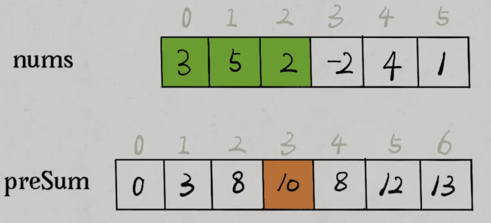
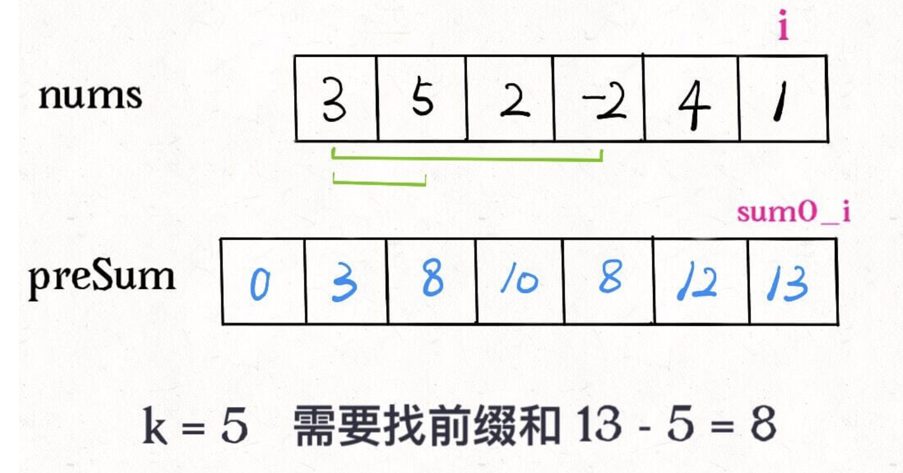

## 	前缀和数组

前缀和的思路是这样的，对于一个给定的数组 `nums`，我们额外开辟一个前缀和数组进行预处理：

```java
class PrefixSum {
    // 前缀和数组
    private int[] prefix;

    /* 输入一个数组，构造前缀和 */
    public PrefixSum(int[] nums) {
        prefix = new int[nums.length + 1];
        // 计算 nums 的累加和
        for (int i = 1; i < prefix.length; i++) {
            prefix[i] = prefix[i - 1] + nums[i - 1];
        }
    }

    /* 查询闭区间 [i, j] 的累加和 */
    public int query(int i, int j) {
        return prefix[j + 1] - prefix[i];
    }
}
```

`prefix[i]`就代表着`nums[0..i-1]`所有元素的累加和，如果我们想求区间`nums[i..j]`的累加和，只要计算`prefix[j+1] - prefix[i]`即可，而不需要遍历整个区间求和。



**前缀和主要适用的场景是原始数组不会被修改的情况下，频繁查询某个区间的累加和**。

## [560. 和为K的子数组](https://leetcode-cn.com/problems/subarray-sum-equals-k/)

给定一个整数数组和一个整数 **k，**你需要找到该数组中和为 **k** 的连续的子数组的个数。

**示例 1 :**

```c
输入:nums = [1,1,1], k = 2
输出: 2 , [1,1] 与 [1,1] 为两种不同的情况。
```

**说明 :**

1. 数组的长度为 `[1, 20,000]`。
2. 数组中元素的范围是 [`-1000, 1000`] ，且整数 `k` 的范围是 [`-1e7, 1e7`]。

### 算法策略

这个子数组问题，我们想求有多少个子数组的和为 `k`，借助前缀和技巧很容易写出一个解法：

```ts
function subarraySum(nums: number[], k: number): number {
    let n = nums.length,
        prefixArr = new Array(n + 1).fill(0);
    
    for (let i = 1; i <= n; i++) {
        prefixArr[i] = nums[i - 1] + prefixArr[i - 1];
    }

    let res = 0;
    
    for (let i = 1; i <= n; i++) {
        for (let j = 0; j < i; j++) {
            if (prefixArr[j] === k - prefixArr[i]) {
                res += 1;
            }
        }
    }

    return res;
};
```

这个解法的时间复杂度 `O(N^2)` 空间复杂度 `O(N)`，并不是最优的解法。不过通过这个解法理解了前缀和数组的工作原理之后，可以使用一些巧妙的办法把时间复杂度进一步降低。

### 算法优化

前面的解法有嵌套的 `for` 循环：

```c
for (int i = 1; i <= n; i++)
    for (int j = 0; j < i; j++)
        if (sum[i] - sum[j] == k)
            ans++;
```

第二层 for 循环在干嘛呢？翻译一下就是，**在计算，有几个** **`j`** **能够使得** **`sum[i]`** **和** **`sum[j]`** **的差为 k。**毎找到一个这样的 `j`，就把结果加一。

我们可以把 `if` 语句里的条件判断移项，这样写：

```c
if (sum[j] == sum[i] - k)
    ans++;
```

优化的思路是：**我直接记录下有几个** **`sum[j]`** **和** **`sum[i] - k`** **相等，直接更新结果，就避免了内层的 for 循环**。我们可以用哈希表，在记录前缀和的同时记录该前缀和出现的次数。

```ts
function subarraySum(nums: number[], k: number): number {
    let n = nums.length;

    let prefixMap = new Map<number, number>(),
        sum0_i = 0,
        res = 0;
    prefixMap.set(0, 1);

    for (let i = 0; i < n; i++) {
        sum0_i += nums[i];
        let sum0_j = sum0_i - k;

        if (prefixMap.has(sum0_j)) {
            res += prefixMap.get(sum0_j);
        }
        prefixMap.set(sum0_i, prefixMap.has(sum0_i) ? prefixMap.get(sum0_i) + 1 : 1);
    }

    return res;
}
```

比如说下面这个情况，需要前缀和 `8` 就能找到和为 `k` 的子数组了，之前的暴力解法需要遍历数组去数有几个 `8`，而优化解法借助哈希表可以直接得知有几个前缀和为 `8`。

