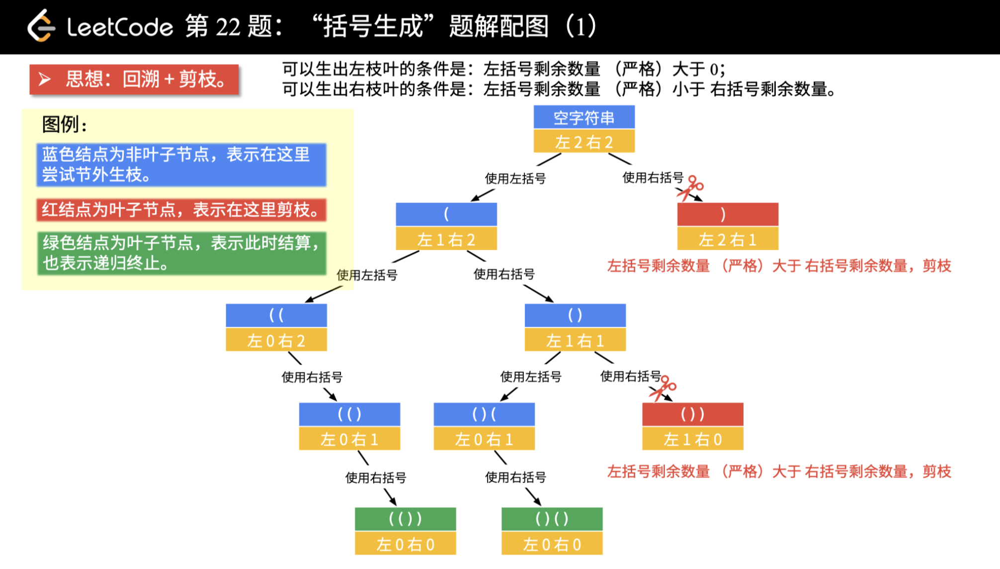

## 概述

`深度优先遍历`属于图的一种基本遍历算法，符合回溯的算法思想。

这里所说的图，不止局限于存储结构上的图，还包括逻辑结构上的图，有的时候甚至说树也是一种图，就是不闭合呗。

搜索的场合中我们一般使用深度优先遍历，因为可以省略一个queue 队列，同时使用递归的话我们还可以通过系统栈来储存一些信息，具体的选择还是要根据实际情况来定。

**伪代码**

```go
1. 栈初始化：visited[n].fill(0)
2. 访问顶点：visited[v] = 1
3. 入栈
4. while(栈不为空)
    x = 栈的顶元素，并且出栈;
    for (存在并找到未被访问的x的邻接点w)
            访问w：visited[w] = 1
            w进栈
```

## 图的遍历

```go
func depthfs(graph Graph, i int, visited []bool){
	fmt.Print(graph.GetVertex(i)," ")
	visited[i] = true
	j := graph.Next(i,-1)
	for j != -1 {
		if !visited[j] {
			depthfs(graph,j,visited)
		}
		j = graph.Next(i,j)
	}
}
```

## 括号生成

给出 n 代表生成括号的对数，请你写出一个函数，使其能够生成所有可能的并且有效的括号组合。

**例子**

```bash
## n=3生成结果为
[
  "((()))",
  "(()())",
  "(())()",
  "()(())",
  "()()()"
]
```

### 解题思路

显示匹配括号的思路：



#### 递归

递归的方式下我们使用参数来储存变量，每个递归的调用就像于是给递归树增加的一个分支。

```go
func generateParenthesis(n int) []string {
	answers := make([]string, 0)
	helper(n, n, "", &answers)
	return answers
}

func helper(l, r int, str string, store *[]string) {
	if l == 0 && r == 0 {
		*store = append(*store, str)
	}

	if l > r {
		return
	}

	if l > 0 {
		helper(l-1, r, str+"(", store)
	}

	if r > 0 {
		helper(l, r-1, str+")", store)
	}
}
```

如果说只是先要拿到一个解，也可以采用如下回溯的方式。

```go
func helperOne(l, r int, str string, store *[]string) bool {
	if l == 0 && r == 0 {
		*store = append(*store, str)

	}
	if l > 0 && helperOne(l-1, r, str+"(", store) {
		return true
	} else if r > 0 && r > l && helperOne(l, r-1, str+")", store) {
		return true
	} else {
		return false
	}
}

```

#### 自建栈

使用自建栈的话我们需要花额外的存储空间来存储括号的剩余和字串状态。

```go
type node struct {
	left  int
	right int
	str   string
}

func generateParenthesisDFS(n int) []string {
	stk := STACK.NewSingleStack()
	stk.Push(&node{
		left:  n,
		right: n,
		str:   "",
	})

	ans := make([]string, 0)
	for !stk.IsEmpty() {
		cur := stk.Pop().(*node)
		if cur.left == 0 && cur.right == 0 {
			ans = append(ans, cur.str)
			continue
		}

		if cur.left > 0 {
			stk.Push(&node{
				left:  cur.left - 1,
				right: cur.right,
				str:   cur.str + "(",
			})
		}

		if cur.right > cur.left {
			stk.Push(&node{
				left:  cur.left,
				right: cur.right - 1,
				str:   cur.str + ")",
			})
		}
	}
	return ans
}
```

