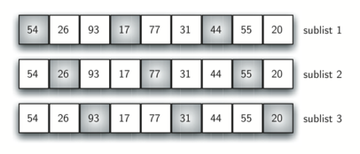
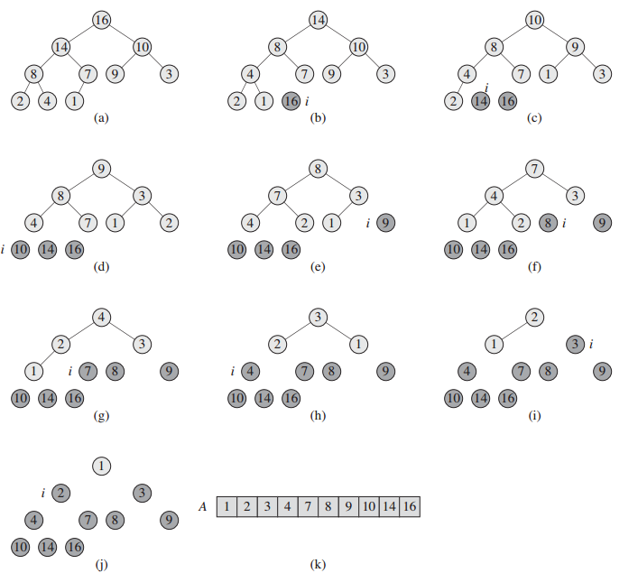

# Sort Func Collection

## O(n*2) level

### Select Sort

`select sort` 选择排序是名副其实最烂的排序算法，外层循环 `n` 次依次找到 `n` 个最小元素，内层循环 `n - i - 1` 次每次找到当前轮次最小元素，并且和第 `i` 个位置的元素做交换。


```go
func SelectSort(data Sortable) {
	for i := 0; i < data.Len(); i++ {
		min := i
		for j := i + 1; j < data.Len(); j++ {
			if data.Less(j, min) {
				min = j
			}
		}
		data.Swap(min, i)
	}
}
```

| 平均时间复杂度 | 最坏时间复杂度 | 最优时间复杂度 | 空间复杂度   |
| -------------- | -------------- | -------------- | ------------ |
| O(n^2)         | O(n^2)         | O(n^2)         | O(1)辅助空间 |

### Bubble Sort

`Bubble Sort`(冒泡排序)的原理和插入排序类似，每次将最大的元素沉到数组的后方，外循环需要 `n-1` 次遍历，每次校正一个最大元素，内循环次数为 `n - i` 每次要忽略已经排序好的大元素。


```go
func BubbleSort(data Sortable) {
	for i := 1; i < data.Len(); i++ {
		for j := 0; j < data.Len()-i; j++ {
			if data.Less(j+1, j) {
				data.Swap(j, j+1)
			}
		}
	}
}
```

| 平均时间复杂度 | 最坏时间复杂度 | 最优时间复杂度 | 空间复杂度   |
| -------------- | -------------- | -------------- | ------------ |
| O(n^2)         | O(n^2)         | O(n)           | O(1)辅助空间 |

**####** **Insertion Sort**

`Insertion Sort`(插入排序)的原理是：从下标为 `1` 的位置开始遍历数组，**外循环**每次固定为 `n - 1` 次，从 `1` 遍历到 `n-1`。**内循环**最多遍历 `i` (外循环下标到 `1`)次迭代插入直到出现比当前元素小的元素。


```go
 // Insertion sort
 func insertionSort(data Interface) {
   for i := 1; i < data.Len(); i++ {
     for j := i; j > 0 && data.Less(j, j-1); j-- {
       data.Swap(j, j-1)
     }
   }
 }
```

| 平均时间复杂度 | 最坏时间复杂度 | 最优时间复杂度 | 空间复杂度   |
| :------------- | :------------- | :------------- | :----------- |
| O(n^2)         | O(n^2)         | O(n)           | O(1)辅助空间 |

### Shell Sort

希尔排序(`Shellsort`)，也称递减增量排序算法，是插入排序的一种更高效的改进版本。

希尔排序最开始将列表按照一定步长(增量)分成多个子序列，每个子序列进行插入排序，然后减小步长，重新分割子序列，再对每个子序列进行插入排序。重复上述步骤，直到步长为`1`，对整个列表进行插入排序，排序完成。

给定一个长度`n=9`的列表，选择一定的步长，这里为`3`，将列表分成如下三个子列表：



对每一个子列表进行插入排序，最终列表如下图所示，我们发现尽管列表没有完全正序，但是很多元素已经距离最终位置非常接近了，这也就减少了插入排序时的移动次数。


```go
func ShellSort(data Sortable) {
	for dalta := data.Len() / 2; dalta > 0; dalta = dalta >> 1 {
		for i := dalta; i < data.Len(); i++ {
			for j := i; j-dalta > 0 && data.Less(j, j-dalta); j -= dalta {
				data.Swap(j, j-dalta)
			}
		}
	}
}
```

`Donald Shell`最初建议步长选择为并且对步长取半直到步长达到`1`。虽然这样取可以比`O(n^2)`类的算法（插入排序）更好，但这样仍然有减少平均时间和最差时间的余地。

已知的最好步长序列是由`Sedgewick`提出的`(1, 5, 19, 41, 109,...)`，该序列的项，从第`0`项开始，偶数来自  和奇数来自这两个算式。用这样步长序列的希尔排序比[插入排序](https://zh.wikipedia.org/wiki/插入排序)要快，甚至在小数组中比[快速排序](https://zh.wikipedia.org/wiki/快速排序)和[堆排序](https://zh.wikipedia.org/wiki/堆排序)还快，但是在涉及大量数据时希尔排序还是比快速排序慢。

其实希尔排序应该归属 `O(nlog(n)) level`的排序算法，但是由于其和 `InsertionSort` 关系的特殊性所以被放在这里。

| 平均时间复杂度          | 最坏时间复杂度 | 最优时间复杂度 | 空间复杂度   |
| ----------------------- | -------------- | -------------- | ------------ |
| depends on gap sequence | O(nlog(n)^2)   | O(nlog(n))     | O(1)辅助空间 |

## O(nlog(n)) level

### Heap Sort

堆排序的思想很简单，首先我们创造一个堆，这个堆的堆顶元素就是最大元素，我们将他和堆的末尾元素交换，之后堆的结构会被破坏，我们只需要从新堆堆顶元素进行堆化，同时堆化的范围`h.size - 1`，我们就能一次拿到其余的最大元素，到最后堆化范围只剩堆顶元素，排序就完成了。



这里我贴的代码很简单，首先 `NewHeap` 构建最大堆，然后每次交换元素并重新 `heapifyDown`，如果想看详细的代码见 **6-6.堆** 这一章。

```go
// Sort is a sort Algorithm
func Sort(arr []int) []int {
	h := New(arr, true)
	for i := h.Size() - 1; i > 0; i-- {
		h.heapifyDown(0, i)
		h.tree[i], h.tree[0] = h.tree[0], h.tree[i]
	}
	return h.tree
}
```

| 平均时间复杂度 | 最坏时间复杂度 | 最优时间复杂度 | 空间复杂度   |
| -------------- | -------------- | -------------- | ------------ |
| O(nlog(n))     | O(nlog(n))     | O(nlog(n))     | O(1)辅助空间 |

### Quick Sort

快速排序是一个经典的 `2*(n/2 - 1)` 规模的分治算法，二分规模的分治算法通常都比较简单，解题步骤无非就是找到分界点，递归解决两个子问题，最后合并。

参考`《算法导论》`，我们对数组 `a[l...r]` 做快速排序的过程是：

1. **分解：**随机产生一个分界点 `q`，将数组 `a[l...r]` 「划分」成两个子数组 `a[l...q-1]`、`a[q+1...r]`，使得 `a[l...q-1]` 中的每个元素小于等于 `a[q]`，且 `a[q]` 小于等于 `a[q+1...r]`中的每个元素。
2. **解决：** 通过递归调用快速排序，对子数组 `a[l...q-1]`、`a[q+1...r]` 进行排序，其实就是调用上面的过程。
3. 合并： 因为子数组都是原址排序的，所以不需要进行合并操作，`a[l...r]` 已经有序。

```ts
function quickSort(arr: number[]) {
    _quickSort(arr, 0, arr.length - 1);
}

function _quickSort(arr: number[], l: number, r: number) {
    if (l >= r) return;
    let divider = randomPartition(arr, l, r);
    _quickSort(arr, l, divider - 1);
    _quickSort(arr, divider + 1, r);
  	// no merge
}

function randomPartition(arr: number[], l: number, r: number): number {
    let divider = (Math.random() * (r - l + 1) + l) | 0;
    swap(arr, divider, r);

    let pivot = arr[r];
    let sIdx = l;
    for (let i = l; i < r; i++) {
        if (arr[i] <= pivot) {
            swap(arr, i, sIdx++);
        }
    }
    swap(arr, r, sIdx);
    return sIdx;
}

function swap(arr: number[], i: number, j: number) {
    [arr[i], arr[j]] = [arr[j], arr[i]];
}
```

来看看代码，首先 `l >= r` 表明问题规模到达阙值，此时可以结束递归。

方法主体包括分解和解决，其实快排比较特殊，解决问题的过程其实是发生在分解的同时，`randomPartition` 产生一个随机分界将整个数组以其为基点一分为二(左小右大)。

之后再次调用 `_quickSort` 递归解决分解过程中产生的子问题直到整个数组排序完成。

| 平均时间复杂度 | 最坏时间复杂度 | 最优时间复杂度 | 空间复杂度     |
| -------------- | -------------- | -------------- | -------------- |
| O(nlog(n))     | O(nlog(n))     | O(nlog(n))     | O(n^2)辅助空间 |

### Merge Sort

归并排序也是一个经典的 `2*(n/2 - 1)` 规模的分治算法，其重点是当数组大小到达阙值(`2`)时，两个子数组大小都是 `1`，相当于已经排好序的两个数组，可以进行合并两个已排序的数组算法。

以数组 `a[l...r]` 为例，三步走：

+ **分解**：将 `a[l...r]` 分为 `a[l...(l+r)/2]`、`a[(l+r)/2+1...r]`两个子数组。
+ **解决**：用合并排序法对两个已排序子序列递归的排序。

```ts
function MergeSort(arr: number[]) {
    _mergeSort(arr, 0, arr.length - 1);
    return arr;
}

function _mergeSort(arr: number[], l: number, r: number) {
    if (l === r) {
        return;
    }
    let mid = l + ((r - l) >> 2);
    _mergeSort(arr, l, mid);
    _mergeSort(arr, mid + 1, r);
    merge(arr, l, mid, r);
}

function merge(arr: number[], l: number, lr: number, r: number) {
    let temp: number[] = new Array(r - l + 1);
    let ll = l;
    let rl = lr + 1;
    let i = 0;
    while (ll <= lr && rl <= r) {
        if (arr[ll] < arr[rl]) {
            temp[i++] = arr[ll++];
        } else {
            temp[i++] = arr[rl++];
        }
    }

    while (ll <= lr) {
        temp[i++] = arr[ll++];
    }

    while (rl <= r) {
        temp[i++] = arr[rl++];
    }

    for (i = 0; i < temp.length; i++) { // 填充回数组
        arr[l + i] = temp[i];
    }
}
```

`MergeSort`的实现也很简单，先写一个合并两个已排序子数组的方法 `merge`，之后递归拆分处理交给 `merge`。其执行流程大概如下：


注意函数的阙值是 `l === r` 此时数组长度为 `1`已经排序。

| 平均时间复杂度 | 最坏时间复杂度 | 最优时间复杂度 | 空间复杂度   |
| -------------- | -------------- | -------------- | ------------ |
| O(nlog(n))     | O(nlog(n))     | O(nlog(n))     | O(n)辅助空间 |

## O(n) level

`O(n)`级别的排序算法一般都用到了 桶 这个概念，只是对桶的使用方法上有明显差异：

+ 计数排序：每个桶只存储单一键值；
+ 桶排序：每个桶存储一定范围的数值；
+ 基数排序：根据键值的每位数字来分配桶；

### Count Sort

计数排序的核心在于将输入的数据值转化为键存储在额外开辟的数组空间中。作为一种线性时间复杂度的排序，计数排序要求输入的数据必须是有确定范围的整数。

 算法的步骤如下：

1. 找出待排序的数组中最大和最小的元素，构造辅助数组 `C`；

2. 统计数组中每个值为 `i` 的元素出现的次数，存入数组 `C` 的第 `i` 项；
3. 对所有的计数累加（从 `C` 中的第一个元素开始，每一项和前一项相加）；
4. 反向填充目标数组：将每个元素 `i` 放在新数组的第 `C(i)` 项，每放一个元素就将 `C(i)` 减去 `1`，直到 `C(i)`的计数为 `0`；

```ts
function countingSort(arr: number[]): number[] {
    let n = arr.length;
    // get the highest and lowest num from the array;
    let loV = 0,
        hiV = 0;

    for (let v of arr) {
        loV = Math.min(v, loV);
        hiV = Math.max(v, hiV);
    }

    // make bucket(mark array)
    let bucket = new Array(hiV - loV + 1),
        sorted = new Array(n).fill(0);

    // count v counts in arr and record on v - loV in bucket
    for (let v of arr) {
        bucket[v - loV]++;
    }

    // sum v and vals lower than v counts on v - loV in bucket
    for (let i = 1; i < bucket.length; i++) {
        bucket[i] = bucket[i - 1] + bucket[i];
    }

    // make new Arr from bucket
    for (let v of arr) {
        sorted[bucket[v - loV] - 1] = v;
        bucket[v - loV]--;
    }

    return sorted;
}
```

| 平均时间复杂度 | 最坏时间复杂度 | 最优时间复杂度 | 空间复杂度     |
| -------------- | -------------- | -------------- | -------------- |
| O(n+r)         | O(n+r)         | O(n+r)         | O(n+r)辅助空间 |

### Radix Sort

`Radix Sort`(基数排序)是一种非比较型整数排序算法，其原理是将整数按位数切割成不同的数字，然后按每个位数分别比较。由于整数也可以表达字符串(比如名字或日期)和特定格式的浮点数，所以基数排序也不只用于整数。


上面的动画很精确的描述了 `radix sort` 的过程，转成文字描述则如下：

+ 计算数组里最高位的元素的位数，以此确定循环次数(对每个位进行一次计数排序)；
+ 循环中从最低位开始，根据 `0-9` 的桶容量根据这个数位的数对数组进行计数排序，重排 `arr`；
+ 重复这个过程直到根据最后一位来进行数组重排完成；

```ts
// RadixSort is a O(n*k) stable sorting algorithm
func RadixSort(intArr []int) []int {
	tmp := make([]int, len(intArr))
	copy(tmp, intArr)
  // 计算最高位
	digits := MaxDigits(tmp)

  // rerange for n digits
	for index := 0; index < digits; i++ {
		zeros := int(math.Pow(float64(10), float64(index)))
    // 10 ^ i
		bucket := [10]int{}
		intArr = rearange(zeros, intArr, &bucket)
	}
	return intArr
}

// MaxDigits returns the biggest digit among nums
func MaxDigits(intArr []int) int {
	for i := 1; i < len(intArr); i++ {
		if intArr[i-1] > intArr[i] {
			intArr[i-1], intArr[i] = intArr[i], intArr[i-1]
		}
	}
	maxNum := intArr[len(intArr)-1]
	return len(strconv.Itoa(maxNum))
}

func rearange(zores int, intArr []int, bucket *[10]int) []int {
	for _, value := range intArr {
    // 给第 i 位的不同数字计数
		(*bucket)[(value/zores)%10]++
	}
	(*bucket)[0]--
  // 下标规范化
	for i := 1; i < len(bucket); i++ {
    // 计算计数和 后 = 前 + 后
		(*bucket)[i] = (*bucket)[i-1] + (*bucket)[i]
	}

	aux := make([]int, len(intArr))
	for i := len(intArr) - 1; i >= 0; i-- {
    // 重排数组
		dnum := (intArr[i] / zores) % 10
		pos := (*bucket)[dnum]
		aux[pos] = intArr[i]
		(*bucket)[dnum]--
	}
	return aux
}

```

| 平均时间复杂度 | 最坏时间复杂度 | 最优时间复杂度 | 空间复杂度     |
| -------------- | -------------- | -------------- | -------------- |
| O(n*r)         | O(n*r)         | O(n*r)         | O(n+r)辅助空间 |

