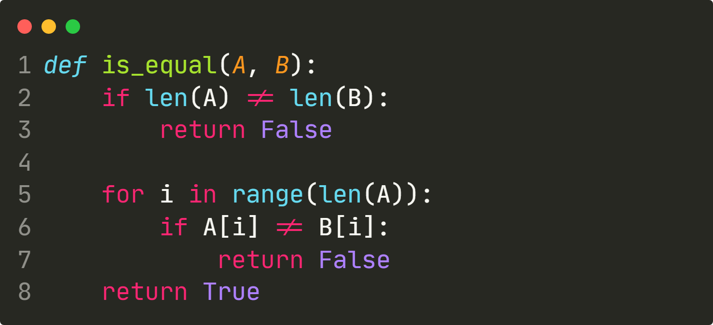
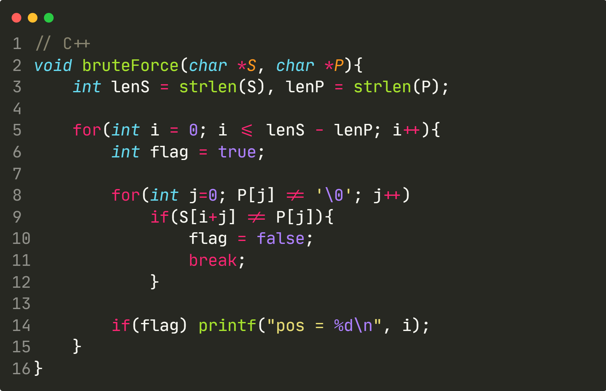
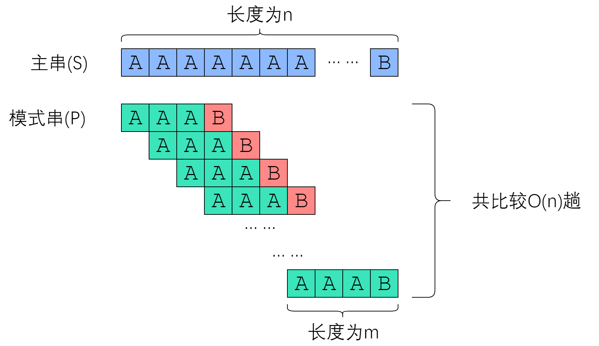
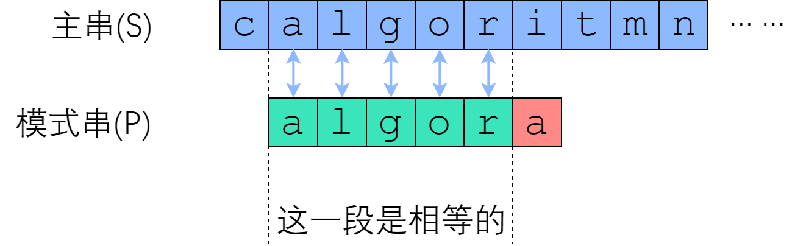
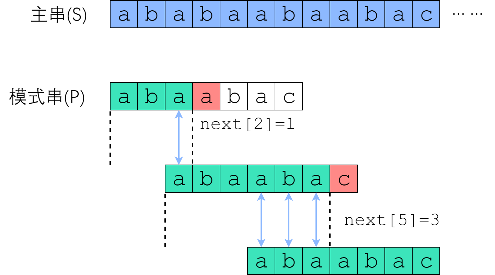
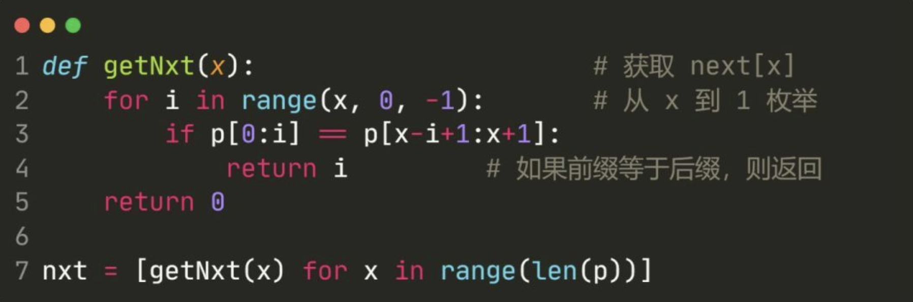
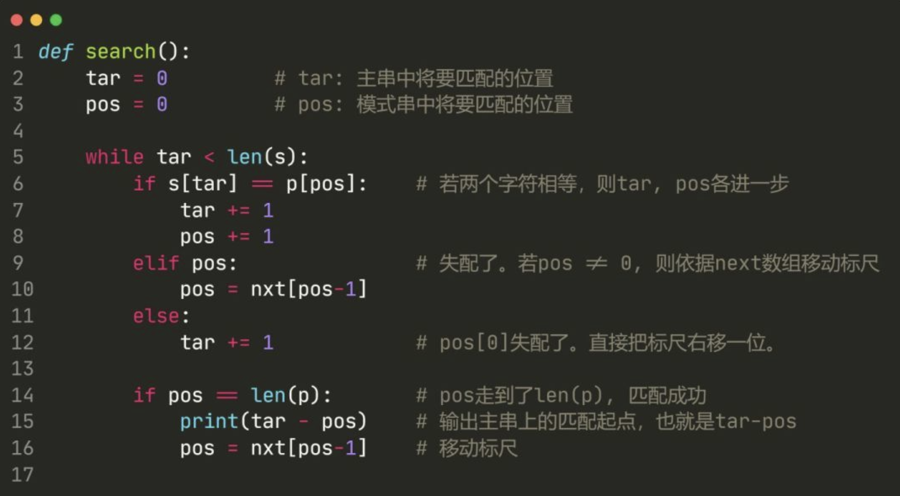
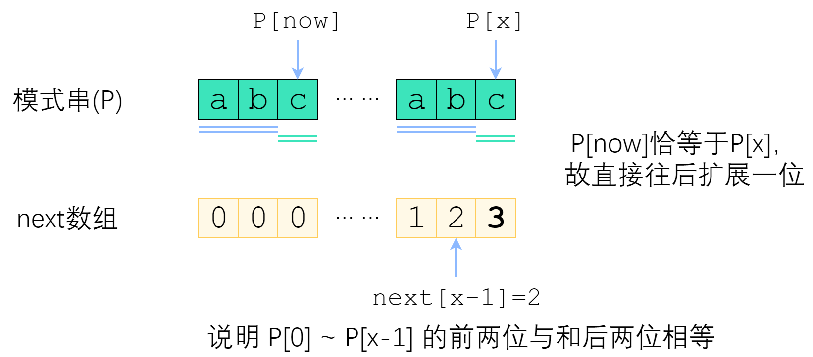
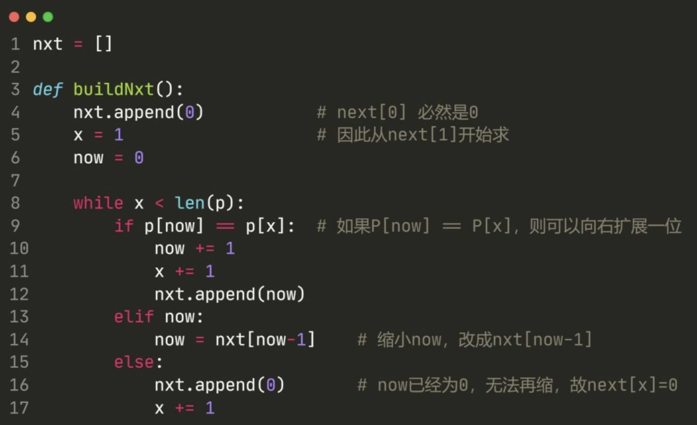

# KMP 模式匹配

所谓字符串匹配，是这样一种问题：“字符串 `P` 是否为字符串 `S` 的子串？如果是，它出现在 `S` 的哪些位置？” 其中 `S` 称为**主串**；`P` 称为**模式串**。下面的图片展示了一个例子。


主串是莎翁那句著名的 “`to be or not to be`”，这里删去了空格。“`no`” 这个模式串的匹配结果是“出现了一次，从`S`[`6`]开始”；“`ob`”这个模式串的匹配结果是“出现了两次，分别从`s`[`1`]、`s`[`10`]开始”。按惯例，主串和模式串都以`0`开始编号。

那么，我们先从最朴素的`Brute-Force`算法开始讲起。

## Brute-Force

顾名思义，`Brute-Force`是一个纯暴力算法。“暴力”一词在算法领域表示“穷举、极低效率的实现”，可能就是源于这个英文词。

![[算法系列之十三]Rabin-Karp字符串查找算法1](assets/4cea9a897e40b85629f6126af21a20b51603447496353.png)

首先，我们应该如何实现两个字符串 `A,B` 的比较？所谓字符串比较，就是问“两个字符串是否相等”。最朴素的思想，就是从前往后逐字符比较，一旦遇到不相同的字符，就返回`False`；如果两个字符串都结束了，仍然没有出现不对应的字符，则返回`True`。实现如下：



既然我们可以知道“两个字符串是否相等”，那么最朴素的字符串匹配算法 `Brute-Force` 就呼之欲出了——枚举 `i = 0, 1, 2 ... , len(S)-len(P)`，将 `S[i : i+len(P)]` 与 `P` 作比较。如果一致，则找到了一个匹配。



我们成功实现了 `Brute-Force` 算法。现在，我们需要对它的时间复杂度做一点讨论。按照惯例，记 `n=|S|` 为串 `S` 的长度，`m=|P|` 为串 `P` 的长度。最坏的情况下，每次字符串比较都需要付出 `|P|` 次字符比较的代价，总共需要比较 `|S|`−`|P|`+`1`次，因此总时间复杂度是 `O(|P|`⋅`(|S|`−`|P|`+`1))`. 考虑到主串一般比模式串长很多，故 `Brute-Force` 的复杂度是 `O(|P|`⋅`|S|)`，也就是 `O(nm)`的。这太慢了！

## Brute-Force的改进思路

经过刚刚的分析，您已经看到，`Brute-Force` 慢得像爬一样。它最坏的情况如下图所示：



我们很难降低字符串比较的复杂度（因为比较两个字符串，真的只能逐个比较字符）。因此，我们考虑**降低比较的趟数**。　

要优化一个算法，首先要回答的问题是“我手上有什么信息？”　我们手上的信息是否足够、是否有效，决定了我们能把算法优化到何种程度。请记住：**尽可能利用残余的信息，是KMP算法的思想所在**。

在 `Brute-Force` 中，如果从 `S`[`i`] 开始的那一趟比较失败了，算法会直接开始尝试从 `S`[`i`+`1`] 开始比较。这种行为，属于典型的“没有从之前的错误中学到东西”。我们应当注意到，一次失败的匹配，会给我们提供宝贵的信息——如果 `S`[`i` : `i`+`len(P)`] 匹配是在第 `r` 个位置失败的，那么从 `S`[`i`] 开始的 `(r-1)` 个连续字符，一定与 `P` 的前 `(r-1)` 个字符一模一样！



### 跳过不可能成功的字符串比较

有些趟字符串比较是有可能会成功的；有些则毫无可能。我们刚刚提到过，优化 `Brute-Force` 的路线是“尽量减少比较的趟数”，而如果我们跳过那些绝不可能成功的字符串比较，则可以希望复杂度降低到能接受的范围。

来看一个例子。已知信息如下：

- 模式串 `P = "abcabd"`.
- 和主串从 `S[0]` 开始匹配时，在 `P[5]` 处失配。


首先，利用上一节的结论。既然是在 `P`[`5`] 失配的，那么说明 `S`[`0`:`5`] 等于 `P`[`0`:`5`]，即"`abcab`". 现在我们来考虑：从 `S`[`1`]、`S`[`2`]、`S`[`3`] 开始的匹配尝试，有没有可能成功？

从 `S`[`1`] 开始肯定没办法成功，因为 `S`[`1`] `= P`[`1`] `=` '`b`'，和 `P`[`0`] 并不相等。从 `S`[`2`] 开始也是没戏的，因为 `S`[`2`] `= P`[`2`] `=` '`c`'，并不等于`P`[`0`]. 但是从 `S`[`3`] 开始是有可能成功的——至少按照已知的信息，我们推不出矛盾。


带着“跳过不可能成功的尝试”的思想，我们来看 `next` 数组。

### next数组

`next`数组是对于模式串而言的。`P` 的 `next` 数组定义为：`next[i]` 表示 `P[0]`~ `P[i]` 这一个子串，使得 前`k`个字符恰等于后`k`个字符 的最大的`k`. 特别地，`k`不能取`i`+`1`（因为这个子串一共才 `i`+`1` 个字符，自己肯定与自己相等，就没有意义了）。


如果把模式串视为一把标尺，在主串上移动，那么 `Brute-Force` 就是每次失配之后只右移一位；改进算法则是每次失配之后，移很多位，跳过那些不可能匹配成功的位置。但是该如何确定要移多少位呢？



在 `S[0]` 尝试匹配，失配于 `S[3] <=> P[3]` 之后，我们直接把模式串往右移了两位，让 `S[3]` 对准 `P[1]`. 接着继续匹配，失配于 `S[8] <=> P[6]`, 接下来我们把 `P` 往右平移了三位，把 `S[8]` 对准 `P[3]`. 此后继续匹配直到成功。

我们应该如何移动这把标尺？**很明显，如图中蓝色箭头所示，旧的后缀要与新的前缀一致**（如果不一致，那就肯定没法匹配上了）！

回忆 `next` 数组的性质：`P[0]` 到 `P[i]` 这一段子串中，前 `next[i]` 个字符与后 `next[i]` 个字符一模一样。既然如此，如果失配在 `P[r]`, 那么`P[0]~P[r-1]`这一段里面，**前`next[r-1]`个字符恰好和后`next[r-1]`个字符相等**——也就是说，我们可以拿长度为 next[r-1] 的那一段前缀，来顶替当前后缀的位置，让匹配继续下去！

您可以验证一下上面的匹配例子：`P[3]`失配后，把`P[next[3-1]]`也就是`P[1]`对准了主串刚刚失配的那一位；`P[6]`失配后，把`P[next[6-1]]`也就是`P[3]`对准了主串刚刚失配的那一位。


于红色处失配。深绿色手绘线条的那部分是相等的，所以可以直接移过来

如上图所示，绿色部分是成功匹配，失配于红色部分。深绿色手绘线条标出了相等的前缀和后缀，**其长度为next[右端]**. 由于手绘线条部分的字符是一样的，所以直接把前面那条移到后面那条的位置。因此说，**next数组为我们如何移动标尺提供了依据**。接下来，我们实现这个优化的算法。

### **利用next数组进行匹配**

了解了利用``next``数组加速字符串匹配的原理，我们接下来代码实现之。分为两个部分：建立``next``数组、利用``next``数组进行匹配

首先是建立``next``数组。我们暂且用最朴素的做法，以后再回来优化：



如上图代码所示，直接根据`next`数组的定义来建立`next`数组。不难发现它的复杂度是 [公式] 的

接下来，实现利用`next`数组加速字符串匹配。代码如下：



如何分析这个字符串匹配的复杂度呢？乍一看，`pos`值可能不停地变成`next[pos-1]`，代价会很高；但我们使用摊还分析，显然`pos`值一共顶多自增`len(S)`次，因此`pos`值减少的次数不会高于`len(S)`次。由此，复杂度是可以接受的，不难分析出整个匹配算法的时间复杂度：`O(n`+`m)`.

### 快速求next数组

终于来到了我们最后一个问题——如何快速构建`next`数组，首先说一句：快速构建`next`数组，是`KMP`算法的精髓所在，核心思想是“`P`自己与自己做匹配”。

为什么这样说呢？回顾 `next` 数组的完整定义：

- 定义 “`k-` 前缀” 为一个字符串的前 `k` 个字符； “`k-` 后缀” 为一个字符串的后 `k` 个字符。`k` 必须小于字符串长度。
- `next[x]` 定义为： `P[0]~P[x]` 这一段字符串，使得**`k-`前缀恰等于`k-`后缀**的最大的`k`。

这个定义中，不知不觉地就包含了一个匹配——前缀和后缀相等。接下来，我们考虑采用递推的方式求出`next`数组。如果`next[0], next[1], ... next[x-1]`均已知，那么如何求出 `next[x]` 呢？

来分情况讨论。首先，已经知道了 `next[x-1]`（以下记为 `now`），如果 `P[x]` 与 `P[now]` 一样，那最长相等前后缀的长度就可以扩展一位，很明显 `next[x] = now + 1`. 图示如下。



刚刚解决了 `P[x] = P[now]` 的情况。那如果 `P[x] 与 P[now]` 不一样，又该怎么办？


如图。长度为 `now` 的子串 `A` 和子串 `B` 是 `P[0]~P[x-1]` 中最长的公共前后缀。可惜 `A` 右边的字符和 `B` 右边的那个字符不相等，`next[x]` 不能改成 `now+1` 了。因此，我们应该**缩短这个 `now`**，把它改成小一点的值，再来试试 `P[x]` 是否等于 `P[now]`.

`now` 该缩小到多少呢？显然，我们不想让 `now` 缩小太多。因此我们决定，在保持“`P[0]~P[x-1]` 的 `now-` 前缀仍然等于 `now-` 后缀”的前提下，让这个新的 `now` 尽可能大一点。 `P[0]~P[x-1]`  的公共前后缀，前缀一定落在串 `A` 里面、后缀一定落在串B里面。换句话讲：接下来 `now` 应该改成：使得 **`A`的`k-`前缀**等于**`B`的`k-`后缀** 的最大的`k`.

您应该已经注意到了一个非常强的性质——**串`A`和串`B`是相同的**！`B`的后缀等于`A`的后缀！因此，使得`A`的`k-`前缀等于`B`的`k-`后缀的最大的`k`，其实就是串`A`的最长公共前后缀的长度 —— `next[now-1]`！


来看上面的例子。当 `P[now]与P[x]`不相等的时候，我们需要缩小 `now` ——把 `now` 变成 `next[now-1]` ，直到 `P[now]=P[x]`为止。`P[now]=P[x]` 时，就可以直接向右扩展了。

代码实现如下：



### 总结

应用摊还分析，不难证明构建 `next` 数组的时间复杂度是 `O(m)` 的。至此，我们以 `O(n+m)` 的时间复杂度，实现了构建`next`数组、利用 `next` 数组进行字符串匹配。

以上就是`KMP` 算法。它于 `1977` 年被提出，全称 `Knuth–Morris–Pratt` 算法。让我们记住前辈们的名字：[Donald Knuth](https://en.wikipedia.org/wiki/Donald_Knuth)(K), [James H. Morris](https://en.wikipedia.org/wiki/James_H._Morris)(M), [Vaughan Pratt](https://en.wikipedia.org/wiki/Vaughan_Pratt)(P).

```go
package kmp

func Make(s, p string) (res []int) {
	nxt := make([]int, len(p))
	buildNext(p, nxt)

	var (
		start = 0
		i     = 0
		res   = make([]int, 0)
	)

	for start <= len(s)-len(p) {
		curIdx = start + i

		if i == len(p) {
			res = append(res, start)
			start = curIdx
			i = 0
			continue
		}
		if s[curIdx] == p[i] {
			i++
		} else if i == 0 {
			start++
		} else {
			start = curIdx - nxt[i-1]
			i = nxt[i-1]
		}
	}
	return res
}

func buildNext(p string, nxt []int) {
	var (
		i int = 1
		n int = 0
	)

	for i < len(p) {
		if p[i] == p[n] {
			n++
			nxt[i] = n
			i++
		} else if n != 0 {
			n = nxt[n-1]
		} else {
			nxt[i] = n
			i++
		}
	}
}
//
```

