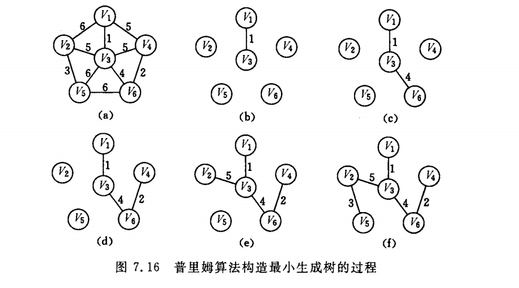

## 最小生成树

求解最小生成树之前我们先来看看什么是最小生成树，

- 给定一个带权的无向连通图，如何选取一棵树，使得边上的权值总和最小，这就是最小生成树。
- `N`个顶点，一定有` N - 1` 条边。
- 最小生成树中包含全部顶点。

## Prim算法

`Prim`算法求最小生成树的时候和边数无关，和顶点树有关，所以适合求解稠密网的最小生成树。

#### Prim算法的步骤包括：



1. 将一个图分为两部分，一部分归为点集`U`，一部分归为点集`V`，`U`的初始集合为`{V1}`，V的初始集合为`{ALL-V1}`。

2. 针对`U`开始找`U`中各节点的所有关联的边的权值最小的那个，然后将关联的节点`Vi`加入到`U`中，并且从`V`中删除 (不能形成环)。

3. 递归执行步骤`2`，直到`V`中的集合为空。
4. `U`中所有节点构成的树就是最小生成树。

#### 代码：

```go
type graph struct {
	vertexs     []interface{}
	triples     [][]int
	vertexCount int
}

func (graph *graph) prim(top int) {
	visited := make([]bool, graph.vertexCount)

	h1 := -1
	h2 := -1
	minWeight := maxWeight

	visited[top] = true

	for i := 0; i < graph.vertexCount-1; i++ {
	// 要生成 n - 1 条边所以需要遍历 n - 1 次。
		for j := 0; j < graph.vertexCount; j++ { // 每一轮都找当前可达到的最短的边。
			for k := 0; k < graph.vertexCount; k++ {
        // 如果节点 1 被访问过，节点 2 没有被访问过，说明，1-2 的边在现在已有的连同图上。
				if visited[j] && !visited[k] && graph.triples[j][k] < minWeight {
					h1 = j
					h2 = k
					minWeight = graph.triples[j][k]
				}
			}
		}
		visited[h2] = true
		fmt.Printf("edge：<%s,%s> with weight %d \n", string(graph.vertexs[h1].(rune)), string(graph.vertexs[h2].(rune)), minWeight)
		minWeight = maxWeight
	}
}
```

#### 简单证明prim算法：

prim算法其实原理是贪心算法，证明贪心算法的好方法就是反证法：假设prim生成的不是最小生成树

- 设prim生成的树为G0
- 假设存在Gmin使得cost(Gmin)<cost(G0)  则在Gmin中存在<u,v>不属于G0
- 将<u,v>加入G0中可得一个环，且<u,v>不是该环的最长边(这是因为<u,v>∈Gmin)
- 这与prim每次生成最短边矛盾
- 故假设不成立，命题得证.

