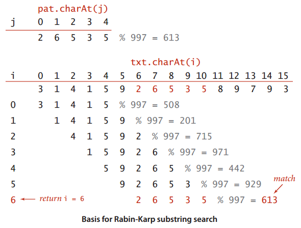
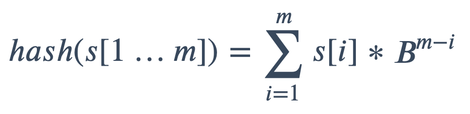
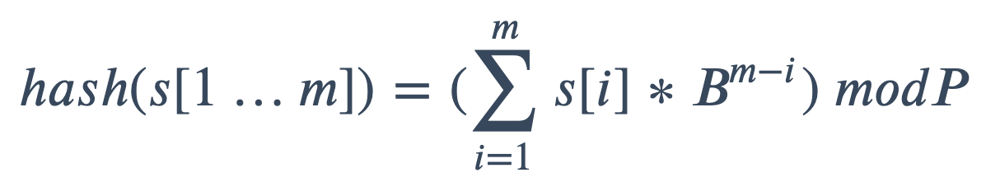
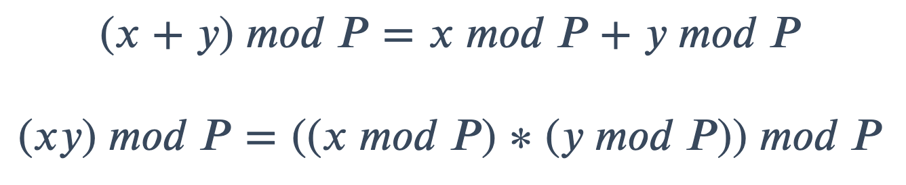
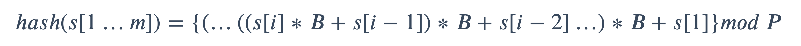

# Rabin-Karp

`Rabin-Karp` 算法是一种基于散列的字符串查找算法，其创始人一个叫罗宾 `M.O.Rabin` 和一个叫卡普 `R.A.Karp`。

![[算法系列之十三]Rabin-Karp字符串查找算法2](assets/930b4f80a2cfd20f65661d4a83ae42811603447496353.png)

## 基本理念

`Rabin-Karp`算法的思路是将字符串的比较转换成数字的比较。比较两个长度为`m`的字符串是否相等需要`O(m)`的时间，而比较两个数字是否相等通常可以是Ɵ`(1)`。为了将字符串映射到对应的数字，故此需要用到哈希函数。

我们都知道开放寻址法的哈希函数`(open addressing)`是可能遇到冲突的。对于这个问题来说冲突意味着虽然两个字符串的哈希值是一样的，但是这两个字符串实际上是不一样的。解决的办法是当遇到哈希值相同时，再做`m`次(模式`P`的长度为`m)`遍历，近一步判断这两个字符串是否相等。



代码如下：

```python
def rabin_karp(T, P):
    n = len(T)
    m = len(P)
    h1 = hash(P)
    for s in range(0, n-m+1):
        h2 = hash(T[s:s+m])
        if h1 != h2:
            continue
        else:
            k = 0
            for i in range(0, m):
                if T[s+i] != P[i]:
                    break
                else:
                    k += 1
            if k == m:
                print(s)
```

这种算法看起来很美妙，但实际上比暴力查找还慢，因为计算散列值会涉及字符串中的每个字符。而`Rabin` 和 `Karp` 对上述方法进行了改进，发明了一种能够在**常数时间**内算出 `M` 个字符的子字符串散列值的方法。

## 哈希优化

选择一个合适的哈希函数很重要。假设文本串为`t[0, n)`，模式串为`p[0, m)`，其中 `0<m<n`，`Hash(t[i, j])` 代表字符串 `t[i, j]` 的哈希。

匹配的过程中，当 `Hash(p[0, m-1]) != Hash(t[0, m-1])` 的时候，我们很自然的会把 `t[1, m]` 拿来继续比较，在这个过程中，若我们重新计算字符串`t[1, m]`的哈希值，这个过程中如果我们重新计算它的 `hash` 值，则我们还需要 `O(m)` 的时间复杂度，时间复杂度会爆表。观察到字符串`t[0, m-1]`与`t[1, m]`中有 `m-1` 个字符是重合的，因此我们可以选用**滚动哈希函数**，那么重新计算的时间复杂度就降为 `O(1)`。

### 滚动哈希

`Rabin-Karp` 算法选用的滚动哈希函数利用 [Rabin fingerprint](https://en.wikipedia.org/wiki/Rabin_fingerprint) 的思想，举个例子，计算字符串`t[1, m]`的哈希值的公式如下:



其中的 `b` 是一个常数，通常是字符串所有能取到的字符的个数，这样可以确保对每个字符串的`hash`值唯一。

如果 `m` 很大的话，这里的 `hash` 值可能会很大，甚至超过最大能处理的整数导致溢出，所以我们这里取一个为质数的模数`P`，这个值应该尽可能大，且是质数，这样可以减小哈希碰撞的概率，所以我们的 `hash` 值可以这样计算：



但是这样括号中的数仍然可能会溢出，这里我们需要用到取模的性质来简化运算：



对于上面的 `hash` 函数我们可以将 `B` 抽取出来写成下面的形式：



这一步不难推出求 `hash(s[1...m])` 的伪代码：

```ts
let hash = 0;
for (int i  = 0; i < str.length; i++) {
  hash = (hash * B + str[i].charCodeAt(0)) % MOD;
}
```

接下来需要考虑的是如何从 `hash(s[i … m+i−1])` 到 `hash(s[i+1… m+i])`, 这里我们拿一组数来举例子：
$$
[0, 1, 2, 3, 4, 5]
$$
第一部分 `[0, 1, 2]` 的`hash`的计算公式如下：
$$
0 * 26^2 + 1 * 26^1 + 2 * 26^0 = 28
$$
而滚动一位之后的 `[1, 2, 3]` 的 `hash` 计算如下：
$$
1 * 26^2 + 2 * 26^1 + 3 * 26^0 = 731
$$
如何编写公式才能实现从 `28` 到 `731` 的转换？总的来说分为三个步骤：

1. 移动窗口，因为移动之后 `m + 1` 所以要整体乘以 `b`：
   $$
   (0 * 26^2 + 1 * 26^1 + 2 * 26^0) * 26
   $$

   $$
   hash = hash * b
   $$

2. 然后我们需要移除不在窗口范围的 `0` 注意这里是 `0 * 26^3`，就是 `tail * b ^ windowLength`：
   $$
   (0 * 26^2 + 1 * 26^1 + 2 * 26^0) * 26 - 0 * 26 ^ 3 = 1 * 26^2 + 2 * 26^1
   $$

   $$
   hash = hash - tail * b ^ L
   $$

3. 最后加上新出现的 `head` ，注意这个 `head ` 阶乘固定是 `0`：
   $$
   1 * 26^2 + 2 * 26^1 + 3 * 26 * 0
   $$
  
   $$
   hash = hash + head
   $$
   

上面就是滚动哈希的求解过程了，代码如下，注意找到 `hash` 相同的子串我们还需要进行一次真正的子串比较确认是否相同：

```ts
const B = 26,
      MOD = 2147483648;

function rollingHash(s: string, p: string): number {
  let n = s.length,
      m = p.length;
      
  if (m > n) return -1;
  let bFacL = 1,
      pHash = 0,
      sHash = 0;
  for (let i = 0; i < m; i++) {
    // 计算 B 的 winLength 次方；
    bFacL = (bFacL * B) % MOD;
  }
  
  for (let i = 0; i < m; i++) {
    // 计算 p 模式串 hash，s 模式串 hash；
    pHash = (pHash * B + p[i].charCodeAt(0) - 'a'.charCodeAt(0)) % MOD;
    sHash = (sHash * B + s[i].charCodeAt(0) - 'a'.charCodeAt(0)) % MOD;
  }

  for (let i = 0; i + m <= n; i++) {
    if (sHash === pHash && s.slice(i, i + m) === p) {
        return i;
    }
    if (i + m < n) {
	  sHash = sHash * B;
      sHash = sHash - (s[i].charCodeAt(0) - 'a'.charCodeAt(0)) * bFacL;
      sHash = sHash + s[i + m].charCodeAt(0) - 'a'.charCodeAt(0);
      sHash = sHash % MOD;
    }
  }
  return -1;
}
```


