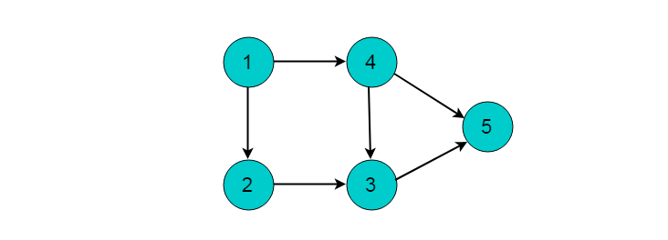
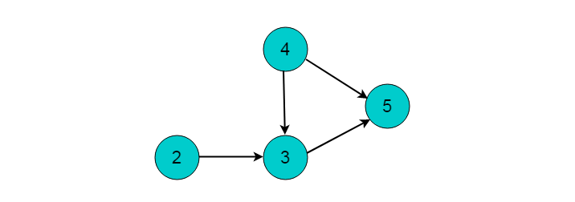
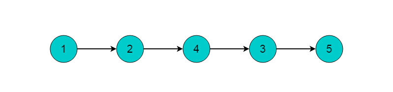
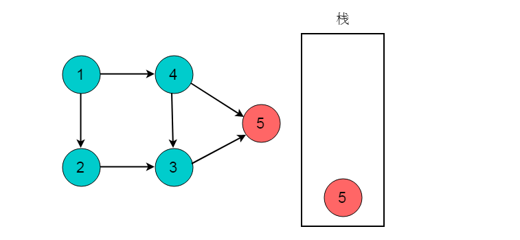
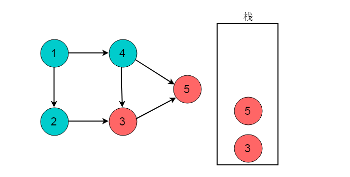
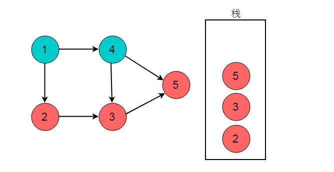
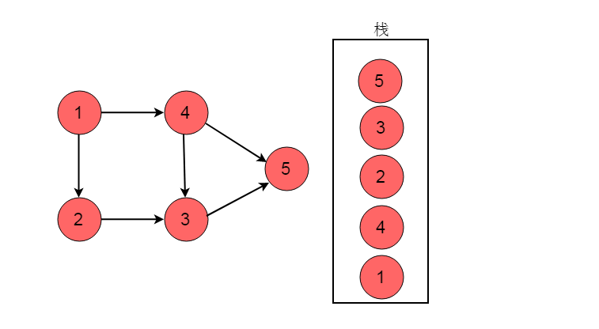

# 拓扑排序

在工程实践中,一个工程项目往往由若干个子项目组成。这些子项目间往往有两种关系:

1. 先后关系，即必须在某个项完成后才能开始实施另一个子项目。
2. 子项目间无关系，即两个子项目可以同时进行,互不影响。

例如：在工厂里产品的生产线上，一个产品由若干个零部件组成。零部件生产时，也存在这两种关系:

1. 先后关系，即一个部件必须在完成后才能生产另一个部件;
2. 部件间无先后关系，即这两个部件可以同时生产。

那么如何合理的分配资源才能保证工程能够按时完成呢？将任务作为图的顶点，将任务之间的依赖关系作为图的边，这样就可以将实际问题抽象为数据结构图论中的典型问题——图的拓扑排序。

## 有向无环图

**有向无环图（Directed Acyclic Graph, DAG）：**是有向图的一种，字面意思的理解就是图中没有环。常常被用来表示事件之间的驱动依赖关系，管理任务之间的调度。

**AOV网：**在每一个工程中，可以将工程分为若干个子工程，这些子工程称为活动。如果用图中的顶点表示活动，以有向图的弧表示活动之间的优先关系，这样的有向图称为`AOV`网，即顶点表示活动的网。在`AOV`网中，如果从顶点`vi`到顶点`vj`之间存在一条路径，则顶点`vi`是顶点`vj`的前驱，顶点`vj`是顶点`vi`的后继。活动中的制约关系可以通过`AOV`网中的表示。 在`AOV`网中，不允许出现环，如果出现环就表示某个活动是自己的先决条件。因此需要对`AOV`网判断是否存在环，可以利用有向图的拓扑排序进行判断。

**拓扑序列：**设`G=(V,E)`是一个具有`n`个顶点的有向图，`V`中的顶点序列`v1,v2,…,vn`，满足若从顶点`vi`到`vj`有一条路径，则在顶点序列中顶点`vi`必在`vj`之前，则我们称这样的顶点序列为一个拓扑序列。

**拓扑排序：**拓扑排序是对一个有向图构造拓扑序列的过程。

#### 拓扑排序

**拓扑排序（Topological Sorting）**是一个有向无环图`（DAG, Directed Acyclic Graph）`的所有顶点的线性序列。且该序列必须满足下面两个条件：

1. 每个顶点出现且只出现一次。
2. 若存在一条从顶点 `A` 到顶点 `B` 的路径，那么在序列中顶点` A` 出现在顶点` B `的前面。

> **注：**有向无环图`（DAG）`才有拓扑排序，非`DAG`图没有拓扑排序一说。

## 入度表法`(BFS)`

入度表法是根据顶点的入度来判断是否存在依赖关系。若顶点入度不为`0`。则必然此顶点的事件有前驱依赖事件，因此每次选取入度为`0`的顶点输出，则符合拓扑排序的性质。

**算法流程**

1. 从图中选择一个入度为`0`的顶点，输出该顶点。
2. 从图中删除该节点及其所有出边（即与之邻接的所有顶点入度`-1`）
3. 反复执行这两个步骤，直至所有节点都输出，即整个拓扑排序完成；或者直至剩下的图中再没有入度为`0`的节点，这就说明此图中有回路，不可能进行拓扑排序。

**实例图解**

图中所示的有向无环图，采用入度表的方法获取拓扑排序过程。



选择图中入度为0的顶点1，输出顶点1。删除顶点1，并删除以顶点1为尾的边。删除后图为：



继续选择入度为0的顶点。现在，图中入度为0的顶点有2和4，这里我们选择顶点2，输出顶点2。删除顶点2，并删除以顶点2为尾的边。删除后图为：


选择入度为0的顶点4，输出顶点4.删除顶点4，并删除以顶点4为尾的边。删除后图为：


选择入度为0的顶点3，输出顶点3.删除顶点3，并删除以顶点3为尾的边。删除后图为：


最后剩余顶点5，输出顶点5，拓扑排序过程结束。最终的输出结果为：



**性能分析**

算法时间复杂度分析：统计所有节点入度的时间复杂性为`V*E`；接下来删边花费的时间也是`V*E`，总花费时间为`O(V*E)`。若使用队列保存入度为`0`的顶点，则可以将这个算法复杂度将为`O(V+E)`。

**算法实现**

这里我们假设顶点序号从`0`开始，首先我们通过计数每个顶点入度，将所有入度为`0`的顶点加入`indegrees`，并且储存每个顶点的后继节点，之后通过广度优先遍历，每次都通过一个入度为`0`的点去给其下一个节点删除边知道新的入度`0`出现，最后如果说所有的顶点都被删除说明图中无环路，（有环路的话边会永远也删不掉，知道队列为空）。

```ts
function topSort(vertexes: number, graph: number[][]) {
    let indegrees = new Array(vertexes).fill(0);
    let nextNodes = new Array(vertexes);
    for (let i = 0; i < vertexes; i++) {
        nextNodes[i] = [];
    }
    let queue: number[] = [];
	  let result: number[] = [];

    for (let [pre, cur] of graph) {
        indegrees[cur] += 1; 					// 当前节点入度 +1；
        nextNodes[pre].push(cur); 		// 前驱节点添加新边边；
    }

    for (let i = 0; i < vertexes; i++) {
        if (indegrees[i] === 0) queue.push(i);
    }

    while (queue.length) {
        let pre = queue.shift() as number;
      	result.push(pre)
        vertexes--;
        for (let cur of nextNodes[pre]) {
            indegrees[cur] -= 1;
            if (indegrees[cur] === 0) queue.push(cur);
        }
    }

    return !vertexes ? result : [];
}
```

## 深度优先`DFS`

深度优先搜索过程中，当到达出度为 **0** 的顶点时，需要进行回退。在执行回退时记录出度为 **0** 的顶点，将其入栈。则最终出栈顺序的逆序即为拓扑排序序列。

**算法流程**

1. 对图执行深度优先搜索。
2. 在执行深度优先搜索时，若某个顶点不能继续前进，即顶点的出度为0，则将此顶点入栈。
3. 最后得到栈中顺序的逆序即为拓扑排序顺序。

**实例图解**

如图所示的有向无环图，采用DFS的方法获取拓扑排序过程。


选择起点为顶点`1`，开始执行深度优先搜索。顺序为`1->2->3->5`，深度优先搜索到达顶点5时，顶点5出度为0。将顶点5入栈。




深度优先搜索执行回退，回退至顶点3。此时顶点3的出度为0，将顶点3入栈。



回退至顶点2，顶点2出度为0，顶点2入栈。



回退至顶点1，顶点1可以前进位置为顶点4，顺序为1->4。


回退至顶点1，顶点1出度为0，顶点1入栈。



栈的逆序为`1->4->2->3->5`。此顺序为拓扑排序结果。

**性能分析**

时间复杂度分析：首先深度优先搜索的时间复杂度为`O(V+E)`，而每次只需将完成访问的顶点存入数组中，需要`O(1)`，因而总复杂度为`O(V+E)`。

**算法实现**