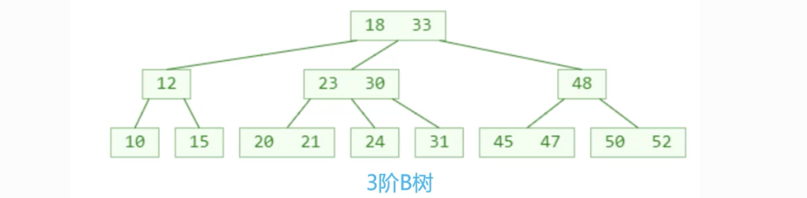
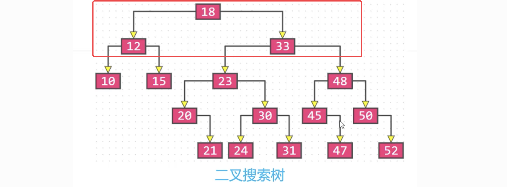
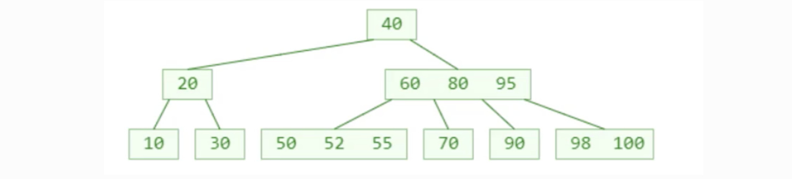
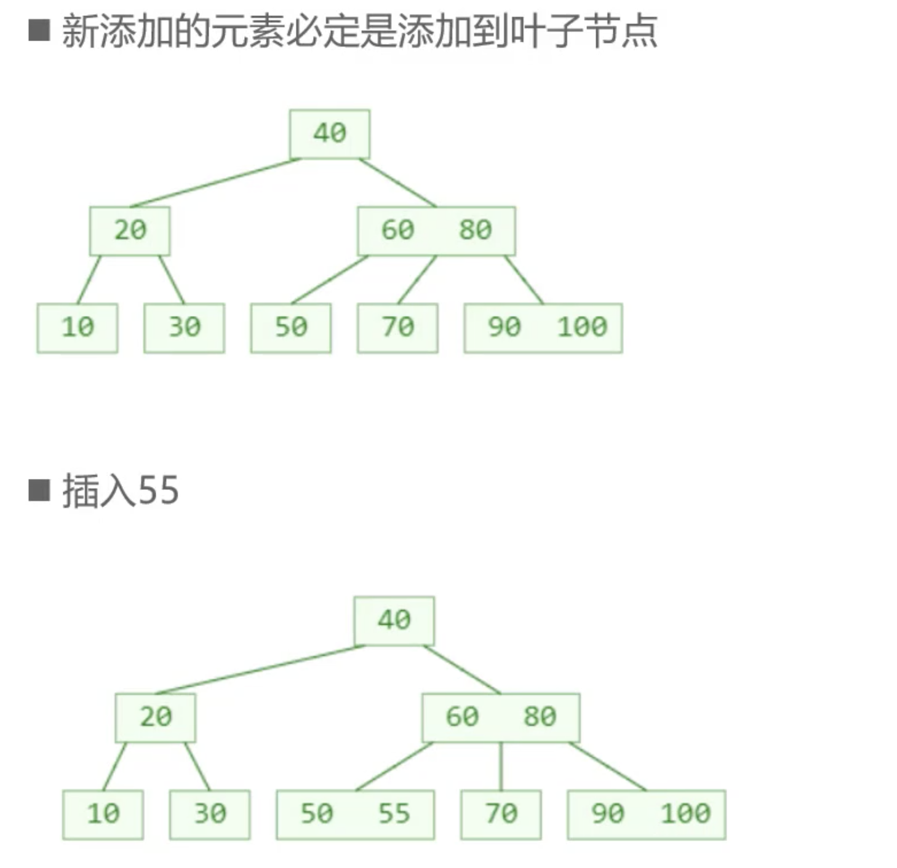
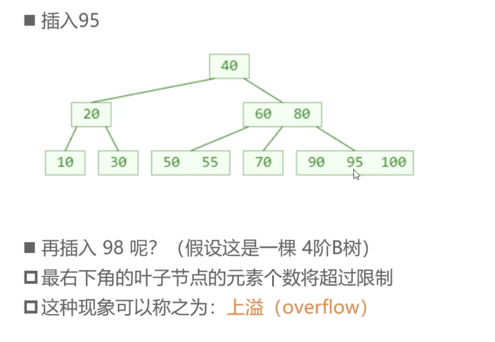
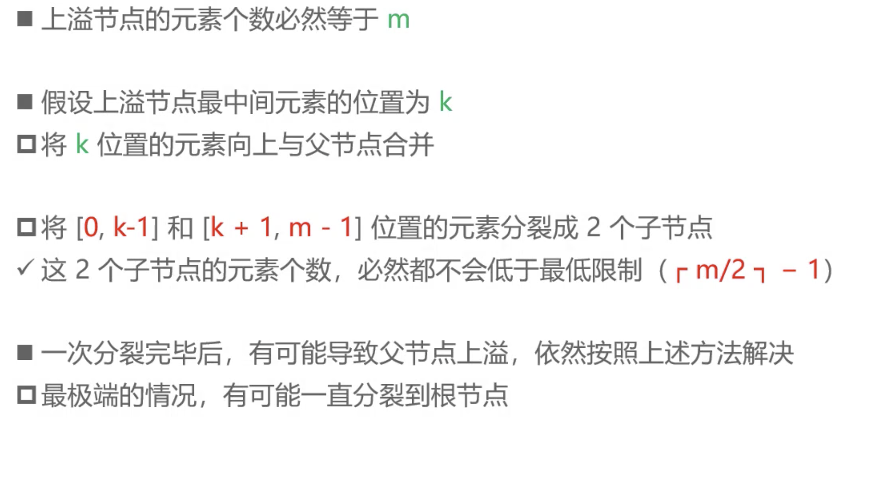
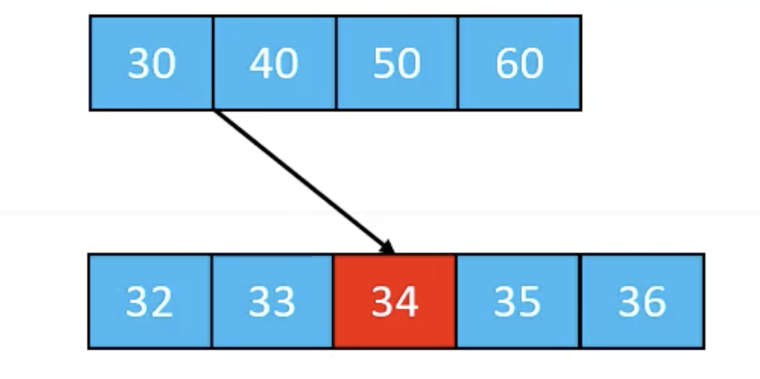
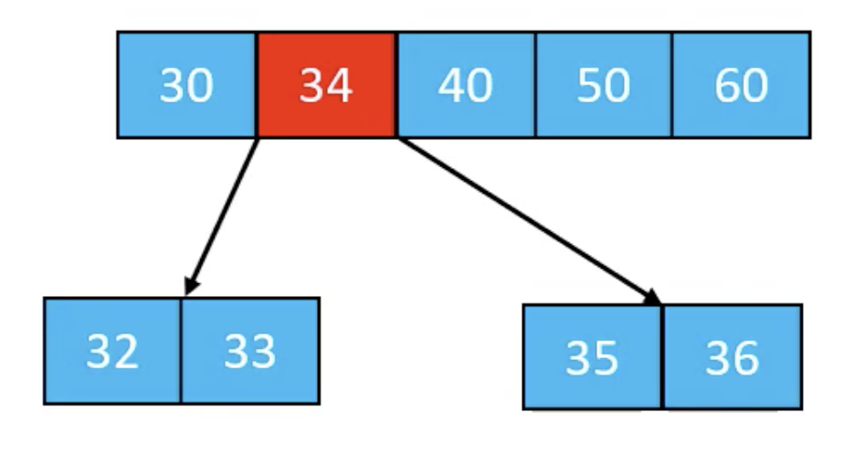
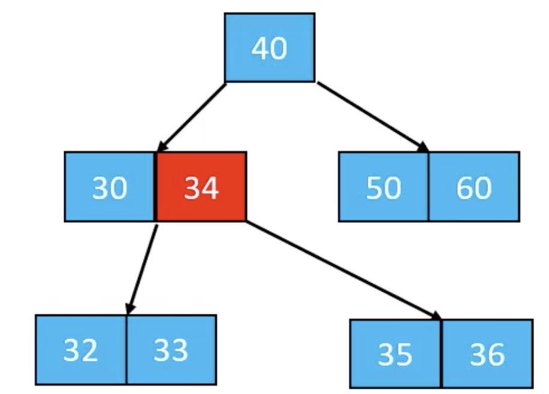
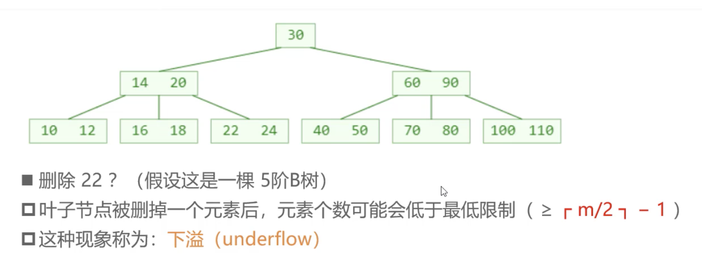

## B树

B 树是符合平衡查找树规则的一种二叉排序树。

#### 性质：

m 阶 B 树，一个节点最多有 m 个分支，最多存储 m-1 个元素。

1. 节点存储元素个数 x ：
   1. 根节点：1<=x<=m-1。
   2. 非根节点：ceil(m/2) -1<=x<=m-1。
2. 如果该节点有子节点则子节点个数位 y = x+1：
   1. 根节点：2<=y<=m。
   2. 

比如 3 阶B树：2 <= y <= 3 子节点个数2到3，也成为2,3树。

​		4 阶B树：2 <= y <= 4 子节点个数2到4，也就是2,3,4树

>1、数据库中的 B 树一般为200到300阶。
>
>2、2 阶 B 树是没有意义的，就是二叉搜索树。

### B树和二叉搜索树：

B树和二叉搜索树在逻辑上是等价的，其中：

两代合并的超级节点最多有四个子节点，就是四阶B树。

三代合并的超级节点最多有八个子节点，就是八阶B树。

n代合并的超级节点最多有2^n个子节点，就是2^n阶B树。

m阶B树，需要log2(M)次合并。

#### 搜索：

1. 先在节点内部从小到大找。
2. 命中就结束搜索。
3. 未命中就去对应的子节点重复步骤一。

#### 添加：

