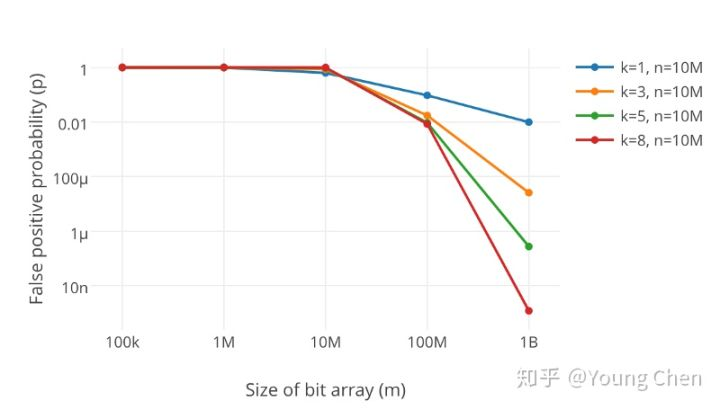

## **什么是布隆过滤器**

本质上布隆过滤器是一种数据结构，比较巧妙的概率型数据结构`（probabilistic data structure）`，特点是高效地插入和查询，可以用来告诉你 **“某样东西一定不存在或者可能存在”**。

相比于传统的`List、Set、Map` 等数据结构，它更高效、占用空间更少，但是缺点是其返回的结果是概率性的，而不是确切的。

## **实现原理**

> **简单实现代码：**https://github.com/patrick-prod/typescript-algorithms/tree/master/src/data-structures/bloom-filter

**HashMap 的问题**

讲述布隆过滤器的原理之前，我们先思考一下，通常你判断某个元素是否存在用的是什么？应该蛮多人回答 `HashMap` 吧，确实可以将值映射到 `HashMap` 的 `Key`，然后可以在 `O(1)` 的时间复杂度内返回结果，效率奇高。但是 `HashMap` 的实现也有缺点，例如存储容量占比高，考虑到负载因子的存在，通常空间是不能被用满的，而一旦你的值很多例如上亿的时候，那 `HashMap` 占据的内存大小就变得很可观了。

还比如说你的数据集存储在远程服务器上，本地服务接受输入，而数据集非常大不可能一次性读进内存构建 `HashMap` 的时候，也会存在问题。

**布隆过滤器数据结构**

布隆过滤器是一个 bit 向量或者说 bit 数组，长这样：

如果我们要映射一个值到布隆过滤器中，我们需要使用**多个不同的哈希函数**生成**多个哈希值，**并对每个生成的哈希值指向的 bit 位置 1，例如针对值 “baidu” 和三个不同的哈希函数分别生成了哈希值 1、4、7，则上图转变为：

Ok，我们现在再存一个值 “tencent”，如果哈希函数返回 3、4、8 的话，图继续变为：

值得注意的是，4 这个 bit 位由于两个值的哈希函数都返回了这个 bit 位，因此它被覆盖了。现在我们如果想查询 “dianping” 这个值是否存在，哈希函数返回了 1、5、8三个值，结果我们发现 5 这个 bit 位上的值为 0，**说明没有任何一个值映射到这个 bit 位上**，因此我们可以很确定地说 “dianping” 这个值不存在。而当我们需要查询 “baidu” 这个值是否存在的话，那么哈希函数必然会返回 1、4、7，然后我们检查发现这三个 bit 位上的值均为 1，那么我们可以说 “baidu” **存在了么？答案是不可以，只能是 “baidu” 这个值可能存在。**

这是为什么呢？答案跟简单，因为随着增加的值越来越多，被置为 1 的 bit 位也会越来越多，这样某个值 “taobao” 即使没有被存储过，但是万一哈希函数返回的三个 bit 位都被其他值置位了 1 ，那么程序还是会判断 “taobao” 这个值存在。

## 支持删除么

感谢评论区提醒，传统的布隆过滤器并不支持删除操作。但是名为 Counting Bloom filter 的变种可以用来测试元素计数个数是否绝对小于某个阈值，它支持元素删除。可以参考文章 [Counting Bloom Filter 的原理和实现](https://link.zhihu.com/?target=https%3A//cloud.tencent.com/developer/article/1136056)

## **如何选择哈希函数个数和布隆过滤器长度**

很显然，过小的布隆过滤器很快所有的 bit 位均为 1，那么查询任何值都会返回“可能存在”，起不到过滤的目的了。布隆过滤器的长度会直接影响误报率，布隆过滤器越长其误报率越小。

另外，哈希函数的个数也需要权衡，个数越多则布隆过滤器 bit 位置位 1 的速度越快，且布隆过滤器的效率越低；但是如果太少的话，那我们的误报率会变高。

k 为哈希函数个数，m 为布隆过滤器长度，n 为插入的元素个数，p 为误报率

如何选择适合业务的 k 和 m 值呢，这里直接贴一个公式：

如何推导这个公式这里只是提一句，因为对于使用来说并没有太大的意义，你让一个高中生来推会推得很快。k 次哈希函数某一 bit 位未被置为 1 的概率为：

插入n个元素后依旧为 0 的概率和为 1 的概率分别是：

标明某个元素是否在集合中所需的 k 个位置都按照如上的方法设置为 1，但是该方法可能会使算法错误的认为某一原本不在集合中的元素却被检测为在该集合中（False Positives），该概率由以下公式确定

## **最佳实践**

常见的适用常见有，利用布隆过滤器减少磁盘 IO 或者网络请求，因为一旦一个值必定不存在的话，我们可以不用进行后续昂贵的查询请求。

另外，既然你使用布隆过滤器来加速查找和判断是否存在，那么性能很低的哈希函数不是个好选择，推荐 MurmurHash、Fnv 这些。

