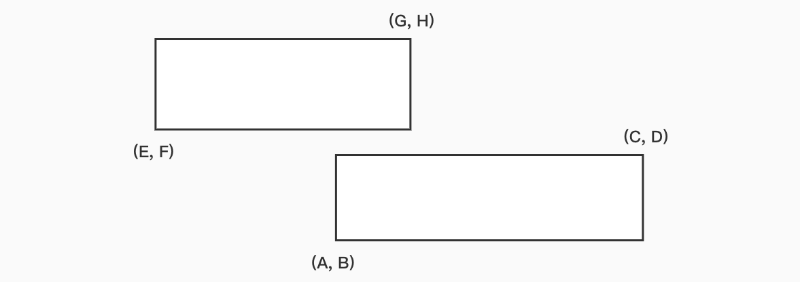
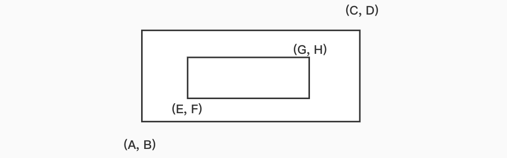

# 线段重叠区间

在做算法题的时候，求重叠面积、重叠区间、重叠长度这样的问题是非常常见的，而这类问题都可以分解成求两线段的公共长度。对于这个问题，如果不分析出求解规律的话，我们就需要进行非常冗杂的判断，所以分析一个公共范式就是解决这类问题的关键：

## 算法分析

我们拿两个矩形的横边为例`（这里为什么用两个矩形呢？因为processon上没有画线段的工具╮(╯▽╰)╭）`。用左下和右上两个点分别表示整个矩形的坐标，先来分析第一种情况：

横向重叠部分：`AG = G-A (A > E, C > G)`，如果给两个矩形互换位置，那么调换位置之后的横向重叠部分：`EC = C-E (E > A, G > C)`。




第二种情况，横向重叠部分：`EG = G-E (E > A, C > G)`，同理得出互换位置后：`AC = C-A (A > E, G > C)`



由上面我们可以分析出，当两矩形有重叠部分的时候，公共部分长度有如下关系：

- `AG = G-A (A > E, C > G)`
- `EC = C-E (E > A, G > C)`
- `EG = G-E (E > A, C > G)`
- `AC = C-A (A > E, G > C)`

不难看出减数只有`A`和`E`，被减数只有`C`和`G`，同时`C`和`G`中我们取最小的，`A`和`E`则取最大的，于是我们就得到了如下的代码：

```ts
let width = Math.min(C, G) - Math.max(A, E);
```

现在还有最后一种情况就是两矩形不重叠，这种情况下`width`必定为负数，所以说我们只需要再进行一次和0的比较即可：

```ts
let commonWidth = Math.max(width, 0);
```

## 题目实践

> **原题地址：**[leetcode  223. 矩形面积](https://leetcode-cn.com/problems/rectangle-area/)。

在**二维**平面上计算出两个**由直线构成的**矩形重叠后形成的总面积，每个矩形由其左下顶点和右上顶点坐标表示，如图所示。


**示例:**

```js
输入: -3, 0, 3, 4, 0, -1, 9, 2
输出: 45
```

**解法：**

根据我们上面的范式，只要将高度的四个变量替换进去即可轻松求解：

```ts
func computeArea(A int, B int, C int, D int, E int, F int, G int, H int) int {
	width := min(C, G) - max(A, E);
	height := min(H, D) - max(B, F);
	commonSpace := max(width, 0) * max(height, 0)
  eachSpace := (C - A) * (D - B) + (G - E) * (H - F);
  return eachSpace - commonSpace;
}
```

