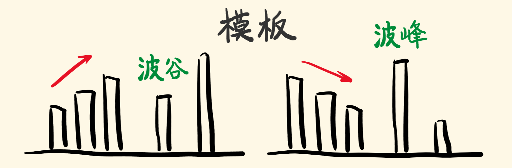
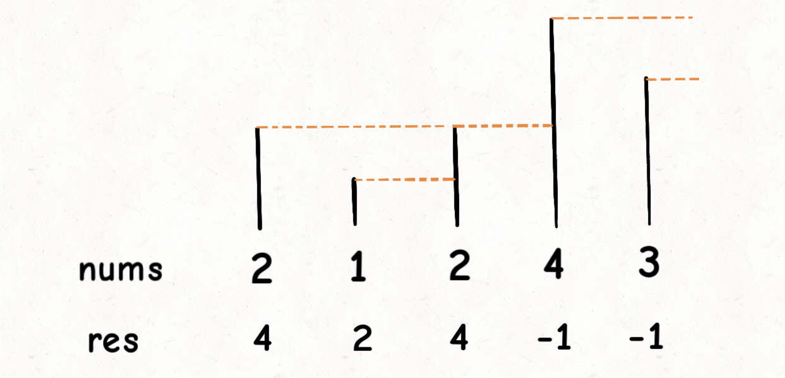
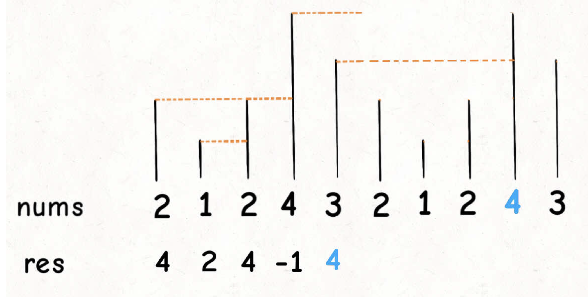

# 单调栈

顾名思义，单调栈即满足单调性的栈结构。利用了一些巧妙的逻辑，使得每次新元素入栈后，栈内的元素都保持有序（单调递增或单调递减）。

## 如何使用单调栈

### 构建

将一个元素插入单调栈时，为了维护栈的单调性，需要在保证将该元素插入到栈顶后整个栈满足单调性的前提下弹出最少的元素。

比如说一个单调递减的栈，栈中自顶向下的元素为 `1,3,5,10,30,50`，插入元素 `20` 时为了保证单调性需要依次弹出元素 `1,3,5,10`，操作后栈变为 `20,30,50`。

用伪代码描述如下：

```ts
insert x
while !sta.empty() && sta.top() < x
    sta.pop()
sta.push(x)
```

### 使用

什么时候用单调栈？需要给当前的元素，找右边/左边第一个比它大/小的位置。

记住这两句话：

+ 单调递增栈，利用波谷剔除栈中的波峰，留下波谷；
+ 单调递减栈，利用波峰剔除栈中的波谷，留下波峰。



## Next Greater Number 

先来看一下这个问题，给你一个数组，返回一个等长的数组，对应索引存储着下一个更大元素，如果没有更大的元素，就存 `-1`。函数签名如下：

```c
vector<int> nextGreaterElement(vector<int>& nums);
```

比如说，输入一个数组 `nums =` [`2,1,2,4,3`]，你返回数组 [`4,2,4,-1,-1`]。

解释：第一个 `2` 后面比 `2` 大的数是 `4`; `1` 后面比 `1` 大的数是 `2`；第二个 `2` 后面比 `2` 大的数是 `4`; `4` 后面没有比 `4` 大的数，填 `-1`；`3` 后面没有比 `3` 大的数，填 `-1`。

这道题的暴力解法很好想到，就是对每个元素后面都进行扫描，找到第一个更大的元素就行了。但是暴力解法的时间复杂度是 `O(n^2)`。

这个问题可以这样抽象思考：把数组的元素想象成并列站立的人，元素大小想象成人的身高。这些人面对你站成一列，如何求元素「`2`」的 `Next Greater Number` 呢？

很简单，如果能够看到元素「`2`」，那么他后面可见的第一个人就是「`2`」的 `Next Greater Number`，因为比「`2`」小的元素身高不够，都被「`2`」挡住了，第一个露出来的就是答案。



这个情景很好理解吧？带着这个抽象的情景，先来看下代码。

```ts
vector<int> nextGreaterElement(vector<int>& nums) {
    vector<int> res(nums.size()); // 存放答案的数组
    stack<int> s;
    // 倒着往栈里放
    for (int i = nums.size() - 1; i >= 0; i--) {
        // 判定个子高矮
        while (!s.empty() && s.top() <= nums[i]) {
            // 矮个起开，反正也被挡着了。。。
            s.pop();
        }
        // nums[i] 身后的 next great number
        res[i] = s.empty() ? -1 : s.top();
        s.push(nums[i]);
    }
    return res;
}
```

这就是单调队列解决问题的模板。`for` 循环要从后往前扫描元素，因为我们借助的是栈的结构，倒着入栈，其实是正着出栈。`while` 循环是把两个「个子高」元素之间的元素排除，因为他们的存在没有意义，前面挡着个「更高」的元素，所以他们不可能被作为后续进来的元素的 `Next Great Number` 了。

这个算法的时间复杂度不是那么直观，如果你看到 `for` 循环嵌套 `while` 循环，可能认为这个算法的复杂度也是 `O(n^2)`，但是实际上这个算法的复杂度只有 `O(n)`。

分析它的时间复杂度，要从整体来看：总共有 `n` 个元素，每个元素都被 `push` 入栈了一次，而最多会被 `pop` 一次，没有任何冗余操作。所以总的计算规模是和元素规模 `n` 成正比的，也就是 `O(n)` 的复杂度。

## Next Greater Number II

同样是 `Next Greater Number`，现在假设给你的数组是个环形的，如何处理？力扣第 `503` 题「下一个更大元素 `II`」就是这个问题：

比如输入一个数组 `[2,1,2,4,3]`，你返回数组 `[4,2,4,-1,4]`。拥有了环形属性，**最后一个元素 3 绕了一圈后找到了比自己大的元素 4**。

一般是通过 % 运算符求模（余数），来获得环形特效：

```java
int[] arr = {1,2,3,4,5};
int n = arr.length, index = 0;
while (true) {
    print(arr[index % n]);
    index++;
}
```

这个问题肯定还是要用单调栈的解题模板，但难点在于，比如输入是 `[2,1,2,4,3]`，对于最后一个元素 3，如何找到元素 4 作为 `Next Greater Number`。

**对于这种需求，常用套路就是将数组长度翻倍**：



这样，元素 `3` 就可以找到元素 `4` 作为 `Next Greater Number` 了，而且其他的元素都可以被正确地计算。

有了思路，最简单的实现方式当然可以把这个双倍长度的数组构造出来，然后套用算法模板。但是，**我们可以不用构造新数组，而是利用循环数组的技巧来模拟数组长度翻倍的效果**。

```c
vector<int> nextGreaterElements(vector<int>& nums) {
    int n = nums.size();
    vector<int> res(n);
    stack<int> s;
    // 假装这个数组长度翻倍了
    for (int i = 2 * n - 1; i >= 0; i--) {
        // 索引要求模，其他的和模板一样
        while (!s.empty() && s.top() <= nums[i % n])
            s.pop();
        res[i % n] = s.empty() ? -1 : s.top();
        s.push(nums[i % n]);
    }
    return res;
}
```

这样，就可以巧妙解决环形数组的问题，时间复杂度 `O(N)`。

## Remove K Digits

给你一个以字符串表示的非负整数 `num` 和一个整数 `k` ，移除这个数中的 `k` 位数字，使得剩下的数字最小。请你以字符串形式返回这个最小的数字。

**示例 1 ：**

```ts
输入：num = "1432219", k = 3
输出："1219"
解释：移除掉三个数字 4, 3, 和 2 形成一个新的最小的数字 1219 。
```

我们可以用一个栈维护当前的答案序列，栈中的元素代表截止到当前位置，删除不超过 `k` 次个数字后，所能得到的最小整数。在使用 `k` 个删除次数之前，栈中的序列从栈底到栈顶单调不降。

+ 如果我们删除了 `m` 个数字且 `m<k`，这种情况下我们需要从序列尾部删除额外的 `k-m` 个数字。
+ 如果最终的数字序列存在前导零，我们要删去前导零。
+ 如果最终数字序列为空，我们应该返回 00。

```ts
function removeKdigits(num: string, k: number): string {
    let stk = [], 
        n = num.length;
    if (n <= k) return '0';
    for (let cur of num) {
        while (stk.length && Number(peek(stk)) > Number(cur) && k) {
            stk.pop();
            k--;
        }

        (stk.length || cur !== '0') && stk.push(cur);
    }

    while (k--) stk.pop();
    return stk.length ? stk.join('') : '0';
};

function peek(stk: number[]): number {
    return stk[stk.length - 1]
}
```

