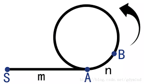

## 简单快慢指针

简单的快慢指针就是一个大致就是一个快指针不断的遍历链表或者数组，而另一个慢指针只有在某些特殊情况下才挪动：

#### [283. 移动零](https://leetcode-cn.com/problems/move-zeroes/)

给定一个数组 `nums`，编写一个函数将所有 `0` 移动到数组的末尾，同时保持非零元素的相对顺序。

**示例:**

```
输入: [0,1,0,3,12]
输出: [1,3,12,0,0]
```

**解法：**

```go
func moveZeroes(nums []int)  {
    uzi := 0
    for i := 0; i < len(nums); i++ {
        if nums[i] != 0 {
            nums[uzi] = nums[i]
            uzi++
        }
    }
    for uzi < len(nums) {
        nums[uzi] = 0
        uzi++
    }
}
```

## Floyd Cycle Detection Algorithm

`Floyd` 判圈算法（`Floyd Cycle Detection Algorithm`），又称龟兔赛跑算法（`Tortoise and Hare Algorithm`），是一个可以在有限状态机、迭代函数或者链表上判断是否存在环，以及判断环的起点与长度的算法。

如果有限状态机、迭代函数或者链表上存在环，那么在某个环上以不同速度前进的 `2` 个[指针](https://zh.wikipedia.org/wiki/指针_(信息学))必定会在某个时刻相遇。同时显然地，如果从同一个起点(即使这个起点不在某个环上)同时开始以不同速度前进的 `2` 个指针最终相遇。

### 判断是否有环

`Floyd Cycle Detection Algorithm `有点类似于龟兔（我和别人在操场上）赛跑（跑步）。假如说赛道有环，那么最终跑得慢的（我）会被跑得快的（别人）套圈。如果别人成功跑到了终点，那么就没有环，如果我和别人在路上相遇了，就说明我被他套圈了，赛道是有环的，同时，他比我多跑的长度是环的长度的整数倍。

```js
function hasCycle(head) {
    if (!head || !head.next) return false;
    let fastPtr = head.next;
    let slowPtr = head;
    while (fastPtr !== slowPtr) {
        if (fastPtr === null || fastPtr.next === null) return false;
        fastPtr = fastPtr.next.next;
        slowPtr = slowPtr.next;
    }
    return true;
}

```

### 求环的长度

现在两个快慢指针已经相遇了，假设相遇点为 `B` 点,让其中一个指针停在 `B` 不动，另一个一步一步向前走并记录步数，再次相遇时步数即为环的长度。

### 确定环的起点

同上假设相遇点为 `B` 点。方法是将其中一个指针移到链表起点，另一个指针为 `B` 点,两者同时移动，每次移动一步，那么两者相遇的地方就是环的起点。



> [解析：]()
>
> 首先假设第一次相遇的时候慢指针走过的节点个数为 `i`，设链表头部到环的起点的长度为 `m`，环的长度为 `c`，相遇的位置与起点与起点位置距离为 `n`，于是有：
> $$
> i = m + n + a * c
> $$
> 其中 `a` 为慢指针走的圈数。因为快指针的速度是慢指针的 `2` 倍，于是又可以得到另一个式子：
> $$
> 2 * i = m + n + b * c
> $$
> 其中 `b` 为快指针走的圈数。两式相减得：
> $$
> i = ( b - a ) * c
> $$
> 也就是说 `i` 是圈长的整数倍，再推导可得：
> $$
> m + n = c
> $$
> 所以上图中 `B->A` 的长度就是 `m`，此时将其中一个节点放在起点向前走 `m` 步时，此时从头部走的指针在 `m` 位置。而从相遇位置开始走的指针应该在距离起点 `i+m`，`i` 为圈长整数倍，则该指针也应该在距离起点为 `m` 的位置，即环的起点。

### 例题

#### [141. 环形链表](https://leetcode-cn.com/problems/linked-list-cycle/)

给定一个链表，判断链表中是否有环。

如果链表中有某个节点，可以通过连续跟踪 `next` 指针再次到达，则链表中存在环。 为了表示给定链表中的环，我们使用整数 `pos` 来表示链表尾连接到链表中的位置（索引从 0 开始）。如果 `pos` 是 `-1`，则在该链表中没有环。**注意：`pos` 不作为参数进行传递**，仅仅是为了标识链表的实际情况。

如果链表中存在环，则返回 `true` 。 否则，返回 `false` 。

**进阶：**

你能用 *O(1)*（即，常量）内存解决此问题吗？

**示例 1：**


```
输入：head = [3,2,0,-4], pos = 1
输出：true
解释：链表中有一个环，其尾部连接到第二个节点。
```

**解法：**

```js
var hasCycle =function hasCycleDoublePtr(head) {
    if (!head || !head.next) return false;
    let fastPtr = head.next;
    let slowPtr = head;
    while (fastPtr !== slowPtr) {
        if (fastPtr === null || fastPtr.next === null) return false;
        fastPtr = fastPtr.next.next;
        slowPtr = slowPtr.next;
    }
    return true;
}
```

#### [142. 环形链表 II](https://leetcode-cn.com/problems/linked-list-cycle-ii/)

给定一个链表，返回链表开始入环的第一个节点。 如果链表无环，则返回 `null`。

为了表示给定链表中的环，我们使用整数 `pos` 来表示链表尾连接到链表中的位置（索引从 0 开始）。 如果 `pos` 是 `-1`，则在该链表中没有环。**注意，`pos` 仅仅是用于标识环的情况，并不会作为参数传递到函数中。**

**说明：**不允许修改给定的链表。

**进阶：**

- 你是否可以使用 `O(1)` 空间解决此题？

**示例 1：**


```
输入：head = [3,2,0,-4], pos = 1
输出：返回索引为 1 的链表节点
解释：链表中有一个环，其尾部连接到第二个节点。
```

**解法：**

```js
var detectCycle = function (head) {
  let slowP = head, fastP = head // 都从头节点出发
  while (fastP) {                // head就是null了，没有入环点，直接返回null
    if (fastP.next == null) return null // fastP.next为null也说明无环
    slowP = slowP.next           // 慢指针走一步
    fastP = fastP.next.next      // 快指针走两步
    if (slowP == fastP) {        // 首次相遇
      fastP = head               // 让快指针回到头节点
      while (true) {             // 开启循环，让快慢指针相遇
        if (slowP == fastP) {    // 相遇，地点发生在入环处
          return slowP           // 返回出指针的位置
        }
        fastP = fastP.next       // 快慢指针都走一步
        slowP = slowP.next
      }
    }
  }
  return null
};
```

#### [61. 旋转链表](https://leetcode-cn.com/problems/rotate-list/)

给定一个链表，旋转链表，将链表每个节点向右移动 *k* 个位置，其中 *k* 是非负数。

示例 1:

```js
输入: 1->2->3->4->5->NULL, k = 2
输出: 4->5->1->2->3->NULL
解释:
向右旋转 1 步: 5->1->2->3->4->NULL
向右旋转 2 步: 4->5->1->2->3->NULL
```

**解法：**

```go
/**
 * Definition for singly-linked list.
 * type ListNode struct {
 *     Val int
 *     Next *ListNode
 * }
 */
func rotateRight(head *ListNode, k int) *ListNode {
    if head == nil || head.Next == nil || k == 0 {
        return head
    }
    n1, nk := head, head
    for k != 0 {
        if nk.Next == nil {
            nk = head
        } else {
            nk = nk.Next
        }
        k--
    }
    if n1 == nk {
        return head
    }
    for nk.Next != nil {
        n1 = n1.Next
        nk = nk.Next
    }
    nk.Next = head
    head = n1.Next
    n1.Next = nil
    return head
}
```

