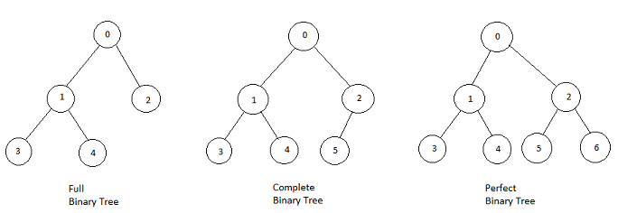
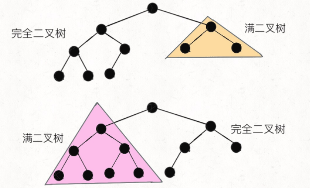

# 二叉树

先来看看二叉树的基本性质，一个树的每个节点最多有两个子分支，那么这个树就是一个高贵的二叉树，对于一个二叉树其有如下的性质：

1. 若根节点层次为`1`，则第 `i` 层最多有 `2^(i-1)`个结点。
2. 高度为 `h` 的树中，最多有 `2^h-1`个节点。

3. 二叉树中的叶子结点数为 `n0`，度为 `2` 的结点数为 `n2`，则 `n0=n2+1`。

   ```ts
   // why?
   nSum = n0 + n1 + n2;
   branch = nSum - 1; 
   //除了根节点外的结点必向上有一个分支
   branch = n1 + 2 * n2;
   nSum - 1 = n1 + 2 * n2;
   n1 + 2 * n2 = n0 + n1 + n2 - 1;
   n0 = n2 + 1;
   ```

## 满二叉树和完全二叉树

**满二叉树：**每一层结点数目都达到最大值，拥有 `2^h-1` 个结点的二叉树。

**完全二叉树：**有`n`个结点高度为`h`的二叉树，每一个节点都和高度为`h`的满二叉树中的序号对应。


说句题外话，关于这两个定义，中文语境和英文语境似乎有点区别，我们说的完全二叉树对应英文 `Complete Binary Tree`，没有问题。但是我们说的满二叉树对应英文 `Perfect Binary Tree`，而英文中的 `Full Binary Tree` 是指一棵二叉树的所有节点要么没有孩子节点，要么有两个孩子节点。如下：



#### 性质

1. 完全二叉树的前 `k-1` 层是满的，`h = |_log2^k_|+1`(`|_x_|`这个公式接相当于对`x`向上取整)。
2. 若`i=0`，则`i`为根节点，无父母节点；
3. 若`i>0`，则`i`的父母节点序号为`|_(i-1)/2_|`；
4. `i`的左孩子：`2i+1`；
5. `i`的右孩子：`2i+2`；

#### [222. 完全二叉树的节点个数](https://leetcode-cn.com/problems/count-complete-tree-nodes/)

给你一棵 **完全二叉树** 的根节点 `root` ，求出该树的节点个数。

#### 算法策略

如果是一个**普通**二叉树，显然只要向下面这样遍历一边即可，时间复杂度 `O(N)`：

```java
public int countNodes(TreeNode root) {
    if (root == null) return 0;
    return 1 + countNodes(root.left) + countNodes(root.right);
}
```

那如果是一棵**满**二叉树，节点总数就和树的高度呈指数关系：

```java
public int countNodes(TreeNode root) {
    int h = 0;
    // 计算树的高度
    while (root != null) {
        root = root.left;
        h++;
    }
    // 节点总数就是 2^h - 1
    return (int)Math.pow(2, h) - 1;
}
```

**完全**二叉树比普通二叉树特殊，但又没有满二叉树那么特殊，计算它的节点总数，可以说是普通二叉树和完全二叉树的结合版，先看代码：

```java
public int countNodes(TreeNode root) {
    TreeNode l = root, r = root;
    // 记录左、右子树的高度
    int hl = 0, hr = 0;
    while (l != null) {
        l = l.left;
        hl++;
    }
    while (r != null) {
        r = r.right;
        hr++;
    }
    // 如果左右子树的高度相同，则是一棵满二叉树
    if (hl == hr) {
        return (int)Math.pow(2, hl) - 1;
    }
    // 如果左右高度不同，则按照普通二叉树的逻辑计算
    return 1 + countNodes(root.left) + countNodes(root.right);
}
```

结合刚才针对满二叉树和普通二叉树的算法，上面这段代码应该不难理解，就是一个结合版，但是**其中降低时间复杂度的技巧是非常微妙的**。

#### 复杂度分析

开头说了，这个算法的时间复杂度是 `O(logN*logN)`，这是怎么算出来的呢？

直觉感觉好像最坏情况下是 `O(N*logN)` 吧，因为之前的 `while` 需要 `logN` 的时间，最后要 `O(N)` 的时间向左右子树递归：

```java
return 1 + countNodes(root.left) + countNodes(root.right);
```

**关键点在于，这两个递归只有一个会真的递归下去，另一个一定会触发** **`hl == hr`** **而立即返回，不会递归下去**。

为什么呢？原因如下：**一棵完全二叉树的两棵子树，至少有一棵是满二叉树**：



看图就明显了吧，由于完全二叉树的性质，其子树一定有一棵是满的，所以一定会触发 `hl == hr`，只消耗 `O(logN)` 的复杂度而不会继续递归。

综上，算法的递归深度就是树的高度 `O(logN)`，每次递归所花费的时间就是 `while` 循环，需要 `O(logN)`，所以总体的时间复杂度是 `O(logN*logN)`。

所以说，「完全二叉树」这个概念还是有它存在的原因的，不仅适用于数组实现二叉堆，而且连计算节点总数这种看起来简单的操作都有高效的算法实现。

## 递归遍历

二叉树的递归遍历我们在递归中讲过，树每次遍历有两个方向，操作可以插在三个不同的位置产生三种遍历方式(操作时机)：`前序遍历时`、`中序遍历时`、`后续遍历时`：

```ts
function traverse(root: ListNode) {
    // 前序遍历 do something
    traverse(root.left)
    // 中序遍历 do something
    traverse(root.right)
    // 后序遍历 do something
}
```

分析出这三种不同的遍历方式，我们在解题的时候还是先设计子问题，然后分析选用的操作顺序，然后移动到第一个操作的节点，设计子问题解决算法。

> [小技巧：]()对于树的遍历问题，我们最好的解决方案就是将算法着眼于当前层，相处当前层的解决方案。

#### [226. 翻转二叉树](https://leetcode-cn.com/problems/invert-binary-tree/)

**题目描述**

翻转一棵二叉树。

```js
     4						 	4
   /   \		   		/   \
  2     7	  ->	 7     2
 / \   / \	 		/ \   / \
1   3 6   9		 9   6 3   1
```

**算法设计**

老四步走，第一步分析子问题：交换每个节点的左右节点。第二步分析操作顺序，果断的前序遍历。第三步直接写代码了：

```ts
function invertTree(root: TreeNode | null): TreeNode | null {
    if (!root) return null;
    [root.left, root.right] = [root.right, root.left];
    invertTree(root.left)
    invertTree(root.right)
    return root;
};
```

#### [114. 二叉树展开为链表](https://leetcode-cn.com/problems/flatten-binary-tree-to-linked-list/)

**题目描述**

给你二叉树的根结点 `root` ，请你将它展开为一个单链表：

+ 展开后的单链表应该同样使用 `TreeNode` ，其中 `right` 子指针指向链表中下一个结点，而左子指针始终为 `null` 。
+ 展开后的单链表应该与二叉树 先序遍历 顺序相同。


```
输入：root = [1,2,5,3,4,null,6]
输出：[1,null,2,null,3,null,4,null,5,null,6]
```

**算法设计**

这道题值得仔细分析一下，还是四步走：

+ 第一步分析子问题，子问题是每一轮如何挪动节点构造一个链表，就第一个节点分析，我们发现过程是先 `flatten` 左子树，再将处理好的左子树挂到右子树上，然后遍历到最后一个节点，`flatten`右子树并拼接。
+ 根据第一步我们分析出了操作顺序：中序遍历。
+ 最后设计子算法。

```ts
function flatten(root: TreeNode | null): void {
    function dfs(root: TreeNode | null): TreeNode | null {
        if (!root || (!root.left && !root.right)) {
            return root;
        }
        let rBranch = root.right;
        root.right = dfs(root.left);
        root.left = null;
        let node = root
        while (node.right !== null) {
            // get last right node
            node = node.right;
        }
        node.right = dfs(rBranch)
        return root;
    }
    dfs(root);
};
```

#### [116. 填充每个节点的下一个右侧节点指针](https://leetcode-cn.com/problems/populating-next-right-pointers-in-each-node/)

#### 题目描述

给定一个 完美二叉树 ，其所有叶子节点都在同一层，每个父节点都有两个子节点。二叉树定义如下：

```ts
struct Node {
  int val;
  Node *left;
  Node *right;
  Node *next;
}
```

填充它的每个 next 指针，让这个指针指向其下一个右侧节点。如果找不到下一个右侧节点，则将 next 指针设置为 NULL。


初始状态下，所有 next 指针都被设置为 NULL。

#### 算法设计

这是一道变式题，首先我们发现不管哪种遍历顺序，我们发现我们都会丢失一个指针即 `2->3` 这一类的指针，所以这个时候思维需要变通，三线同时向下递归：

```ts
function connect(root: INode | null): INode | null {
    if (!root) return null;
    connectDouble(root.left, root.right);
    return root;
};

function connectDouble(left: INode, right: INode) {
    if (left === null || right === null) return
    left.next = right;
    connectDouble(left.left, left.right);
    connectDouble(left.right, right.left);
    connectDouble(right.left, right.right);
}
```

## 层级(非递归)遍历

层级遍历是一种非递归的遍历方式，借助了队列这种数据结构来实现：

```ts
function levelOrder(root: TreeNode) {
	if (root === null) return;
  let queue = [];
  queue.push(root);
  
  while (queue.length) {
    let cur = queue.shift();
    console.log(cur.val);
    if (cur.left) {
      queue.push(queue.left);
    }
		if (cur.right) {
      queue.push(queue.right);
    }
  }
}
```

**上述代码是标准的二叉树层级遍历框架**，从上到下，从左到右打印每一层二叉树节点的值，可以看到，队列 `q` 中不会存在 null 指针。

#### [102. 二叉树的层序遍历](https://leetcode-cn.com/problems/binary-tree-level-order-traversal/)

#### **题目描述**

给你一个二叉树，请你返回其按 层序遍历 得到的节点值。 （即逐层地，从左到右访问所有节点）。

```ts
二叉树：[3,9,20,null,null,15,7],
		3
   / \
  9  20
    /  \
   15   7
```
#### 算法设计

额，这道题其实考的是广度优先遍历的层级遍历方法，直接上代码吧，很好理解：

```go
func levelOrder(root *TreeNode) [][]int {
	res := make([][]int, 0)
    if root == nil {
        return res
    }
	queue := NewLinkedQueue()
	queue.Add(root)

	for !queue.IsEmpty() {
		store := make([]int, 0)
		preNodes := make([]*TreeNode, 0)
		for !queue.IsEmpty() {
			cur := queue.Poll().(*TreeNode)
			store = append(store, cur.Val)

			if cur.Left != nil {
				preNodes = append(preNodes, cur.Left)
			}

			if cur.Right != nil {
				preNodes = append(preNodes, cur.Right)
			}
		}
		for _, v := range preNodes {
			queue.Add(v)
		}
		res = append(res, store)
	}

	return res
}
```

