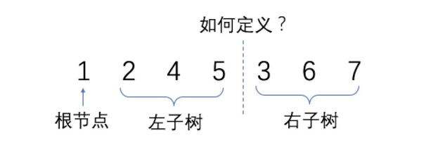
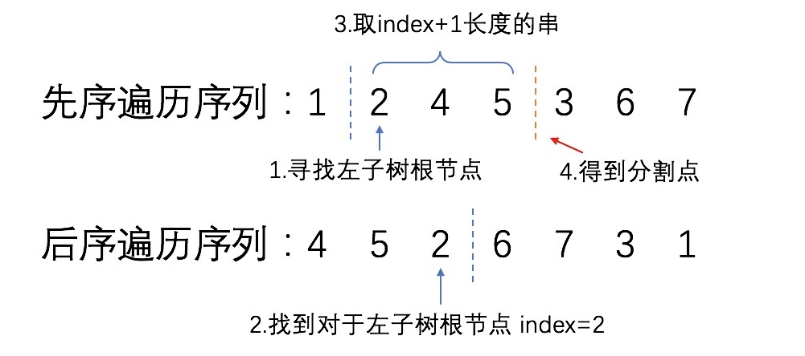

# 根据两种遍历顺序构造二叉树

**二叉树前序遍历的顺序为：**遍历根节点 `->` 递归遍历左子树 `->`递归遍历右子树。

**二叉树中序遍历的顺序为：**递归遍历左子树`->`遍历根节点`->`递归遍历右子树。

**二叉树后序遍历的顺序为：**递归遍历左子树`->`递归遍历右子树`->`遍历根节点。

## 算法策略

对于任意一颗树而言，前序遍历的形式总是：

```go
[ 根节点, [左子树的前序遍历结果], [右子树的前序遍历结果] ]
```

即根节点总是前序遍历中的第一个节点。而中序遍历的形式总是：

```go
[ [左子树的中序遍历结果], 根节点, [右子树的中序遍历结果] ]
```

最后后序遍历的顺序则是：

```go
[ [左子树的中序遍历结果], [右子树的中序遍历结果], 根节点 ]
```

#### 前 + 中 | 中 + 后

只要我们在中序遍历中定位到根节点，那么我们就可以分别知道左子树和右子树中的节点数目。由于同一颗子树的前序遍历和中序遍历以及后序遍历的长度显然是相同的，因此我们就可以对应到前序遍历和后序遍历的结果中，对上述形式中的所有左右括号进行定位。

这样以来，我们就知道了左子树的前序|后序遍历和中序遍历结果，以及右子树的前序|后序遍历和中序遍历结果，我们就可以递归地对构造出左子树和右子树，再将这两颗子树接到根节点的左右位置。

```tsx
function buildTree(preorder: number[], inorder: number[]): TreeNode | null {
    if (preorder.length === 0) return null;	// 两个数组的长度是一样的所以判断任意一个都行。
    const root = new TreeNode(preorder[0], null, null);
    let divider = preorder[0];
    let i = inorder.indexof(divider);
    root.left = buildTree(preorder.slice(1, i + 1), inorder.slice(0, i));
    root.right = buildTree(preorder.slice(i + 1), inorder.slice(i + 1));
    return root;
}
```

#### 前 + 后

对于前序遍历和后序遍历这种情况我们可以很轻松的得到根节点的位置，但是却不好确定左子树和右子树的边界，



这种情况我们知道根节点右边的元素就是左子树的根节点，而左子树的根节点在后序遍历中应该在左子树的最后一位，于是刚好就形成了这样的结构：



这样通过左子树根节点作为边界我们就能找出左右子树的分界：

```tsx
function buildTree(preorder: number[], postorder: number[]): TreeNode | null {
    if (preorder.length === 0) return null;	// 两个数组的长度是一样的所以判断任意一个都行。
    const root = new TreeNode(preorder[0], null, null);
  	let divider = preorder[1];
    let i = postorder.indexof(divider);
    root.left = buildTree(preorder.slice(1, i + 2), postorder.slice(0, i + 1));
    root.right = buildTree(
        preorder.slice(i + 2),
        postorder.slice(i + 1, postorder.length - 1)
    );
    return root;
}
```

