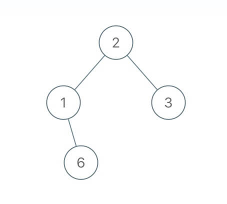
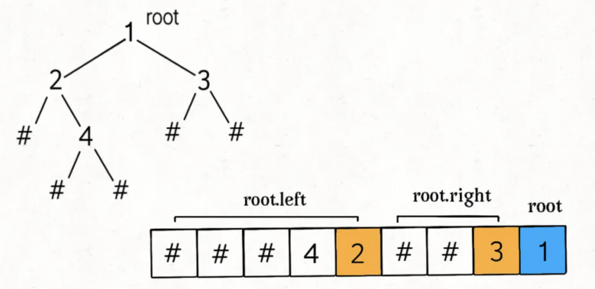
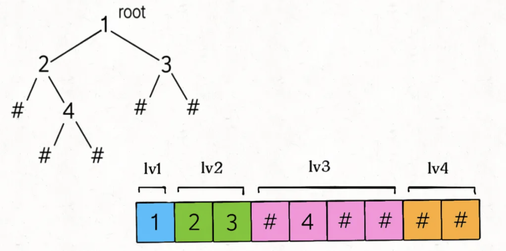

# 序列化与反序列化

`JSON` 的运用非常广泛，比如我们经常将变成语言中的结构体序列化成 `JSON` 字符串，存入缓存或者通过网络发送给远端服务，消费者接受 `JSON` 字符串然后进行反序列化，就可以得到原始数据了。这就是「序列化」和「反序列化」的目的，以某种固定格式组织字符串，使得数据可以独立于编程语言。

那么假设现在有一棵用 `Java` 实现的二叉树，我想把它序列化字符串，然后用 `C`++ 读取这棵并还原这棵二叉树的结构，怎么办？这就需要对二叉树进行「序列化」和「反序列化」了。

前面我们讲的根据两种遍历顺序构造二叉树，扁平化的树结构(序列)中不包含空节点，如果我们已知空节点，我们就能使用一种遍历顺序对应的序列来构造二叉树。

## 问题描述

「二叉树的序列化与反序列化」就是给你输入一棵二叉树的根节点 `root`，要求你实现如下一个类：

```ts
interface Codec {
    // 把一棵二叉树序列化成字符串
    serialize(root: TreeNode): string
    // 把字符串反序列化成二叉树
		deserialize(data: string): TreeNode
}
```

我们可以用 `serialize` 方法将二叉树序列化成字符串，用 `deserialize` 方法将序列化的字符串反序列化成二叉树，至于以什么格式序列化和反序列化，这个完全由你决定。

比如说输入如下这样一棵二叉树：



`serialize` 方法也许会把它序列化成字符串 `2,1,#,6,3,#,#`，其中 `#` 表示 `null` 指针，那么把这个字符串再输入 `deserialize` 方法，依然可以还原出这棵二叉树。也就是说，这两个方法会成对儿使用，你只要保证他俩能够自洽就行了。

想象一下，二叉树结该是一个二维平面内的结构，而序列化出来的字符串是一个线性的一维结构。**所谓的序列化不过就是把结构化的数据「打平」，其实就是在考察二叉树的遍历方式**。

二叉树的遍历方式有哪些？递归遍历方式有前序遍历，中序遍历，后序遍历；迭代方式一般是层级遍历。本文就把这些方式都尝试一遍，来实现 `serialize` 方法和 `deserialize` 方法。

## 前序遍历解法

前序遍历框架如下：

```java
void traverse(TreeNode root) {
    if (root == null) return;
    // 前序遍历的代码
    traverse(root.left);
    traverse(root.right);
}
```

### 序列化

对应构造序列的代码很容易想出，在代码部分构造字符串就能获得对应的序列了：

```ts
const NULL = "#";
const SEP = ",";

function serialize(root: TreeNode | null): string {
    let str = "";
    function helper(root: TreeNode) {
        if (!root) {
            str += NULL + SEP;
            return;
        }

        str += root.val + SEP;
        helper(root.left);
        helper(root.right);
    }
    helper(root);
    return str;
};
```

调用 `serialize` 函数之后，你是否可以立即想出这个 `res` 列表中元素的顺序是怎样的？比如如下二叉树（`#` 代表空指针 `null`），可以直观看出前序遍历做的事情：


那么 `res =` [`1,2,-1,4,-1,-1,3,-1,-1`]，这就是将二叉树「打平」到了一个列表中，其中 `-1` 代表 `null`。

### 反序列化

现在，思考一下如何写 `deserialize` 函数，将字符串反过来构造二叉树。

首先我们可以把字符串转化成列表：

```java
String data = "1,2,#,4,#,#,3,#,#,";
String[] nodes = data.split(",");
```

这样，`nodes` 列表就是二叉树的前序遍历结果，问题转化为：如何通过二叉树的前序遍历结果还原一棵二叉树？

> [PS：]()一般语境下，单单前序遍历结果是不能还原二叉树结构的，因为缺少空指针的信息，至少要得到前、中、后序遍历中的两种才能还原二叉树。但是这里的 `node` 列表包含空指针的信息，所以只使用 `node` 列表就可以还原二叉树。

该怎么实现呢，其实很简单，还是前序遍历框架的顺序，每次我们先根据 `seq`的头符号构造当前节点(子根节点)，`#`算作`null`，然后就是前序遍历的部分了，先左子树再右子树，只是遍历的形式从 `travse(root.left)`变成了`root.left = travse(list)`，这是因为树的结构还没有确定，但是两种形式是一个效果：

```ts
function deserialize(data: string): TreeNode | null {
    let sequence = data.split(",");
    function build(): TreeNode | null {
      if (!sequence.length) return null;
      let head = sequence.shift();
      if (head === "#") {
          return null;
      }
      let root = new TreeNode(Number(head), null, null);
      root.left = build();
      root.right = build();
      return root;
  	}
    return build();
};
```

## 后序遍历解法

二叉树的后续遍历框架：

```java
void traverse(TreeNode root) {
    if (root == null) return;
    traverse(root.left);
    traverse(root.right);

    // 后序遍历的代码
}
```

### 序列化

明白了前序遍历的解法，后序遍历就比较容易理解了，我们首先实现 `serialize` 序列化方法，只需要稍微修改辅助方法即可：

```ts
const NULL = "#";
const SEP = ",";

function serialize(root: TreeNode | null): string {
    let str = "";
    function helper(root: TreeNode) {
        if (!root) {
            str += NULL + SEP;
            return;
        }

        helper(root.left);
        helper(root.right);
	      str += root.val + SEP;
    }
    helper(root);
    return str;
};
```

我们把对 `str` 的拼接操作放到了后续遍历的位置，后序遍历导致结果的顺序发生变化：



### 反序列化

**`deserialize` 方法首先寻找 `root` 节点的值，然后递归计算左右子节点**。那么我们这里也应该顺着这个基本思路走，后续遍历中，`root` 节点的值能不能找到？再看一眼刚才的图：


可见，`root` 的值是列表的最后一个元素。我们应该从后往前取出列表元素，先用最后一个元素构造 `root`，然后递归调用生成 `root` 的左右子树。**注意，根据上图，从后往前在 `nodes` 列表中取元素，一定要先构造 `root.right` 子树，后构造 `root.left` 子树**。

看完整代码：

```java
/* 主函数，将字符串反序列化为二叉树结构 */
TreeNode deserialize(String data) {
    LinkedList<String> nodes = new LinkedList<>();
    for (String s : data.split(SEP)) {
        nodes.addLast(s);
    }
    return deserialize(nodes);
}

/* 辅助函数，通过 nodes 列表构造二叉树 */
TreeNode deserialize(LinkedList<String> nodes) {
    if (nodes.isEmpty()) return null;
    // 从后往前取出元素
    String last = nodes.removeLast();
    if (last.equals(NULL)) return null;
    TreeNode root = new TreeNode(Integer.parseInt(last));
    // 限构造右子树，后构造左子树
    root.right = deserialize(nodes);
    root.left = deserialize(nodes);

    return root;
}
```

至此，后续遍历实现的序列化、反序列化方法也都实现了。

## 中序遍历解法

先说结论，中序遍历的方式行不通，因为无法实现反序列化方法 `deserialize`。

我们刚才说了，要想实现反序列方法，首先要构造 `root` 节点。前序遍历得到的 `nodes` 列表中，第一个元素是 `root` 节点的值；后序遍历得到的 `nodes` 列表中，最后一个元素是 `root` 节点的值。

`root` 的值被夹在两棵子树的中间，也就是在 `nodes` 列表的中间，我们不知道确切的索引位置，所以无法找到 `root` 节点，也就无法进行反序列化。

## 层级遍历解法

首先，先写出层级遍历二叉树的代码框架：

```ts
function levelOrder(root: TreeNode) {
	if (root === null) return;
  let queue = [];
  queue.push(root);
  
  while (queue.length) {
    let cur = queue.shift();
    console.log(cur.val);
    if (cur.left) {
      queue.push(queue.left);
    }
		if (cur.right) {
      queue.push(queue.right);
    }
  }
}
```

**上述代码是标准的二叉树层级遍历框架**，从上到下，从左到右打印每层二叉树节点值，可以看到，队列 `q` 中不会存在 null 指针。

不过我们在反序列化的过程中是需要记录空指针 null 的，所以可以把标准的层级遍历框架略作修改：

```ts
function levelOrder(root: TreeNode) {
	if (root === null) return;
  let queue = [];
  queue.push(root);
  
  while (queue.length) {
    let cur = queue.shift();
    if (cur === null) continue;
    console.log(cur.val);
		queue.push(queue.left);
		queue.push(queue.right);
  }
}
```

这样也可以完成层级遍历，只不过我们把对空指针的检验从「将元素加入队列」的时候改成了「从队列取出元素」的时候。

那么我们完全仿照这个框架即可写出序列化方法：

```ts
const NULL = "#";
const SEP = ",";

function serialize(root: TreeNode | null): string {
  	if (root === null) return "";
    let str = "";
	  let queue = [];
  	queue.push(root);
    while (queue.length) {
      let cur = queue.shift();
      if (cur === null) {
        str += NULL + SEP;
        continue;
      }
      str += root.val + SEP;
      queue.push(queue.left);
      queue.push(queue.right);
    }
    return str;
};
```

层级遍历序列化得出的结果如下图：



可以看到，每一个非空节点都会对应两个子节点，**那么反序列化的思路也是用队列进行层级遍历，同时用索引 `i` 记录对应子节点的位置**：

```ts
function deserialize(data: string): TreeNode | null {
    let sequence = data.split(",");
  	if (!sequence.length) return null;
  	let root = new TreeNode(Number(sequence[0]), null, null);
  	let queue = [];
  	queue.push(root);
		
		for (let i = 1; i < data.length;) {
      let root = queue.shift();
      let left = sequence[i++];
      if (left !== NULL) {
				root.left = new TreeNode(Number(left, null, null);
				queue.push(root.left)
      } else {
        root.left = null;
      }
      let right = sequence[i++];
      if (right !== NULL) {
				root.right = new TreeNode(Number(right, null, null);
				queue.push(root.right)
      } else {
        root.right = null;
      }
    }
  	return root;
};
```

到这里，我们对于二叉树的序列化和反序列化的几种方法就全部讲完了。

## [652. 寻找重复的子树](https://leetcode-cn.com/problems/find-duplicate-subtrees/)

给定一棵二叉树，返回所有重复的子树。对于同一类的重复子树，你只需要返回其中任意一棵的根结点即可。

两棵树重复是指它们具有相同的结构以及相同的结点值。

示例 1：

```ts
    1
   / \
  2   3
 /   / \
4   2   4
   /
  4
```
下面是两个重复的子树：

```ts
  2
 /
4
```
和

```ts
4
```
因此，你需要以列表的形式返回上述重复子树的根结点。

### 算法策略

这道题之所以划到了这章里是因为它使用了序列化的技巧，来看看算法实现的策略吧：

如果你想知道以自己为根的子树是不是重复的，是否应该被加入结果列表中，你需要知道什么信息？

1. 以我为根的这棵二叉树（子树）长啥样？
2. 以其他节点为根的子树都长啥样？

好，那我们一个一个来解决，先来思考，**我如何才能知道以自己为根的二叉树长啥样**？

其实看到这个问题，就可以判断本题要使用「后序遍历」框架来解决：

```java
void traverse(TreeNode root) {
    traverse(root.left);
    traverse(root.right);
    /* 解法代码的位置 */
}
```

为什么？我要知道以自己为根的子树长啥样，是不是得先知道我的左右子树长啥样，再加上自己，就构成了整棵子树的样子，现在我们知道了遍历顺序，序列化的代码不难写出：

```java
String traverse(TreeNode root) {
    // 对于空节点，可以用一个特殊字符表示
    if (root == null) {
        return "#";
    }
    // 将左右子树序列化成字符串
    String left = traverse(root.left);
    String right = traverse(root.right);
    /* 后序遍历代码位置 */
    // 左右子树加上自己，就是以自己为根的二叉树序列化结果
    String subTree = left + "," + right + "," + root.val;
    return subTree;
}
```

**这样，我们第一个问题就解决了，对于每个节点，递归函数中的`subTree`变量就可以描述以该节点为根的二叉树**。

**现在我们解决第二个问题，我知道了自己长啥样，怎么知道别人长啥样**？这样我才能知道有没有其他子树跟我重复对吧。

这很简单呀，我们借助一个外部数据结构，让每个节点把自己子树的序列化结果存进去，这样，对于每个节点，不就可以知道有没有其他节点的子树和自己重复了么？

但是呢，这有个问题，如果出现多棵重复的子树，结果集`res`中必然出现重复，而题目要求不希望出现重复。为了解决这个问题，我们还需要使用`HashMap`，额外记录每棵子树的出现次数：

```ts
function findDuplicateSubtrees(root: TreeNode | null): Array<TreeNode | null> {
    let memo = new Map(),
        res = [];
    function travse(root: TreeNode): string {
        if (!root) return "#";

        let left = travse(root.left),
            right = travse(root.right);

        let subTree = left + "," + right + "," + root.val,
            count = memo.get(subTree);
        if (count) {
            memo.set(subTree, ++count);
            if (count === 2) {
                res.push(root);
            }
        } else {
            memo.set(subTree, 1);
        }

        return subTree;
    }

    travse(root);
    return res;
};
```

