# 二叉搜索树

二叉搜索树的基础数据结构当然是一棵二叉树，在二叉树的基础上二叉搜索树添加了一些特性，让其自身适合于查找的场景。

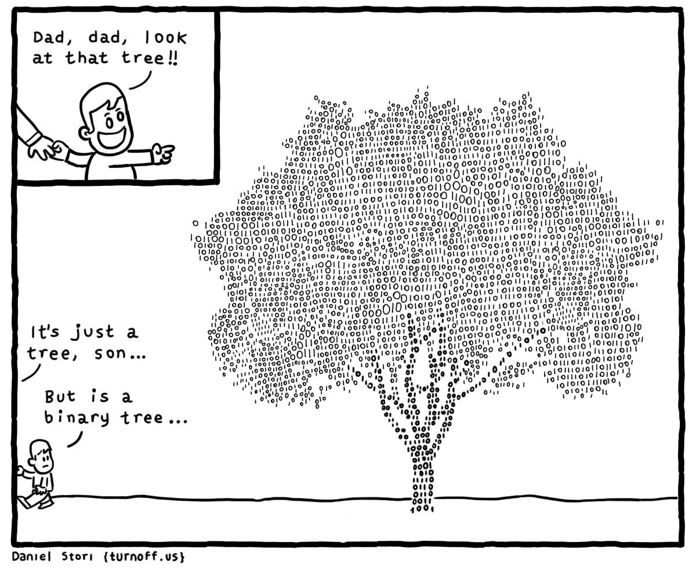

### 规则

- 若二叉搜索树的左子树不空，则左子树上所有节点的值均小于它的根节点的值；
- 若它的右子树不空，则右子树上所有节点的值均大于其根节点的值。
- 换句话说就是：任何节点的键值一定大于其左子树中的每一个节点的键值，并小于其右子树中的每一个节点的键值。

## 数据结构

节点类：很明显一个查找树的结点需要三个储存空间，左右指针和数据域。

```go
// Node 结点类
type Node struct {
	Data        int
	Left, Right *Node
}

// NewNode 结点类的构造方法
func NewNode(data int, left, right *Node) *Node {
	return &Node{
		data,
		left,
		right,
	}
}
```

查找树类：

```go
// BinarySearchTree 二叉查找树
type BinarySearchTree struct {
	Root *Node
}

// New 二叉查找树构造方法
func New(datas []int) (bst *BinarySearchTree, err error) {
	if len(datas) < 1 {
		return nil, errors.New("params datas should has at least one element")
	}
	bst = new(BinarySearchTree)
	bst.Root = NewNode(datas[0], nil, nil)
	for i := 1; i < len(datas); i++ {
		bst.insert(bst.Root, datas[i])
	}
	return bst, nil
}
```

## 遍历

二叉搜索树的中序遍历的序列是递增排序的序列。中序遍历的遍历次序：`Left -> Node -> Right`。

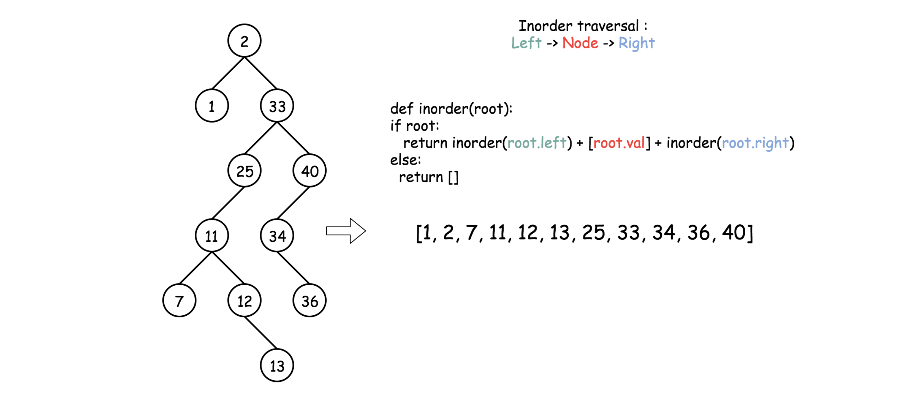

```java
public LinkedList<Integer> inorder(TreeNode root, LinkedList<Integer> arr) {
  if (root == null) return arr;
  inorder(root.left, arr);
  arr.add(root.val);
  inorder(root.right, arr);
  return arr;
} 
```

#### [230. 二叉搜索树中第K小的元素](https://leetcode-cn.com/problems/kth-smallest-element-in-a-bst/)

给定一个二叉搜索树的根节点 `root` ，和一个整数 `k` ，请你设计一个算法查找其中第 `k` 个最小元素（从 1 开始计数）。


```ex
输入：root = [5,3,6,2,4,null,null,1], k = 3
输出：3
```

**算法策略**

直接的思路就是升序排序，然后找第`k`个元素。BST 的中序遍历其实就是升序排序的结果，按照这个思路，可以直接写出代码：

```ts
function kthSmallest(root: TreeNode | null, k: number): number {
    let res = -1;
    function inOrder(root: TreeNode | null): TreeNode {
        if (!root) {
            return null;
        }
        inOrder(root.left);
        if (k === 1) {
            res = root.val;
        }
        k--;
        inOrder(root.right);
    }
    inOrder(root);
    return res;
};
```

## 搜索

查找的思路很简单，就是一种类似二分法查找的写法，按照二叉搜索树的特性可以很容易写出：

```ts
// Search 在二叉查找树中搜索
func (bst *BinarySearchTree) Search(key int) bool {
	return bst.search(bst.Root, key)
}

func (bst *BinarySearchTree) search(root *Node, key int) bool {
	if root == nil {
		return false
	}

	if root.Data == key {
		return true
	}

	if root.Data > key {
		return bst.search(root.Left, key)
	} else {
		return bst.search(root.Right, key)
	}
}
```

## 插入

对数据结构的操作无非遍历 + 访问，遍历就是「找」，访问就是「改」。具体到这个问题，插入一个数，就是先找到插入位置，然后进行插入操作。

找的部分我们已经在上面实现了，加上「改」的操作即可。**一旦涉及「改」，函数就要返回`Node`类型，并且对递归调用的返回值进行接收**。

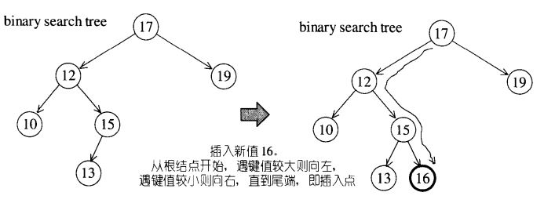

```go
// Insert 向二叉查找树中插入节点
func (bst *BinarySearchTree) Insert(data int) {
	bst.insert(bst.Root, data)
}

func (bst *BinarySearchTree) insert(root *Node, data int) {
  if root == nil {
    return NewNode(data, nil, nil)
  }
  if data > root.Data {
    root.Right = insert(root.Right, data);
	} 
  if data < root.Data {
    root.Left = insert(root.Left, nil, nil)
	}
  return root;
}
```

## 删除

这个问题稍微复杂，跟插入操作类似，先「找」再「改」，找到目标节点了，比方说是节点`A`，如何删除这个节点，这是难点。因为删除节点的同时不能破坏 BST 的性质。有三种情况，用图片来说明。

**情况 1**：`A`恰好是末端节点，两个子节点都为空，那么它可以当场去世了。

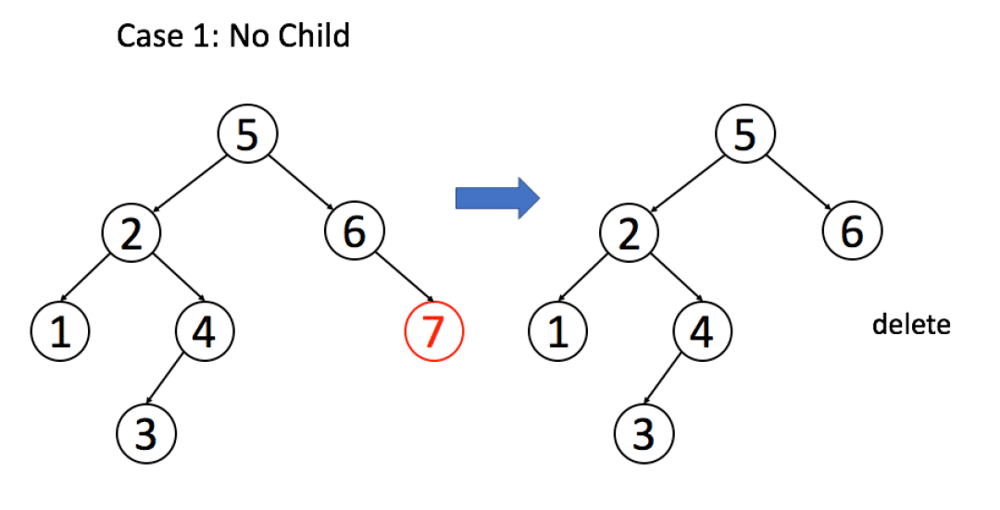

```ts
if (root.left == null && root.right == null)
    return null;
```

**情况 2**：`A`只有一个非空子节点，那么它要让这个孩子接替自己的位置。

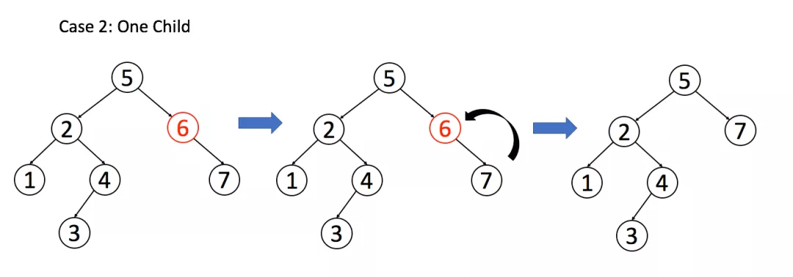

```ts
// 排除了情况 1 之后
if (root.left == null) return root.right;
if (root.right == null) return root.left;
```

**情况 3**：`A`有两个子节点，麻烦了，为了不破坏 BST 的性质，`A`必须找到左子树中最大的那个节点，或者右子树中最小的那个节点来接替自己。这两个不同的节点都有自己的定义：

+ `Successor` 代表的是中序遍历序列的下一个节点。即比当前节点大的最小节点，简称后继节点。 先取当前节点的右节点，然后一直取该节点的左节点，直到左节点为空，则最后指向的节点为后继节点。

  ```java
  public int successor(TreeNode root) {
    root = root.right;
    while (root.left != null) root = root.left;
    return root;
  } 
  ```

+ `Predecessor` 代表的是中序遍历序列的前一个节点。即比当前节点小的最大节点，简称前驱节点。先取当前节点的左节点，然后取该节点的右节点，直到右节点为空，则最后指向的节点为前驱节点。

  ```java
  public int predecessor(TreeNode root) {
    root = root.left;
    while (root.right != null) root = root.right;
    return root;
  } 
  ```

这里我们拿第二种也就是后继节点的删除举例子，流程如下图:

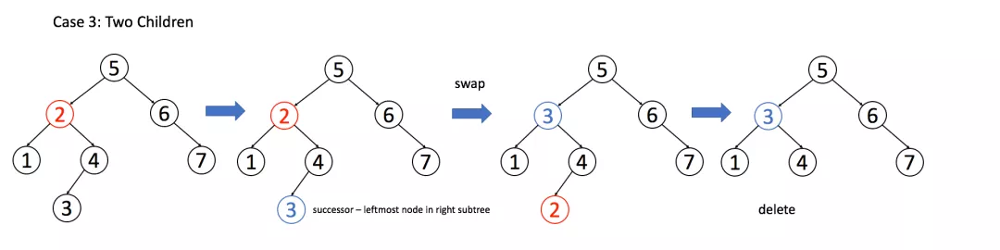

```ts
if (root.left != null && root.right != null) {
    // 找到右子树的最小节点
    TreeNode suc = successor(root.right);
    // 把 root 改成 minNode
    root.val = suc.val;
    // 转而去删除 minNode
    root.right = deleteNode(root.right, suc.val);
}
```

整体代码如下：

```ts
function deleteNode(root: TreeNode | null, key: number): TreeNode | null {
    if (!root) return null;

    if (root.val === key) {
        if (root.left === null) {
            return root.right;
        }
        if (root.right === null) {
            return root.left;
        }

        let successor = root.right;
        while (successor.left) {
            successor = minNode.left;
        }

        root.val = successor.val;

        root.right = deleteNode(root.right, successor.val);

    } else if (root.val > key) {
        root.left = deleteNode(root.left, key);
    } else if (root.val < key) {
        root.right = deleteNode(root.right, key);
    }

    return root;
}
```

## 合法性检验

### 题目描述

给定一个二叉树，判断其是否是一个有效的二叉搜索树，假设一个二叉搜索树具有如下特征：

+ 节点的左子树只包含小于当前节点的数。
+ 节点的右子树只包含大于当前节点的数。
+ 所有左子树和右子树自身必须也是二叉搜索树。

### 算法设计

乍一看，只需要遍历整棵树，检查`node.right.val > node.val`和`node.left.val < node.val` 对每个结点是否成立。

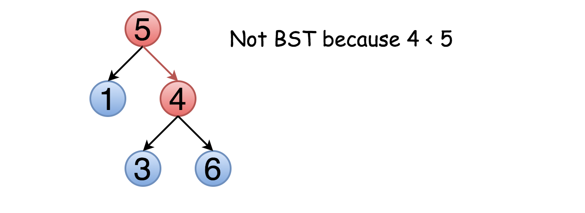

问题是，这种方法并不总是正确。不仅右子结点要大于该节点，整个右子树的元素都应该大于该节点。例如:

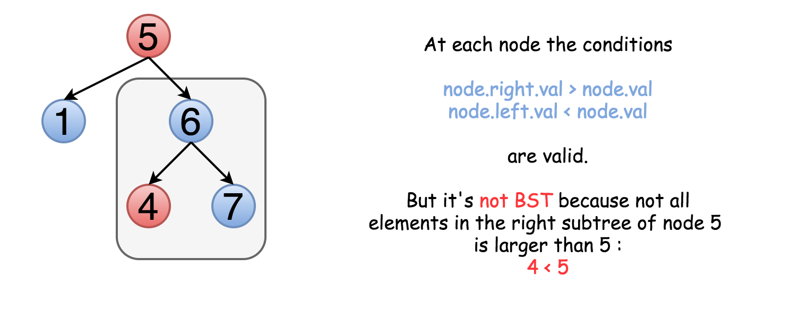

这意味着我们需要在遍历树的同时保留结点的上界与下界，在比较时不仅比较子结点的值，也要与上下界比较。

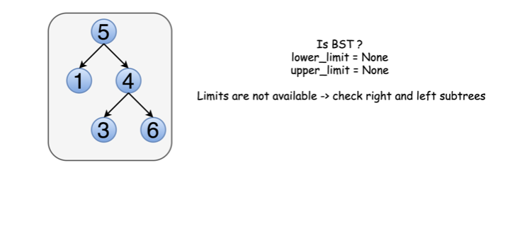

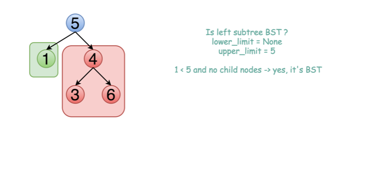

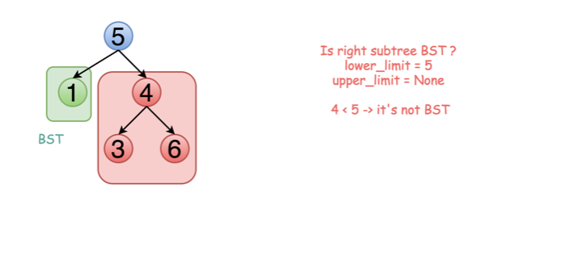

```go
func isValidBST(root *TreeNode) bool {
	return helper(root, -1, -1)
}

func helper(root *TreeNode, min, max int) bool {
	if root == nil {
		return true
	}
	if min != -1 && root.Val <= min {
		return false
	}
	if max != -1 && root.Val >= max {
		return false
	}
	if !helper(root.Left, min, root.Val) {
		return false
	}

	if !helper(root.Right, root.Val, max) {
		return false
	}
	return true
}
```

