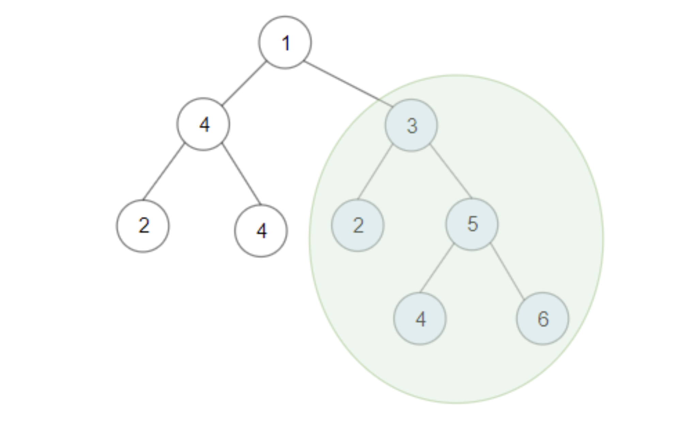
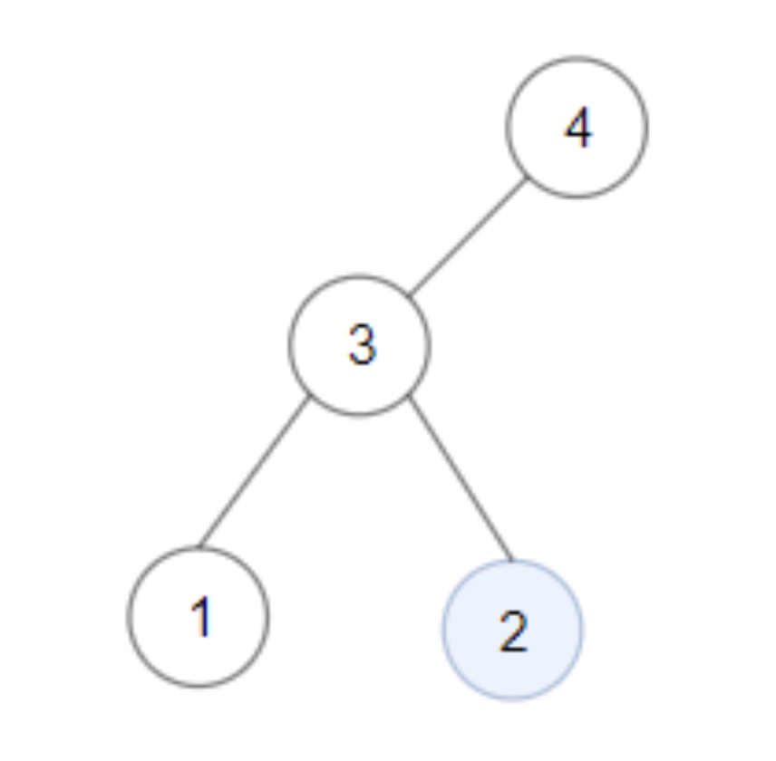
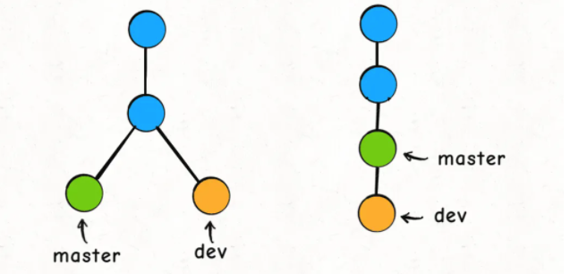

# 后序遍历

为什么这章把后序遍历单独拿出来说？因为后序遍历有先序和中序所不具有的特性，我们再看看后序遍历的代码框架：

```java
void traverse(TreeNode root) {
    traverse(root.left);
    traverse(root.right);
    /* 后序遍历代码的位置 */
    /* 在这里处理当前节点 */
}
```

观察这段代码，我们会发现后序遍历代码执行的时机是左右子树计算完成的时候，利用这个特性我们可以反推出：**如果当前节点要做的事情需要通过左右子树的计算结果推导出来，就要用到后序遍历**。

比如说二叉搜索树判断合法性的时候就可以通过后序遍历来计算，因为可以同时获得左右子树的前驱后继计算结果。

很多时候，后序遍历用得好，可以大幅提升算法效率。下面具体来讲几道题。

## 二叉搜索子树的最大键值和

给你一棵以 `root` 为根的 二叉树 ，请你返回 任意 二叉搜索子树的最大键值和。

二叉搜索树的定义如下：

+ 任意节点的左子树中的键值都 小于 此节点的键值。
+ 任意节点的右子树中的键值都 大于 此节点的键值。
+ 任意节点的左子树和右子树都是二叉搜索树。

**示例 1：**



```ts
输入：root = [1,4,3,2,4,2,5,null,null,null,null,null,null,4,6]
输出：20
解释：键值为 3 的子树是和最大的二叉搜索树。
```

如果输入这棵二叉树，算法应该返回 `20`，也就是图中绿圈的那棵子树的节点值之和，因为它是一棵 `BST`，且节点之和最大。任何二叉树都有最大搜索子树键值和，因为单独的叶子节点就符合搜索树的特性：



### 算法策略

**那么我们想计算子树中 BST 的最大和，站在当前节点的视角，需要做什么呢**？

1. 我肯定得知道左右子树是不是合法的 BST，如果这俩儿子有一个不是 BST，以我为根的这棵树肯定不会是 BST，对吧。
2. 如果左右子树都是合法的 BST，我得瞅瞅左右子树加上自己还是不是合法的 BST 了。因为按照 BST 的定义，当前节点的值应该大于左子树的最大值，小于右子树的最小值，否则就破坏了 BST 的性质。
3. 因为题目要计算最大的节点之和，如果左右子树加上我自己还是一棵合法的 BST，也就是说以我为根的整棵树是一棵 BST，那我需要知道我们这棵 BST 的所有节点值之和是多少，方便和别的 BST 争个高下，对吧。

**根据以上三点，站在当前节点的视角，需要知道以下具体信息**：

1. 左右子树是否是 BST。
2. 左子树的最大值和右子树的最小值。
3. 左右子树的节点值之和。

进一步设计，上面的第 `1` 点和第 `3` 点都需要从递归函数中获取，是两种截然不同的值，如何同时将二者返回？有两种解决方案。第一种比较粗暴就是返回一个数组记录二者，而第二种则相对来说好一些，用一个特殊值标记子树合法性，比如整数最小值：

```ts
const FALSY_MARK = Number.MIN_SAFE_INTEGER;
```

在之后看看第`2` 点左子树最大值和右子树最小值其实就是前驱和后继节点，由此我们写出对应的辅助函数来检测当前树的搜索合法性：

```ts
// 后继
function successor(root: TreeNode | null): TreeNode {
    if (!root || !root.right) return null;
    root = root.right;
    while (root.left) root = root.left;
    return root;
}

// 前驱
function predecessor(root: TreeNode | null): TreeNode {
    if (!root || !root.left) return null;
    root = root.left;
    while (root.right) root = root.right;
    return root;
}

function isValid(root: TreeNode): boolean {
    let lValid = predecessor(root) ? root.val > predecessor(root).val : true;
    let rValid = successor(root) ? root.val < successor(root).val : true;
    return  lValid && rValid;
}
```

需要的东西都齐了，主体函数采用后序遍历的框架，代码并不难写出：

+ `max`做闭包用来记录最大值，这样每次递归函数返回的就是当前子树的所有节点和，如果不是合法子树返回的就是`mask`。

在后序遍历代码中，每次我们根据`left`和`right` 判断树的合法性以及计算最大值，出现新的最大值就记录。

```ts
function maxSumBST(root: TreeNode | null): number {
    let max = 0;
    function helper(root: TreeNode | null): number {
        if (!root) return 0;
        let left = helper(root.left);
        let right = helper(root.right);

        if (left === FALSY_MARK || right === FALSY_MARK || !isValid(root)) {
            return FALSY_MARK;
        }

        let sum = left + right + root.val;
        max = Math.max(sum, max);

        return sum;
    }
    helper(root);
    return max;
};
```

## 最近公共祖先

`git` 合并分支的两个命令分别是 `merge` 和 `rebase`，本文就用 Git 的`rebase`工作方式引出一个经典的算法问题：**最近公共祖先**(`Lowest Common Ancestor`，简称 `LCA`)。

`rebase`是如何将两条不同的分支合并到同一条分支的呢：



上图的情况是，我站在`dev`分支，使用`git rebase master`，然后就会把`dev`接到`master`分支之上。Git 是这么做的：

**首先，找到这两条分支的最近公共祖先`LCA`，然后从`master`节点开始，重演`LCA`到`dev`几个`commit`的修改**，如果这些修改和`LCA`到`master`的`commit`有冲突，就会提示你手动解决冲突，最后的结果就是把`dev`的分支完全接到`master`上面。

那么，Git 是如何找到两条不同分支的最近公共祖先的呢？这就是一个经典的算法问题了，下面来详解。

#### [236. 二叉树的最近公共祖先](https://leetcode-cn.com/problems/lowest-common-ancestor-of-a-binary-tree/)

这个问题可以在 `LeetCode` 上找到，第 `236` 题，看下题目：给定一个二叉树, 找到该树中两个指定节点的最近公共祖先。

> [Tips：]()最近公共祖先的定义为：“对于有根树 `T` 的两个节点 `p`、`q`，最近公共祖先表示为一个节点 `x`，满足 `x` 是 `p`、`q` 的祖先且 `x` 的深度尽可能大（一个节点也可以是它自己的祖先）。”

#### 算法策略

粗略的分析一下这个问题，想要找到 `p` 和 `q` 的最近公共祖先，其实就是对 `p` 和 `q`出现之后进行标记，然后找到第一个两个标记同时点亮的节点。具体的其实有两种情况：

+ `p` 和 `q` 在不同的分支上，那么就按上面的策略找到第一个两个标记同时 `on` 的节点。
+ `p` 和 `q` 在同一个分支上，其实也很简单标记的同时检测另一个标记是否点亮就好了。

分析完之后就很明确了，首先我们要获得两个标记的状态，那肯定要采用后序遍历，具体的后序遍历内容直接看代码就行了，个人感觉有点简单：

```ts
function lowestCommonAncestor(
	root: TreeNode | null, p: TreeNode | null, q: TreeNode | null
): TreeNode | null {
  let lca = null;
	function helper(root: TreeNode): boolean {
        if (!root) {
            return false;
        }
        let left = helper(root.left);
        let right = helper(root.right);

        if (left && right && !lca) {
            lca = root;
        }

        if (root == p || root === q) {
            if (left || right) {
                lca = root;
            }
            return true;
        }

        return left || right ? true : false;
    }
    helper(root);
    return lca;
};
```

