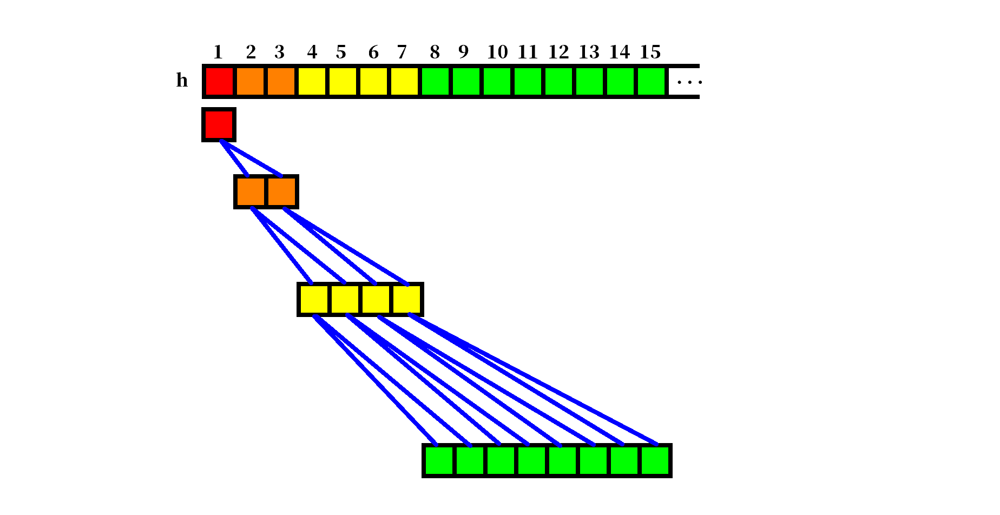
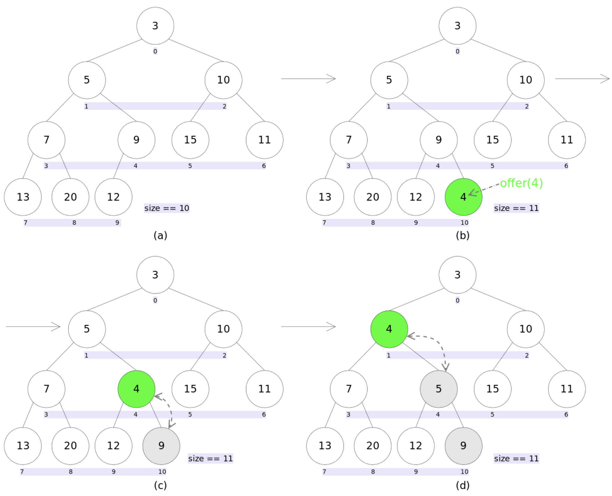
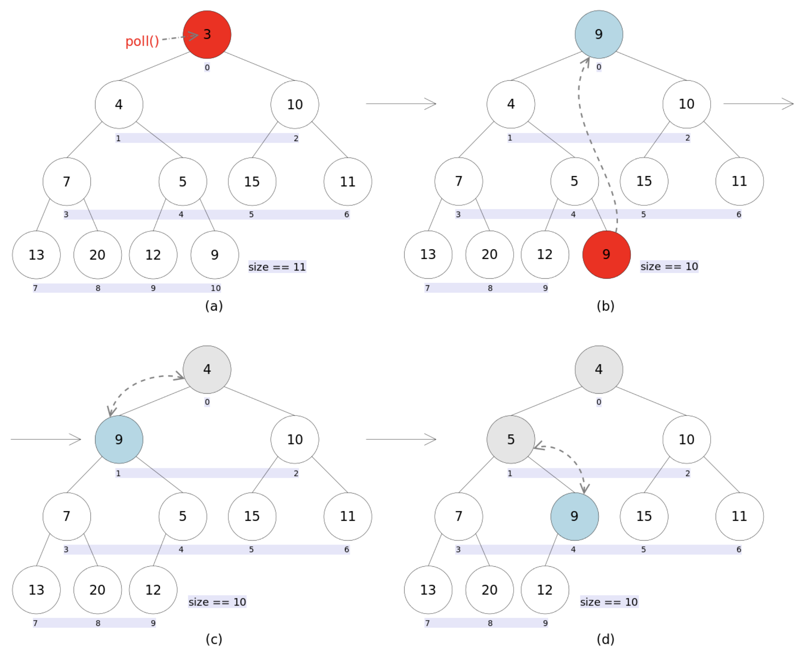

# 优先队列

优先队列是计算机科学中的一类抽象数据类型。优先队列中的每个元素都有各自的优先级，优先级最高的元素最先得到服务；优先级相同的元素按照其在优先队列中的顺序得到服务。

优先队列往往用堆来实现，最大优先队列可以选用大堆，最小优先队列可以选用小堆来实现。

优先队列至少需要支持下述操作：

+ 插入带优先级的元素 `(insert_with_priority)`;
+ 取出具有最高优先级的元素 `(pull_highest_priority_element)`;
+ 在 `O(1)` 时间复杂度查看最高优先级的元素 `(peek)`;

## 存储结构

回忆一下我们上文说的堆结构，对结构使用树状数组来实现，如下图：

这里我们使用一个技巧：数组的第一个索引 `0` 空着不用，这样把 `arr[1]` 作为整棵树的根的话，每个节点的父节点和左右孩子的索引运算会更为简单：

```go
// 父节点的索引
func parent(root int) int {
    return root / 2;
}
// 左孩子的索引
func left(root int) int {
    return root * 2;
}
// 右孩子的索引
int right(root int) int {
    return root * 2 + 1;
}
```

对应的优先队列初始化代码则如下所示，因为是一个队列所以不需要初始化节点，每次支持出入队列即可：

```go
// PqHeap is a priority queue
type PqHeap struct {
	tree []compare.Comparable
	// element in tree
	size int
}

// New is a constructor
func New(n int) *PqHeap {
	return &PqHeap{
		tree: make([]compare.Comparable, n+1),
	}
}
```

## 堆化

前文堆化的两个操作 `heapifyDown` 和 `heapifyUp`在这里换了名字：`sink`、 `swim`。但是逻辑是不变的。`sink` 就是将堆顶元素沉下去使其符合堆结构，`swim` 就是把最后一个元素浮上来：

```go
func (q *PqHeap) swim(i int) {
	for i > 1 && q.tree[i].CompareTo(q.tree[i/2]) == 1 {
		q.tree[i], q.tree[i/2] = q.tree[i/2], q.tree[i]
		i = i / 2
	}
}

func (q *PqHeap) sink(i int) {
	for i*2 <= q.size {
		k := i * 2
		if k+1 <= q.size && q.tree[k].CompareTo(q.tree[k+1]) == -1 {
			k++
		}
		if q.tree[k].CompareTo(q.tree[i]) == -1 {
			break
		}
		q.tree[i], q.tree[k] = q.tree[k], q.tree[i]
		i = k
	}
}

```

## 查看

上面说了堆顶元素实际上存储在 `1` 的位置：

```go
// Top returns the top ele of the queue
func (q *PqHeap) Top() compare.Comparable {
	return q.tree[1]
}
```

## 入队

入队列的过程和堆的插入操作类似，就是在队列尾添加一个元素然后向上堆化，把这个元素试探性的游上去，这个游上去的过程就是我们上文说的 `swim`：



```go
// Add Append a ele to queue
func (q *PqHeap) Append(c compare.Comparable) {
	q.size++
	q.tree[q.size] = c
	q.swim(q.size)
}
```

## 出队

移除操作和堆的删除元素也差不多，就是将堆顶元素和最后一个元素做交换，然后删除最后一个元素，并且把交换上去的新堆顶沉下来，这个沉下来的操作就是上面的 `sink`：



```go
// Pop removes the top ele from queue
func (q *PqHeap) Pop() compare.Comparable {
	top := q.tree[1]
	q.tree[1], q.tree[q.size] = q.tree[q.size], q.tree[1]
	q.size = q.size - 1
	q.tree[q.size+1] = nil
	q.sink(1)
	return top
}
```

