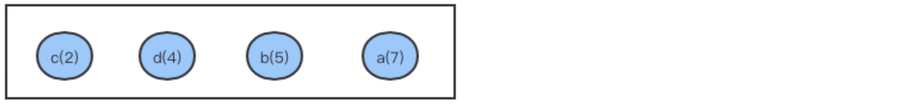
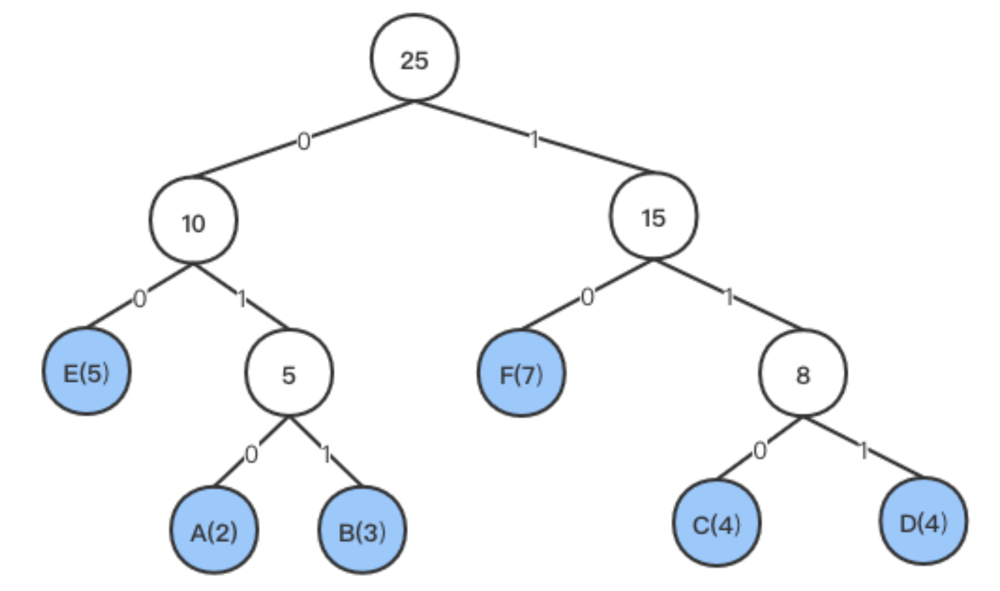

# 赫夫曼树

在树这种数据结构中，从树中的一个结点到另一个结点之间的分支构成这两个结点之间的**路径**，路径上分支的数目叫做**路径长度**，从根结点到每个结点的路径长度之和叫做**树的路径长度**。

如果一个结点带有权重，则路径长度和该结点权重的乘积叫做该结点的**带权路径长度(`WPL`)**，一棵树的带权路径长度为树中所有叶子结点的带权路径长度之和：
$$
WPL = Σ (wi*li)
$$
赫夫曼树又称最优树或者最优二叉树。假设有`n`个权值{,,...,}，通过这 `n` 个权值构造 `n` 个结点，每个结点的权值为(`1<=i<=n`)，然后以这 `n` 个结点为叶子结点构造一棵二叉树，在所有构成的二叉树中**带权路径长度最小**的二叉树被称作最优二叉树或者赫夫曼树。如下:

给定`4`个权重分别为`7, 5, 2, 4`的四个叶子结点`a, b, c, d`, 下图为用该`4`个结点构造的`3`棵二叉树：


上面图中三个二叉树的带权路径长度分别为:

+ `WPL = 7*2 + 5*2 + 2*2 + 4*2 = 36`
+ `WPL = 7*3 + 5*3 + 2*1 + 4*2 = 46`
+ `WPL = 7*1 + 5*2 + 2*3 + 4*3 = 35`

其中 `(c)` 的带权路径最小，从图中可以看出：**权值从高到低的节点对应路径长度依次递增**，可以得出该树的带权路径为最小，该树即为赫夫曼树。

## 构造

构造赫夫曼树的步骤如下，附图为上面四个节点对应的 `huffman`树构造过程：

1. 根据给定的 `n` 个权值{,,...,}构成 `n` 棵二叉树集合{,,...,}，其中每棵二叉树中只有一个带权为的根结点，其左右子树均为空(即初始集合中每棵树只有一个根结点构成单节点森林)。

   

2. 在 `F `中选取两棵根结点权值最小的树作为左右子树构造一棵新的二叉树，并且新二叉树根结点的权值为两棵子树根结点的权值之和。

3. 在`F`中删除步骤`2`中选中的两棵树，同时步骤`2`新构造出的二叉树加入到`F`中。

   

4. 重复步骤`2`和`3`，直到`F`中只剩下一棵树为止，此时剩下的这棵树便是赫夫曼树。

   


## 存储结构

先来看看 `HuffmanNode` 的 `ADT` 实现，一个节点类包含权重、数据、父节点指针以及左右子树指针四个字段，赫夫曼树使用树状数组来储存节点，所以指针就是数组下标，初始值为 `-1`。刚初始化的时候每个节点都是独立的。

   ```go
   // Node is an element of huffman tree
   type Node struct {
      Weight					int
   	Data                int
   	Parent, Left, Right int
   }
   
   // NewNode is a constructor
   func NewNode(w int, d int) *Node {
   	return &Node{
         Weight: w,
   		Data:   d,
   		Parent: -1,
   		Left:   -1,
   		Right:  -1,
   	}
   }
   ```

再来看看 `HuffmanTree` 的 `ADT` 实现，本身采用一个树状数组的数据结构存储节点，和堆类似、可以不使用 `0` 地址来简化下标操作(`L`：`2i`、`R`：`2i+1`、`F`：`i/2`)(但是本文未采用)：


初始化这颗树的过程如下：

1. 初始化树状数组长度为 `2*n-1` 这个长度观察赫夫曼树的结构可得(一个节点对应一个 `fake` 节点)；
2. 根据权重和数值构造长度为 `n` 的最初的单节点森林，然后将这些单节点树添加到树状数组的前 `n` 位；
3. 构造剩余的 `[n, 2n-1)` 位，从 `n` 开始遍历，设下标为 `i` 每次遍历 `[0, i)` 找到最小且没有父节点的两个节点相加构造新的 `root`。
4. 重复步骤 `3` 直到 `i === 2n-1`，`trie[2n-2]`即数组的根节点。

```go
// HaffmanTree is a tree
type HaffmanTree []*Node
const INF int = math.MaxInt64

// New is the constructor of haffman tree
func New(weights []int, values []int) HaffmanTree {
  // init first n digits of the trie;
	n := len(weights)
	trie := make([]*Node, 2*n-1)
	for i := range weights {
		trie[i] = NewNode(weights[i], values[i])
	}
	
  // build [n, 2n-1) nodes for the trie from bottom to top;
	for i := n; i < 2*n-1; i++ {
		min1 := INF
		min2 := min1
		x1 := -1
		x2 := -1

		for j := 0; j < i; j++ {
      // find two smallest weight node;
			if trie[j].Parent == -1 {
        // find a node without parent;
				if trie[j].Data < min1 {
					min2 = min1
					x2 = x1
					min1 = trie[j].Data
					x1 = j
				} else if trie[j].Data < min2 {
					min2 = trie[j].Data
					x2 = j
				}
			}
		}
		trie[x1].Parent = i
		trie[x2].Parent = i
		trie[i] = NewNode(min1 + min2)
		trie[i].Left = x1
		trie[i].Right = x2
	}
	return trie
}
```

## 赫夫曼编码

在现实生活中，我们通常经常会遇到对数据进行编码的场景。最简单的方法是对每个原始数据的每个源符号生成一个固定长度的编码，然后用编码替换每个源符号，以达到对整个数据编码的目的。但是这种方法有两个弊端:

1. 每个编码长度固定，容易被破译。
2. 每个编码长度固定，导致编码后的数据长度不尽如人意。

而赫夫曼编码则很好的规避了这两个问题，赫夫曼编码使用变长编码表对源符号进行编码，其中每个编码的长度是根据评估源符号出现几率的方法得到的，即出现频率高的源符号使用较短的编码，反之使用较长的编码，这样编码后的数据整体平均长度降低，从而实现更高效的压缩。

举个例子对比一下，`AAAABBBCDDBBAAA`这个序列分别用等长编码和赫夫曼编码压缩：

```go
A		B		C		D
00	01	10	11
// 2*15 = 30
A(7) B(5) C(1) D(2)
0		 11		100	 101
// 7*1+5*2+3*1+3*2 = 26
```

可以看出已知权值的情况下 `huffman` 编码的效率比等长编码高很多。

### 构建策略

赫夫曼编码是由通过构造赫夫曼树生成的一种编码，假设给定的某些英文符号的出现频率如下表所示:

| 符号 | A    | B    | C    | D    | E    | F    |
| :--- | :--- | :--- | :--- | :--- | :--- | :--- |
| 频率 | 2    | 3    | 4    | 4    | 5    | 7    |

编码生成过程如下，我们以频率为权值构造 `6` 棵只有一个结点的二叉树，然后按照赫夫曼树的构造规则构造赫夫曼树:


代码中我们使用 `huffmantree.HaffmanTree` 来实现 `HuffmanCode`，`HuffmanCode` 的几个字段介绍如下，初始化的过程会直接构建 `HuffmanTree` 结构然后调用 `buildCodeMap` 构建编码表：

```go
// HuffmanCode is compression datastruct
type HuffmanCode struct {
	charset    []byte										// 字符集
	tree       huffmantree.HaffmanTree	// huffman树结构
	code       map[byte][]byte					// 编码映射表
	compressed []byte										
	count      int
}

// New is constructor of HuffmanCode
func New(charset []byte, weight []int) *HuffmanCode {
	c := &HuffmanCode{
		charset: charset,
		tree:    huffmantree.New(weight),
	}
	c.buildCodeMap()
	return c
}
```

构造好赫夫曼树后，下一步便是进行编码，赫夫曼编码步骤为:

1. 给赫夫曼树中存在孩子结点的左路径编码`0`，右路径编码`1`，因为我们构造树的时候将最小的两个节点中更小的那个作为左子树，所以说左子树权值理论上比右子树更小。
2. 从树的根结点开始到每一个叶子结点所经过的路径的编码组成的一个编码串便是该叶子结点代表的符号的赫夫曼编码。

生成结果如下图：



根据上图得到每个字符的编码为:

| 符号 | A    | B    | C    | D    | E    | F    |
| :--- | :--- | :--- | :--- | :--- | :--- | :--- |
| 频率 | 2    | 3    | 4    | 4    | 5    | 7    |
| 编码 | 010  | 011  | 110  | 111  | 00   | 10   |

**注意: 赫夫曼编码并不唯一，如上图中的 `C` 和 `D` 的位置可以互换。**

下面来看看构建字符编码表的具体代码，首先我们遍历 `c.charset` 拿到每个字符的下标，这个下标就是 `huffmanTree` 中的字符叶子节点下标。

拿到这个下标我们就可以从下而上遍历路径上的所有节点，不过既然是反向遍历所以我们也应该反向构建编码串或者在最后将编码串颠倒。

```go
func (c *HuffmanCode) buildCodeMap() {
	c.code = make(map[byte][]byte)
	for i, b := range []byte(c.charset) {
    // 根据 char 下标构建编码串
		c.code[b] = c.getCode(i)
	}
}

// get char i`s code
func (c *HuffmanCode) getCode(i int) []byte {
  // 限定在 256 位编码
	n := 8
	huffcode := make([]byte, n)
	child := i
	parent := c.tree[i].Parent
	for i = n - 1; parent != -1; i-- {
    // 反向填充编码
		if c.tree[parent].Left == child {
      // 判断当前节点为左右子树的哪一个
			huffcode[i] = 0
		} else {
			huffcode[i] = 1
		}
		parent = c.tree[parent].Parent
		child = parent
	}
	return huffcode[i+1:]
  // 返回边长编码
}
```

### 编码策略

上面我们只是构造了字符对应的编码表，其中编码还是用数组来储存，将数据流转换为真正的二进制串还需要辅助的数据结构来实现，`binarySlice`这个数据结构类似 `bitmap` 主要方法就是存储`bit`位：

```go
type binarySlice struct {
	data   []byte
	size   int
	offset int
}

func new(n int) *binarySlice {
	return &binarySlice{
		data: make([]byte, n),
		size: n,
	}
}

func (s *binarySlice) add(b byte) {
	i8Offset := s.offset / 8
	bOffset := s.offset % 8
	if b == 1 {
		s.data[i8Offset] = s.data[i8Offset] | (1 << bOffset)
	}
	s.offset++
}
```

`Encode` 用于编码数据流，代码比较简单，最后返回字节切片以及位偏移：

```go
// Encode a str with huffmancode
func (c *HuffmanCode) Encode(s []byte) ([]byte, int) {
	n := len(s)
	slice := new(n)
	for _, v := range s {
		for _, b := range c.code[v] {
			slice.add(b)
		}
	}
	return slice.data, slice.offset
}
```

### 代码

实际代码中还提供了 `zip` 方法和 `getInfo` 来提取权重，有兴趣的可以自行查看：

```go
type binarySlice struct {
	data   []byte
	size   int
	offset int
}

func new(n int) *binarySlice {
	return &binarySlice{
		data: make([]byte, n),
		size: n,
	}
}

func (s *binarySlice) add(b byte) {
	i8Offset := s.offset / 8
	bOffset := s.offset % 8
	if b == 1 {
		s.data[i8Offset] = s.data[i8Offset] | (1 << bOffset)
	}
	s.offset++
}

// const range = 8

// HuffmanCode is compression datastruct
type HuffmanCode struct {
	charset    []byte
	tree       huffmantree.HaffmanTree
	code       map[byte][]byte
	compressed []byte
	count      int
}

// New is con
func New(charset []byte, weight []int) *HuffmanCode {
	c := &HuffmanCode{
		charset: charset,
		tree:    huffmantree.New(weight),
	}
	c.buildCodeMap()
	return c
}

func (c *HuffmanCode) buildCodeMap() {
	c.code = make(map[byte][]byte)
	for i, b := range []byte(c.charset) {
		c.code[b] = c.getCode(i)
	}
}

// get char i`s code
func (c *HuffmanCode) getCode(i int) []byte {
	n := 8
	huffcode := make([]byte, n)
	child := i
	parent := c.tree[i].Parent
	for i = n - 1; parent != -1; i-- {
		if c.tree[parent].Left == child {
			huffcode[i] = 0
		} else {
			huffcode[i] = 1
		}
		parent = c.tree[parent].Parent
		child = parent
	}
	return huffcode[i+1:]
}

// Encode a str with huffmancode
func (c *HuffmanCode) Encode(s []byte) ([]byte, int) {
	n := len(s)
	slice := new(n)
	for _, v := range s {
		for _, b := range c.code[v] {
			slice.add(b)
		}
	}
	return slice.data, slice.offset
}

// HZip zip a file with huffman code
func HZip(org, dst string) (output *os.File, err error) {
	data, err := ioutil.ReadFile(org)
	if err != nil {
		return
	}
	charset, weights := getInfo(data)
	t := New(charset, weights)
	encoded, offset := t.Encode(data)

	wLen := uint64(len(weights))
	lOffset := uint8(offset % 8)

	buf := &bytes.Buffer{}
	// write head
	binary.Write(buf, binary.BigEndian, wLen)
	buf.WriteByte(lOffset)
	// write charset
	buf.Write(charset)
	buf.WriteByte(0x00)
	// write
	binary.Write(buf, binary.BigEndian, weights)
	buf.Write(encoded)
	output, err = os.Create(dst)
	if err != nil {
		return
	}
	defer output.Close()
	buf.WriteTo(output)
	return output, nil
}

func getInfo(data []byte) (charset []byte, weight []int) {
	countMap := make(map[byte]int)
	for _, b := range data {
		if _, ok := countMap[b]; ok {
			countMap[b]++
		} else {
			countMap[b] = 1
		}
	}
	buf := bytes.Buffer{}
	weight = make([]int, len(countMap))
	i := 0
	for b, c := range countMap {
		buf.WriteByte(b)
		weight[i] = c
		i++
	}
	return buf.Bytes(), weight
}
```

