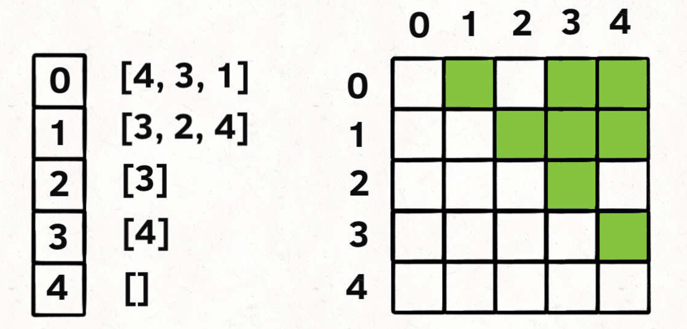
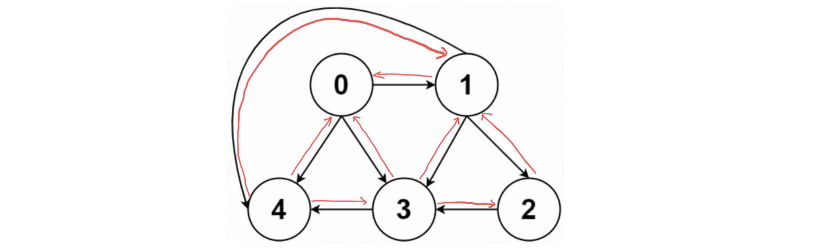

## 图 `graph`

一幅图是由**节点**和**边**构成的，逻辑结构如下：


根据这个逻辑结构，我们可以认为每个节点的实现如下：

```java
/* 图节点的逻辑结构 */
class Vertex {
    int id;
    Vertex[] neighbors;
}
```

除此之外，我们在算法题中还经常看到更简便的图数据结构，其中 `vertex(n)`表示顶点数目，顶点的序号从 `0` 到 `n-1` 递增连续，`edge` 包含多个`[起点，终点]`的边。

```ts
vertex = n
edge = [[0, 2], [1, 3], [3, 2], ..., [i, n - 1]];
```

这种存储结构不方便访问某个点的下一点集，一般转换为邻接表的存储结构：

```ts
let nextNodes = new Array(n);
for (let i = 0; i < n; i++) {
  nextNodes[i] = [];
}

for (let [cur, pre] of edges) {
  nextNodes[pre].push(cur);
}
```

### 邻接表和邻接矩阵

不过呢，上面的这两种种实现是「逻辑上的」，实际上我们很少用这个 `Vertex` 类和 `vertex&edge`实现图，而是用常说的**邻接表和邻接矩阵**来实现。



邻接表很直观，我把每个节点 `x` 的邻居都存到一个列表里，然后把 `x` 和这个列表关联起来，这样就可以通过一个节点 `x` 找到它的所有相邻节点。

邻接矩阵则是一个二维布尔数组，我们权且成为 `matrix`，如果节点 `x` 和 `y` 是相连的，那么就把 `matrix[x][y]` 设为 `true`。如果想找节点 `x` 的邻居，去扫一圈 `matrix[x][..]` 就行了。

这两种图的存储方式各有各的好处，首先邻接表又称为稀疏矩阵，当图的体量不那么大的时候比邻接矩阵消耗更少的空间，但是缺点也很明显但是，邻接表无法快速判断两个节点是否相邻。

比如说我想判断节点 `1` 是否和节点 `3` 相邻，我要去邻接表里 `1` 对应的邻居列表里查找 `3` 是否存在。但对于邻接矩阵就简单了，只要看看 `matrix[1][3]` 就知道了，效率高。

### 有向加权图和无向图

加权图，无向图这些看起来复杂的数据结构都是从最简单的图模型演变出来的，比如有向加权图怎么实现？

如果是邻接表，我们不仅仅存储某个节点 `x` 的所有邻居节点，还存储 `x` 到每个邻居的权重，不就实现加权有向图了吗？

如果是邻接矩阵，`matrix[x][y]` 不再是布尔值，而是一个 `int` 值，`0` 表示没有连接，其他值表示权重，不就变成加权有向图了吗？

无向图怎么实现？也很简单，所谓的「无向」，是不是等同于「双向」？



如果连接无向图中的节点 `x` 和 `y`，把 `matrix[x][y]` 和 `matrix[y][x]` 都变成 `true` 不就行了；邻接表也是类似的操作。

把上面的技巧合起来，就变成了无向加权图……

### 图的遍历

图其实就是包含环的多叉树，所以图进行遍历整体的逻辑和遍历树结构一致，只需要判断环作为结束条件即可，参考多叉树，多叉树的遍历框架如下：

```java
/* 多叉树遍历框架 */
void traverse(TreeNode root) {
    if (root == null) return;

    for (TreeNode child : root.children)
        traverse(child);
```

图和多叉树最大的区别是，图是可能包含环的，你从图的某一个节点开始遍历，有可能走了一圈又回到这个节点。所以，如果图包含环，遍历框架就要一个 `visited` 数组进行辅助：

```java
Graph graph;
boolean[] visited;

/* 图遍历框架 */
void traverse(Graph graph, int s) {
    if (visited[s]) return;
    // 经过节点 s
    visited[s] = true;
    for (TreeNode neighbor : graph.neighbors(s))
        traverse(neighbor);
    // 离开节点 s
    visited[s] = false;   
```

注意这里我们在遍历所有边之前先标记经过`s` 节点，在遍历完成之后标记离开 `s` 节点，这和回溯的原理很相似，`s` 已访问只是针对于本轮选择，本轮选择的所有后序可能都遍历完了之后就应该取消标记，避免影响同层级下一轮选择。

这个 `visited` 数组的操作很像回溯算法做「做选择」和「撤销选择」，区别在于位置，回溯算法的「做选择」和「撤销选择」在 for 循环里面，而对 `visited` 数组的操作在 `for` 循环外面。

比如下面两种多叉树的遍历：

```java
void traverse(TreeNode root) {
    if (root == null) return;
    System.out.println("enter: " + root.val);
    for (TreeNode child : root.children) {
        traverse(child);
    }
    System.out.println("leave: " + root.val);
}

void traverse(TreeNode root) {
    if (root == null) return;
    for (TreeNode child : root.children) {
        System.out.println("enter: " + child.val);
        traverse(child);
        System.out.println("leave: " + child.val);
    }
}
```

前者会正确打印所有节点的进入和离开信息，而后者唯独会少打印整棵树根节点的进入和离开信息。

为什么回溯算法框架会用后者？因为回溯算法关注的**不是节点，而是树枝**。显然，对于这里「图」的遍历，我们应该把 `visited` 的操作放到 for 循环外面，否则会漏掉起始点的遍历。

当然，**当有向图含有环的时候才需要 `visited` 数组辅助**，如果不含环，连 `visited` 数组都省了，基本就是多叉树的遍历。

> 这种遍历方式其实就是深度优先遍历，后文我们会具体说明，并且还会提到广度优先遍历。

#### [797. 所有可能的路径](https://leetcode-cn.com/problems/all-paths-from-source-to-target/)

给一个有 `n` 个结点的有向无环图，找到所有从 `0` 到 `n-1` 的路径并输出（不要求按顺序）

二维数组的第 `i` 个数组中的单元都表示有向图中 `i` 号结点所能到达的下一些结点（译者注：有向图是有方向的，即规定了 a→b 你就不能从 b→a ）空就是没有下一个结点了。

**示例 1：**


```c
输入：graph = [[1,2],[3],[3],[]]
输出：[[0,1,3],[0,2,3]]
解释：有两条路径 0 -> 1 -> 3 和 0 -> 2 -> 3
```

**解法:**

这道题其实就是一道图的遍历算法，在遍历的过程中收集路径，由于这里是一个无环图所以不需要搞一个标记数组。同时 `path`的收集也有两种策略，一时每次都拷贝出一个新数组避免对其他轮次的影响，二就是将改变恢复来避免影响。

```ts
function allPathsSourceTarget(graph: number[][]): number[][] {
    let n = graph.length,
        res = [];
    function travse(vertex: number, path: number[]) {
        path = [...path, vertex];
      	// path.push(vertex);
        if (vertex === n - 1) {
            res.push(path);
          	// path.pop();
            return;
        }

        for (let j of graph[vertex]) {
            travse(j, path);
        }
	    	// path.pop();
    }

    travse(0, []);
    return res;
};
```

