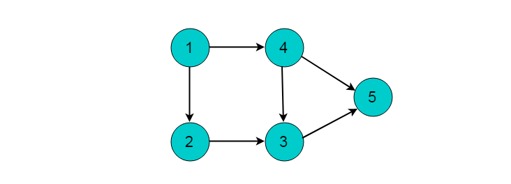
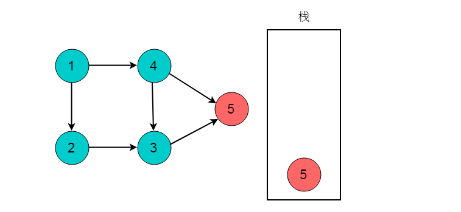
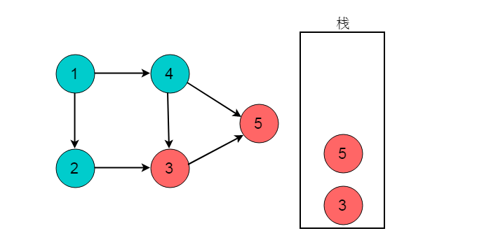
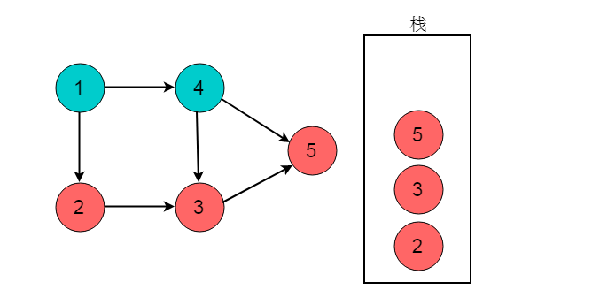
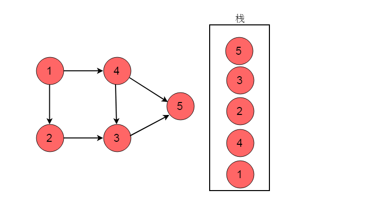

# 拓扑排序

在工程实践中,一个工程项目往往由若干个子项目组成。这些子项目间往往有两种关系:

1. 先后关系，即必须在某个项完成后才能开始实施另一个子项目。
2. 子项目间无关系，即两个子项目可以同时进行,互不影响。

例如：在工厂里产品的生产线上，一个产品由若干个零部件组成。零部件生产时，也存在这两种关系:

1. 先后关系，即一个部件必须在完成后才能生产另一个部件;
2. 部件间无先后关系，即这两个部件可以同时生产。

那么如何合理的分配资源才能保证工程能够按时完成呢？将任务作为图的顶点，将任务之间的依赖关系作为图的边，这样就可以将实际问题抽象为数据结构图论中的典型问题——图的拓扑排序。

## 有向无环图

**有向无环图（Directed Acyclic Graph, DAG）：**是有向图的一种，字面意思的理解就是图中没有环。常常被用来表示事件之间的驱动依赖关系，管理任务之间的调度。

**AOV网：**在每一个工程中，可以将工程分为若干个子工程，这些子工程称为活动。如果用图中的顶点表示活动，以有向图的弧表示活动之间的优先关系，这样的有向图称为`AOV`网，即顶点表示活动的网。在`AOV`网中，如果从顶点`vi`到顶点`vj`之间存在一条路径，则顶点`vi`是顶点`vj`的前驱，顶点`vj`是顶点`vi`的后继。活动中的制约关系可以通过`AOV`网中的表示。 在`AOV`网中，不允许出现环，如果出现环就表示某个活动是自己的先决条件。因此需要对`AOV`网判断是否存在环，可以利用有向图的拓扑排序进行判断。

**拓扑序列：**设`G=(V,E)`是一个具有`n`个顶点的有向图，`V`中的顶点序列`v1,v2,…,vn`，满足若从顶点`vi`到`vj`有一条路径，则在顶点序列中顶点`vi`必在`vj`之前，则我们称这样的顶点序列为一个拓扑序列。

**拓扑排序：**拓扑排序是对一个有向图构造拓扑序列的过程。

### 拓扑排序

**拓扑排序（Topological Sorting）**是一个有向无环图`（DAG, Directed Acyclic Graph）`的所有顶点的线性序列。且该序列必须满足下面两个条件：

1. 每个顶点出现且只出现一次。
2. 若存在一条从顶点 `A` 到顶点 `B` 的路径，那么在序列中顶点` A` 出现在顶点` B `的前面。

简单的来说拓扑排序就是找到一个能顺利完成前驱事件直到结束的路径。

> **注：**有向无环图`（DAG）`才有拓扑排序，非`DAG`图没有拓扑排序一说。

## 入度表法`(BFS)`

入度表法是根据顶点的入度来判断是否存在依赖关系。若顶点入度不为`0`。则必然此顶点的事件有前驱依赖事件，因此每次选取入度为`0`的顶点输出，然后删除其本身和所有的边，因为其作为入度的任务已完成，这样符合拓扑排序的性质。

### 算法流程

1. 从图中选择一个入度为`0`的顶点，输出该顶点。
2. 从图中删除该节点及其所有出边（即与之邻接的所有顶点入度`-1`）
3. 反复执行这两个步骤，直至所有节点都输出，即整个拓扑排序完成；或者直至剩下的图中再没有入度为`0`的节点，这就说明此图中有回路，不可能进行拓扑排序。

### 实例图解

图中所示的有向无环图，采用入度表的方法获取拓扑排序过程。


选择图中入度为``0``的顶点``1``，输出顶点``1``。删除顶点``1``，并删除以顶点``1``为尾的边。删除后图为：


继续选择入度为`0`的顶点。现在，图中入度为`0`的顶点有`2`和`4`，这里我们选择顶点`2`，输出顶点`2`。删除顶点`2`，并删除以顶点`2`为尾的边。删除后图为：


选择入度为`0`的顶点`4`，输出顶点`4`.删除顶点`4`，并删除以顶点`4`为尾的边。删除后图为：


选择入度为 `0`的顶点`3`，输出顶点`3`.删除顶点`3`，并删除以顶点`3`为尾的边。删除后图为：


最后剩余顶点 `5`，输出顶点 `5`，拓扑排序过程结束。最终的输出结果为：


### 性能分析

算法时间复杂度分析：统计所有节点入度的时间复杂性为`V*E`；接下来删边花费的时间也是`V*E`，总花费时间为`O(V*E)`。若使用队列保存入度为`0`的顶点，则可以将这个算法复杂度将为`O(V+E)`。

### 算法实现

这里我们假设顶点序号从`0`开始，首先我们通过计数每个顶点入度，将所有入度为`0`的顶点加入`indegrees`，并且储存每个顶点的后继节点，之后通过广度优先遍历，每次都通过一个入度为`0`的点去给其下一个节点删除边知道新的入度`0`出现，最后如果说所有的顶点都被删除说明图中无环路，（有环路的话边会永远也删不掉，知道队列为空）。

```ts
function topSort(vertexes: number, graph: number[][]) {
    let indegrees = new Array(vertexes).fill(0);
    let nextNodes = new Array(vertexes);
    for (let i = 0; i < vertexes; i++) {
        nextNodes[i] = [];
    }
    let queue: number[] = [];
	  let result: number[] = [];

    for (let [pre, cur] of graph) {
        indegrees[cur] += 1; 					// 当前节点入度 +1；
        nextNodes[pre].push(cur); 		// 前驱节点添加新边边；
    }

    for (let i = 0; i < vertexes; i++) {
        if (indegrees[i] === 0) queue.push(i);
    }

    while (queue.length) {
        let pre = queue.shift() as number;
      	result.push(pre)
        vertexes--;
        for (let cur of nextNodes[pre]) {
            indegrees[cur] -= 1;
            if (indegrees[cur] === 0) queue.push(cur);
        }
    }

    return !vertexes ? result : [];
}
```

## 出度表法`(DFS)`

先进行深度优先搜索，当到达出度为 **0** 的顶点时，进入回退过程。在执行回退时过程中，不断记录出度为 **0** 的顶点，将其入栈。则最终出栈顺序即为拓扑排序序列。

### 算法流程

1. 对图执行深度优先搜索。
2. 在执行深度优先搜索时，若某个顶点不能继续前进，即顶点的出度为0，则将此顶点入栈。
3. 最后得到栈中顺序的逆序即为拓扑排序顺序。

### 实例图解

如图所示的有向无环图，采用`DFS`的方法获取拓扑排序过程。



选择起点为顶点`1`，开始执行深度优先搜索。顺序为`1->2->3->5`，深度优先搜索到达顶点5时，顶点5出度为0。将顶点5入栈。




深度优先搜索执行回退，回退至顶点`3`。此时顶点`3`的出度为`0`，将顶点`3`入栈。



回退至顶点`2`，顶点`2`出度为`0`，顶点`2`入栈。


回退至顶点`1`，顶点`1`可以前进位置为顶点`4`，顺序为`1->4`。



回退至顶点`1`，顶点`1`出度为`0`，顶点`1`入栈。



栈的逆序为`1->4->2->3->5`。此顺序为拓扑排序结果。

### 性能分析

时间复杂度分析：首先深度优先搜索的时间复杂度为`O(V+E)`，而每次只需将完成访问的顶点存入数组中，需要`O(1)`，因而总复杂度为`O(V+E)`。

### 算法实现

