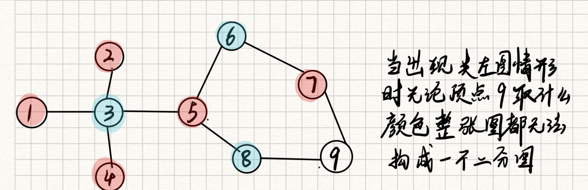

# 二分图

**二分图**又称作**二部图**，是图论中的一种特殊模型，逻辑结构上就是基础图模型，但是有特殊限定条件。

设 `G=(V,E) `是一个无向图`PS:(V=vertex, E=edge)`，如果顶点 `V` 可分割为两个互不相交的子集 `(A,B)`，并且图中的每条边`(i，j)`所关联的两个顶点 `i` 和 `j` 分别属于这两个不同的顶点集 `(i in A,j in B)`，则称图 `G` 为一个二分图。

简而言之，就是顶点集 `V` 可分割为两个互不相交的子集，并且图中每条边依附的两个顶点都分属于这两个互不相交的子集，即每个子集内的顶点不相邻。

## 二分图判断

对于二分图的问题我们首先要判断一个图它是不是二分图，比如说下面这个图结构：



根据定义我们知道二分图的两个顶点集各自内部的顶点都不相邻，反过来理解这句话就是相邻的顶点都不属于同一顶点集，根据这个特性可以很简单的判断二分图。

二分图的判断方法最常见的是染色法，顾名思义就是我们对每一个点进行染色操作，我们只用任意两种颜色，问**能不能使所有的点都染上了色(1)**，而且**相邻两个点的颜色不同(2)**，如果可以那么这个图就是一个二分图。

判断是否是一个二分图的方法可以用`dfs`和`bfs`两种方式去实现。下面我就上一个`bfs`的判断二分图的代码。

首先一个图可能有多个连通域，所以说要从每一个顶点开始都遍历一遍，不用担心重复遍历，我们在访问的过程中对已访问的节点进行标记，访问之前进行判断即可。

```ts
function isBipartite(graph: number[][]): boolean {
    let n = graph.length,
        mark = new Array(n).fill(0);
    
    function bfs() {
        let queue = [];
        for (let top = 0; top < n; top++) {
          	// 从所有顶点开始遍历连通域
            if (mark[top] !== 0) {
              	// 规避已访问的顶点
                continue;
            }
          	// 广度优先遍历
            queue.push(top);
            mark[top] = 1;
            while (queue.length) {
                let cur = queue.pop();

                for (let next of graph[cur]) {
                  	// 访问所有相邻顶点
                    if (mark[next] === 0) {
                      	// 未访问的顶点反色标记
                        mark[next] = -mark[cur];
                        queue.push(next);
                    } else {
                        if (mark[cur] === mark[next]) {
                            // 颜色重合的顶点直接返回
                            return false;
                        }
                    }
                }
            }
        }

        return true;
    }
    return bfs();
};
```

使用这个算法不需要对图是否成环做判断，亦不需要对重复访问节点创建额外的 `visit` 数组，因为 `mark` 这个颜色数组就相当于是一个访问标记数组，只有`mark[next] === 0` 这种情况会继续访问下一个节点。
