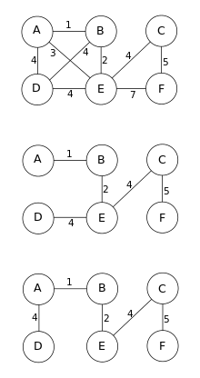
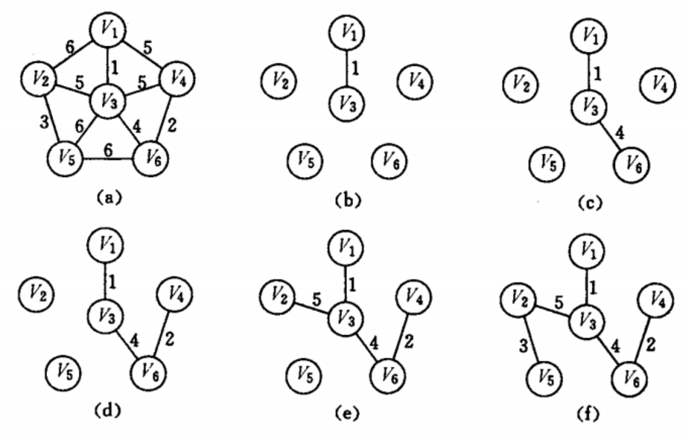

# 最小生成树

最小生成树简单来说是图的最短路径算法，了解之前我们先看看几个图的概念：

+ **连通图：**在无向图中，若任意两个顶点`vi`与`vj`都有路径相通，则称该无向图为连通图。
+ **强连通图：**在有向图中，若任意两个顶点`vi`与`vj`都有路径相通，则称该有向图为强连通图。
+ **连通网：**在连通图中，若图的边具有一定的意义，每一条边都对应着一个数，称为权；权代表着连接连个顶点的代价，称这种连通图叫做连通网。
+ **生成树：**一个连通图的生成树是指一个连通子图，它含有图中全部 `n` 个顶点，但只有足以构成一棵树的 `n-1` 条边。一颗有`n`个顶点的生成树有且仅有``n-1`条边，如果生成树中再添加一条边，则必定成环。

**最小生成树：**在连通网的所有生成树中，所有边的代价和最小的生成树，称为最小生成树。最小生成树其实是**最小权重生成树**的简称。生成树注意是指定的是无向图。


一个连通图可能有多个生成树。当图中的边具有权值时，总会有一个生成树的边的权值之和小于或者等于其它生成树的边的权值之和。广义上而言，对于非连通无向图来说，它的每一[连通分量](https://zh.wikipedia.org/wiki/图论术语)同样有最小生成树，它们的并被称为**最小生成森林**。



### 最小生成树算法：

**Borůvka算法**

第一个用于寻找最小生成树的算法由捷克科学家奥塔卡尔·布卢瓦卡提出，即`Borůvka`算法。

**Prim算法**

Prim算法的每一步都会为一棵生长中的树添加一条边，该树最开始只有一个[顶点](https://zh.wikipedia.org/wiki/顶点_(图论))，然后会添加`v-1`个边。每次总是添加生长中的树和树中除该生长的树以外的部分形成的切分的具有最小权值的横切边。

Prim算法的时间复杂度为`O(E+VlogV)`。

**Kruskal算法**

按照边的权重顺序（从小到大）将边加入生成树中，但是若加入该边会与生成树形成环则不加入该边。直到树中含有`v-1`条边为止。这些边组成的就是该图的最小生成树。

Kruskal算法的时间复杂度为`ElogE`。

## 最小生成树

求解最小生成树之前我们先来看看什么是最小生成树，

- 给定一个带权的无向连通图，如何选取一棵树，使得边上的权值总和最小，这就是最小生成树。
- `N`个顶点，一定有` N - 1` 条边。
- 最小生成树中包含全部顶点。

## Prim算法

`Prim`算法求最小生成树的时候和边数无关，和顶点树有关，所以适合求解稠密网的最小生成树。

### 算法策略

`prim` 算法的步骤如下：

1. 将一个图分为两部分，一部分归为点集`U`，一部分归为点集`V`，`U`的初始集合为`{V1}`，`V`的初始集合为`{ALL-V1}`。

2. 针对`U`开始找`U`中各节点的所有关联的边的权值最小的那个，然后将关联的节点`Vi`加入到`U`中，并且从`V`中删除 (不能形成环)。

3. 递归执行步骤`2`，直到`V`中的集合为空。
4. `U`中所有节点构成的树就是最小生成树。



代码不难写出，其实就是三个循环，最外层循环负责生成最小生成树的边，要生成 `v-1` 条，所以遍历 `v-1`次，第二层循环负责找到目前已访问的节点，第三层循环负责找到目前已访问节点的可连通节点。两个循环配合找到当前的最小可扩展边。

```go
type graph struct {
	vertexs     []interface{}
	triples     [][]int
	vertexCount int
}

func (graph *graph) prim(top int) {
  // 设置访问标记数组
	visited := make([]bool, graph.vertexCount)

	h1 := -1
	h2 := -1
  
  minWeight := MAX_WEIGHT;
	visited[top] = true;
  
	/* 最外层循环负责生成最小生成树的边，要生成 n - 1 条边所以需要遍历 n - 1 次。 */
	for i := 0; i < graph.vertexCount - 1; i++ {
    /* 内层循环负责找到新最短边，如果节点 1 被访问过，节点 2 没有被访问过，说明 1-2 的边可加入测试(尚未加入生成树)。*/
		for j := 0; j < graph.vertexCount; j++ {
      // 找到已访问的节点
      if !visited[j] {
        continue;
      }
			for k := 0; k < graph.vertexCount; k++ {
        // 找到已访问节点对应的可连通节点
				if !visited[k] && graph.triples[j][k] < minWeight {
					h1 = j
					h2 = k
					minWeight = graph.triples[j][k]
				}
			}
		}
		visited[h2] = true
		fmt.Printf("edge：<%s,%s> with weight %d \n", 
               string(graph.vertexs[h1].(rune)), 
               string(graph.vertexs[h2].(rune)), 
               minWeight)
		minWeight = MAX_WEIGHT;
	}
}
```

#### 算法证明

``prim``算法其实原理是贪心算法，证明贪心算法的好方法就是反证法：假设``prim``生成的不是最小生成树

- 设 `prim` 生成的树为 `G0`；
- 假设存在`Gmin`使得 `cost(Gmin)<cost(G0)` 则在 `Gmin` 中存在 `<u,v>` 不属于 `G0`；
- 将 `<u,v>` 加入 `G0` 中可得一个环，且 `<u,v>` 不是该环的最长边(这是因为 `<u,v>∈Gmin`)；
- 这与 `prim` 每次生成最短边矛盾；
- 故假设不成立，命题得证；

## Kruskal算法

``Kruskal` 算法是一种常见并且好写的最小生成树算法，由 `Kruskal` 发明。该算法的基本思想是从小到大加入边，是一个贪心算法，

### 算法策略

`Kruskal` 算法的步骤如下：

1. 新建图`G`，`G`中拥有原图中相同的节点，但没有边；

2. 将原图中所有的边按权值从小到大排序；

3. 从权值最小的边开始，如果这条边连接的两个节点于图`G`中不在同一个连通分量(尚未连通)中，则添加这条边到图`G`中。

   > [注：]()我举个例子比如 `a-c`目前权值最小，但是 `a，c`已经在一个连通分量中(如`a-b-c`)了那就不能添加 `a-c`。

4. 重复`3`，直至图`G`中所有的节点都在同一个连通分量中。

上面步骤中，我们要对权值最小的边的两个端点进行连通性检测，那就避免不了使用另一个性感的数据结构 - 并查集。

那下面这张图举例，算法的过程大概如下：

|                             图例                             |                             说明                             |
| :----------------------------------------------------------: | :----------------------------------------------------------: |
| [](https://zh.wikipedia.org/wiki/File:Kruskal_Algorithm_1.svg) | **AD**和**CE**是最短的两条边，长度为5，其中**AD**被任意选出，以高亮表示。 |
| [](https://zh.wikipedia.org/wiki/File:Kruskal_Algorithm_2.svg) | 现在**CE**是不属于环的最短边，长度为5，因此第二个以高亮表示。 |
| [](https://zh.wikipedia.org/wiki/File:Kruskal_Algorithm_3.svg) |        下一条边是长度为6的**DF**，同样地以高亮表示。         |
| [](https://zh.wikipedia.org/wiki/File:Kruskal_Algorithm_4.svg) | 接下来的最短边是**AB**和**BE**，长度均为7。**AB**被任意选中，并以高亮表示。边**BD**用红色高亮表示，因为**B**和**D**之间已经存在一条（标为绿色的）路径，如果选择它将会构成一个环（**ABD**）。 |
| [](https://zh.wikipedia.org/wiki/File:Kruskal_Algorithm_5.svg) | 以高亮表示下一条最短边**BE**，长度为7。这时更多的边用红色高亮标出：会构成环**BCE**的**BC**、会构成环**DBEA**的**DE**以及会构成环**FEBAD**的**FE**。 |
| [](https://zh.wikipedia.org/wiki/File:Kruskal_Algorithm_6.svg) | 最终，标记长度为9的边**EG**，得到最小生成树，结束算法过程。  |

### 算法代码

在实际代码中，我们首先将这张完全图中的边全部提取到边集数组中，然后对所有边进行排序，从小到大进行枚举，每次贪心选边加入答案。使用并查集维护连通性，若当前边两端不连通即可选择这条边。

```ts
type graph struct {
	vertexs     []interface{}
	triples     [][]int
	vertexCount int
}

func (g *graph) kruskal(top int) int {
  type edge struct{ v, w, dis int }
	edges := []edge{}
  for i := 0; i < g.vertexCount; i++ {
    for j := 0; j < g.vertexCount; j++ {
      if g.triples[i][j] {
        edges = append(edges, edge{i, j, triples[i][j])});
      }
    }
  }
	res := 0
  sort.Slice(edges, func(i, j int) bool { return edges[i].dis < edges[j].dis })
  uf := unionFound.New(n)
	triples := n - 1
	// 总共需要生成 n - 1 条边，避免多余的检测，删掉也不会报错
  for _, e := range edges {
    if uf.connect(e.v, e.w) {
      // 检测连通性
      res += e.dis
      triples--
      uf.union(e.v, e.w)
      // 添加连通性
      if triples == 0 {
        break
      }
    }
  }
	return res;
}
```

平均时间复杂度为`O(|E|log |V|)`，其中`E`和`V`分别是图的边集和点集。

### 算法证明

这样的步骤保证了选取的每条边都是桥，因此图`G`构成一个树。

为什么这一定是最小生成树呢？关键还是步骤`3`中对边的选取。算法中总共选取了`n-1`条边，每条边在选取的当时，都是连接两个不同的连通分量的权值最小的边。

要证明这条边一定属于最小生成树，可以用反证法：如果这条边不在最小生成树中，它连接的两个连通分量最终还是要连起来的，通过其他的连法，那么另一种连法与这条边一定构成了环，而环中一定有一条权值大于这条边的边，用这条边将其替换掉，图仍旧保持连通，但总权值减小了。也就是说，如果不选取这条边，最后构成的生成树的总权值一定不会是最小的。

