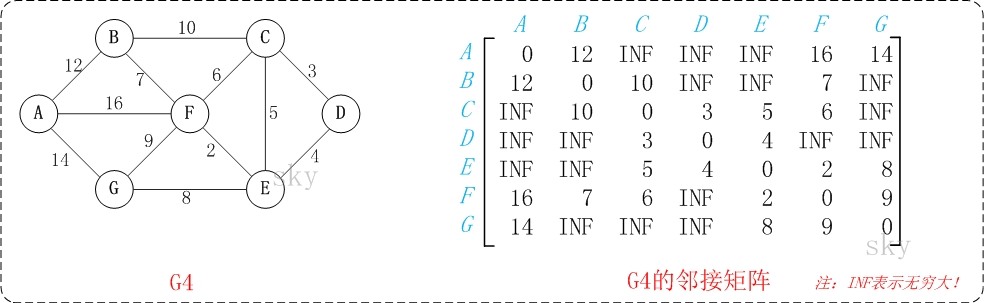

# Floyd

`Floyd` 算法又称为插点法，是一种利用[动态规划](https://baike.baidu.com/item/动态规划/529408)的思想寻找给定的[加权图](https://baike.baidu.com/item/加权图/10579361)中多源点之间[最短路径](https://baike.baidu.com/item/最短路径/6334920)的算法，`floyd`可以通过一个图的权值[矩阵](https://baike.baidu.com/item/矩阵)求出它的任意(所有)两点间的[最短路径](https://baike.baidu.com/item/最短路径)矩阵。

## 算法策略

`Floyd`算法又称为插点法，是一种利用[动态规划](https://baike.baidu.com/item/动态规划/529408)的思想寻找给定的[加权图](https://baike.baidu.com/item/加权图/10579361)中多源点之间[最短路径](https://baike.baidu.com/item/最短路径/6334920)的算法。

[状态转移方程](https://baike.baidu.com/item/状态转移方程)如下：

```go
 map[i,j]: = min{map[i,k] + map[k,j], map[i,j]}；
```

`map[i,j]`表示`i`到`j`的最短距离，`K`是穷举`i,j`的[断点](https://baike.baidu.com/item/断点)，`map[n,n]`初值应该为`0`。

当然，如果这条路没有通的话，还必须特殊处理，比如没有`map[i,k]`这条路。

这么说可能不是很好理解动态规划的迭代过程，我们举个例子画图观察这个流程：



以上图`G4`为例，来对弗洛伊德进行算法演示。


## 算法实现

要实现这个算法，首先我们维护两个矩阵来储存节点之间的最短距离和对应的路径：

```go
type graph struct {
	vertexs     []interface{}
	vertexCount int

	dis [][]int    // 存储所有 x -> y 最短距离
	pre [][]*[]int    // 存储所有 x -> y 最短路径的上一个节点
}
```

举个例子，初始化时`dis`距离就是每条边的距离，`pre`中比如`AB`的已访问路径就是`A（不包括B）`：

```shell
	# dis							# pre
	A B C D E F G		  A B C D E F G
A ∆	5	7	∆	∆	∆	2		A	A A G A A A A
B 5	∆	∆	9	∆	∆	3		B	B B B B B B B
C 7	∆	∆	∆	8	∆	∆		C	C C C C C C C
D ∆	9	∆	∆	∆	4	∆		D	D D D D D D D
E ∆	∆	8	∆	∆	5	4		E	E E E E E E E
F ∆	∆	∆	4	5	∆	6		F	F F F F F F F
G 2	3	∆	∆	4	6	∆		G	G G G G G G G
```

那么初始化的代码如下，其实就是按照上面的规则初始化 `dis` 和 `pre` 两个数组，没什么难度：

```go
const INF int = 0x0000ffff
// INF means unreachable;
func new(v int, triples [][]int) *graph {	
  // v represents vertex`s count;
	start := 'a';
	vertexs := make([]interface{}, 0);
	for i := 0; i < v; i++ {
		cur := int(start) + i
		vertexs = append(vertexs, rune(cur))
    // generate vertexs (a, b, c, d....);
	}
  // generate n*n status matrix: pre & dis;
	pre := make([][]int, v)
  dis := make([][]*[]int, v)
	for i := 0; i < v; i++ {
		pre[i] = make([]int, v)
    dis[i] = make([]*[]int, v)
	}
	// set initial val for pre and dis;
	for i := 0; i < v; i++ {
		for j := 0; j < v; j++ {
      // set j for pre;
      tmp := make([]int, 1)
      tmp[0] = i
      pre[i][j] = &tmp
      dis[i][j] = triple[i][j] ? triple[i][j] : INF; 
      // fake code, no ? : in golang;
		}
	}

	return &graph{
		vertexCount: v,
		vertexs:     vertexs,
		dis:         dis,
		pre:         pre,
	}
}
```

具体执行的过程中，我们对于每一个节点，我们都进行一次三重循环，维护指针。第一个循环：**遍历所有连通点**、第二个循环：**遍历所有起点**、第三个循环：**遍历所有终点**。

通过三个循环我们遍历所有以 `k` 为连通点 `i` 到 `j` 的最小距离，并且对`dis、pre`数组进行更新：

```go
func (g *graph) floyd() {
	minDis := 0

	for k := 0; k < g.vertexCount; k++ {
		for i := 0; i < g.vertexCount; i++ {
			for j := 0; j < g.vertexCount; j++ {
				minDis = g.dis[i][k] + g.dis[k][j]
				if i != j && minDis < g.dis[i][j] {
          g.pre[i][j] = append(*g.pre[i][j], k)
					g.dis[i][j] = minDis
				}
			}
		}
	}
}
```

最后来看看上面那组示例的运行结果：

```go
// pre数组
∆		5		7		12	6		8		2	
5		∆		12	9		7		9		3	
7		12	∆		17	8		13	9	
12	9		17	∆		9		4		10	
6		7		8		9		∆		5		4	
8		9		13	4		5		∆		6	
2		3		9		10	4		6		∆		
// dis数组
a->a				a->b					a->c				a->b->g->d	a->c->g->e		a->d->g->f	a->g	
b->a				b->b					b->a->c			b->d				b->c->f->g->e	b->d->g->f	b->g	
c->a				c->a->b				c->c				c->b->f->d	c->e					c->d->e->f	c->a->g	
d->b->g->a	d->b					d->b->f->c	d->d				d->c->f->e		d->f				d->b->f->g	
e->c->g->a	e->c->f->g->b	e->c				e->c->f->d	e->e					e->f				e->g	
f->d->g->a	f->d->g->b		f->d->e->c	f->d				f->e					f->f				f->g	
g->a				g->b					g->a->c			g->b->f->d	g->e					g->f				g->g	
```

