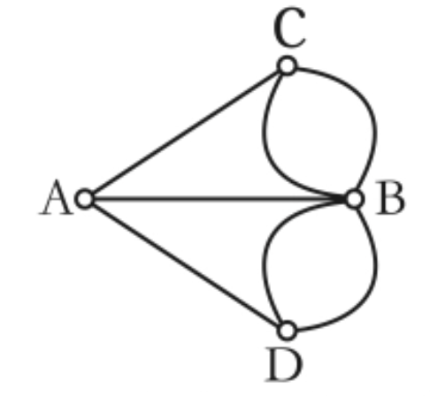

# 欧拉图

欧拉图是指通过图（无向图或有向图）中所有边且每边仅通过一次通路，相应的回路称为欧拉回路。 具有欧拉回路的图称为欧拉图 (`Euler Graph`)。

欧拉图最早是数学家欧拉在研究著名的德国哥尼斯堡`(Koenigsberg)`七桥问题时发现的。如图`1`所示，流经哥尼斯堡的普雷格尔河中有两个岛，两个岛与两岸共`4`处陆地通过`7`座杨 彼此相联。

`7`桥问题就是如何能从任一处陆地出发，经过且经过每个桥一次后回到原出发点。


## 欧拉路径

图 `G ` (有向图或者无向图) 中，通过所有边恰好一次且行遍所有顶点的通路称为**欧拉通路**。

图 `G` 中，通过所有边恰好一次且行遍所有顶点的回路称为**欧拉回路**。

欧拉回路和欧拉通路统称**欧拉路径**，欧拉路径有的时候也被称为**欧拉迹**，**欧拉开迹**对应欧拉通路，**欧拉闭迹**对应欧拉回路。

具有**欧拉回路**的图称为**欧拉图** (简称 `E` 图)。具有**欧拉通路**但不具有**欧拉回路**的图称为**半欧拉图**。

## 定理及推论

欧拉通路和欧拉回路的判定是很简单的，请看下面的定理及推论。

**定理1：无向图G存在欧拉通路的充要条件是：**

`G`为连通图，并且`G`仅有两个奇度结点（度数为奇数的顶点）或者无奇度结点。

**推论1：**

1. 当`G`是仅有两个奇度结点的连通图时，`G`的欧拉通路必以此两个结点为端点。
2. 当`G`是无奇度结点的连通图时，`G`必有欧拉回路。
3. `G`为欧拉图（存在欧拉回路）的充分必要条件是`G`为无奇度结点的连通图。

**定理2：有向图D存在欧拉通路的充要条件是：**

`D`为有向图，`D`的**基图连通**，并且所有顶点的出度与入度都相等；或者除两个顶点外，其余顶点的出度与入度都相等，而这两个顶点中一个顶点的出度与入度之差为`1`，另一个顶点的出度与入度之差为`-1`。

**推论2：**

1. 当`D`除出、入度之差为`1`，`-1`的两个顶点之外，其余顶点的出度与入度都相等时，`D`的有向欧拉通路必以出、入度之差为`1`的顶点作为始点，以出、入度之差为`-1`的顶点作为终点。
2. 当`D`的所有顶点的出、入度都相等时，`D`中存在有向欧拉回路。
3. 有向图`D`为有向欧拉图的充分必要条件是`D`的基图为连通图，并且所有顶点的出、入度都相等。

## 判断存在性

根据定理和推论，我们可以很好的找到欧拉通路回路的判断方法，定理和推论是离散数学的内容，这里就给出简明的判断方法：

**A.判断欧拉通路是否存在的方法**

+ 有向图：图连通，有一个顶点出度大入度1，有一个顶点入度大出度1，其余都是出度=入度。

+ 无向图：图连通，只有两个顶点是奇数度，其余都是偶数度的。

**B.判断欧拉回路是否存在的方法**

+ 有向图：图连通，所有的顶点出度=入度。
+ 无向图：图连通，所有顶点都是偶数度。

**哥尼斯堡七桥问题**

现在我们再回到一开始的七桥问题，我们将现实地图转换为抽象的数学模型：



我们可以很轻易的发现顶点 `A`、`D`、`C`、`B` 都是奇度顶点，很明显不符合无向图欧拉回路或者通路的存在条件，所以说七桥问题从一开始就是无解的。

判断欧拉路径是否存在的算法比较简单，先判断连通性，在计算每个节点的度数/出入度数就好了。我们一般遇到的关于欧拉路径的算法题都是求取已知欧拉图/半欧拉图中的欧拉路径。

## Hierholzer 算法

`Hierholzer`算法用于在连通图寻找欧拉路径(注意连通图是已知条件，一般题目中会说明图中必定存在一条欧拉路径，而我们需要做的就是求出这条路径。)，其流程非常简单。

 从一个可能的起点出发，进行深度优先搜索，但是每次沿着辅助边从某个顶点移动到另外一个顶点的时候，都需要删除这个辅助边。如果没有可移动的路径，则将所在结点加入到栈中，并返回。

```ts
let res = [];
let dfs: (from: string) => void = (from: string) => {
  while (true) {
    if (!map.has(from) || map.get(from).length) break;
    let nxt = map.get(from).shift();
    dfs(nxt);
  }

  res.push(from);
};
dfs(start);
```

最后得到的栈中保存的就是整个欧拉路径中的顶点，要拿到这个路径我们需要不断出栈，因此如果你用列表来存欧垃路径的话需要反转一次。

最后如果想知道我们拿到的是欧拉通路还是欧拉环只需要判断一下路径中第一个节点和最后一个节点是否相同就可以了。

### 算法证明

让我们来验证一下算法的正确性：

**命题1：如果图满足上面的校验条件，那么Hierholzer算法处理图一定能得到欧拉轨迹。**

首先由于图的连通性，因此所有顶点都会被遍历到，因为每次遍历我们都会删除边故而每条边也都会被正好遍历到一次。

同时由于每次返回时才将顶点记录到欧拉路径中，因此顶点之间具有*连贯性*，即欧拉迹中出现的相邻顶点都对应有一条边独一无二的边存在。结合着两条性质，就可以保证得到的是欧垃路径了。

### 算法推论

**推论1：如果我们每次都贪心取编号最小的顶点，那么得到的欧拉迹是所有欧拉迹中编号字典序最小的。**

由字典序的比较性质可以直接推出结论。

#### [Leetcode 332.重新安排行程](https://leetcode-cn.com/problems/reconstruct-itinerary/)

给你一份航线列表 ``tickets`` ，其中 ``tickets``[``i``] ``=`` [``fromi, toi``] 表示飞机出发和降落的机场地点。请你对该行程进行重新规划排序。

所有这些机票都属于一个从 ``JFK``（肯尼迪国际机场）出发的先生，所以该行程必须从 ``JFK`` 开始。如果存在多种有效的行程，请你按字典排序返回最小的行程组合。

例如，行程 ["``JFK``", "``LGA``"] 与 ["``JFK``", "``LGB``"] 相比就更小，排序更靠前。

假定所有机票至少存在一种合理的行程。且所有的机票 必须都用一次 且 只能用一次。

**示例 ：**


```ts
输入：tickets = [["JFK","SFO"],["JFK","ATL"],["SFO","ATL"],["ATL","JFK"],["ATL","SFO"]]
输出：["JFK","ATL","JFK","SFO","ATL","SFO"]
解释：另一种有效的行程是 ["JFK","SFO","ATL","JFK","ATL","SFO"] ，但是它字典排序更大更靠后。
```

**算法策略**

这道题的整体思路就是以 `JFK` 为起始点寻找欧拉路径，只不过得到的欧拉路径要求字典编号最小。

根据我们之前的到的推论，我们可以通过邻接矩阵并且对边进行排序来获得一个字典序的临边遍历顺序，这样就能保证得到的欧拉迹是所有欧拉迹中编号字典序最小的。

```ts
function findItinerary(tickets: [string, string][]): string[] {
    let map = new Map<string, string[]>();

    for (let [from, to] of tickets) {
        if (map.has(from)) {
            map.get(from)!.push(to);
        } else {
            map.set(from, [to]);
        }
    }

    for (let key of map.keys()) {
        map.get(key)!.sort();
    }

    let res: string[] = [];
    let dfs: (from: string) => void = (from: string) => {
        while (true) {
            if (!map.has(from) || !map.get(from)!.length) break;
          	let nxt = map.get(from)!.shift() as string;
            dfs(nxt);
        }

        res.push(from);
    };

    dfs('JFK');
    return res.reverse();
}
```

#### [Leetcode 753. 破解保险箱](https://leetcode-cn.com/problems/cracking-the-safe/)

有一个需要密码才能打开的保险箱。密码是 `n` 位数, 密码的每一位是 `k` 位序列 `0, 1, ..., k-1` 中的一个 。

你可以随意输入密码，保险箱会自动记住最后 `n` 位输入，如果匹配，则能够打开保险箱。举个例子，假设密码是 "`345`"，你可以输入 "`012345`" 来打开它，只是你输入了 `6` 个字符.

请返回一个能打开保险箱的最短字符串。

**示例：**

```ts
输入: n = 2, k = 2
输出: "00110"
说明: "00", "11", "01", "10" 也能打开保险箱。
```

**算法策略**

对于题目，我们来举个例子，如果 `n=3，k=2`，那么可能的密码是 `101`，题目所说的，会记忆后 `n` 位输入，就是说如果密码 `3` 位，我们可以输入 `10` 位甚至 `20` 位，只要把我们的输入当成一个队列，每次弹出队首数字，然后核验现在的前`n`位是否符合。

对于 `n=3, k=2`，我们可以输入 `000 001 010 100 011 101 110 111` (为了好看每三位隔开了)，显然这串数其中必定含有密码。因为我们枚举了所有可能串。

但是也显然，这绝对不是最短的那个数字串，因为没有利用这个保险箱的特性——记忆`n`位。

就像是 `000 001` 这一串，`001`可以说是重新输入的，其实就可以简化成 `0001`，效果是一样的。

所以这个问题就变成了：**如何在一个最短的串内枚举 `n` 位 `k` 进制数的所有排列。**其实这个问题是一个在数学中早已被研究透彻的问题了，这种序列称之为 **de Bruijn序列**。

对于这道题我们需要使用 `Hierholzer` 算法来求取序列，不过这题真正的难点在于如何构建图来抽象数字和数字串之间的关系。其实构思的方向不过几种：

1. 用单个数字为顶点，用数字串为边
2. 用数字串为顶点，用数字为边
3. 用数字串为顶点和边
4. 用数字为顶点和边

显然第四种方向是不行的。

第一种方向的问题就在于，两个顶点之间有巨多边，难以枚举，更难以储存(或者说难以判断是否遍历过)。第二种方向其实是有一定可行性的，但是比不上第三种方向好写代码，问题也是类似的，就是边的储存。

现在说说，第三种方向具体要怎么实现：

抽象地来说，以所有 `n-1`位`k`进制数字串 为顶点，然后符合要求的 `n`为`k`进制数字串 为边。

具体说说，例如 `n=5` , `k=7`。其中的一个顶点可以是 `0000`，然后和这个顶点相连的七条边分别是：

`00000、00001、00002、00003、00004、00005、00006`，然后 `0000` 这个顶点可以通过 `00001` 这条边连到 `0001` 顶点。这样我们就复用了 `0000` 的后三位，加上 `1` 就是一共 `4` 位记忆数字。

在这个思路上，每条边所代表的数字串都是可能的密码。那么，在这个基础上，如果我们找到一条欧拉路径，也就是说这条路径囊括了**所有数字串的组合**，并且是最短的。

**算法实现**

对应具体的操作上，这种构思有着非常妙的实现方式。首先，根据性质，这个图中每个顶点都必定是入度为`k`出度为`k`。也就是说这是一个欧拉环，所以任选一个顶点为起点即可，那为了方便就选 `n` 位零串(`0...0`)为起点。

然后你会发现一件事，就是处理这幅图，并不需要储存顶点和边，**因为和当前顶点相连的边以及顶点，可以通过当前顶点代表的数字串推断出来。**

唯一比较麻烦的就是，在实现 `Hierholzer` 算法 的时候，要删边。也就是我们需要判断边有没有走过。这并不难使用一个 `hashmap` 存储一下就好了。

```ts
function crackSafe(n: number, k: number): string {
    let visited = new Set<string>();
    let res: string = '';
    const dfs: (cur: string) => void = (cur: string) => {
        for (let i = 0; i < k; i++) {
            let triple = cur + i;
            if (!visited.has(triple)) {
                visited.add(triple);
                dfs(triple.slice(1));
                res += i;
            }
        }

    }
	
    dfs(new Array(n).fill(0).join());
    return res;
};
```

