# 拒绝采样

在数学中，拒绝抽样是用来从分布产生观测值的基本技术。它也被称为接受拒绝方法或“接受 - 拒绝算法”，是一种蒙特卡罗方法。这段解释对于程序员来说或许太过严格，其实简单算法应用中的拒绝采样就是拒绝分布中的一部分值来生成期望的值。

原谅我蹩脚的解释，让我们直接从一道例题开始：

## 用 `Rand7` 实现 `Rand10`

已有方法 `rand7` 可生成 1 到 7 范围内的均匀随机整数，试写一个方法 `rand10` 生成 1 到 10 范围内的均匀随机整数。

**思考**

+ `rand7()`调用次数的 期望值 是多少 ?
+ 你能否尽量少调用 `rand7() `?

### 算法策略

我们已有 `rand7()` 等概率生成了 [`1, 7`] 中的数字，我们需要等概率生成 [`1, 10`] 范围内的数字。第一反应是调用一次`rand7()` 肯定是不够的，因为覆盖的范围不够。那么，就需要至少`2`次调用 `rand7()` 才能生成一次 `rand10()`，但是还要保证 [`1, 10`] 的数字生成概率相等，这个是难点。

现在我们先来考虑反问题，给定`rand10()` 生成 `rand7()`。这个应该很简单，调用一次 `rand10()` 得到 [`1, 10`]，如果是 `8, 9, 10` ，则丢弃，重新开始，否则返回。想必大家都能想到这个朴素的方法，这种思想就是统计模拟中的拒绝采样（`Reject Sampling`）。

有了上面反问题的思考，我们可能会想到，`rand7()` 可以生成 `rand5()`，覆盖 [`1, 5`]的范围，如果将区间 [`1, 10`] 分成两个`5`个值的区间 [`1, 5`] 和 [`6, 10`]，那么 `rand7()` 可以通过先等概率选择区间 [`1, 5`] 或 [`6, 10`]，再通过`rand7()` 生成 `rand5()`就可以了。这个问题就等价于先用 `rand7()` 生成 `rand2()`，决定了 [`1, 5`] 还是 [`6, 10`]，再通过`rand7()` 生成 `rand5()` 。

#### 解法一：`rand2` + `rand5`

我们来实现这种解法。下图为调用两次 `rand7()`  生成 `rand10` 数值的映射关系：横轴表示第一次调用，`1`，`2`，`3`决定选择区间 [`1, 5`] ，`4`，`5`，`6`选择区间 [`6, 10`]。灰色部分表示结果丢弃，重新开始 （注，若第一次得到`7`无需再次调用 `rand7()`）。

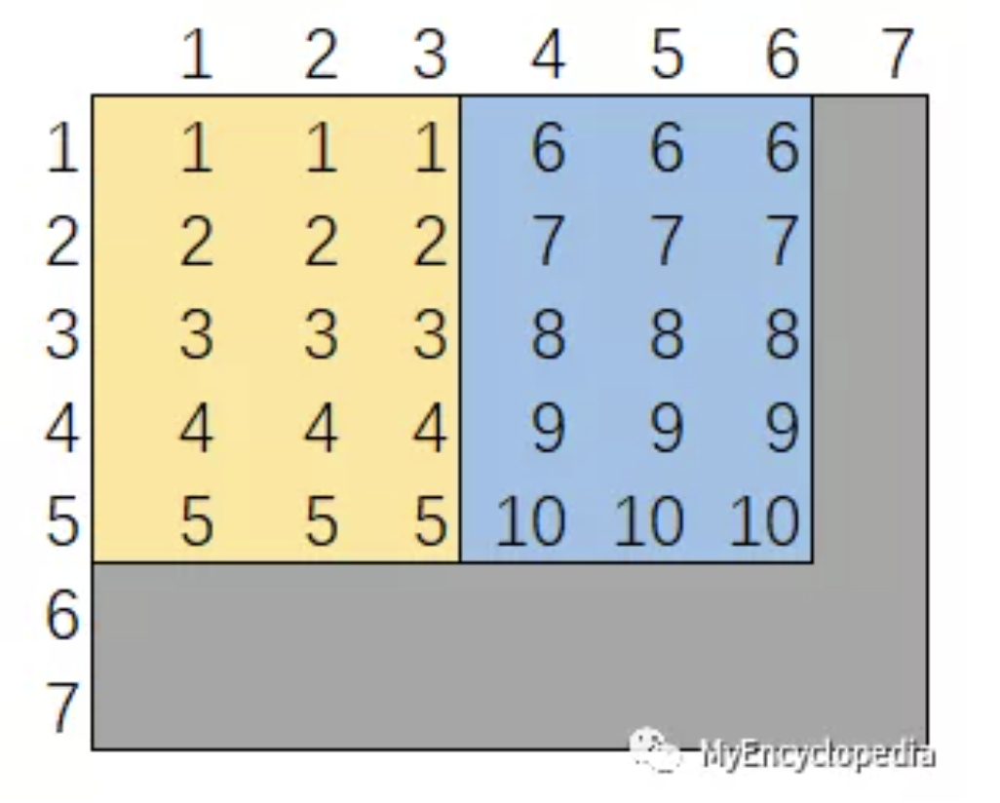

有了上图，我们很容易写出如下 `AC` 代码：

```python
# AC
# Runtime: 408 ms, faster than 23.80% of Python3 online submissions for Implement Rand10() Using Rand7().
# Memory Usage: 16.7 MB, less than 90.76% of Python3 online submissions for Implement Rand10() Using Rand7().
class Solution:
    def rand10(self):
        while True:
            a = rand7()
            if a <= 3:
                b = rand7()
                if b <= 5:
                    return b
            elif a <= 6:
                b = rand7()
                if b <= 5:
                    return b + 5
```

#### 解法二：`rand7` + `rand7`

从提交的结果来看，第一种解法慢于多数解法。原因是我们的调用 `rand7()` 的采样效率比较低，第一次有 `1/7` 的概率结果丢弃，第二次有 `2/7`的概率被丢弃。

如何在第一种解法的基础上提高采样效率呢？直觉告诉我们一种做法是降低上述 `7x7` 表格中灰色格子的面积。此时，会想到我们通过两次 `rand7()` 已经构建出来 `rand49()`了，那么再生成 `rand10()` 也规约成基本问题了。

下图为 `rand49()` 和 `rand10()` 的数字对应关系：

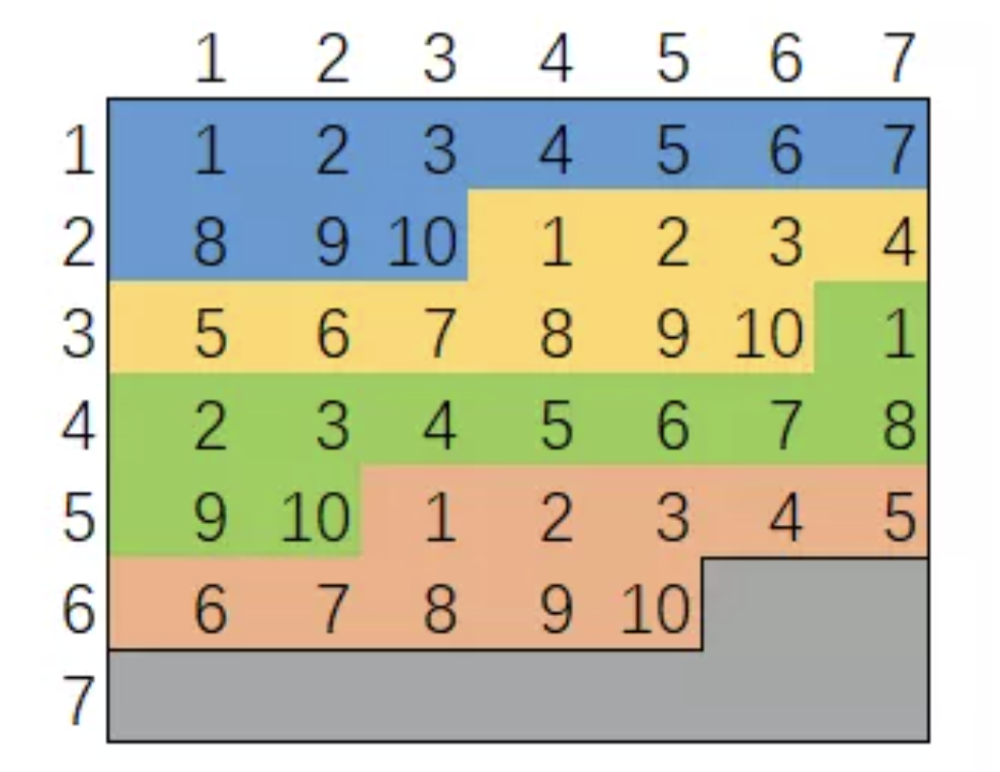

实现代码比较简单。注意，`while True`可以去掉，用递归来代替。

```python
# AC
# Runtime: 376 ms, faster than 54.71% of Python3 online submissions for Implement Rand10() Using Rand7().
# Memory Usage: 16.9 MB, less than 38.54% of Python3 online submissions for Implement Rand10() Using Rand7().
class Solution:
    def rand10(self):
        while True:
            a, b = rand7(),  rand7()
            num = (a - 1) * 7 + b
            if num <= 40:
                return num % 10 + 1
```

#### 优化

观察发现，`rand49()` 有 `9/49` 的概率，生成的值被丢弃，原因是 [`41, 49`] 只有 `9` 个数，不足`10`个。倘若此时能够将这种状态保持下去，那么只需再调用一次 `rand7()` 而不是从新开始情况下至少调用两次 `rand7()`。


也就是说，当 `rand49()` 生成了 [`41, 49`] 范围内的数的话等价于我们先调用了一次 `rand9()`，那么依样画葫芦，我们接着调用 `rand7()` 得到了 `rand63()`。

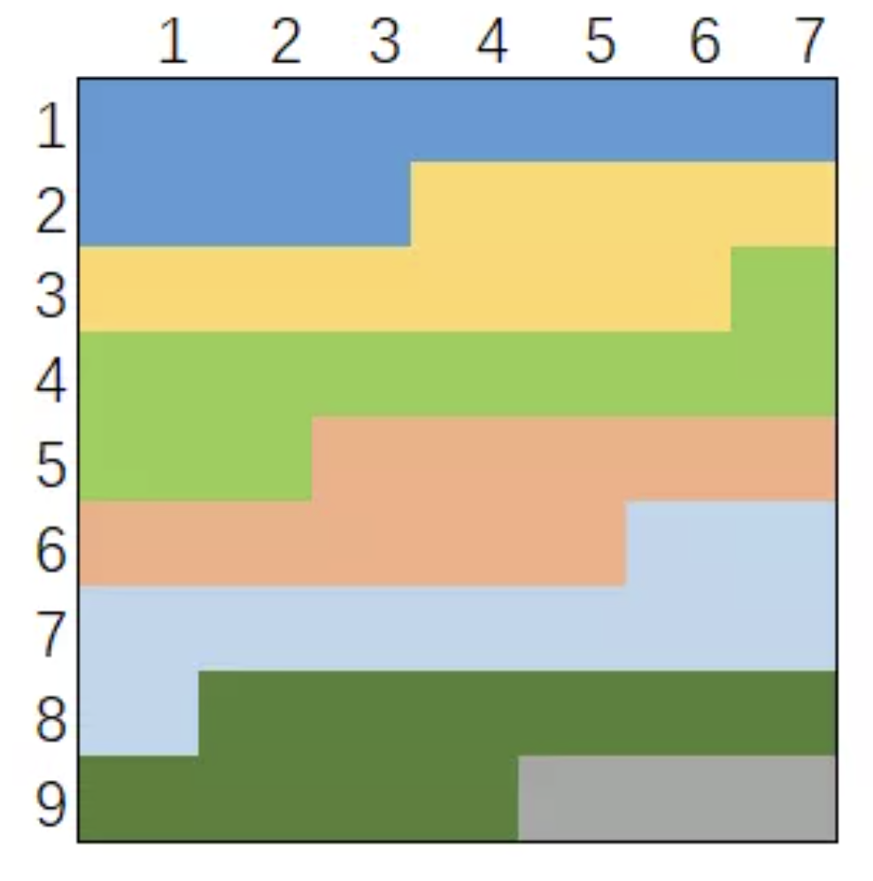

如果还没采样成功，`63` 分成了`6`个`10`个值的区间后，剩余 `3` 个数。此时，又等价于 `rand3()`，循环往复，调用了 `rand7()` 得到了 `rand21()`，最后若`rand21()` 不幸得到`21`，等价于 `rand1()`，`rand1()` 和 `rand7()`凑不成 `rand10` 只能重新进入循环。

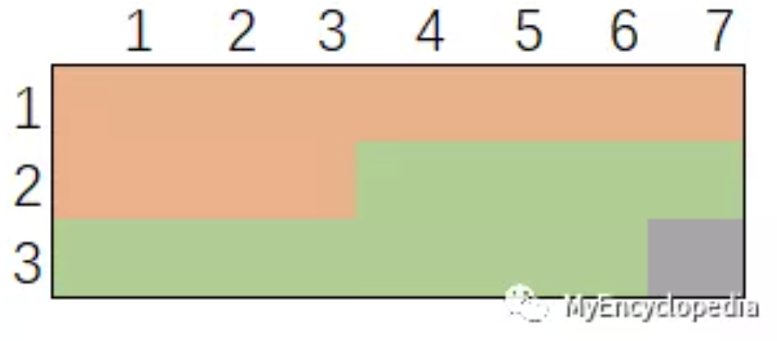

改进算法代码如下：

```python
# AC
# Runtime: 344 ms, faster than 92.72% of Python3 online submissions for Implement Rand10() Using Rand7().
# Memory Usage: 16.7 MB, less than 90.76% of Python3 online submissions for Implement Rand10() Using Rand7().
class Solution:
    def rand10(self):
        while True:
            a, b = rand7(),  rand7()
            num = (a - 1) * 7 + b
            if num <= 40: return num % 10 + 1
            a = num - 40
            b = rand7()
            num = (a - 1) * 7 + b
            if num <= 60: return num % 10 + 1
            a = num - 60
            b = rand7()
            num = (a - 1) * 7 + b
            if num <= 20: return num % 10 + 1
```

#### 为什么不是相加

假设已知`rand2()`可以均匀的生成[`1,2`]的随机数，现在想均匀的生成[`1,4`]的随机数，该如何考虑？

我想如果你也像我一样第一次接触这个问题，那么很可能会这么考虑——令两个`rand2()`相加，再做一些必要的边角处理。如下，这里我明确的说相加是不行的，可是为什么？

```ts
rand2() + rand2() = ? ==> [2,4]
   1    +   1     = 2
   1    +   2     = 3
   2    +   1     = 3
   2    +   2     = 4

// 为了把生成随机数的范围规约成[1,n]，于是在上一步的结果后减1
(rand2()-1) + rand2() = ? ==> [1,3]
   0       +   1     = 1
   0       +   2     = 2
   1       +   1     = 2
   1       +   2     = 3
```

可以看到，使用这种方法处理的结果，最致命的点在于——其生成的结果不是等概率的。在这个简单的例子中，产生`2`的概率是`50%`，而产生`1`和`3`的概率则分别是`25%`。原因当然也很好理解，由于某些值会有多种组合，因此仅靠简单的相加处理会导致结果不是等概率的。

### 采样效率计算

计算采样效率，即计算 `rand7` 调用次数的期望，我们可以通过代码绘制状态转换图来计算：

例如，解法二可以对应到下图：初始状态 `Start` 节点中的 `+2` 表示经过此节点会产生 `2`次 `rand7()` 的代价。从 `Start` 节点有 `40/49` 的概率到达被接受状态 `AC`，有 `9/49` 概率到达拒绝状态 `REJ`。`REJ` 需要从头开始，则用虚线表示重新回到 `Start`节点，也就是说 `REJ` 的代价等价于 `Start`。

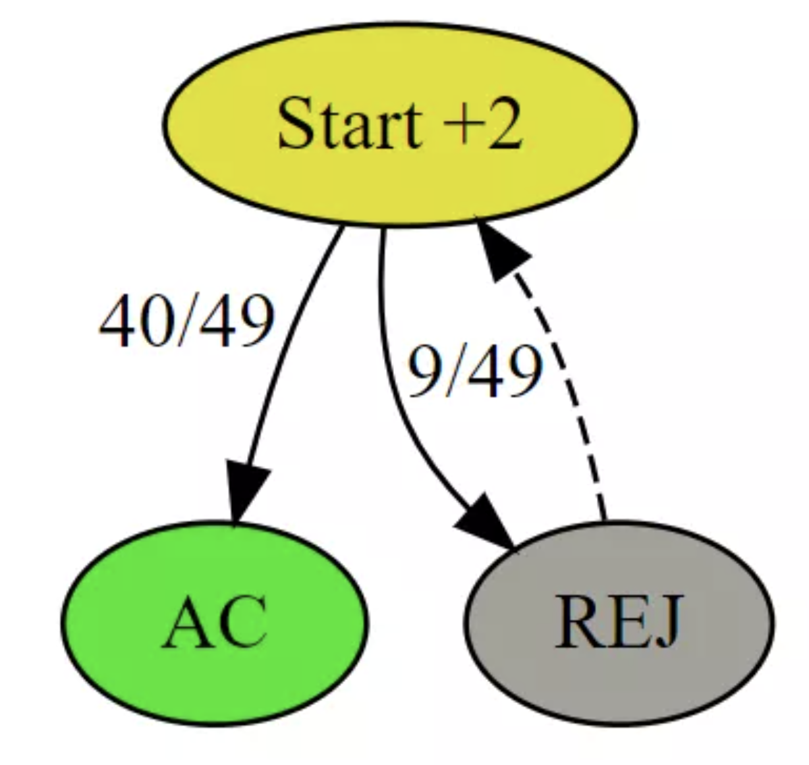

有了上述状态转移关系图，我们令初始状态的平均代价为 `C_2` ，则可以写成递归表达式，因为其中 REJ 的代价就是 `C_2`，即：

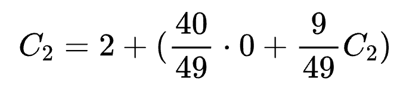

解得 `C_2`即期望 `E`：

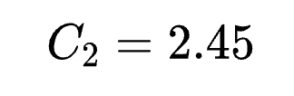

#### 优化之后的期望

最快的解法三状态转移图为：

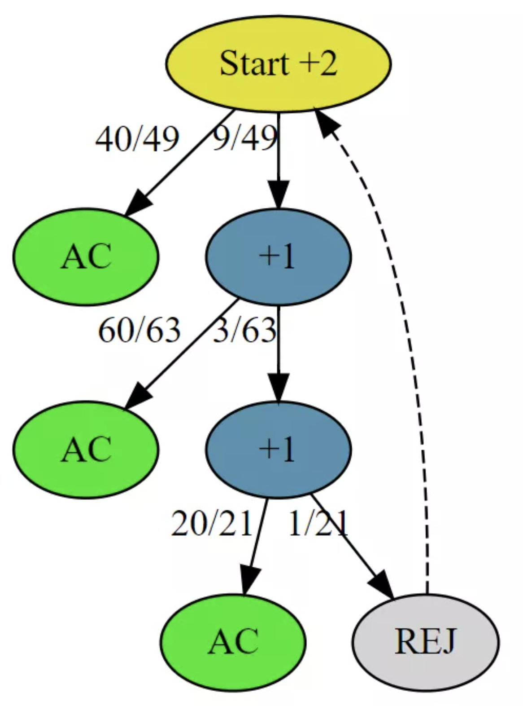

递归方程表达式为：

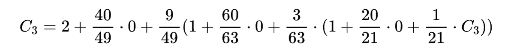

解得 `C_3`：

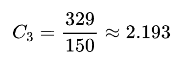

## 在圆内随机生成点

给定圆的半径和圆心的 `x`、`y` 坐标，写一个在圆中产生均匀随机点的函数 `randPoint` 。

**说明:**

+ 输入值和输出值都将是浮点数。
+ 圆的半径和圆心的 ``x``、``y`` 坐标将作为参数传递给类的构造函数。
+ 圆周上的点也认为是在圆中。
+ ``randPoint`` 返回一个包含随机点的``x``坐标和``y``坐标的大小为``2``的数组。

### 算法策略

为了在一个半径为 `R` 的圆 `C` 中均匀随机生成点，我们可以使用拒绝采样的方法。

我们使用一个边长为 `2R` 的正方形覆盖住圆 `C`，并在正方形内随机生成点，若该点落在圆内，我们就返回这个点，否则我们拒绝这个点，重新生成知道新的随机点落在圆内。

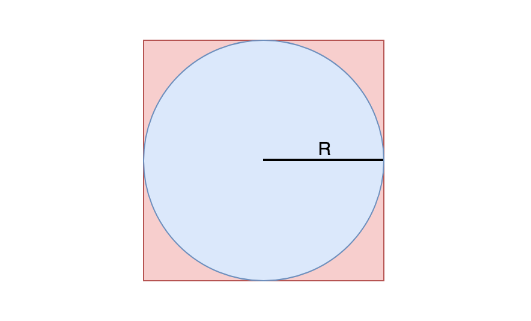

其实在正方形中随机生成点的代码还是有一定技巧性的，首先 `Math.random() * 2 * radius` 可以生成 `[0, 2R]` 范围内的随机数，然后减去 `R`  就可以生成 `[-R, R]` 范围内的随机数，注意这样生成的点没有考虑圆心的位置，最后还需要加上圆心的偏移：

```ts
function randPoint(radius: number, x_center: number, y_center: number): number[] {
  let x_rand = 0,
      y_rand = 0;

  while (true) {
    x_rand = Math.random() * 2 * radius - radius;
    y_rand = Math.random() * 2 * radius - radius;
    if (x_rand ** 2 + y_rand ** 2 <= radius ** 2) {
      return [x_rand + x_center, y_rand + y_center];
    }
  }
}
```

### 期望计算

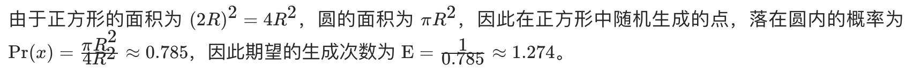

