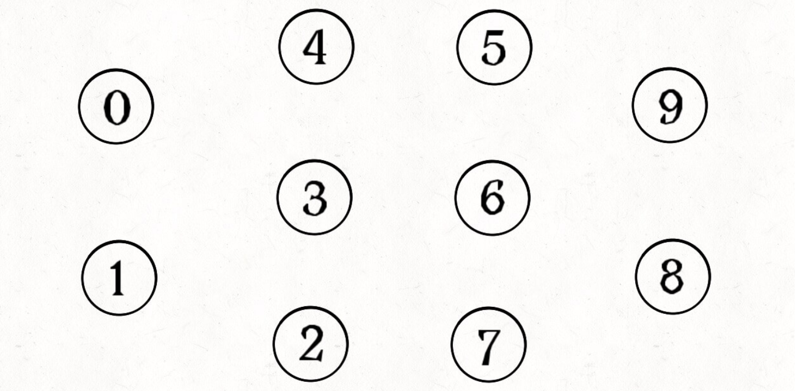
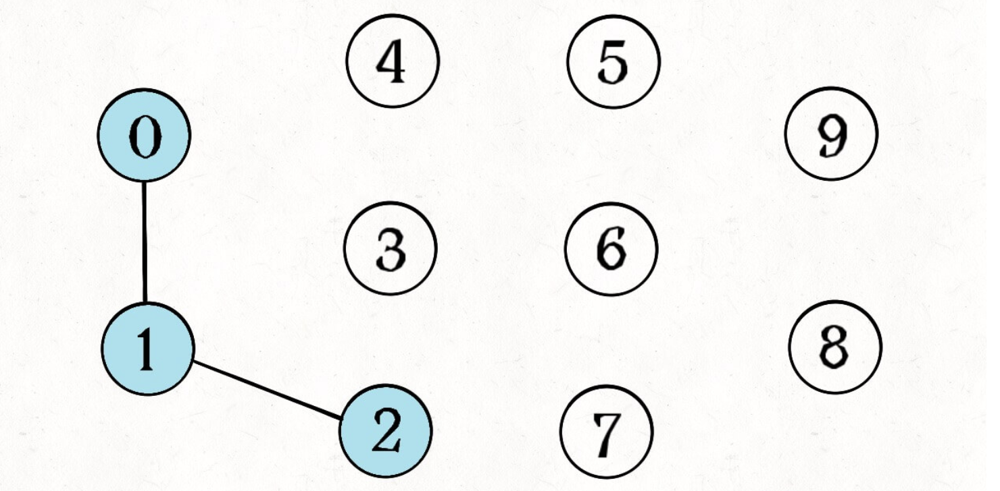
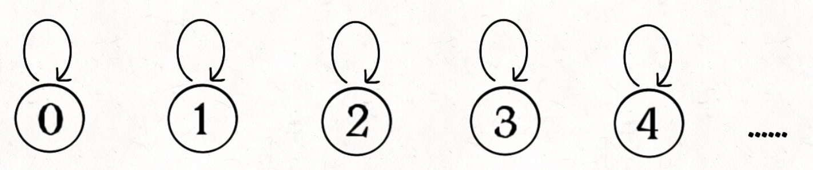
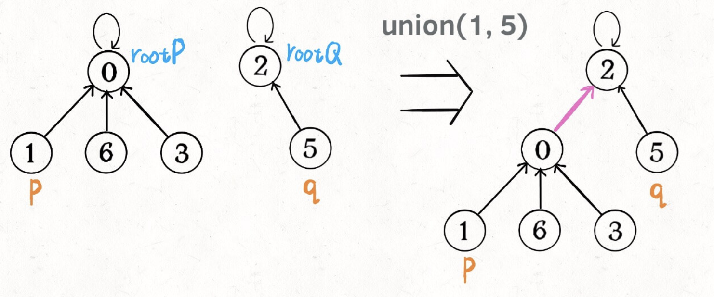
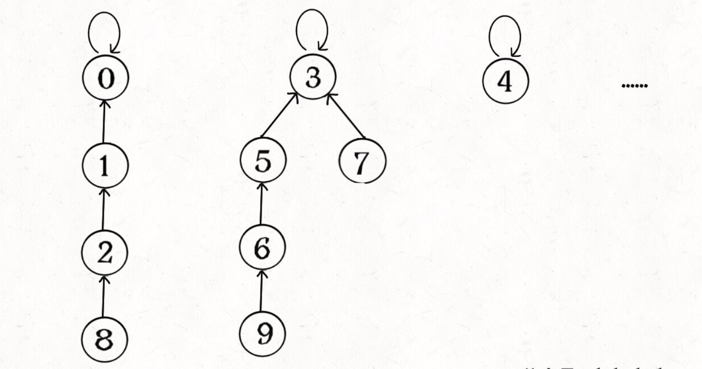
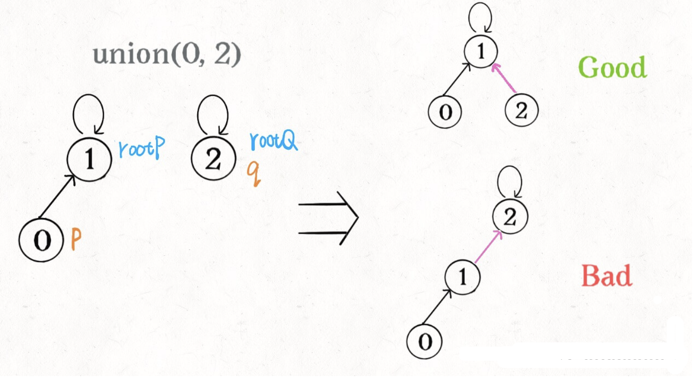
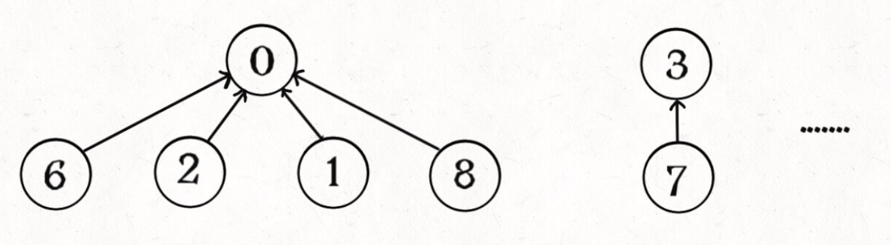

# Union-Find

在[计算机科学](https://zh.wikipedia.org/wiki/计算机科学)中，**并查集**（英文：`Disjoint-set data structure`，直译为不交集数据结构）是一种[数据结构](https://zh.wikipedia.org/wiki/数据结构)，用于处理一些[不交集](https://zh.wikipedia.org/wiki/不交集)（`Disjoint sets`，一系列没有重复元素的集合）的合并及查询问题。并查集支持如下操作：

+ **查询：**查询某个元素属于哪个集合，通常是返回集合内的一个“代表元素”。这个操作是为了判断两元素是否在同一个集合中。
+ **合并：**将两个集合合并为一个。
+ *添加*：添加一个新集合，其中有一个新元素。添加操作不如查询和合并操作重要，常常被忽略。

并查集可以用来指代任何支持上述操作的数据结构，但是一般来说，并查集特指其中最常见的一种实现：**不交集森林**(`Disjoint-set forest`)。所以说有的时候并查集数据结构被写成 `DisjointSet`有的时候被写成`UnionFind` 两者其实属于同一集合，前者是后者的一种实现。

> [Tips]() 我们维护所有交集元素，就相当于维护了不交集，所以并查集可以称做不交集数据结构。

`Union-Find` 算法主要是解决图论中「动态连通性」问题的，简单说，动态连通性其实可以抽象成给一幅图连线。比如下面这幅图，总共有 `10` 个节点，他们互不相连，分别用 `0~9` 标记：



现在我们的 `Union-Find` 算法主要需要实现这两个 `API`：

```ts
interface UF {
    union(p: number, q: number): void;
    connected(p: number, q: number): boolean;
    count(): number;
}
```

这里所说的「连通」是一种等价关系，也就是说具有如下三个性质：

1、自反性：节点`p`和`p`是连通的。

2、对称性：如果节点`p`和`q`连通，那么`q`和`p`也连通。

3、传递性：如果节点`p`和`q`连通，`q`和`r`连通，那么`p`和`r`也连通。

比如说之前那幅图，0～9 任意两个**不同**的点都不连通，调用`connected`都会返回 false，连通分量为 10 个。

如果现在调用`union(0, 1)`，那么 0 和 1 被连通，连通分量降为 9 个。

再调用`union(1, 2)`，这时 0,1,2 都被连通，调用`connected(0, 2)`也会返回 true，连通分量变为 8 个。



判断这种「等价关系」非常实用，比如说编译器判断同一个变量的不同引用，比如社交网络中的朋友圈计算等等。

这样，你应该大概明白什么是动态连通性了，Union-Find 算法的关键就在于`union`和`connected`函数的效率。那么用什么模型来表示这幅图的连通状态呢？用什么数据结构来实现代码呢？

## Basic Design

我们使用森林(若干棵树)来表示图的动态连通性，用数组来具体实现这个森林。

怎么用森林来表示连通性呢？我们设定树的每个节点有一个指针指向其父节点，如果是根节点的话，这个指针指向自己。比如说刚才那幅 `10` 个节点的图，一开始的时候没有相互连通，就是这样：



```ts
class UnionFound implements UF {
    private _count: number;
    private _parent: number[];
    constructor(n: number) {
        this._count = n;
        // set initizal union count;
        this._parent = new Array(n);
        for (let i = 0; i < n; i++) {
            // set parent to self of node;
            this._parent[i] = i;
        }
    }
}
```

**如果某两个节点被连通，则让其中的（任意）一个节点的根节点接到另一个节点的根节点上：**



于是我们先给类定义一个方法 `_find`，这个方法沿着树向上找到根节点：

```ts
private _find(x: number): number {
  while (x != this._parent[x]) {
    x = this._parent[x];
  }
  return x;
}
```

然后按上面的图写出连同两个树的代码：

```ts
union(p: number, q: number): boolean {
  let rootP = this._find(p);
	let rootQ = this._find(q);

	if (rootP === rootQ) return false; // 已经连通了，连通失败
	this._parent[rootQ] = rootP;

	this._count--; 
  return true // 连通成功
}
```

这样，如果节点`p`和`q`连通的话，它们一定拥有相同的根节点：


所以`connected`代码也能很容易的写出：

```ts
connected(p: number, q: number): boolean {
  let rootP = this._find(p);
  let rootQ = this._find(q);

  return rootP === rootQ;
}
```

最后每次 `union` 的时候我们都会收缩树的数量，所以连通分量的数量就是 `count`:

```ts
count(): number {
  return this._count;
}
```

至此，`Union-Find` 算法就基本完成了，那么这个算法的复杂度是多少呢？我们发现，主要 API`connected`和`union`中的复杂度都是`find`函数造成的，所以说它们的复杂度和`find`一样。

`find`主要功能就是从某个节点向上遍历到树根，其时间复杂度就是树的高度。我们可能习惯性地认为树的高度就是`logN`，但这并不一定。`logN`的高度只存在于平衡二叉树，对于一般的树可能出现极端不平衡的情况，使得「树」几乎退化成「链表」，树的高度最坏情况下可能变成`N`。



所以说上面这种解法，`find`,`union`,`connected`的时间复杂度都是 O(N)。这个复杂度很不理想的，你想图论解决的都是诸如社交网络这样数据规模巨大的问题，对于`union`和`connected`的调用非常频繁，每次调用需要线性时间完全不可忍受。

**问题的关键在于，如何想办法避免树的不平衡呢**？

## balance optimization

我们要知道哪种情况下可能出现不平衡现象，关键在于`union`过程：

```ts
union(p: number, q: number): void {
  let rootP = this._find(p);
	let rootQ = this._find(q);

	if (rootP === rootQ) return;
	this._parent[rootQ] = rootP;

	this._count--;
}
```

我们一开始就是简单粗暴的把`p`所在的树接到`q`所在的树的根节点下面，那么这里就可能出现「头重脚轻」的不平衡状况，比如下面这种局面：



长此以往，树可能生长得很不平衡。**我们其实是希望，小一些的树接到大一些的树下面，这样就能避免头重脚轻，更平衡一些**。解决方法是额外使用一个`size`数组，记录每棵树包含的节点数，我们不妨称为「重量」：

```ts
class UnionFound implements UF {
    private _count: number;
    private _parent: number[];
    private _size: number[];
    constructor(n: number) {
        this._count = n;
        // set initizal union count;
        this._parent = new Array(n);
        this._size = new Array(n).fill(1);
        for (let i = 0; i < n; i++) {
            // set parent to self of node;
            this._parent[i] = i;
        }
    }
}
```

比如说`size[3] = 5`表示，以节点`3`为根的那棵树，总共有`5`个节点。这样我们可以修改一下`union`方法：

```ts
union(p: number, q: number): boolean {
  let rootP = this._find(p);
  let rootQ = this._find(q);

  if (rootP === rootQ) false;

  if (this._size[rootP] > this._size[rootQ]) {
  	this._parent[rootQ] = rootP;
  	this._size[rootP] += this._size[rootQ];
  } else {
  	this._parent[rootP] = rootQ;
  	this._size[rootQ] += this._size[rootP];
  }

	this._count--;
  return true;
}
```

这样，通过比较树的重量，就可以保证树的生长相对平衡，树的高度大致在`logN`这个数量级，极大提升执行效率。

此时，`find`,`union`,`connected`的时间复杂度都下降为 `O(logN)`，即便数据规模上亿，所需时间也非常少。

## path compression

这步优化特别简单，所以非常巧妙。我们能不能进一步压缩每棵树的高度，使树高始终保持为常数？



这样`find`就能以 O(1) 的时间找到某一节点的根节点，相应的，`connected`和`union`复杂度都下降为 O(1)。

要做到这一点，非常简单，只需要在`find`中加一行代码：

```ts
    // find root
    private _find(x: number): number {
        while (x != this._parent[x]) {
            this._parent[x] =  this._parent[this._parent[x]];
            // path compression
            x = this._parent[x];
        }
        return x;
    }
```

这个操作有点匪夷所思，看个 `GIF` 就明白它的作用了（为清晰起见，这棵树比较极端）：


可见，调用`find`函数每次向树根遍历的同时，顺手将树高缩短了，最终所有树高都不会超过 3(`union`的时候树高可能达到 3)。