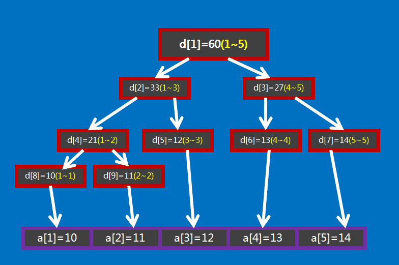

# Segement Tree

前面我们学过前缀和数组和查分数组，这两个线性数据结构分别能在 `O(1)` 的时间内计算区间和或更新数值。但是另一个操作的时间复杂度则是 `O(n)`。而 `segementTree` 线段树则能在 `O(logN)` 的时间复杂度下同时权衡两个操作。

线段树是算法竞赛中常用的用来维护 **区间信息** 的数据结构。

线段树可以在 `Olog(N)` 的时间复杂度内实现单点修改、区间修改、区间查询（区间求和，求区间最大值，求区间最小值）等。

## 构建

对于线段树，我们采用树状数组的结构来实现，将其看作是一个完全二叉树，空节点用 `null` 来存储，下面代码中 `tree` 储存树结构，`arr` 储存原数组：

```go
// SegmentTree represents the segment tree datastructure
type SegmentTree struct {
	// segment arr tree
	tree []int
	// datas
	arr []int
}
```

接下来看看如何初始化线段树的空间，上面我们说了线段树使用树状数组来储存(`2p+1`是`p`的左儿子，`2p+2`是`p`的右儿子)，若有 `n` 个叶子结点，则 `d` 数组的范围最大为 `2^(|_logn_|+1)`。

分析：首先我们知道线段树的深度是 `|_logN_|` 的，则在堆式储存情况下叶子节点（包括无用的叶子节点）数量为 `2|_logN_|` 个，又由于其为一棵完全二叉树，则其总节点个数 `2n_0  1` 即 `2^(|_logn_|+1) - 1`。当然如果你懒得计算的话可以直接把数组长度设为 `4n`：

```go
// New is a constructor
// 4*n is tree max length
func New(arr []int) *SegmentTree {
	n := len(arr)
	t := &SegmentTree{
		tree: make([]int, 4*n),
		arr:  make([]int, n),
	}
	t.arr = arr
	t.build(0, 0, n-1)
	return t
}
```

最后来看看如何构建，整体策略就是递归，我们初始用 `start，end `代表两个边界，每次递归分解成`[start, mid]`和`[mid+1, end]`，直到 `s === e` 的时候递归结束，设置 `tree[n] === arr[s]`，如图所示：



代码如下：

```go
// n represents cur build node, [s, e] represent [start, end] of segment in node
func (t *SegmentTree) build(n int, s, e int) {
	if s == e {
		t.tree[n] = t.arr[s]
	} else {
		m := (s + e) / 2
		ln := 2*n + 1
		rn := 2*n + 2
		t.build(ln, s, m)
		t.build(rn, m+1, e)
		t.tree[n] = t.tree[ln] + t.tree[rn]
	}
}
```

## 区间查询

区间查询，比如求区间 `[l, r]` 的总和（即 `a_l + a_l+1 + ... +a_r`）、求区间最大值/最小值等操作。

如果要查询的区间为 `[3, 5]`，此时就不能直接获取区间的值，但是 `[3, 5]` 可以拆成 `[3, 3]` 和 `[4, 5]`，可以通过合并这两个区间的答案来求得这个区间的答案。

一般地，如果要查询的区间是 `[l, r]`，则可以将其拆成最多为 `O(logN)` 个 **极大** 的区间，合并这些区间即可求出 `[l, r]` 的答案。下面给出代码示例：

```go
// Sum returns certain segment sum in segment tree
// n represents node, [s, e] represent [start, end] of segment in node,
// [l, r] represent [right, left] segment in arr to sum
func (t *SegmentTree) Sum(n, s, e, l, r int) int {
	if l > e || r < s {
		return 0
	} else if l <= s && e <= r {
    // contain this segment
		return t.tree[n]
	} else if s == e {
    // contain this number
		return t.tree[n]
	} else {
		m := (s + e) / 2
		ln := 2*n + 1
		rn := 2*n + 2
		sl := t.Sum(ln, s, m, l, r)
		sr := t.Sum(rn, m+1, e, l, r)
		return sl + sr
	}
}
```

## 区间修改

区间修改指的是修改某个 `idx` 对应数组位的 `val`，过程就是先找到要修改的 `idx` 在线段树上对应的位置，然后向上返回修改沿途经过的所有节点，代码如下：

```go
// Update update a single in segment tree
// n represents node, [s, e] represent [start, end] of segment in node,
// i represents idx in arr, v represents new node value
func (t *SegmentTree) Update(n, s, e, i, v int) {
	if s == e {
		t.arr[i] = v
		t.tree[n] = v
	} else {
		m := (s + e) / 2
		ln := 2*n + 1
		rn := 2*n + 2
		if i >= s && i <= m {
			t.Update(ln, s, m, i, v)
		} else {
			t.Update(rn, m+1, e, i, v)
		}
		t.tree[n] = t.tree[ln] + t.tree[rn]
	}
}
```


