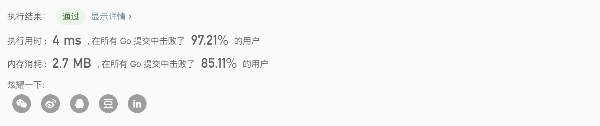
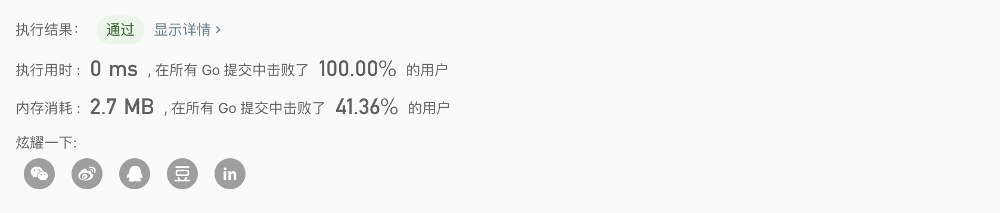

## 1.两数之和

[力扣（LeetCode）链接](https://leetcode-cn.com/problems/two-sum/submissions/)

#### 题目描述：

给定一个整数数组 nums 和一个目标值 target，请你在该数组中找出和为目标值的那 两个 整数，并返回他们的数组下标。

你可以假设每种输入只会对应一个答案。但是，你不能重复利用这个数组中同样的元素。

#### 示例:

```go
给定 nums = [2, 7, 11, 15], target = 9
因为 nums[0] + nums[1] = 2 + 7 = 9
所以返回 [0, 1]
```

#### 我的解法：

**golang：**

```go
func twoSum(nums []int, target int) []int {
    for i := 0; i < len(nums); i++ {
        for j := i + 1; j < len(nums); j++ {
            if target == nums[i] + nums[j]{
                return []int{i,j}
            }
        } 
    }
    return nil
}
```

**javascript：**

```js
var twoSum = function (nums, target) {
  for (let i = 0; i < nums.length; i++) {
    for (let j = i + 1; j < nums.length; j++) {
      if (nums[i] + nums[j] == target) {
        return [i, j];
      }
    }
  }
  return null;
};
```

## 2.两数相加

[力扣（LeetCode）链接](https://leetcode-cn.com/problems/add-two-numbers/)

#### 题目描述：

给出两个非空的链表用来表示两个非负的整数。其中，它们各自的位数是按照 逆序 的方式存储的，并且它们的每个节点只能存储一位数字。如果，我们将这两个数相加起来，则会返回一个新的链表来表示它们的和。

- 您可以假设除了数字 0 之外，这两个数都不会以 0 开头。

#### 示例:

```go
输入：(2 -> 4 -> 3) + (5 -> 6 -> 4)
输出：7 -> 0 -> 8
原因：342 + 465 = 807
```

#### 我的解法：

```go
/**
 * Definition for singly-linked list.
 * type ListNode struct {
 *     Val int
 *     Next *ListNode
 * }
 */
func addTwoNumbers(l1 *ListNode, l2 *ListNode) *ListNode {
	if l1 == nil {
		return l2
	}
	list := l1
	var l1h *ListNode
	for l1 != nil && l2 != nil {
		curResult := l1.Val + l2.Val
		if curResult >= 10 {
			curResult = curResult % 10
			if l1.Next == nil {
				l1.Next = &ListNode{Val: 1, Next: nil}
			} else {
				l1.Next.Val++
			}
		}

		l1.Val = curResult
		if l1.Next == nil {
			l1h = l1
		}

		l1 = l1.Next
		l2 = l2.Next
	}

	for l1 != nil {
		if l1.Val >= 10 {
			if l1.Next != nil {
				l1.Next.Val++
			} else {
				l1.Next = &ListNode{Val: 1, Next: nil}
			}
		}

		l1.Val = l1.Val % 10
		l1 = l1.Next
	}
    
	if l2 != nil {
		l1h.Next = l2
	}
	return list
}
```

## [3. 无重复字符的最长子串](https://leetcode-cn.com/problems/longest-substring-without-repeating-characters/)

#### 题目描述：

给定一个字符串，请你找出其中不含有重复字符的 **最长子串** 的长度。

**示例 1:**

```
输入: "abcabcbb"
输出: 3 
解释: 因为无重复字符的最长子串是 "abc"，所以其长度为 3。
```

**示例 2:**

```
输入: "bbbbb"
输出: 1
解释: 因为无重复字符的最长子串是 "b"，所以其长度为 1。
```

**示例 3:**

```
输入: "pwwkew"
输出: 3
解释: 因为无重复字符的最长子串是 "wke"，所以其长度为 3。
     请注意，你的答案必须是 子串 的长度，"pwke" 是一个子序列，不是子串。
```

#### 我的解法：

滑动窗口，时间复杂度O(n)只需对 s 一次遍历，通过left记住当前子串的起始位置，同时当前的idx就是窗口的右界，max记录最大值，如果左减去右+1比max大，就更新max。每次遍历都标记访问的元素已访问并且记录他的出现位置，这里比较特殊ascii码的话只需要一个128的数组(桶)，如果不是ascii的话可以使用一个map。遍历的过程中如果发现当前元素已访问则更新left并且移动窗口。

```go
func lengthOfLongestSubstring(s string) int {
	var (
		alps [128]int		// 记录数组
		left int 				// 左界
		max  int				// 记录最大值
	)
	for i := range alps {
		alps[i] = -1
	}
	for idx := 0; idx < len(s); idx++ {
		charId := s[idx]	        // 拿到当前字符 id

		if alps[charId] >= left {						// alps[charId] < left 的记录已经失效
			left = alps[charId] + 1						// 左界更新
		}
		alps[charId] = idx       	// 记录字符出现的位置

		if idx + 1 - left > max {
			max =  idx + 1 - left
		}
	}
	return max
}
```

## [5. 最长回文子串](https://leetcode-cn.com/problems/longest-palindromic-substring/)

#### 题目描述：

给定一个字符串 `s`，找到 `s` 中最长的回文子串。你可以假设 `s` 的最大长度为 1000。

**示例 1：**

```
输入: "babad"
输出: "bab"
注意: "aba" 也是一个有效答案。
```

#### 我的解法：

**动态转移方程🌳**
$$
dp[i][j]=(dp[i] == dp[j]) ~~\&\&~~ dp[i+1][j-1];
$$


`dp[i+1][j-1]`位于`dp[i][j]`的左下，所以我们必须列遍历，刚好这复合区间dp的通用范式，之后就没有什么好说的了。\

**Golang:**

```js
func longestPalindrome(s string) string {
	n := len(s)
	dp := make([][]int, n)
	for idx := range dp {
		dp[idx] = make([]int, n)
	}

	ans := ""
	for l := 0; l < n; l++ {
		for i := 0; i+l < n; i++ {
			j := i + l
      // do somthing...
			if l == 0 {
				dp[i][j] = 1			// 只有一位。
			} else if l == 1 {	// 跨度为一直接判断两端是否相等。
				if s[i] == s[j] {
					dp[i][j] = 1
				}
			} else {
				if s[i] == s[j] {
					dp[i][j] = dp[i+1][j-1]
				}
			}
			if dp[i][j] > 0 && l+1 > len(ans) {	// 判断是否为最长
				ans = s[i : j+1]
			}
      // ...
		}
	}
	return ans
}
```

**Javascript:**

```js
/**
 * @param {string} s
 * @return {string}
 */
var longestPalindrome = function (s) {
  let n = s.length;
  let dp = new Array(n);
  for (let i = 0; i < n; i++) {
    dp[i] = new Array(n).fill(0);
  }
  ans = "";
  for (let l = 0; l < n; l++) {
    for (let i = 0; i + l < n; i++) {
      j = i + l;
      if (l === 0) {
        dp[i][j] = 1;
      } else if (s[i] == s[j]) {
        dp[i][j] = l === 1 ? 1 : (dp[i][j] = dp[i + 1][j - 1]);
      }
      ans =
        dp[i][j] > 0 && l + 1 > ans.length
          ? s
              .split("")
              .slice(i, j + 1)
              .join("")
          : ans;
    }
  }
  return ans;
};
```

## 8.atoi

[力扣（LeetCode）链接](https://leetcode-cn.com/problems/string-to-integer-atoi/submissions/)

#### 题目描述：

请你来实现一个 atoi 函数，使其能将字符串转换成整数。

首先，该函数会根据需要丢弃无用的开头空格字符，直到寻找到第一个非空格的字符为止。

当我们寻找到的第一个非空字符为正或者负号时，则将该符号与之后面尽可能多的连续数字组合起来，作为该整数的正负号；假如第一个非空字符是数字，则直接将其与之后连续的数字字符组合起来，形成整数。

该字符串除了有效的整数部分之后也可能会存在多余的字符，这些字符可以被忽略，它们对于函数不应该造成影响。

在任何情况下，若函数不能进行有效的转换时，请返回 0。

> **注意：**假如该字符串中的第一个非空格字符不是一个有效整数字符、字符串为空或字符串仅包含空白字符时，则你的函数不需要进行转换。
>
> **说明：**假设我们的环境只能存储 32 位大小的有符号整数，那么其数值范围为 [−231,  231 − 1]。如果数值超过这个范围，请返回  INT_MAX (231 − 1) 或 INT_MIN (−231) 。

#### 示例:

```go
输入: "42"
输出: 42
```

```go
输入: "   -42"
输出: -42
解释: 第一个非空白字符为 '-', 它是一个负号。
     我们尽可能将负号与后面所有连续出现的数字组合起来，最后得到 -42 。
```

```go
输入: "-91283472332"
输出: -2147483648
解释: 数字 "-91283472332" 超过 32 位有符号整数范围。 
     因此返回 INT_MIN (−231) 。
```

#### 我的解法：

```go
func myAtoi (str string) int {
	str = strings.TrimSpace(str)
	num := 0
	str0 := str

	if len(str) != 0 {
		if str[0] == '-' || str[0] == '+' {
			str = str[1:]
		}

		for _, v := range str {
			v -= '0'
			if v > 9 || v < 0 {
				break
			}

			num = num*10 + int(v)
			if num >= 2 << (31 - 1) {
				// 之所以把判断写在这里是因为，整数越界相加会报错。
				num = 2 << (31 - 1)
				num--
				if str0[0] == '-' {
					num++
				}
				break
			}
		}

		if str0[0] == '-' {
			num = -num
		}
	}
	ret
```

## [11. 盛最多水的容器](https://leetcode-cn.com/problems/container-with-most-water/)

#### 题目描述：

给你 *n* 个非负整数 *a*1，*a*2，...，*a*n，每个数代表坐标中的一个点 (*i*, *ai*) 。在坐标内画 *n* 条垂直线，垂直线 *i* 的两个端点分别为 (*i*, *ai*) 和 (*i*, 0)。找出其中的两条线，使得它们与 *x* 轴共同构成的容器可以容纳最多的水。

**说明：**你不能倾斜容器，且 *n* 的值至少为 2。 


图中垂直线代表输入数组 [1,8,6,2,5,4,8,3,7]。在此情况下，容器能够容纳水（表示为蓝色部分）的最大值为 49。

**示例：**

```go
输入：[1,8,6,2,5,4,8,3,7]
输出：49
```

#### 我的解法：

双指针从height的两个边界开始，向中间遍历，每次移动比较矮的一边。

```go
func maxArea(height []int) int {
	lheight, rheight, space := 0, len(height) - 1, 0
	for lheight < rheight {
        lh, rh := height[lheight], height[rheight]
		if lh < rh {
            space = int(math.Max(float64(space), float64(lh*(rheight-lheight))))
			lheight++
		} else {
            space = int(math.Max(float64(space), float64(rh*(rheight-lheight))))
			rheight--
		}
	}
	return space
}
```

## 12.整数转古罗马数

[力扣（LeetCode）链接](https://leetcode-cn.com/problems/integer-to-roman/)

#### 题目描述：

罗马数字包含以下七种字符： `I`， `V`， `X`， `L`，`C`，`D` 和 `M`。

```
字符          数值
I             1
V             5
X             10
L             50
C             100
D             500
M             1000
```

例如， 罗马数字 2 写做 `II` ，即为两个并列的 1。12 写做 `XII` ，即为 `X` + `II` 。 27 写做 `XXVII`, 即为 `XX` + `V` + `II` 。

通常情况下，罗马数字中小的数字在大的数字的右边。但也存在特例，例如 4 不写做 `IIII`，而是 `IV`。数字 1 在数字 5 的左边，所表示的数等于大数 5 减小数 1 得到的数值 4 。同样地，数字 9 表示为 `IX`。这个特殊的规则只适用于以下六种情况：

- `I` 可以放在 `V` (5) 和 `X` (10) 的左边，来表示 4 和 9。
- `X` 可以放在 `L` (50) 和 `C` (100) 的左边，来表示 40 和 90。 
- `C` 可以放在 `D` (500) 和 `M` (1000) 的左边，来表示 400 和 900。

给定一个整数，将其转为罗马数字。输入确保在 1 到 3999 的范围内。

#### 示例:

```go
输入: 58
输出: "LVIII"
解释: L = 50, V = 5, III = 3.

输入: 1994
输出: "MCMXCIV"
解释: M = 1000, CM = 900, XC = 90, IV = 4.
```

#### 我的解法：

首先使用hashmap组合存起来，之后使用贪心算法的思想每次都转换能转换的最大数。

```go
func intToRoman(num int) string {
    value := []int{1000, 900 ,500, 400, 100, 90, 50 , 40, 10, 9, 5, 4, 1}
    behaiver := []string{"M", "CM", "D", "CD", "C", "XC", "L", "XL", "X", "IX", "V", "IV", "I"}
    str := ""

    for i, v := range value {
        for v <= num {
            str += behaiver[i]
            num = num - v
        }
    }
    return str
}
```

## 13.古罗马数转整数

[力扣（LeetCode）链接](https://leetcode-cn.com/problems/roman-to-integer/)

#### 题目描述：

罗马数字包含以下七种字符: `I`， `V`， `X`， `L`，`C`，`D` 和 `M`。

```
字符          数值
I             1
V             5
X             10
L             50
C             100
D             500
M             1000
```

例如， 罗马数字 2 写做 `II` ，即为两个并列的 1。12 写做 `XII` ，即为 `X` + `II` 。 27 写做 `XXVII`, 即为 `XX` + `V` + `II` 。

通常情况下，罗马数字中小的数字在大的数字的右边。但也存在特例，例如 4 不写做 `IIII`，而是 `IV`。数字 1 在数字 5 的左边，所表示的数等于大数 5 减小数 1 得到的数值 4 。同样地，数字 9 表示为 `IX`。这个特殊的规则只适用于以下六种情况：

- `I` 可以放在 `V` (5) 和 `X` (10) 的左边，来表示 4 和 9。
- `X` 可以放在 `L` (50) 和 `C` (100) 的左边，来表示 40 和 90。 
- `C` 可以放在 `D` (500) 和 `M` (1000) 的左边，来表示 400 和 900。

给定一个罗马数字，将其转换成整数。输入确保在 1 到 3999 的范围内。

#### 示例:

```go
输入: "MCMXCIV"
输出: 1994
解释: M = 1000, CM = 900, XC = 90, IV = 4.
```

#### 我的解法：

```go
func romanToInt(s string) int {
	romaMap := map[string]int{
		"I":  1,
		"IV": 4,
		"V":  5,
		"IX": 9,
		"X":  10,
		"XL": 40,
		"L":  50,
		"XC": 90,
		"C":  100,
		"CD": 400,
		"D":  500,
		"CM": 900,
		"M":  1000,
	}
	sum := 0
	i := 0
	for ; i < len(s)-2; i++ {	//从零开始，先试着匹配两位，再试着匹配一位。
		if v, ok := romaMap[s[i:i+2]]; ok {
			sum += v
			i++
		} else {
			sum += romaMap[s[i:i+1]]
		}

	}
	if i == len(s)-1 {
		return sum + romaMap[s[i:]]
	}
  
	if v, ok := romaMap[s[i:]]; ok {
		sum += v
	} else {
		sum += romaMap[s[i:i+1]]
		sum += romaMap[s[i+1:]]
	}

	return sum
}
```

## [14. 最长公共前缀](https://leetcode-cn.com/problems/longest-common-prefix/)

编写一个函数来查找字符串数组中的最长公共前缀，如果不存在公共前缀，返回空字符串 `""`。

**示例 1:**

```sql
输入: ["flower","flow","flight"]
输出: "fl"
```

**示例 2:**

```sql
输入: ["dog","racecar","car"]
输出: ""
解释: 输入不存在公共前缀。
```

**说明:**

所有输入只包含小写字母 `a-z` 。

#### 我的题解：

水平扫描法，每次把第一个单词的第i个字母和其他的比较。

```go
func longestCommonPrefix(strs []string) string {
	var (
		i   int
		res string
	)

	if len(strs) != 0 {
		return res
	}

	for {
		if i > len(strs[0])-1 {
			return res
		}
		for j := 1; j < len(strs); j++ {
			if i > len(strs[j])-1 || strs[j][i] != strs[0][i] {
				return res
			}
		}
		res = res + string(strs[0][i])
		i++
	}
}
```

## 15.三数之和

[力扣（LeetCode）链接](https://leetcode-cn.com/problems/3sum/)

#### 题目描述：

给定一个包含 n 个整数的数组 nums，判断 nums 中是否存在三个元素 a，b，c ，使得 a + b + c = 0 ？找出所有满足条件且不重复的三元组。

注意：答案中不可以包含重复的三元组。

#### 示例：

```go
给定数组 nums = [-1, 0, 1, 2, -1, -4]，

满足要求的三元组集合为：
[
  [-1, 0, 1],
  [-1, -1, 2]
]
```

#### 解题思路：

- **排序（O(NlogN)O(NlogN)）**
  - 排序后相同的数会挨在一起，所以方便接下来的操作来避免重复；
  - 右边的数比左边的大，方便比较。

- **遍历（O(N^2)O(N2)）**
  - 我们定义当前下标 k，i, j 分别位于` k + 1, len(nums) - 1`的位置。若 k = 1，如下图所示：
  - 从左到右遍历，对于每个 k 值：
  - 如果三数之和大于 0，j 左移会使得和减小，甚至等于 0，故 j 左移；
  - 如果三数之和小于 0，i 右移会使得和增大，甚至等于 0，故 i 右移；
  - 如果三数之和等于 0，将` [nums[i],nums[j],nums[k]] `加入到结果中，i 右移，j 左移，寻找下一组可能结果。

#### 我的解法：

```go
func threeSum(nums []int) [][]int {
	var (
		k int
		i int
		j int

		threeSums [][]int
	)
	QuickSort(nums)  //快速排序省略
	for ; k < len(nums)-2; k++ {
		if nums[k] > 0 {
			break
		}
		if k > 0 && nums[k] == nums[k-1] {
			continue
		}
		i, j = k+1, len(nums)-1
		for i < j {
			if nums[k]+nums[i]+nums[j] > 0 {
				j--
				for nums[j] == nums[j+1] && i < j {
					j--
				}
			} else if nums[k]+nums[i]+nums[j] < 0 {
				i++
				for nums[i] == nums[i-1] && i < j {
					i++
				}
			} else {
				threeSums = append(threeSums, []int{nums[k], nums[i], nums[j]})
				i++
				j--
				for nums[i] == nums[i-1] && i < j {
					i++
				}
				for nums[j] == nums[j+1] && i < j {
					j--
				}
			}
		}
	}
	return threeSums
}
```

## [16. 最接近的三数之和](https://leetcode-cn.com/problems/3sum-closest/)

#### 题目描述：

给定一个包括 n 个整数的数组 nums 和 一个目标值 target。找出 nums 中的三个整数，使得它们的和与 target 最接近。返回这三个数的和。假定每组输入只存在唯一答案。

#### 示例：

```sql
例如，给定数组 nums = [-1，2，1，-4], 和 target = 1.

与 target 最接近的三个数的和为 2. (-1 + 2 + 1 = 2).
```

#### 我的解法：

先排序再，双指针：

https://leetcode-cn.com/problems/3sum-closest/solution/hua-jie-suan-fa-16-zui-jie-jin-de-san-shu-zhi-he-b/

```go
func threeSumClosest(nums []int, target int) int {
	var nms arr = nums
	sort.Sort(nms)
	result := nums[0] + nums[1] + nums[2]
	for i := 0; i < len(nums)-2; i++ {
		start := i + 1
		end := len(nums) - 1
		for start != end {
			curResult := nums[i] + nums[start] + nums[end]
			curOffset := curResult - target
			if Abs(curOffset) < Abs(result-target) {
				result = curResult
			}
      if curOffset > 0 {
				end--
			} else if curOffset < 0 {
				start++
			} else {
				return curResult
			}
		}

	}
	return result
}
```

#### 效果：



## [17. 电话号码的字母组合](https://leetcode-cn.com/problems/letter-combinations-of-a-phone-number/)

#### 题目描述：

给定一个仅包含数字 `2-9` 的字符串，返回所有它能表示的字母组合。给出数字到字母的映射如下（与电话按键相同）。

> **注意：** 1 不对应任何字母。


**示例:**

```
输入："23"
输出：["ad", "ae", "af", "bd", "be", "bf", "cd", "ce", "cf"].
```

**说明:**
尽管上面的答案是按字典序排列的，但是你可以任意选择答案输出的顺序。

#### 解题思路：

下面是递归树，就是穷举，因为不需要进行剪枝，而数字1-9代表的字母都是按顺序的，所以我们可以通过数字来对其代表的三个字母的起始acsii码和结束ascii码做转换，就能拿到每个数字代表的所有字母。


```go
func hanlder(digits string, idx int, cur string, res *[]string) {
	if idx == len(digits) {
		*res = append(*res, cur)
		return
	}
	curNum, _ := strconv.Atoi(digits[idx : idx+1])

	start := (curNum-1)*3 + 94
	end := (curNum-1)*3 + 96

	if curNum == 7 {
		end = end + 1
	}

	if curNum == 8 {
		start = start + 1
		end = end + 1
	}

	if curNum == 9 {
		start = start + 1
		end = end + 2
	}

	for i := start; i <= end; i++ {
		hanlder(digits, idx+1, cur+string(i), res)
	}
}

func letterCombinations(digits string) []string {
	res := make([]string, 0)
    if digits == "" {
        return res
    }
	hanlder(digits, 0, "", &res)
	return res
}
```

## [18. 四数之和](https://leetcode-cn.com/problems/4sum/)

#### 题目描述：

给定一个包含 *n* 个整数的数组 `nums` 和一个目标值 `target`，判断 `nums` 中是否存在四个元素 *a，**b，c* 和 *d* ，使得 *a* + *b* + *c* + *d* 的值与 `target` 相等？找出所有满足条件且不重复的四元组。

**注意：**

答案中不可以包含重复的四元组。

**示例：**

```go
给定数组 nums = [1, 0, -1, 0, -2, 2]，和 target = 0。

满足要求的四元组集合为：
[
  [-1,  0, 0, 1],
  [-2, -1, 1, 2],
  [-2,  0, 0, 2]
]
```

#### 我的解法：

两层循环+双指针(参照三数之和)，要注意过滤重复元素。

```go
type SortBy []int

func (a SortBy) Len() int           { return len(a) }
func (a SortBy) Swap(i, j int)      { a[i], a[j] = a[j], a[i] }
func (a SortBy) Less(i, j int) bool { return a[i] < a[j] }

func fourSum(nums []int, target int) [][]int {
	ress := make([][]int, 0)
	sort.Sort(SortBy(nums))
	for i := 0; i < len(nums)-3; i++ {
            if i != 0 && nums[i] == nums[i-1] {
                continue	// 要注意过滤重复元素
            }
		for j := i + 1; j < len(nums)-2; j++ {
            if j != i + 1 && nums[j] == nums[j-1] {
                continue  // 要注意过滤重复元素
            }
			start := j + 1
			end := len(nums) - 1
			for start < end {
				sum := nums[i] + nums[j] + nums[start] + nums[end]
				if sum == target {
					ress = append(ress, []int{nums[i], nums[j], nums[start], nums[end]})
					start++
					end--
          for start < end && start != j+1 && nums[start] == nums[start-1] {
            start++	// 要注意过滤重复元素
          }
          for start < end && end != len(nums)-1 && nums[end] == nums[end+1] {
            end--		// 要注意过滤重复元素
          }
				} else if sum > target {
					end--
				} else {
					start++
				}

			}
		}
	}
	return ress
}
```

## [19. 删除链表的倒数第N个节点](https://leetcode-cn.com/problems/remove-nth-node-from-end-of-list/)

#### 题目描述：

给定一个链表，删除链表的倒数第 *n* 个节点，并且返回链表的头结点。

**示例：**

```c
给定一个链表: 1->2->3->4->5, 和 n = 2.

当删除了倒数第二个节点后，链表变为 1->2->3->5.
```

**说明：**

给定的 *n* 保证是有效的。

**进阶：**

你能尝试使用一趟扫描实现吗？

#### 我的解法：

一次扫描，双指针，我们先拿到数据长度只有n+1的时候的倒数第n个元素的前一个元素，双指针分别标记这个元素和最后一个元素(这里可能会有特殊情况就是n为数组长度，那么倒数第n给就是第一个元素，那么我们直接返回head.Next)。然后开始遍历到数组的实际的最后一个元素，同时挪动两个指针，cur到达数组末尾的时候lastN也到达，然后删除即可。


偷张图

```go
package main

import "fmt"

func removeNthFromEnd(head *ListNode, n int) *ListNode {
	cur := head
	for n != 0 {
		cur = cur.Next
		n--
	}
	
	lastN := head

	if cur == nil {
		return lastN.Next
	}

	for cur.Next != nil {
		cur = cur.Next
		lastN = lastN.Next
	}
	lastN.Next = lastN.Next.Next
	return head

}
```

## 20.有效的括号

[力扣（LeetCode）链接](https://leetcode-cn.com/problems/valid-parentheses/)

#### 题目描述：

给定一个整数数组 nums 和一个目标值 target，请你在该数组中找出和为目标值的那 两个 整数，并返回他们的数组下标。给定一个只包括 '('，')'，'{'，'}'，'['，']' 的字符串，判断字符串是否有效。

**有效字符串需满足：**

- 左括号必须用相同类型的右括号闭合。
- 左括号必须以正确的顺序闭合。
- 注意空字符串可被认为是有效字符串。

#### 示例:

```go
输入: "()[]{}"
输出: true

输入: "([)]"
输出: false
```

#### 我的解法：

棧

```go
func isValid(s string) bool {
	stk := NewSeqStack(len(s))

	for i, v := range s {
		if i == 0 {
			stk.Push(v)
			continue
		}
		if stk.Peek() != nil {
			if stk.Peek().(int32)+2 == v || stk.Peek().(int32)+1 == v {
				stk.Pop()
			}
		} else {
			stk.Push(v)
		}

	}

	return stk.IsEmpty()
}
```

## 21.合并有序链表

[力扣（LeetCode）链接](https://leetcode-cn.com/problems/merge-two-sorted-lists)

#### 题目描述：

将两个有序链表合并为一个新的有序链表并返回。新链表是通过拼接给定的两个链表的所有节点组成的。 

#### 示例:

```go
输入：1->2->4, 1->3->4
输出：1->1->2->3->4->4
```

#### 我的解法：

递归

```go
/**
 * Definition for singly-linked list.
 * type ListNode struct {
 *     Val int
 *     Next *ListNode
 * }
 */
func mergeTwoLists(l1 *ListNode, l2 *ListNode) *ListNode {
    if l1 == nil {
        return l2
    }
    if l2 == nil {
        return l1
    }
    if l1.Val < l2.Val {
        l1.Next = mergeTwoLists(l1.Next, l2)
        return l1
    } else {
        l2.Next = mergeTwoLists(l1, l2.Next)
        return l2
    }
}
```

## 22.括号生成

[力扣（LeetCode）链接](https://leetcode-cn.com/problems/generate-parentheses/solution/)

#### 题目描述：

给出 *n* 代表生成括号的对数，请你写出一个函数，使其能够生成所有可能的并且**有效的**括号组合。

#### 示例:

```go
例如，给出 *n* = 3，生成结果为：
[
  "((()))",
  "(()())",
  "(())()",
  "()(())",
  "()()()"
]
```

#### 我的解法：

我们以 `n = 2` 为例，画树形结构图。方法是 “做减法”。


画图以后，可以分析出的结论：

1. 当前左右括号都有大于 00 个可以使用的时候，才产生分支；
2. 产生左分支的时候，只看当前是否还有左括号可以使用；
3. 产生右分支的时候，还受到左分支的限制，右边剩余可以使用的括号数量一定得在严格大于左边剩余的数量的时候，才可以产生分支；
4. 在左边和右边剩余的括号数都等于 00 的时候结算。

```go
func generateParenthesis(n int) []string {
	answers := make([]string, 0)
	helper(n, n, "", &answers)
	return answers
}

func helper(l, r int, str string, store *[]string) {
	if l == 0 && r == 0 {
		*store = append(*store, str)
	}

	if l > r {
		return
	}

	if l > 0 {
		helper(l-1, r, str+"(", store)
	}

	if r > 0 {
		helper(l, r-1, str+")", store)
	}
}
```

#### 结论：



## 23.合并k个有序链表

[力扣（LeetCode）链接](https://leetcode-cn.com/problems/merge-k-sorted-lists/submissions/)

#### 题目描述：

合并 *k* 个排序链表，返回合并后的排序链表。请分析和描述算法的复杂度。

#### 示例:

```go
输入:
[
  1->4->5,
  1->3->4,
  2->6
]
输出: 1->1->2->3->4->4->5->6
```

#### 我的解法：

使用一个优先队列，先将每个链表的头结点放入队列，之后每一次都从队列中删除最小元素并且填入新链表中直到优先队列为空。

```go
func mergeKLists(lists []*ListNode) *ListNode {
	proQueue := New(len(lists))
	for _, node := range lists {
		if node == nil {
			continue
		}
		proQueue.Insert(node)
	}
	l := new(ListNode)
	head := l

	for {
		cur := proQueue.DelMin()
		l.Val = cur.Val

		if cur.Next != nil {
			proQueue.Insert(cur.Next)
		}

		if proQueue.IsEmpty() {
			break
		}
		l.Next = new(ListNode)
		l = l.Next
	}
	return head
}
```

## 24.[两两交换链表中的节点](https://leetcode-cn.com/problems/swap-nodes-in-pairs/)

#### 题目描述：

给定一个链表，两两交换其中相邻的节点，并返回交换后的链表。

**你不能只是单纯的改变节点内部的值**，而是需要实际的进行节点交换。

#### 示例:

```go
给定 1->2->3->4, 你应该返回 2->1->4->3.
```

#### 我的解法：

```go
func swapPairs(head *ListNode) *ListNode {
	if head == nil || head.Next == nil {
		return head
	}
	fir := head
	sec := head.Next

	fir.Next = swapPairs(sec.Next)
	sec.Next = fir
	return sec
}
```

## [27. 移除元素](https://leetcode-cn.com/problems/remove-element/)

给你一个数组 *nums* 和一个值 *val*，你需要 **[原地](https://baike.baidu.com/item/原地算法)** 移除所有数值等于 *val* 的元素，并返回移除后数组的新长度。

- 不要使用额外的数组空间，你必须仅使用 O(1) 额外空间并 **[原地 ](https://baike.baidu.com/item/原地算法)修改输入数组**。

- 元素的顺序可以改变。你不需要考虑数组中超出新长度后面的元素。

**示例 1:**

```
给定 nums = [3,2,2,3], val = 3,

函数应该返回新的长度 2, 并且 nums 中的前两个元素均为 2。

你不需要考虑数组中超出新长度后面的元素。
```

**示例 2:**

```
给定 nums = [0,1,2,2,3,0,4,2], val = 2,

函数应该返回新的长度 5, 并且 nums 中的前五个元素为 0, 1, 3, 0, 4。

注意这五个元素可为任意顺序。

你不需要考虑数组中超出新长度后面的元素。
```

#### 我的解法：

```go
func removeElement(nums []int, val int) int {
	r := 0
	// 使用 r 作为数组移除元素后的idx，元素被移除是 r 不自增。
	for i := 0; i < len(nums); i++ {
        if nums[i] != val {
            nums[r] = nums[i]
            r++
        }
    }
	return r
}
```

## 28.strStr

[力扣（LeetCode）链接](https://leetcode-cn.com/problems/implement-strstr/)

#### 题目描述：

实现 `strStr()` 函数。

给定一个 haystack 字符串和一个 needle 字符串，在 haystack 字符串中找出 needle 字符串出现的第一个位置 (从0开始)。如果不存在，则返回  -1。

> **说明：**
>
> 当 needle 是空字符串时，我们应当返回什么值呢？这是一个在面试中很好的问题。对于本题而言，当 needle 是空字符串时我们应当返回 0 。这与C语言的 strstr() 以及 Java的 indexOf() 定义相符。

#### 示例:

```go
输入: haystack = "hello", needle = "ll"
输出: 2
示例 2:

输入: haystack = "aaaaa", needle = "bba"
输出: -1
```

#### 我的解法：

递归

```go
func strStr(haystack string, needle string) int {
	if len(needle) == 0 {
		return 0
	}

	for i, _ := range haystack {
		if i+len(needle) > len(haystack) { //判断是否越界。
			break
		}
		if haystack[i:len(needle)+i] == needle[:] {  //比对并且返回。
			return i
		}
	}

	return -1
}
```

## [32. 最长有效括号](https://leetcode-cn.com/problems/longest-valid-parentheses/)

#### 题目描述：

给定一个只包含 `'('` 和 `')'` 的字符串，找出最长的包含有效括号的子串的长度。

**示例 1:**

```
输入: "(()"
输出: 2
解释: 最长有效括号子串为 "()"
```

**示例 2:**

```
输入: ")()())"
输出: 4
解释: 最长有效括号子串为 "()()"
```

#### 我的解法：

https://leetcode-cn.com/problems/longest-valid-parentheses/solution/zui-chang-you-xiao-gua-hao-by-leetcode/

```go
func longestValidParentheses(s string) int {
	n := len(s)
	maxLen := 0
	dp := make([]int, n)

	for i := 1; i < n; i++ {
		if s[i] == ')' && i-1-dp[i-1] >= 0 && s[i-1-dp[i-1]] == '(' {
			if i-dp[i-1]-2 >= 0 {
				dp[i] = dp[i-1] + 2 + dp[i-dp[i-1]-2]
			} else {
				dp[i] = dp[i-1] + 2
			}
		} else if s[i] == ')' && s[i-1] == '(' {
			dp[i] = dp[i-2] + 2
		}
		maxLen = max(maxLen, dp[i])
	}
	return maxLen
}

func max(a, b int) int {
	if a > b {
		return a
	}
	return b
}
```

## [33. 搜索旋转排序数组](https://leetcode-cn.com/problems/search-in-rotated-sorted-array/)

假设按照升序排序的数组在预先未知的某个点上进行了旋转。

( 例如，数组 `[0,1,2,4,5,6,7]` 可能变为 `[4,5,6,7,0,1,2]` )。

搜索一个给定的目标值，如果数组中存在这个目标值，则返回它的索引，否则返回 `-1` 。

你可以假设数组中不存在重复的元素。

你的算法时间复杂度必须是 *O*(log *n*) 级别。

**示例 1:**

```
输入: nums = [4,5,6,7,0,1,2], target = 0
输出: 4
```

**示例 2:**

```
输入: nums = [4,5,6,7,0,1,2], target = 3
输出: -1
```

#### 我的解法：

先找到旋转点，之后在以旋转点和首元素或者尾元素作为二分区间做二分查找。旋转点的特点就是左边元素比右边大，那这个特点来做二分查找。


```go
func search(nums []int, target int) int {
    if len(nums) == 0 {
        return -1
    }
	rotatedPoint := findRotatedPoint(nums)
	var start, end int
	if target < nums[0] {
		start = rotatedPoint+1
		end = len(nums)-1
		if rotatedPoint == end {
			start = 0
		}
	} else {
		start = 0
		end = rotatedPoint
	}

	for start <= end {
		middle := (start + end)/2
		if nums[middle] == target {
			return middle
		} else if nums[middle] > target {
			end = middle - 1
		} else {
			start = middle + 1 
		}
	}

	return -1
}

func findRotatedPoint(nums []int) int {
	start := 0
	end := len(nums)-1

	for start < end {
		middle := (start + end)/2
		if nums[middle] > nums[middle+1] {
			return middle
		}
		if nums[0] > nums[middle] {
			end = middle
		} else {
			start = middle + 1
		}
	}
	return len(nums)-1
}
```

## [34. 在排序数组中查找元素的第一个和最后一个位置](https://leetcode-cn.com/problems/find-first-and-last-position-of-element-in-sorted-array/)

给定一个按照升序排列的整数数组 `nums`，和一个目标值 `target`。找出给定目标值在数组中的开始位置和结束位置。

你的算法时间复杂度必须是 *O*(log *n*) 级别。

如果数组中不存在目标值，返回 `[-1, -1]`。

**示例 1:**

```
输入: nums = [5,7,7,8,8,10], target = 8
输出: [3,4]
```

**示例 2:**

```
输入: nums = [5,7,7,8,8,10], target = 6
输出: [-1,-1]
```

#### 我的解法：

二分法加中心拓展。

```go
func searchRange(nums []int, target int) []int {
	n := len(nums)
	middle, start, end := 0, 0, n-1
	for start <= end {
		middle = (start+end)/2
		if nums[middle] == target {
			start, end = middle, middle
			break
		} else if nums[middle] > target {
			end = middle - 1
		} else {
			start = middle + 1
		}
	}
	if n == 0 || nums[middle] != target {
		return []int{-1, -1}
	}
	for start >= 0 && nums[start] == target {
		start--
	}
	for end <= n - 1 && nums[end] == target {
		end++
	}

	return []int{start+1, end-1}
}
```

## [35. 搜索插入位置](https://leetcode-cn.com/problems/search-insert-position/)

给定一个排序数组和一个目标值，在数组中找到目标值，并返回其索引。如果目标值不存在于数组中，返回它将会被按顺序插入的位置。

你可以假设数组中无重复元素。

**示例 1:**

```
输入: [1,3,5,6], 5
输出: 2
```

#### 我的题解：

```go
func searchInsert(nums []int, target int) int {
	start, end := 0, len(nums)-1
	for start <= end {
		middle := (start + end) / 2
		if nums[middle] == target {
			return middle
		}
        if start == end || start == end - 1 {
            if nums[end] < target {
                return end + 1
            } else if nums[start] > target {
                return start
            } else {
                return end
            }
        }

		if nums[middle] > target {
			end = middle - 1
		} else {
			start = middle + 1
		}
	}

	return 0
}
```

## [39. 组合总和](https://leetcode-cn.com/problems/combination-sum/)

给定一个**无重复元素**的数组 `candidates` 和一个目标数 `target` ，找出 `candidates` 中所有可以使数字和为 `target` 的组合。

`candidates` 中的数字可以无限制重复被选取。

**说明：**

- 所有数字（包括 `target`）都是正整数。
- 解集不能包含重复的组合。 

**示例 1:**

```
输入: candidates = [2,3,6,7], target = 7,
所求解集为:
[
  [7],
  [2,2,3]
]
```

**示例 2:**

```
输入: candidates = [2,3,5], target = 8,
所求解集为:
[
  [2,2,2,2],
  [2,3,3],
  [3,5]
]
```

#### 我的题解：

回溯+剪枝，递归树类似下图但是我是用加的。


```go
func combinationSum(candidates []int, target int) [][]int {
	cur := make([]int, 0)
	res := make([][]int, 0)
	handler(candidates, cur, 0, target, 0, &res)
	return res
}

func handler(candidates, cur []int, i, target, sum int, res *[][]int) {
	if target == sum {
		*res = append(*res, cur)
		return
	}

	for ; i < len(candidates); i++ {
		if sum+candidates[i] > target {
			continue
		}
		tmp := make([]int, 0)
		tmp = append(tmp, cur...)
		tmp = append(tmp, candidates[i])
		handler(candidates, tmp, i, target, sum+candidates[i], res)
	}
}
```

## [40. 组合总和 II](https://leetcode-cn.com/problems/combination-sum-ii/)

给定一个数组 `candidates` 和一个目标数 `target` ，找出 `candidates` 中所有可以使数字和为 `target` 的组合。

`candidates` 中的每个数字在每个组合中只能使用一次。

**说明：**

- 所有数字（包括目标数）都是正整数。
- 解集不能包含重复的组合。 

**示例 1:**

```
输入: candidates = [10,1,2,7,6,1,5], target = 8,
所求解集为:
[
  [1, 7],
  [1, 2, 5],
  [2, 6],
  [1, 1, 6]
]
```

**示例 2:**

```
输入: candidates = [2,5,2,1,2], target = 5,
所求解集为:
[
  [1,2,2],
  [5]
]
```

#### 我的题解：

这道题的大体思路和上一道题差不多，有变化的点是这次我们不能重复使用元素，所以说后面的 `i+1`，而且我们要预先对数组进行排序，跳过相同的元素，避免出现重复解。

```go
type SortBy []int

func (a SortBy) Len() int           { return len(a) }
func (a SortBy) Swap(i, j int)      { a[i], a[j] = a[j], a[i] }
func (a SortBy) Less(i, j int) bool { return a[i] < a[j] }

func combinationSum2(candidates []int, target int) [][]int {
	cur := make([]int, 0)
	res := make([][]int, 0)
	sort.Sort(SortBy(candidates))
	handler(candidates, cur, 0, target, 0, &res)
	return res
}

func handler(candidates, cur []int, i, target, sum int, res *[][]int) {
	if target == sum {
		*res = append(*res, cur)
		return
	}
  flag := false	// 这里是为了避免出现这种情况：1, 1, 2 | 4 (第一层递归不会出现问题，但是第二层会直接把第二个1跳过去。)
	for ; i < len(candidates); i++ {
		if sum+candidates[i] > target {
			continue
		}
		if flag && candidates[i] == candidates[i-1] {
			continue
		}
		flag = true
		tmp := make([]int, 0)
		tmp = append(tmp, cur...)
		tmp = append(tmp, candidates[i])
		handler(candidates, tmp, i+1, target, sum+candidates[i], res)
	}
}
```

## [42. 接雨水](https://leetcode-cn.com/problems/trapping-rain-water/)

#### 题目描述

给定 *n* 个非负整数表示每个宽度为 1 的柱子的高度图，计算按此排列的柱子，下雨之后能接多少雨水。


上面是由数组 [0,1,0,2,1,0,1,3,2,1,2,1] 表示的高度图，在这种情况下，可以接 6 个单位的雨水（蓝色部分表示雨水）。 

**示例:**

```
输入: [0,1,0,2,1,0,1,3,2,1,2,1]
输出: 6
```

#### 我的解法

**javascript：**

我们用一个栈存储每个墙体块并且遍历数组，如果栈不为空，并且当前访问墙体比栈顶墙体高，说明可能可以储水，于是我们弹出栈顶元素，此时弹出的元素左边必然没有比他矮的墙体，所以我们要向左遍历找到第一个比他高的墙体，并以其和当前访问墙体作为左右界计算储水量。


```js
/**
 * @param {number[]} height
 * @return {number}
 */
var trap = function (height) {
  let stack = new Stack();
  let ans = 0;
  for (let i = 0; i < height.length; i++) {
    while (!stack.isEmpty() && height[stack.peek()] < height[i]) {
      let curIdx = stack.pop();		// 坑底元素。
      while (!stack.isEmpty() && height[stack.peek()] === height[curIdx]) {	// 跳过所有等高的墙体。
        stack.pop();
      }
      if (!stack.isEmpty()) {
        let leftBorder = stack.peek();
        ans +=
          (Math.min(height[i], height[leftBorder]) - height[curIdx]) *		// 高度，左右边界的最小值。
          (i - leftBorder - 1);		// 宽度	
      }
    }
    stack.push(i);
  }
  return ans;
};
```

## [43. 字符串相乘](https://leetcode-cn.com/problems/multiply-strings/)

给定两个以字符串形式表示的非负整数 `num1` 和 `num2`，返回 `num1` 和 `num2` 的乘积，它们的乘积也表示为字符串形式。

**示例 1:**

```
输入: num1 = "2", num2 = "3"
输出: "6"
```

**示例 2:**

```
输入: num1 = "123", num2 = "456"
输出: "56088"
```

**说明：**

1. `num1` 和 `num2` 的长度小于110。
2. `num1` 和 `num2` 只包含数字 `0-9`。
3. `num1` 和 `num2` 均不以零开头，除非是数字 0 本身。
4. **不能使用任何标准库的大数类型（比如 BigInteger）**或**直接将输入转换为整数来处理**。

#### 我的解法：

大数相乘，字符串模拟竖式运算：

```js
/**
 * @param {string} num1
 * @param {string} num2
 * @return {string}
 */
var multiply = function (num1, num2) {
  let res = "";
  let l2 = num2.length;
  let l1 = num1.length;
  for (let i = l2 - 1; i >= 0; i--) {
    let carry = 0;
    let cur = "";
    cur = cur.padStart(l2 - i - 1, "0");
    n2 = num2[i] - 0;

    for (let j = l1 - 1; j >= 0 || carry != 0; j--) {
      let n1 = j < 0 ? 0 : num1[j] - 0;
      let part = (n1 * n2 + carry) % 10;
      cur = part + cur;
      carry = Math.floor((n1 * n2 + carry) / 10);
    }

    res = addStrings(cur, res);
  }
  return res;
};
```

## 46. [全排列](https://leetcode-cn.com/problems/permutations/)

给定一个 **没有重复** 数字的序列，返回其所有可能的全排列。

**示例:**

```
输入: [1,2,3]
输出:
[
  [1,2,3],
  [1,3,2],
  [2,1,3],
  [2,3,1],
  [3,1,2],
  [3,2,1]
]
```

#### 我的解法：

回溯，每层递归中都将第一个元素和后面的元素依次做交换，获取当前元素的所有可能。因为前一轮元素都不相同所以不需要进行剪枝。这组题和前面的两个组合题差不多，特点就是如果使用上面的解法每一次都要遍历所有元素，所以我们使用交换的方式。


```go
func permute(nums []int) [][]int {
	recs := make([][]int, 0)
	handler(nums, 0, len(nums), &recs)
	return recs
}

func handler(nums []int, first int, n int, recs *[][]int) {
	if n == first {
		*recs = append(*recs, nums)
		return
	}
	for i := first; i < n; i++ {
		nums[first], nums[i] = nums[i], nums[first]
		handler(append(make([]int, 0), nums...), first+1, n, recs)
	}
}
```

## [47. 全排列 II](https://leetcode-cn.com/problems/permutations-ii/)

给定一个可包含重复数字的序列，返回所有不重复的全排列。

**示例:**

```
输入: [1,1,2]
输出:
[
  [1,1,2],
  [1,2,1],
  [2,1,1]
]
```

#### 我的解法：

这种不重复的组合题，都可以使用排序来解决，无非就是在当前轮跳过重复的元素。


```go
type SortByInt []int

func (a SortByInt) Len() int           { return len(a) }
func (a SortByInt) Swap(i, j int)      { a[i], a[j] = a[j], a[i] }
func (a SortByInt) Less(i, j int) bool { return a[i] < a[j] }

func permuteUnique(nums []int) [][]int {
	res := make([][]int, 0)
	sort.Sort(SortByInt(nums))
	dfs(nums, 0, &res)
	return res
}

func dfs(nums []int, idx int, res *[][]int) {
	if idx == len(nums)-1 {
		*res = append(*res, nums)
		return
	}
	for i := idx; i < len(nums); i++ {
		if i != idx && nums[i] == nums[idx] {
			continue
		}
		nums[idx], nums[i] = nums[i], nums[idx]
		tmp := append(make([]int, 0), nums...)
		fmt.Println(tmp)
		dfs(tmp, idx+1, res)
	}
}
```

## [49. 字母异位词分组](https://leetcode-cn.com/problems/group-anagrams/)

给定一个字符串数组，将字母异位词组合在一起。字母异位词指字母相同，但排列不同的字符串。

**示例:**

```go
输入: ["eat", "tea", "tan", "ate", "nat", "bat"],
输出:
[
  ["ate","eat","tea"],
  ["nat","tan"],
  ["bat"]
]
```

**说明：**

- 所有输入均为小写字母。
- 不考虑答案输出的顺序。

#### 我的解法：

将每个字符串排序并且作为map分组的键。

```go
func groupAnagrams(strs []string) [][]string {
	res := make([][]string, 0)
	if len(strs) == 0 {
		return res
	}
	groups := make(map[string][]string)

	for _, v := range strs {
		arr := []rune(v)
		QuickSort(arr)
		key := string(arr)
		if _, ok := groups[key]; ok {
			groups[key] = append(groups[key], v)
		} else {
			groups[key] = append(make([]string, 0), v)
		}
	}
	for _, value := range groups {
		res = append(res, value)
	}
	return res
}
```


