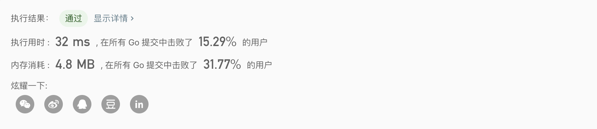

## 56.区间合并

[力扣（LeetCode）链接](https://leetcode-cn.com/problems/merge-intervals/)

#### 题目描述：

给出一个区间的集合，请合并所有重叠的区间。

#### 示例:

```go
输入: [[1,3],[2,6],[8,10],[15,18]]
输出: [[1,6],[8,10],[15,18]]
解释: 区间 [1,3] 和 [2,6] 重叠, 将它们合并为 [1,6].

输入: [[1,4],[4,5]]
输出: [[1,5]]
解释: 区间 [1,4] 和 [4,5] 可被视为重叠区间。
```

#### 我的解法：

递归

```go
func merge(intervals [][]int) [][]int {
	if len(intervals) == 1 {
		return intervals
	}
	quickSortInterval(intervals, 0, len(intervals)-1) //根据起始边界排序区间。
	for i := 1; i < len(intervals); i++ {
		if intervals[i][0] <= intervals[i-1][1] {
      intervals = append(append(intervals[:i-1],[][]int{[]int{intervals[i-1][0], int(math.Max(float64(intervals[i][1]), float64(intervals[i-1][1])))}}...), intervals[i+1:]...)
			i--
		}
	}
	return intervals
}
```

#### 结论：

大概是因为循环里那段又臭又长的代码



## 57.插入区间

[力扣（LeetCode）链接](https://leetcode-cn.com/problems/insert-interval/)

#### 题目描述：

给出一个无重叠的 ，按照区间起始端点排序的区间列表。

在列表中插入一个新的区间，你需要确保列表中的区间仍然有序且不重叠（如果有必要的话，可以合并区间）。

#### 示例:

```go
输入: intervals = [[1,3],[6,9]], newInterval = [2,5]
输出: [[1,5],[6,9]]
```

#### 我的解法：

**方法：贪心**

1. 将 newInterval 之前开始的区间添加到输出。

2. 添加 newInterval 到输出，若 newInterval 与输出中的最后一个区间重合则合并他们。

3. 一个个添加区间到输出，若有重叠部分则合并他们。

```go
func insert(intervals [][]int, newInterval []int) [][]int {
  if len(intervals) == 0 {
		return [][]int{newInterval}
	}
	result := make([][]int, 0)
	i := 0
	s, e := newInterval[0], newInterval[1]	//声明新区间的其实和结束。
	for i < len(intervals) && intervals[i][0] <= newInterval[1] {
		if intervals[i][1] < newInterval[0] {  // 如果小于带插入区间的起始点就插入。
			result = append(result, intervals[i])
			i++
			continue
		}
		if intervals[i][0] < newInterval[0] {  //判断是否更新边界。
			s = intervals[i][0]
		}
		if intervals[i][1] > newInterval[1] {  //判断是否更新边界。
			e = intervals[i][1]
		}
		i++
	}
  result = append(result, []int{s, e})  //将合并后的新边界插入。
	result = append(result, intervals[i:]...)  //将后面的区间插入。
	return result
}
```

## [62. 不同路径](https://leetcode-cn.com/problems/unique-paths/)

#### 题目描述：

一个机器人位于一个 m x n 网格的左上角 （起始点在下图中标记为“Start” ）。机器人每次只能向下或者向右移动一步。机器人试图达到网格的右下角（在下图中标记为“Finish”），问总共有多少条不同的路径？


例如，上图是一个7 x 3 的网格。有多少可能的路径？

**示例 1:**

```js
输入: m = 3, n = 2
输出: 3
解释:
从左上角开始，总共有 3 条路径可以到达右下角。

1. 向右 -> 向右 -> 向下
2. 向右 -> 向下 -> 向右
3. 向下 -> 向右 -> 向右
```

#### 我的题解：


通过上面的递归树可以看出来动态转移方程式`f(x, y ) = f(x-1, y) + f(x, y-1) +2`，然后我们声明一个二维dp数组记录重复遍历的元素，便可以写出如下算法：

```js
func uniquePaths(m, n int) int {
	if m == 0 || n == 0 {
		return 0
	}
	dp := make([][]int, n)
	for idx := range dp {
		dp[idx] = make([]int, m)
	}
	res := dfs(m-1, n-1, dp)
	util.Print2DArray(dp)
	return res
}

func dfs(m, n int, dp [][]int) int {
	if m == 0 && n == 0 {
		return 1
	}
	count := 0
	if dp[n][m] != 0 {
		return dp[n][m]
	}
	if n-1 >= 0 {
		count += dfs(m, n-1, dp)
	}
	if m-1 >= 0 {
		count += dfs(m-1, n, dp)
	}
	dp[n][m] = count
	return count
}
```

通过dp数组的规律还可以写出这样的动态规划写法：

```go
func dp(m, n int) int {
	if m == 0 || n == 0 {
		return 0
	}
	dp := make([][]int, n)
	for idx := range dp {
		dp[idx] = make([]int, m)
	}
	for i := 0; i < n; i++ {
		for j := 0; j < m; j++ {
			if i == 0 {
				dp[0][j] = 1
			} else if j == 0 {
				dp[i][0] = 1
			} else {
				dp[i][j] = dp[i-1][j] + dp[i][j-1]
			}

		}
	}
	return dp[n-1][m-1]
}
```

## [64. 最小路径和](https://leetcode-cn.com/problems/minimum-path-sum/)

#### 题目描述：

给定一个包含非负整数的 *m* x *n* 网格，请找出一条从左上角到右下角的路径，使得路径上的数字总和为最小。

**说明：**每次只能向下或者向右移动一步。

**示例:**

```js
输入:
[
  [1,3,1],
  [1,5,1],
  [4,2,1]
]
输出: 7
解释: 因为路径 1→3→1→1→1 的总和最小。
```

#### 我的题解：

很容易就能写出来状态转移方程：`cost(i,j)=grid[i][j]+min(cost(i+1,j),cost(i,j+1))`，之后得出带dp数组的递归解法。

```js
// 说明：每次只能向下或者向右移动一步。
func minPathSum(grid [][]int) int {
	r := len(grid[0])
	c := len(grid)

	if r == 0 || c == 0 {
		return 0
	}

	dp := make([][]int, c)
	for idx := range dp {
		dp[idx] = make([]int, r)
	}

	res := dfs(grid, dp, 0, 0)
	util.Print2DArray(dp)
	return res
}

func dfs(grid, dp [][]int, x, y int) int {
	m := len(grid[0]) - 1
	n := len(grid) - 1
	if y == n && x == m {
		return grid[y][x]
	}
	if dp[y][x] != 0 {
		return dp[y][x]
	}
	curBestChoice := math.MaxInt64
	if x+1 <= m {
		curBestChoice = min(curBestChoice, dfs(grid, dp, x+1, y))
	}

	if y+1 <= n {
		curBestChoice = min(curBestChoice, dfs(grid, dp, x, y+1))
	}
	dp[y][x] = curBestChoice + grid[y][x]
	return dp[y][x]
}
```


通过dp数组可以分析出dp数组和原数组的规律，很容易的写出动态规划解法：

```go
func minPathSum(grid [][]int) int {
	x, y := len(grid[0]), len(grid)
	if x == 0 || y == 0 {
		return 0
	}

	for i := y - 1; i >= 0; i-- {
		for j := x - 1; j >= 0; j-- {
			if i == y-1 {
				if j == x-1 {
					continue
				}
				grid[i][j] = grid[i][j+1] + grid[i][j]
			} else if j == x-1 {
				grid[i][j] = grid[i+1][j] + grid[i][j]
			} else {
				grid[i][j] = min(grid[i+1][j], grid[i][j+1]) + grid[i][j]
			}
		}
	}

	return grid[0][0]
}
```

## [65. 有效数字](https://leetcode-cn.com/problems/valid-number/)

验证给定的字符串是否可以解释为十进制数字。

例如:

```
"0"` => `true`
`" 0.1 "` => `true`
`"abc"` => `false`
`"1 a"` => `false`
`"2e10"` => `true`
`" -90e3  "` => `true`
`" 1e"` => `false`
`"e3"` => `false`
`" 6e-1"` => `true`
`" 99e2.5 "` => `false`
`"53.5e93"` => `true`
`" --6 "` => `false`
`"-+3"` => `false`
`"95a54e53"` => `false
```

**说明:** 我们有意将问题陈述地比较模糊。在实现代码之前，你应当事先思考所有可能的情况。这里给出一份可能存在于有效十进制数字中的字符列表：

- 数字 0-9
- 指数 - "e"
- 正/负号 - "+"/"-"
- 小数点 - "."

当然，在输入中，这些字符的上下文也很重要。

#### 我的解法：

此题可偷

```js
/**
 * @param {string} s
 * @return {boolean}
 */
var isNumber = function(s) {
    return s.trim() && !Number.isNaN(Number(s))
};
```

## [66. 加一](https://leetcode-cn.com/problems/plus-one/)

给定一个由**整数**组成的**非空**数组所表示的非负整数，在该数的基础上加一。

最高位数字存放在数组的首位， 数组中每个元素只存储**单个**数字。

你可以假设除了整数 0 之外，这个整数不会以零开头。

**示例 1:**

```
输入: [1,2,3]
输出: [1,2,4]
解释: 输入数组表示数字 123。
```

**示例 2:**

```
输入: [4,3,2,1]
输出: [4,3,2,2]
解释: 输入数组表示数字 4321。
```

#### 我的解法：

考虑一些一些特殊情况就是当出现 9999、999999 之类的数字时，循环到最后也需要进位，出现这种情况时需要手动将它进一位。

```js
/**
 * @param {number[]} digits
 * @return {number[]}
 */
var plusOne = function(digits) {
    let carry = 1
    for (let i = digits.length-1; i >= 0 && carry != 0; i--) {
        let cur = digits[i]
        digits[i] = (digits[i] + carry) % 10;
        carry = (cur + carry > 9) - 0
    }
    if (carry != 0) {
        digits.unshift(1)
    }
    return digits
};
```

## [67. 二进制求和](https://leetcode-cn.com/problems/add-binary/)

#### 题目描述：

给定两个二进制字符串，返回他们的和（用二进制表示）。

输入为**非空**字符串且只包含数字 `1` 和 `0`。

**示例 1:**

```go
输入: a = "11", b = "1"
输出: "100"
```

**示例 2:**

```go
输入: a = "1010", b = "1011"
输出: "10101"
```

#### 我的题解：

先补0，同时遍历两个串，并且判断时候进位。

```go
func addBinary(a string, b string) string {
	idxA, idxB := len(a) - 1, len(b) - 1
	if idxA > idxB {
		for idxB != idxA {
			idxB++
			b = "0" + b
		}
	} else if idxA < idxB {
		for idxB != idxA {
			idxA++
			a = "0" + a
		}
	}
	res := ""
  var lst, sub, iA, iB int
	for idxA >= 0 {
		iA, _ = strconv.Atoi(a[idxA : idxA+1]) 
		iB, _ = strconv.Atoi(b[idxA : idxA+1]) 
		sub = iA ^ iB                          
		sub = sub ^ lst
		idxA--
		if sub == 0 {
			res = "0" + res

			if iA == 1 || iB == 1 || lst == 1 {
				lst = 1
				continue
			}
			lst = 0
		} else {
			res = "1" + res
			if iA == 1 && iB == 1 && lst == 1 {
				lst = 1
				continue
			}
			lst = 0
		}
	}
	if lst == 1 {
		res = "1" + res
	}
	return res
}
```

## [69. x 的平方根](https://leetcode-cn.com/problems/sqrtx/)

实现 `int sqrt(int x)` 函数。计算并返回 *x* 的平方根，其中 *x* 是非负整数。由于返回类型是整数，结果只保留整数的部分，小数部分将被舍去。

**示例 1:**

```go
输入: 4
输出: 2
```

**示例 2:**

```go
输入: 8
输出: 2
说明: 8 的平方根是 2.82842..., 
     由于返回类型是整数，小数部分将被舍去。
```

#### 我的解法：

二分法查找

```go
func mySqrt(x int) int {
	start := 0
	end := (x / 2) + 1
	var pivot, num int

	for start <= end {
		pivot = (end + start) / 2
		num = pivot * pivot
		if num > x {
			end = pivot - 1
		} else if num < x {
			start = pivot + 1
		} else {
			return pivot
		}
	}
	return end
}
```

## 70.爬楼梯

[力扣（LeetCode）链接](https://leetcode-cn.com/problems/climbing-stairs/)

#### 题目描述：

假设你正在爬楼梯。需要 *n* 阶你才能到达楼顶。

每次你可以爬 1 或 2 个台阶。你有多少种不同的方法可以爬到楼顶呢？

> **注意：**
>
> 给定 *n* 是一个正整数。

#### 示例:

```go
输入： 3
输出： 3
解释： 有三种方法可以爬到楼顶。
1.  1 阶 + 1 阶 + 1 阶
2.  1 阶 + 2 阶
3.  2 阶 + 1 阶
```

#### 我的解法：

**解题思路：**

一道经典的动态规划问题：

先做出递归方法：`状态转移方程 -> 暴力递归 -> 超出时间限制 -> 备忘录数组优化`

> **状态转移方程**:`f(n) = f(n-1) + f(n-2) | if (n <= 2) { return n }`f(n) 表示当楼梯阶数为n时的结果集。

```go
func climbStairs(n int) int {
	var dparr = make([]int, n+1)
	methods := climb(n, dparr)
	fmt.Println(dparr)
	return methods
}

func climb(n int, dparr []int) int {
	if dparr[n] != 0 {
		return dparr[n]
	}

	if n == 0 {
		return 1
	} else if n == 1 {
		return 1
	} else if n == 2 {
		return 2
	}

	methods := climb(n-2, dparr)
	methods += climb(n-1, dparr)
	dparr[n] = methods
	return methods
}
```

 动态规划写法，并且对dp数组占用内存进行优化`(n->3->2) `

```go
func climbStairs(n int) int {
	if n <= 2 {
		return n
	}
	dpArr := make([]int, 2)
	dpArr[0] = 1
	dpArr[1] = 2
	for i := 3; i <= n; i++ {
		dpArr[1], dpArr[0] = dpArr[0]+dpArr[1], dpArr[1]
	}
	return dpArr[1]
}
```

## [71. 简化路径](https://leetcode-cn.com/problems/simplify-path/)

以 Unix 风格给出一个文件的**绝对路径**，你需要简化它。或者换句话说，将其转换为规范路径。

请注意，返回的规范路径必须始终以斜杠 `/` 开头，并且两个目录名之间必须只有一个斜杠 `/`。最后一个目录名（如果存在）**不能**以 `/` 结尾。此外，规范路径必须是表示绝对路径的**最短**字符串。

**示例 1：**

```
输入："/home/"
输出："/home"
解释：注意，最后一个目录名后面没有斜杠。
```

**示例 2：**

```
输入："/../"
输出："/"
解释：从根目录向上一级是不可行的，因为根是你可以到达的最高级。
```

**示例 3：**

```
输入："/home//foo/"
输出："/home/foo"
解释：在规范路径中，多个连续斜杠需要用一个斜杠替换。
```

**示例 4：**

```
输入："/a/./b/../../c/"
输出："/c"
```

**示例 5：**

```
输入："/a/../../b/../c//.//"
输出："/c"
```

#### 我的解法：

使用栈模拟文件夹的位置变化：

```js
/**
 * @param {string} path
 * @return {string}
 */
var simplifyPath = function (path) {
  const parts = path.split("/");
  const stk = new Stack();
  for (let part of parts) {
    if (part === "" || part === ".") {		// 排除两种特殊情况。
      continue;
    }

    if (part === "..") {									// 栈不为空就返回上一层
      if (!stk.isEmpty()) {
        stk.pop();
      }
      continue;
    }

    stk.push(part);
  }

  let ans = "";
  while (!stk.isEmpty()) {
    ans = `/${stk.pop()}${ans}`;
  }
  return ans === "" ? "/" : ans;
};

```

## 73.矩阵置零

[力扣（LeetCode）链接](https://leetcode-cn.com/problems/set-matrix-zeroes/)

#### 题目描述：

给定一个 m x n 的矩阵，如果一个元素为 0，则将其所在行和列的所有元素都设为 0。请使用原地算法。

#### 示例:

```go
输入: 
[
  [1,1,1],
  [1,0,1],
  [1,1,1]
]
输出: 
[
  [1,0,1],
  [0,0,0],
  [1,0,1]
]
```

#### 我的解法：

矩阵的第一行做标志位，hasZore作为标志位记录某行是否包含0值，firHashZore作为标志位记录第一行是否包含0值。

```go
func setZeroesPro(matrix [][]int) {
	var (
		hasZore    = false
		firHasZore = false
	)

	for i := 0; i < len(matrix); i++ {
		hasZore = false
		for j := 0; j < len(matrix[i]); j++ {
			if matrix[i][j] == 0 {
				if i == 0 {
					firHasZore = true //因为第一行用来记录，所以说不能判断第一行是否应该清0，所以添加一个标志位。
					break
				} else {
					for k := 0; k < i; k++ { //将之前的值改为0
						matrix[k][j] = 0
					}
					hasZore = true
				}
				continue
			}

			if matrix[0][j] == 0 {
				matrix[i][j] = 0
				continue
			}
		}
		if hasZore {
			for j := 0; j < len(matrix[i]); j++ {
				matrix[i][j] = 0
			}
		}
	}

	if firHasZore {
		for i := 0; i < len(matrix[0]); i++ {
			matrix[0][i] = 0
		}
	}
}
```

## [75. 颜色分类](https://leetcode-cn.com/problems/sort-colors/)

给定一个包含红色、白色和蓝色，一共 *n* 个元素的数组，**[原地](https://baike.baidu.com/item/原地算法)**对它们进行排序，使得相同颜色的元素相邻，并按照红色、白色、蓝色顺序排列。

此题中，我们使用整数 0、 1 和 2 分别表示红色、白色和蓝色。

**注意:**
不能使用代码库中的排序函数来解决这道题。

**示例:**

```
输入: [2,0,2,1,1,0]
输出: [0,0,1,1,2,2]
```

**进阶：**

- 一个直观的解决方案是使用计数排序的两趟扫描算法。
  首先，迭代计算出0、1 和 2 元素的个数，然后按照0、1、2的排序，重写当前数组。
- 你能想出一个仅使用常数空间的一趟扫描算法吗？

#### 我的解法：

用三个指针`（left, right 和curr）`来分别追踪 *0*的最右边界，*2* 的最左边界和当前考虑的元素，本解法的思路是沿着数组移动 `curr` 指针，若`nums[curr] = 0`，则将其与 `nums[left]`互换；若` nums[curr] = 2` ，则与 `nums[right]`互换。


```js
var sortColors = function(nums) {
    let left=0,right=nums.length-1,curr=0;
    while(curr<=right){
        if(nums[curr]===0){
            [nums[curr],nums[left]]=[nums[left],nums[curr]];
            //这里为什么可以自信的直接加1而不检测被调换过来的数字呢？我们可以假设被换过来的数字可能为1，2；但是如果这个数字是2，那么在之前的循环中已经被移动末尾了，所以这个数组只可能是1.
            left++;
            curr++;
            continue;
        }
        if(nums[curr]===2){
            [nums[curr],nums[right]]=[nums[right],nums[curr]];
            right--;
            continue;
        }
        if(nums[curr]===1){
            curr++;
            continue;
        }
        
    }
    return nums
};
```

## [77. 组合](https://leetcode-cn.com/problems/combinations/)

给定两个整数 *n* 和 *k*，返回 1 ... *n* 中所有可能的 *k* 个数的组合。

**示例:**

```go
输入: n = 4, k = 2
输出:
[
  [2,4],
  [3,4],
  [2,3],
  [1,2],
  [1,3],
  [1,4],
]
```

#### 我的解法：

又是一道回溯算法，idx从零开始，每层递归加 1，代表新数组序号，尝试当前序号所有可能的元素值，其中`k-idx > n-lst`为剪纸条件，表示当剩余元素不足以填入新数组。

```go
func combine(n int, k int) [][]int {
	recs := make([][]int, 0)
	rec := make([]int, k)
	handler(0, 0, n, k, rec, &recs)
	return recs
}

func handler(idx, lst, n, k int, rec []int, recs *[][]int) {
	if idx == k {
		*recs = append(*recs, rec)
		return
	}
  
  // if k-idx > n-lst {
	// 	return
	// }

	for i := lst + 1; k-(idx+1) <= n-i; i++ {
		rec[idx] = i
		handler(idx+1, i, n, k, append(make([]int, 0), rec...), recs)
	}
}
```

## [78. 子集](https://leetcode-cn.com/problems/subsets/)

#### 题目描述：

给定一组**不含重复元素**的整数数组 *nums*，返回该数组所有可能的子集（幂集）。

**说明：**

- 解集不能包含重复的子集。

**示例:**

```go
输入: nums = [1,2,3]
输出:
[
  [3],
  [1],
  [2],
  [1,2,3],
  [1,3],
  [2,3],
  [1,2],
  []
]
```

#### 我的题解：

回溯的思想，idx表示该层回溯要填入元素的下标，每次加一等于len时结束，比较精妙的就是我们每次都同时进行横向和竖向拓展。


```go
func subsetsV2(nums []int) [][]int {
	result := make([][]int, 0)
	item := make([]int, 0)
	result = append(result, item)
	generatel(0, nums, item, &result)
	return result
}

func generatel(idx int, nums []int, item []int, result *[][]int) {
	if idx >= len(nums) { // 结束
		return
	}
	item = append(item, nums[idx])

	// 加入解
	temp := make([]int, len(item))
	copy(temp, item)
	*result = append(*result, temp)
	// 纵向拓展
	generatel(idx+1, nums, item, result)
	// 横向遍历
	item = item[:len(item)-1]
	generatel(idx+1, nums, item, result)
}
```

## [79. 单词搜索](https://leetcode-cn.com/problems/word-search/)

#### 题目描述：

给定一个二维网格和一个单词，找出该单词是否存在于网格中。

**注意：**

单词必须按照字母顺序，通过相邻的单元格内的字母构成，其中“相邻”单元格是那些水平相邻或垂直相邻的单元格。同一个单元格内的字母不允许被重复使用。 

**示例:**

```go
board =
[
  ['A','B','C','E'],
  ['S','F','C','S'],
  ['A','D','E','E']
]

给定 word = "ABCCED", 返回 true
给定 word = "SEE", 返回 true
给定 word = "ABCB", 返回 false
```

**提示：**

- `board` 和 `word` 中只包含大写和小写英文字母。
- `1 <= board.length <= 200`
- `1 <= board[i].length <= 200`
- `1 <= word.length <= 10^3`

#### 我的题解：

典型的回溯，我们要注意的就是，路径探索的时候不能出界，同时下面我找到一个非常nice的不需要拷贝数组的小技巧。

```go
func exist(board [][]byte, word string) bool {
	m, n := len(board), len(board[0])
	for i := 0; i < m; i++ {
		for j := 0; j < n; j++ {
			if dfs(board, word, j, i, 0) {
				return true
			}
		}
	}
	return false
}

func dfs(board [][]byte, word string, x, y, idx int) bool {
	if board[y][x] != word[idx] {
		return false
	}

	if idx == len(word)-1 {
		return true
	}

	tmp := board[y][x]
	board[y][x] = ' '
	// 不需要改变数组的小技巧
	if 0 <= y-1 && dfs(board, word, x, y-1, idx+1) {
		return true
	}
	if y+1 < len(board) && dfs(board, word, x, y+1, idx+1) {
		return true
	}
	if 0 <= x-1 && dfs(board, word, y, x-1, idx+1) {
		return true
	}
	if x+1 < len(board[0]) && dfs(board, word, y, x+1, idx+1) {
		return true
	}
	// 不需要改变数组的小技巧
	board[y][x] = tmp
	return false
}

```

## [83. 删除排序链表中的重复元素](https://leetcode-cn.com/problems/remove-duplicates-from-sorted-list/)

给定一个排序链表，删除所有重复的元素，使得每个元素只出现一次。

**示例 1:**

```
输入: 1->1->2
输出: 1->2
```

**示例 2:**

```
输入: 1->1->2->3->3
输出: 1->2->3
```

#### 我的题解：

```js
/**
 * Definition for singly-linked list.
 * function ListNode(val) {
 *     this.val = val;
 *     this.next = null;
 * }
 */
/**
 * @param {ListNode} head
 * @return {ListNode}
 */
var deleteDuplicates = function(head) {
    let node = head;
    while (node && node.next != null) {
        while (node.next && node.val === node.next.val) {
            node.next = node.next.next
        }
        node = node.next
    }
    return head
};
```

## [84. 柱状图中最大的矩形](https://leetcode-cn.com/problems/largest-rectangle-in-histogram/)

#### 题目描述：

给定 *n* 个非负整数，用来表示柱状图中各个柱子的高度。每个柱子彼此相邻，且宽度为 1 ，求在该柱状图中，能够勾勒出来的矩形的最大面积。

 


以上是柱状图的示例，其中每个柱子的宽度为 1，给定的高度为 `[2,1,5,6,2,3]`。

 


图中阴影部分为所能勾勒出的最大矩形面积，其面积为 `10` 个单位。

**示例:**

```
输入: [2,1,5,6,2,3]
输出: 10
```

#### 我的解法：

暴力

```go
func largestRectangleArea(heights []int) int {
    n := len(heights)
    maxS := 0
    for i := 0; i < n; i++ {
        if i != 0 && heights[i] < heights[i-1] {
            continue
        }
        minY := heights[i]
        for j := i; j < n; j++ {
            x := j - i + 1
            if minY > heights[j] {
                minY = heights[j]
            }
            maxS = max(maxS, x*minY)
        }
    }
    return maxS
}

func max(a, b int) int {
    if a > b {
        return a
    }
    return b
}
```

## [85. 最大矩形](https://leetcode-cn.com/problems/maximal-rectangle/)

#### 我的题解：

给定一个仅包含 0 和 1 的二维二进制矩阵，找出只包含 1 的最大矩形，并返回其面积。

**示例:**

```
输入:
[
  ["1","0","1","0","0"],
  ["1","0","1","1","1"],
  ["1","1","1","1","1"],
  ["1","0","0","1","0"]
]
输出: 6
```

#### 我的解法：

首先，我们可以以常数时间计算出在给定的坐标结束的矩形的最大宽度。我们可以通过记录每一行中每一个方块连续的“1”的数量来实现这一点。每遍历完一行，就更新该点的最大可能宽度。通过以下代码即可实现。` row[i] = row[i - 1] + 1 if row[i] == '1'`.


一旦我们知道了每个点对应的最大宽度，我们就可以在线性时间内计算出以该点为右下角的最大矩形。当我们遍历列时，从上往下遍历，依次获取每一行的每一列作为右下角的最大矩形，可知从初始点到当前点矩形的最大宽度，就是我们遇到的每个最大宽度的最小值。


```go
func maximalRectangle(matrix [][]byte) int {
	n := len(matrix)
	if n <= 0 {
		return 0
	}
	m := len(matrix[0])
	dp := make([][]int, n)
	for idx := range dp {
		dp[idx] = make([]int, m)
	}
	maxS := 0
	for i := 0; i < n; i++ {
		for j := 0; j < m; j++ {
			if matrix[i][j] != '1' {
				dp[i][j] = 0
				continue
			}
			if j == 0 {
				dp[i][j] = 1
			} else {
				dp[i][j] = dp[i][j-1] + 1
			}
			minWidth := dp[i][j]
			for k := i; k >= 0; k-- {
				minWidth = min(dp[k][j], minWidth)
				maxS = max(maxS, minWidth*(i-k+1))
			}
		}
	}
	return maxS
}
```

## [88. 合并两个有序数组](https://leetcode-cn.com/problems/merge-sorted-array/)

#### 题目描述：

给定两个有序整数数组 *nums1* 和 *nums2*，将 *nums2* 合并到 *nums1* 中*，*使得 *num1* 成为一个有序数组。

**说明:**

- 初始化 *nums1* 和 *nums2* 的元素数量分别为 *m* 和 *n*。
- 你可以假设 *nums1* 有足够的空间（空间大小大于或等于 *m + n*）来保存 *nums2* 中的元素。

 **示例:**

```go
输入:
nums1 = [1,2,3,0,0,0], m = 3
nums2 = [2,5,6],       n = 3

输出: [1,2,2,3,5,6]
```

#### 我的解法：

贪心算法，每次选择nums1和nums2的实际数组中的最后一位填入nums1的尾部，一次循环搞定，时间复杂度`O(n)`。

```go
func merge(nums1 []int, m int, nums2 []int, n int) {
	// reverseIndex := len(nunms1)-1-i

	for i := 0; i < len(nums1); i++ {
		if n == 0 { //如果n=0说明没有必要继续填入数字。
			break
		}

		if m == 0 { //如果说m=0，说明应该把n中的数字填到m中
			nums1[len(nums1)-1-i] = nums2[n-1]
			n--
			continue
			// nums1 = append(nums2[:n], nums1[n:]...)
			//很可惜，不能使用append，因为切片其实不是完全的引用类型，如果改变底层数组映射就不能当作引用类型
			// break
		}

		if i == len(nums1)-1 { //判断是否为最后一位。
			if nums1[0] > nums2[0] {
				nums1[0] = nums2[0]
			}
			break
		}

		if nums1[m-1] > nums2[n-1] { //比较当前m和n的大小
			nums1[len(nums1)-1-i] = nums1[m-1]
			m--
		} else {
			nums1[len(nums1)-1-i] = nums2[n-1]
			n--
		}
	}
}
```

## [91. 解码方法](https://leetcode-cn.com/problems/decode-ways/)

一条包含字母 `A-Z` 的消息通过以下方式进行了编码：

```go
'A' -> 1
'B' -> 2
...
'Z' -> 26
```

给定一个只包含数字的**非空**字符串，请计算解码方法的总数。

**示例 1:**

```go
输入: "12"
输出: 2
解释: 它可以解码为 "AB"（1 2）或者 "L"（12）。
```

**示例 2:**

```go
输入: "226"
输出: 3
解释: 它可以解码为 "BZ" (2 26), "VF" (22 6), 或者 "BBF" (2 2 6) 。
```

#### 我的解法：

```go
func numDecodings(s string) int {
	if len(s) == 0 {
		return 0
	}
    
	dp := make([]int, len(s))

    if s[len(s)-1] != '0' {
	    dp[len(s)-1] = 1
    }

	for i := len(s)-2; i >= 0; i-- {
		if s[i] == '0' {
			dp[i] = 0
			continue
		}
		if s[i] == 49 || (s[i] == 50 && s[i+1] <= 54) {
			
			if i == len(s)-2 {
				dp[i] = 1 + dp[i+1]
				continue
			}
			dp[i] = dp[i+1] + dp[i+2]
			continue
		}

		dp[i] = dp[i+1]
	}
	return dp[0]
}
```

## [94. 二叉树的中序遍历](https://leetcode-cn.com/problems/binary-tree-inorder-traversal/)

给定一个二叉树，返回它的*中序* 遍历。

**示例:**

```
输入: [1,null,2,3]
   1
    \
     2
    /
   3

输出: [1,3,2]
```

**进阶:** 递归算法很简单，你可以通过迭代算法完成吗？

#### 我的解法：

意料之外的有点难：

```js
/**
 * @param {TreeNode} root
 * @return {number[]}
 */

var inorderTraversal = function (root) {
    const stk = new Stack()
    const ans = []
    let cur = root
    while (cur != null || !stk.isEmpty()) {
        while (cur != null) {
            stk.push(cur)
            cur = cur.left
        }
        cur = stk.pop()
        ans.push(cur.val)
        cur = cur.right
    }
    return ans
};
```


## 98. 验证二叉搜索树

[力扣（LeetCode）链接](https://leetcode-cn.com/problems/validate-binary-search-tree/)

#### 题目描述：

给定一个二叉树，判断其是否是一个有效的二叉搜索树。

假设一个二叉搜索树具有如下特征：

- 节点的左子树只包含小于当前节点的数。

- 节点的右子树只包含大于当前节点的数。

- 所有左子树和右子树自身必须也是二叉搜索树。

#### **示例:**

```go
输入:
     5
    / \
    1  4
      / \
     3   6
输出: false
解释: 输入为: [5,1,4,null,null,3,6]。
根节点的值为 5 ，但是其右子节点值为 4
```

#### 我的解法：

见二叉排序树笔记。

```go
/**
 * Definition for a binary tree node.
 * type TreeNode struct {
 *     Val int
 *     Left *TreeNode
 *     Right *TreeNode
 * }
 */

func isValidBST(root *TreeNode) bool {
    return helper(root, -1, -1)
}

func helper(root *TreeNode, min, max int) bool {
    if root == nil {
        return true
    }
    if min != -1 && root.Val <= min {
        return false
    }
    if max != -1 && root.Val >= max {
        return false 
    }
    if !helper(root.Left, min, root.Val) {
        return false
    }

    if !helper(root.Right, root.Val, max) {
        return false
    }
    return true
}
```

