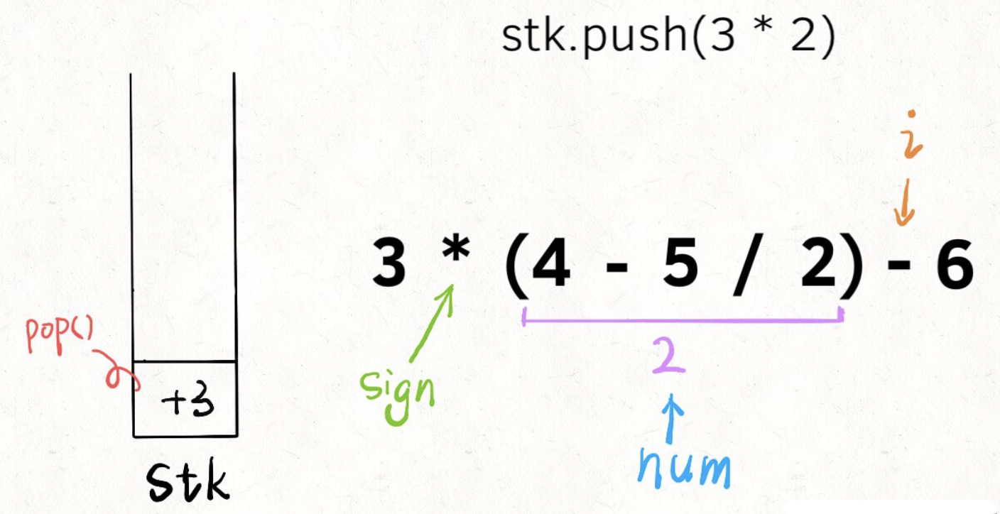

## 实现计算器

我们最终要实现的计算器功能如下：

1. 输入一个字符串，可以包含`+ - * /`、数字、括号以及空格，你的算法返回运算结果。
2. 要符合运算法则，括号的优先级最高，先乘除后加减。
3. 除号是整数除法，无论正负都向 `0` 取整`(5/2=2，-5/2=-2)`。
4. 可以假定输入的算式一定合法，且计算过程不会出现整型溢出，不会出现除数为 `0` 的意外情况。

比如输入如下字符串，算法会返回 `9`：

```c
3 * (2-6 /(3 -7))
```

可以看到，这就已经非常接近我们实际生活中使用的计算器了，虽然我们以前肯定都用过计算器，但是如果简单思考一下其算法实现，就会大惊失色：

1. 按照常理处理括号，要先计算最内层的括号，然后向外慢慢化简。这个过程我们手算都容易出错，何况写成算法呢！
2. 要做到先乘除，后加减，这一点教会小朋友还不算难，但教给计算机恐怕有点困难。
3. 要处理空格。我们为了美观，习惯性在数字和运算符之间打个空格，但是计算之中得想办法忽略这些空格。

### 字符串转整数

是的，就是这么一个简单的问题，首先告诉我，怎么把一个字符串形式的**正**整数，转化成 `int` 型？

```c
string s = "458";


int n = 0;
for (int i = 0; i < s.size(); i++) {
    char c = s[i];
    n = 10 * n + (c - '0');
}
// n 现在就等于 458
```

这个还是很简单的吧，老套路了。但是即便这么简单，依然有坑：**`(c - '0')`**的这个括号不能省略，否则可能造成整型溢出。

因为变量`c`是一个 `ASCII` 码，如果不加括号就会先加后减，想象一下`s`如果接近 `INT`_`MAX`，就会溢出。所以用括号保证先减后加才行。

### 处理加减法

现在进一步，**如果输入的这个算式只包含加减法，而且不存在空格**，你怎么计算结果？我们拿字符串算式`1-12+3`为例，来说一个很简单的思路：

1. 先给第一个数字加一个默认符号`+`，变成`+1-12+3`。
2. 把一个运算符和数字组合成一对儿，也就是三对儿`+1`，`-12`，`+3`，把它们转化成数字，然后放到一个栈中。
3. 将栈中所有的数字求和，就是原算式的结果。

我们直接看代码，结合一张图就看明白了：

```ts
int calculate(string s) {
    stack<int> stk;
    // 记录算式中的数字
    int num = 0;
    // 记录 num 前的符号，初始化为 +
    char sign = '+';
    for (int i = 0; i < s.size(); i++) {
        char c = s[i];
        // 如果是数字，连续读取到 num
        if (isdigit(c)) 
            num = 10 * num + (c - '0');
        // 如果不是数字，就是遇到了下一个符号，
        // 之前的数字和符号就要存进栈中
        if (!isdigit(c) || i == s.size() - 1) {
            switch (sign) {
                case '+':
                    stk.push(num); break;
                case '-':
                    stk.push(-num); break;
            }
            // 更新符号为当前符号，数字清零
            sign = c;
            num = 0;
        }
    }
    // 将栈中所有结果求和就是答案
    int res = 0;
    while (!stk.empty()) {
        res += stk.top();
        stk.pop();
    }
    return res;
}
```

我估计就是中间带`switch`语句的部分有点不好理解吧，`i`就是从左到右扫描，`sign`和`num`跟在它身后。当`s[i]`遇到一个运算符时，情况是这样的：


所以说，此时要根据`sign`的 case 不同选择`nums`的正负号，存入栈中，然后更新`sign`并清零`nums`记录下一对儿符合和数字的组合。

另外注意，不只是遇到新的符号会触发入栈，当`i`走到了算式的尽头（`i == s.size() - 1`），也应该将前面的数字入栈，方便后续计算最终结果。


至此，仅处理紧凑加减法字符串的算法就完成了，请确保理解以上内容，后续的内容就基于这个框架修修改改就完事儿了。

### 处理乘除法

其实思路跟仅处理加减法没啥区别，拿字符串`2-3*4+5`举例，核心思路依然是把字符串分解成符号和数字的组合。

比如上述例子就可以分解为`+2`，`-3`，`*4`，`+5`几对儿，我们刚才不是没有处理乘除号吗，很简单，**其他部分都不用变**，在`switch`部分加上对应的 case 就行了：

```c
for (int i = 0; i < s.size(); i++) {
    char c = s[i];
    if (isdigit(c)) 
        num = 10 * num + (c - '0');

    if (!isdigit(c) || i == s.size() - 1) {
        switch (sign) {
            int pre;
            case '+':
                stk.push(num); break;
            case '-':
                stk.push(-num); break;
            // 只要拿出前一个数字做对应运算即可
            case '*':
                pre = stk.top();
                stk.pop();
                stk.push(pre * num);
                break;
            case '/':
                pre = stk.top();
                stk.pop();
                stk.push(pre / num);
                break;
        }
        // 更新符号为当前符号，数字清零
        sign = c;
        num = 0;
    }
}
```


**乘除法优先于加减法体现在，乘除法可以和栈顶的数结合，而加减法只能把自己放入栈**。

现在我们思考一下**如何处理字符串中可能出现的空格字符**。其实也非常简单，想想空格字符的出现，会影响我们现有代码的哪一部分？

```c
// 如果 c 非数字
if (!isdigit(c) || i == s.size() - 1) {
    switch (c) {...}
    sign = c;
    num = 0;
}
```

显然空格会进入这个 if 语句，但是我们并不想让空格的情况进入这个 if，因为这里会更新`sign`并清零`nums`，空格根本就不是运算符，应该被忽略。

那么只要多加一个条件即可：

```c
if ((!isdigit(c) && c != ' ') || i == s.size() - 1) {
    ...
}
```

好了，现在我们的算法已经可以按照正确的法则计算加减乘除，并且自动忽略空格符，剩下的就是如何让算法正确识别括号了。

### 处理括号

处理算式中的括号看起来应该是最难的，但真没有看起来那么难。

这段代码跟刚才 C++ 代码完全相同，唯一的区别是，不是从左到右遍历字符串，而是不断从左边`pop`出字符，本质还是一样的。

那么，为什么说处理括号没有看起来那么难呢，**因为括号具有递归性质**。我们拿字符串`3*(4-5/2)-6`举例：

calculate(`3*(4-5/2)-6`) = 3  calculate(**`4-5/2`**) - 6 = 3  2 - 6 = 0

可以脑补一下，无论多少层括号嵌套，通过 calculate 函数递归调用自己，都可以将括号中的算式化简成一个数字。**换句话说，括号包含的算式，我们直接视为一个数字就行了**。

现在的问题是，递归的开始条件和结束条件是什么？遇到**`(`开始递归，遇到`)`结束递归**：

```ts
function calculate(s: string): number {
    
    function helper(sList: string[]): number {
        let stack = [];
        let sign = '+',
            c = '',
            num = 0;
        while (sList.length > 0) {
            c = sList.shift();
            if (isDigit(c)) {
                num = num * 10 + (c.charCodeAt(0) - '0'.charCodeAt(0));
            }
            if (c === '(') {
                num = helper(sList);
            }

            if ((!isDigit(c) && c !== ' ') || sList.length === 0) {
                if (sign === '+') {
                    stack.push(num);
                } else if (sign === '-') {
                    stack.push(-num);
                } else if (sign === '*') {
                    stack[stack.length - 1] = stack[stack.length - 1] * num;
                } else if (sign === '/') {
                    stack[stack.length - 1] = stack[stack.length - 1] / num;
                }
                num = 0;
                sign = c;
            }
            if (c === ')') {
                break;
            }
        }

        let res = 0;
        while (stack.length !== 0) {
            res += stack[stack.length - 1];
            stack.pop();
        }

        return res;
    }

    return helper(s.split(''));
};

function isDigit(s: string): boolean {
    return s !== ' ' && s !== '' && Number.isFinite(Number(s));
}
```




你看，加了两三行代码，就可以处理括号了，这就是递归的魅力。至此，计算器的全部功能就实现了，通过对问题的层层拆解化整为零，再回头看，这个问题似乎也没那么复杂嘛。

