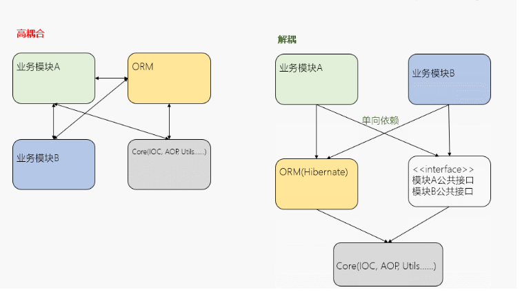
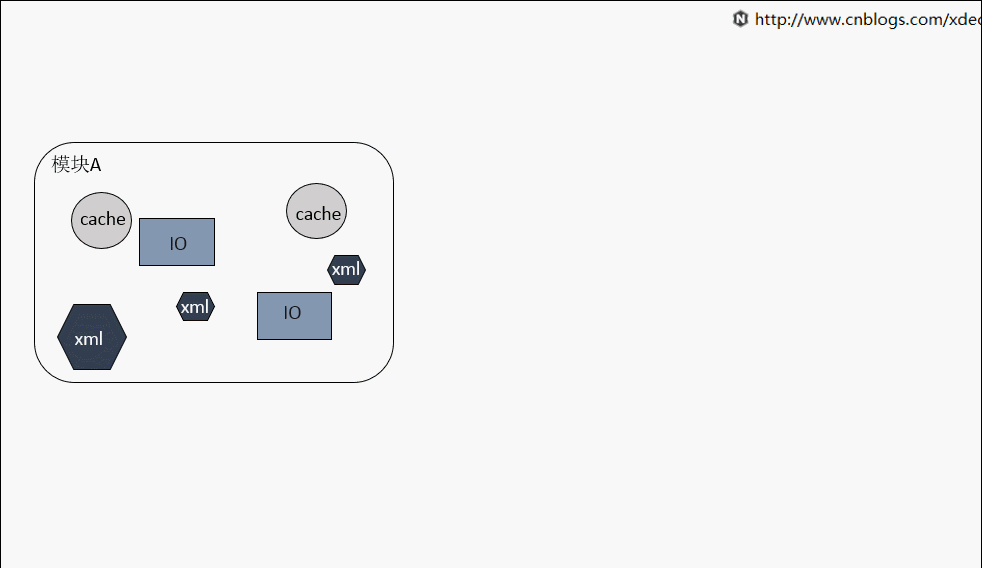

# 面向对象

面向对象的三大特性是"**封装、"多态"、"继承**"，七大原则是**"单一职责原则"、"开放封闭原则"、"里氏替换原则"、"依赖倒置原则"、"接口分离原则"、"迪米特原则（高内聚低耦合）"、"聚合复用原则"**。

遵循七大原则的根本目的是实现代码的高内聚和低耦合，而三大特性则是构建七大原则的根本。

## 内聚和耦合

内聚和耦合是代码质量的首要考量，在学习他们之前，先来理解一下模块的概念，模块就是从逻辑上将系统分解为更细微的部分，分而治之，复杂问题拆解为若干简单问题，逐个解决。

耦合主要描述模块之间的关系，内聚主要描述模块内部。模块的**粒度可大可小**，可以是函数，类，功能块等等。

### 耦合

模块之间存在依赖，导致改动可能会互相影响，关系越紧密，耦合越强，模块独立性越差。



耦合可以分为以下几种，它们之间的耦合度由高到低排列如下：

+ **内容耦合：**当一个模块直接修改或操作另一个模块的数据时，或一个模块不通过正常入口而转入另一个模块时，这样的耦合被称为内容耦合。内容耦合是最高程度的耦合，应该避免使用之。
+ **公共耦合：**两个或两个以上的模块共同引用一个全局数据项，这种耦合被称为公共耦合。在具有大量公共耦合的结构中，确定究竟是哪个模块给全局变量赋了一个特定的值是十分困难的。
+ **外部耦合：**一组模块都访问同一全局简单变量而不是同一全局数据结构，而且不是通过参数表传递该全局变量的信息，则称之为外部耦合。
+ **控制耦合：**一个模块通过接口向另一个模块传递一个控制信号，接受信号的模块根据信号值而进行适当的动作，这种耦合被称为控制耦合。
+ **标记耦合：**若一个模块A通过接口向两个模块 `B` 和 `C` 传递一个公共参数，那么称模块B和C之间存在一个标记耦合。
+ **数据耦合：**模块之间通过参数来传递数据，那么被称为数据耦合。数据耦合是最低的一种耦合形式，系统中一般都存在这种类型的耦合，因为为了完成一些有意义的功能，往往需要将某些模块的输出数据作为另一些模块的输入数据。
+ **非直接耦合：**两个模块之间没有直接关系，它们之间的联系完全是通过主模块的控制和调用来实现的。

耦合是影响软件复杂程度和设计质量的一个重要因素，在设计上我们应采用以下原则：如果模块间**必须存在耦合，就尽量使用数据耦合，少用控制耦合，限制公共耦合的范围，尽量避免使用内容耦合**。

### 内聚

模块内部的元素，**关联性越强，则内聚越高**，模块单一性更强。**一个模块应当尽可能独立完成某个功能**，



如果有各种场景需要被引入到当前模块， 代码质量将变得非常脆弱， 这种情况建议拆分为多个模块。低内聚的模块代码， 不管是维护， 扩展还是重构都相当麻烦， 难以下手。

## 三大特性

三大基本特性：封装，继承，多态。

### 封装

封装，就是把客观事物封装成抽象的类，并且类可以把自己的数据和方法只让可信的类或者对象操作，对不可信的进行信息隐藏。一个类就是一个封装了数据以及操作这些数据的代码的逻辑实体。

在一个对象内部，某些代码或某些数据可以是私有的，不能被外界访问。通过这种方式，对象对内部数据提供了不同级别的保护，以防止程序中无关的部分意外的改变或错误的使用了对象的私有部分。

### 继承

继承，指可以让某个类型的对象获得另一个类型的对象的属性和方法。它支持按级分类的概念。继承是指这样一种能力：它可以使用现有类的所有功能，并在无需重新编写原来的类的情况下对这些功能进行扩展。通过继承创建的新类称为“子类”或“派生类”，被继承的类称为“基类”、“父类”或“超类”

要实现继承，可以通过 “继承”（`Inheritance`）和“组合”（`Composition`）来实现。继承概念的实现方式有二类：实现继承与接口继承。实现继承是指直接使用基类的属性和方法而无需额外编码的能力；接口继承是指仅使用属性和方法的名称、但是子类必须提供实现的能力。

### 多态

多态，是指一个类实例的相同方法在不同情形有不同表现形式。多态机制使具有不同内部结构的对象可以共享相同的外部接口。这意味着，虽然针对不同对象的具体操作不同，但通过一个公共的类，它们（那些操作）可以通过相同的方式予以调用。

举个例子多个类继承一个抽象类或者实现一个共同接口。

## 七大原则

设计模式(面向对象)有七大原则，分别是：

- 单一职责原则 (`Single Responsibility Principle`)
- 开放-关闭原则 (`Open-Closed Principle`)
- 里氏替换原则 (`Liskov Substitution Principle`)
- 依赖倒转原则 (`Dependence Inversion Principle`)
- 接口隔离原则 (`Interface Segregation Principle`)
- 迪米特法则 (`Law Of Demeter`)
- 组合/聚合复用原则 (`Composite/Aggregate Reuse Principle`)

### 目的

使用设计模式的最终目的是“高内聚低耦合”：

- 代码重用性：相同功能的代码，不多多次编写
- 代码可读性：编程规范性，便于其他程序员阅读
- 代码可扩展性：当增加新的功能后，对原来的功能没有影响

其中开放-封闭原则具有理想主义的色彩，他是面向对象设计的终极目标。其他几条则可以看做是开放-封闭原则的实现方法。设计模式就是实现了这些原则，从而达到了代码复用，增加可维护性的目的。

## 单一职责原则 `SRP`

概念：就一个类而言，应该仅有一个引起它变化的原因。意思就是我们设计的每一个类，都应该只负责一个功能。

### 未使用单一职责原则

`Single` 类：

```java
public class single {
    public static void main(String[] args) {
        Vehicle vehicle = new Vehicle();
        vehicle.run("汽车");
        vehicle.run("轮船");
        vehicle.run("飞机");
    }
}
```

`Vehicle` 类：

```java
public class Vehicle {
    void run(String type){
        System.out.println(type+"在公路上开");
    }
}
```

我们看下运行结果，汽车是在公路上开，但是轮船和飞机并不是在公路上。因为Vehicle类负责了不止一个功能，所以该设计是有问题的。

### 已使用单一职责原则

对于上面的例子，我们采用单一职责原则重写一下，将 `Vehicle` 类拆分成三个类，分别是 `Car`，`Ship`，`Plane`，让他们各自负责陆地上，水上，空中的交通工具，使其互不影响。

如果我们需要对水上交通做“风级大于8级，禁止出海”的限制，就只需要对Ship类进行修改。

具体代码如下：

`single` 类：

```java
public class single {
    public static void main(String[] args) {
        Car car = new Car();
        car.run("汽车");

        Ship ship=new Ship();
        ship.run("轮船");

        Plane plane=new Plane();
        plane.run("飞机");
    }
}
```

`Car` 类：

```java
public class Car {
    void run(String type){
        System.out.println(type+"在公路上开");
    }
}
```

`Ship` 类：

```java
public class Ship {
    void run(String type){
        System.out.println(type+"在水里开");
    }
}
```

Plane类：

```java
public class Plane {
    void run(String type){
        System.out.println(type+"在天空开");
    }
}
```

### 优化

我们可以发现单一职责原则有点代码太多了，显得冗余。毕竟我们程序员是能少写就少写，决不能多写代码。那我们对其优化下，上面每个类只有一个方法，我们可以合并为一个类，其中有三个方法，每个方法对应着在公路上，在水上，在天空中的交通工具，**将单一职责原则落在方法层面，而不再是类层面**，代码如下：

`single` 类：

```java
public class single {
    public static void main(String[] args) {
        Vehicle vehicle = new Vehicle();
        vehicle.runOnRoad("汽车");

        vehicle.runOnWater("轮船");

        vehicle.runOnAir("飞机");
    }
}
```

`Vehicle` 类：

```java
public class Vehicle {
    void runOnRoad(String type){
        System.out.println(type+"在公路上开");
    }
    void runOnWater(String type){
        System.out.println(type+"在水里开");
    }
    void runOnAir(String type){
        System.out.println(type+"在天空开");
    }
} 
```

### 优缺点总结

**优点：**

- 降低类的复杂性，一个类只负责一个职责。
- 提高代码的可读性，逻辑清楚明了。
- 降低风险，只修改一个类，并不影响其他类的功能。

**缺点：**

+ 代码量增多。(可将单一职责原则落在方法层面进行优化)

## 接口隔离原则

类不应该依赖他不需要的接口，接口尽量小颗粒划分。接口隔离原则的核心定义，不出现臃肿的接口，但是“小”是有限度的，首先就是不能违反单一职责原则。

### 不遵循接口隔离原则

对于 `golang` 来说，接口的实现是隐式的，接口的实现者必须实现接口的全部方法。不遵循接口隔离原则的代码看起来就反人类。

```go
type SchoolMembers interface {
	Exam()
	Teach()
}

type student string

func (s *student) Exam() {
	fmt.Println("exam")
}

func (s *student) Teach() {

}

type teacher string

func (s *teacher) Exam() {

}

func (s *teacher) Teach() {
	fmt.Println("teach")
}
```

### 已使用接口隔离原则

将 `SchoolMembers` 接口分离开来，`TeachingMembers` 和 `ExamingMember` 互不干扰。

```go
type TeachingMembers interface {
	Teach()
}

type ExamingMembers interface {
	Exam()
}

type student string

func (s *student) Exam() {
	fmt.Println("exam")
}

type teacher string

func (s *teacher) Teach() {
	fmt.Println("teach")
}
```

### 总结

言归正传，如果将多个方法合并为一个接口，再提供给其他系统使用的时候，就必须实现该接口的所有方法，那有些方法是根本不需要的，造成使用者的混淆。

## 依赖倒转原则 `DIP`

高层模块不应该依赖底层模块，二者都应该依赖接口或抽象类。其核心就是面向接口编程。

依赖倒转原则主要基于如下的设计理念：相对于细节的多变性，抽象的东西要稳定的多，以抽象为基础搭建的架构比以细节为基础的架构要稳定的多。

抽象指接口或抽象类，细节指具体的实现类。

### 举例

拿常见的`mvc`架构来说，`controller `层要调用 `model` 层提供的数据库方法，如果我们不使用接口的话就要考虑这样一个问题，如果说依赖的数据库更换，带来的影响可能就是我们的 `m` 层和 `c` 层都需要重构，这显然是不可取的，所以说我们让 `c `层以来 `m` 层提供的方法接口，保证框架的稳定

**`m` 层**

```go
type IUserManager interface {
	Conn() error
	SelectOne(string) (*models.User, error)
	SelectOneById(int64) (*models.User, error)
	InsertOne (*models.User) (int64, error)
}

type UserManager struct {
	mysqlCon *sql.DB
	tableName string
}

func(u *UserManager) Conn() (err error) {...}

func (u *UserManager) SelectOneById(uid int64) (userResult *models.User, err error) {...}

func (u *UserManager) SelectOne(email string) (userResult *models.User, err error) {...}

func (u *UserManager) InsertOne(user *models.User) (uid int64, err error) {...}
```

**`s` 层**

```go
type UserService struct {
	userRepository repositories.IUserManager
}

func (bs *UserService) GetUserById(uid int64) (user *models.User, err error) {
	user, err = bs.userRepository.SelectOneById(uid)
	return
}

....
```

## 里氏替换原则 `LSP`

### 继承的优缺点

里氏替换原则是 `1988` 年麻省理工姓李的女士提出，它是阐述了对继承 `extends` 的一些看法。

继承的优点：

- 提高代码的重用性，子类也有父类的属性和方法。

- 提高代码的可扩展性，子类有自己特有的方法。

继承的缺点：

- 当父类发生改变的时候，要考虑子类的修改。

里氏替换原则是继承的基础，只有当子类替换父类时，软件功能仍然不受到影响，才说明父类真正被复用啦。

### 未使用里氏置换

**子类必须实现父类的抽象方法**，但不得重写（覆盖）父类的非抽象（已实现）方法，因为 `golang` 中没有抽象方法所以暂且不谈。

##### 父类

```go
type Istudent interface{
	Eat()
}

type student struct{
}

func (s *student) Eat() {
	fmt.Println("吃饱才有力气学习")
}
```

##### 子类

```go
type highSchoolStudent struct {
	Istudent
}


func (s *highSchoolStudent) Eat() {
	fmt.Println("不想学习只想吃饭")
}
```

##### 煮方法

```go
func main() {
	stu := student{}
	stu.Eat()
  fmt.Println("子类替换父类")
	highSchoolStu := highSchoolStudent{new(student),}
	highSchoolStu.Eat()
}

// 吃饱才有力气学习
// 子类替换父类
// 不想学习只想吃饭
```

### 使用里氏置换 1

如想要不覆盖父类中的方法，子类中可以增加自己特有的方法

##### 重构子类

```go
type highSchoolStudent struct {
	people
}

func (s *highSchoolStudent) highSchoolEat() {
	fmt.Println("不想学习只想吃饭")
}
```

##### 煮方法

```go
func main() {
	stu := student{}
	stu.Eat()
	fmt.Println("子类替换父类")
	highSchoolStu := highSchoolStudent{new(student),}
	highSchoolStu.Eat()
	highSchoolStu.highSchoolEat()
}
```

### 使用里氏替换原则 2

当子类覆盖或实现父类的方法时，方法的前置条件（即方法的形参）要比父类方法的输入参数更宽松，可惜的是 `golang` 中方法可以复写但是不能实现重载，所以说这里拿 `java` 举例。

##### 父类A：

```java
public class A {
    public void run(HashMap hashMap){
        System.out.println("父类执行");
    }
}
```

##### 子类B :

```java
public class B extends A{
    public void run(Map map){
        System.out.println("子类执行");
    }
}
```

##### 测试类test：

```java
public class test {
    public static void main(String[] args) {
        A a = new A();
        a.run(new HashMap());

        System.out.println("将子类替换成父类：");
        B b = new B();
        b.run(new HashMap());

    }
}
```

### 总结

我们平常好像也没有遵循这些里氏替换原则，程序还是正常跑。其实如果不遵循里氏替换原则，你写的代码出问题的几率会大大增加。

## 开闭原则 `OCP`（重点）

前面四个原则，单一职责原则，接口屏蔽原则，依赖倒转原则，里氏替换原则可以说都是为了开闭原则做铺垫，其是编程汇总最基础，最重要的设计原则，核心为**对扩展开放，对修改关闭**，简单来说，通过扩展软件的行为来实现变化，而不是通过修改来实现，尽量不修改代码，而是扩展代码

### 不遵循开闭原则

##### 交通工具接口

```go
type transport interface {
	run()
}
```

##### bus类

这里我想要 `bus` 可以在水里走，于是我又添加了一个方法 `runInWater` 于是我违反了开闭原则。

```go
type bus string

func (b *bus) run() {
	fmt.Println("run on rail")
}

func (b *bus) runInWater() {
	fmt.Println("run in water")
}
```

### 使用开闭原则

这里我们不使用接口实现继承而是使用 `bus` 类本身实现继承，因为我们只是希望对 `bus` 类进行拓展，不希望重写 `bus` 类的具体方法，但是这样写的同时也违反了里氏置换原则，不过这里的 `superbus` 其实并不是子类的角色，而是类似一种拓展的角色，所以说这个时候原则也是相对的。

##### superBus

```go
type superBus struct{
  	bus
}

func (sb *superBus) run() {
	fmt.Println("run in water and rail")
}
```

## 合成/聚合复用原则

合成/聚合复用原则经常又叫做合成复用原则，就是在一个新的对象里面使用一些已有的对象，使之成为新对象的一部分，新的对象通过这些对象的委派达到复用已有功能的目的。他的设计原则是：要尽量使用合成/聚合，尽量不要使用继承。

`mixin` 是此原则比较常见的实现方式。

### 使用合成复用原则

`school ` 和 `student` 很明显不能是继承的关系。

```go
type student struct {
	name string
}

func (s *student) ...

type school struct {
	stu student
}
```

与其说不要使用继承，更应该说合理的使用继承，继承关系明显，而不是依赖关系明显的时候就应该使用继承。

## 迪米特法则（也称为最小知识原则）

一个软件实体应当尽可能的少与其他实体发生相互作用。每一个软件单位对其他软件单位都只有最少的知识，而且局限于那些与本单位密切相关的软件单位。

迪米特法则的初衷在于降低类之间的耦合。由于每个类尽量减少对其他类的依赖，因此，很容易使得系统的功能模块功能独立，相互之间不存在（或很少有）依赖关系。迪米特法则不希望类之间建立直接的联系。如果有真的需要建立联系的，也希望能通过他的友元类来转达。因此，应用迪米特法则有可能造成一个后果就是：系统中存在大量的中介类，这些类之所以存在完全是为了传递类之间的相互关系，这在一定程度上增加了系统的复杂度。

`Ω` 一个对象应该对其他对象保持最少的了解。

1. 类与类关系越密切，耦合度越大
2. 一个类对自己依赖的类知道的越少越好。也就是说，对于被依赖的类不管多么复杂，都尽量将逻辑封装在类的内部。对外除了提供的 `public` 方法，不对外泄露任何信息
3. 迪米特法则还有个更简单的定义：只与直接（熟悉）的朋友通信
4. **直接（熟悉）的朋友：**每个对象都会与其他对象有耦合关系，只要两个对象之间有耦合关系， 我们就说这两个对象之间是朋友关系。耦合的方式很多，依赖，关联，组合，聚合等。

其中，我们称出现成员变量，方法参数，方法返回值中的类为直接的朋友，而出现在局部变量中的类不是直接的朋友。也就是说，陌生的类最好不要以局部变量 的形式出现在类的内部。