# UML 图

`UML`图有很多种，但是并非必须掌握所有的`UML`图，才能完整系统分析和设计工作。对于程序员来说，最频繁使用的莫过于类图。因此，这里我们只讲解`UML`类图。

类图是面向对象系统建模中最常用和最重要的图，是定义其它图的基础。类图主要是用来显示系统中的类、接口以及它们之间的静态结构和关系的一种静态模型。类图中最基本的元素是类、接口。软件设计师设计出类图后，程序员就可以用代码实现类图中包含的内容。

后文我们描述设计模式中类、接口之间的关系也是基于 `UML` 图。

## 成员

`UML`类图中的成员 — 具体类、抽象类、接口和包有不同的表示方法。

### ConcreteClass 具体类

具体类在类图中用矩形框表示，矩形框分为三层：第一层是类名字。第二层是类的成员变量；第三层是类的方法。成员变量以及方法前的访问修饰符用符号来表示：

+ `+` 表示 `public`；
+ `-` 表示 `private`；
+ `#` 表示 `protected`；
+ 不带符号表示 `default`。

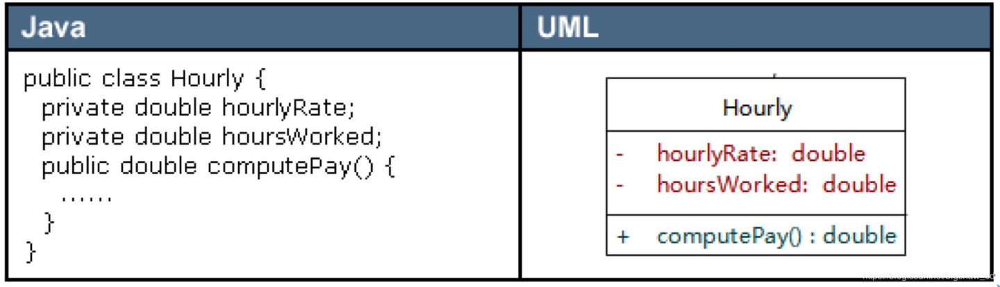

### AbstractClass 抽象类

抽象类在 `UML` 类图中同样用矩形框表示，但是抽象类的类名以及抽象方法的名字都用斜体字表示，如图 `2`所示。

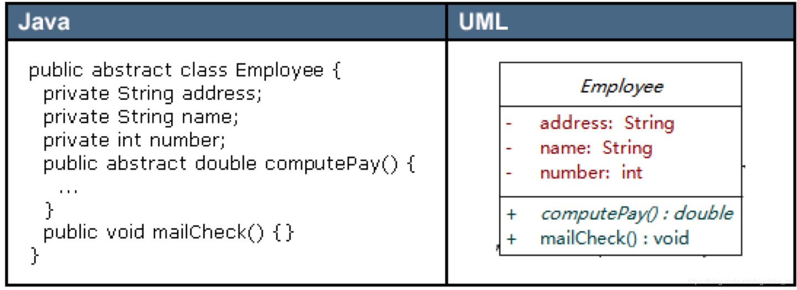

### interface 接口

接口在类图中也是用矩形框表示，但是与类的表示法不同的是，接口在类图中的第一层顶端用构造型 `<<interface>>`表示，下面是接口的名字，第二层是方法：

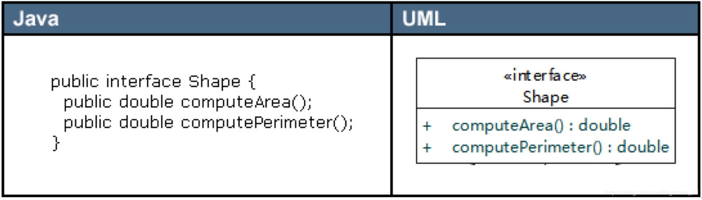

### Package 包

类和接口一般都出现在包中，`UML` 类图中包的表示形式如图 `4` 所示。

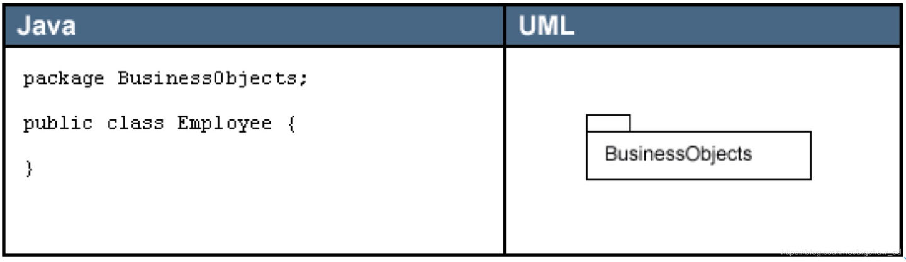

## 关系

类和类、类和接口、接口和接口之间存在一定关系，`UML`类图中一般会有连线指明它们之间的关系。关系共有六种类型，分别是实现关系、泛化关系、关联关系、依赖关系、聚合关系、组合关系，如图所示。

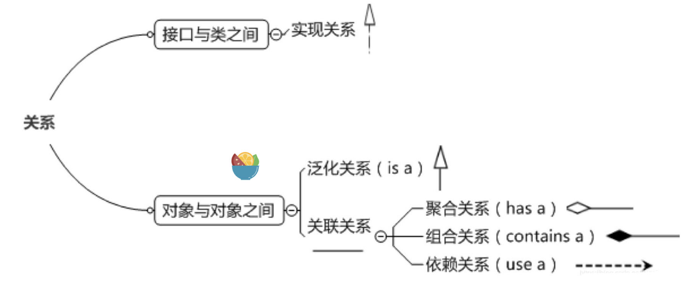

### 实现关系 `can do`

实现关系是指接口及其实现类之间的关系。在 `UML` 类图中，实现关系用空心三角和虚线组成的箭头来表示，从实现类指向接口，如图所示。在 `Java` 代码中，实现关系可以直接翻译为关键字 `implements`。

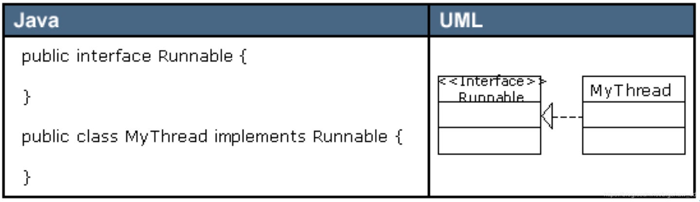

### 泛化关系 `is a`

泛化关系（`Generalization`）是指对象与对象之间的继承关系。比如下面的 `Professor` 继承于 `Employee`：

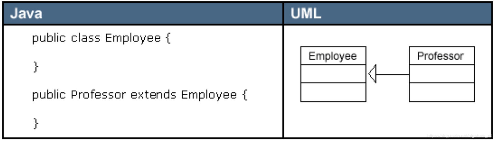

### 关联关系 `links a`

关联关系（`Association`）是指对象和对象之间的连接，它使一个对象知道另一个对象的属性和方法。在`Java`中，关联关系的代码表现形式为一个对象含有另一个对象的引用。也就是说，如果一个对象的类代码中，包含有另一个对象的引用，那么这两个对象之间就是关联关系。

关联关系有单向关联和双向关联。如果两个对象都知道（即可以调用）对方的公共属性和操作，那么二者就是双向关联。如果只有一个对象知道（即可以调用）另一个对象的公共属性和操作，那么就是单向关联。大多数关联都是单向关联，单向关联关系更容易建立和维护，有助于寻找可重用的类。

在`UML`图中，双向关联关系用带双箭头的实线或者无箭头的实线双线表示。单向关联用一个带箭头的实线表示，箭头指向被关联的对象，如图`9`所示。这就是导航性（`Navigatity`）。

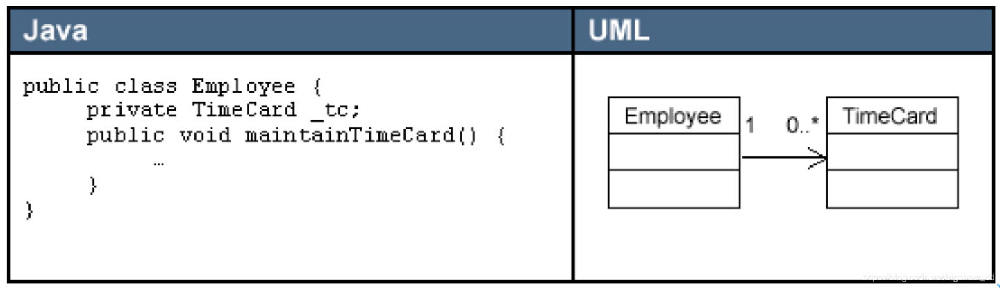

一个对象可以持有其它对象的数组或者集合。在UML中，通过放置多重性（multipicity）表达式在关联线的末端来表示。多重性表达式可以是一个数字、一段范围或者是它们的组合。多重性允许的表达式示例如下：

+ 数字：精确的数量
+ `*`或者`0..*`：表示0到多个
+ `0..1`：表示0或者1个，在Java中经常用一个空引用来实现
+ `1..*`：表示1到多个

关联关系又分为依赖关联、聚合关联和组合关联三种类型：

### 依赖关系 `depends a`

依赖（`Dependency`）关系是一种弱关联关系。如果对象`A`用到对象`B`，但是和`B`的关系不是太明显的时候，就可以把这种关系看作是依赖关系。如果对象`A`依赖于对象`B`，则 `A` “`use a`” `B`。比如驾驶员和汽车的关系，驾驶员使用汽车，二者之间就是依赖关系。

在UML类图中，依赖关系用一个带虚线的箭头表示，由使用方指向被使用方，表示使用方对象持有被使用方对象的引用，如图10所示。

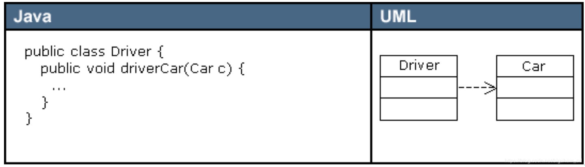

依赖关系在Java中的具体代码表现形式为**B为A的构造器**或**方法中的局部变量**、**方法或构造器的参数**、**方法的返回值**，或者**A调用B的静态方法**。

### 聚合关系 `has a`

聚合（`Aggregation`）是关联关系的一种特例，它体现的是整体与部分的拥有关系，即 “has a” 的关系。此时整体与部分之间是可分离的，它们可以具有各自的生命周期，部分可以属于多个整体对象，也可以为多个整体对象共享，所以聚合关系也常称为共享关系。

在UML图中，聚合关系用空心菱形加实线箭头表示，空心菱形在整体一方，箭头指向部分一方，如图 `11` 所示。

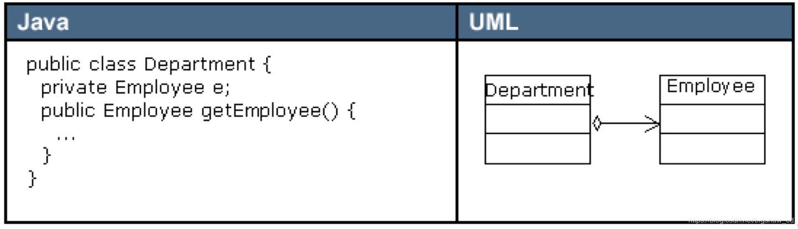

### 组合关系 `contain a`

组合（`Composition`）也是关联关系的一种特例，它同样体现整体与部分间的包含关系，即 “`contains a`” 的关系。但此时整体与部分是不可分的，部分也不能给其它整体共享，作为整体的对象负责部分的对象的生命周期。这种关系比聚合更强，也称为强聚合。如果`A`组合`B`，则`A`需要知道`B`的生存周期，即可能`A`负责生成或者释放`B`，或者`A`通过某种途径知道`B`的生成和释放。

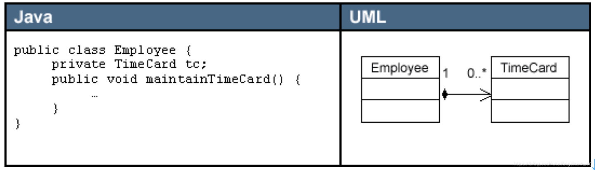

### 聚合和组合

在 `Java` 代码形式上，聚合和组合关系中的部分对象是整体对象的一个成员变量。但是，在实际应用开发时，两个对象之间的关系到底是聚合还是组合，有时候很难区别。

很多时候仅从类代码本身是区分不了聚合和组合的。如果一定要区分，那么如果在删除组合对象的时候，会造成副作用，那么就是组合关系，否则可能就是聚合关系。从业务角度上来看，如果作为整体的对象必须要部分对象的参与，才能完成自己的职责，那么二者之间就是组合关系，否则就是聚合关系。

我更感觉聚合是一种属性委托，而组合是一种函数委托。

## 委托

**委托模式（delegation pattern）**是[软件设计模式](https://zh.wikipedia.org/wiki/软件设计模式)中的一项基本技巧。在委托模式中，有两个对象参与处理同一个请求，接受请求的对象将请求委托给另一个对象来处理。

委托依赖于动态绑定或者静态绑定，如果是动态绑定则可以在运行时调用不同的代码段，可以看下面代码：

```java
public class A {
    void foo() {
        this.bar(); 
    }
    void bar() { 
        System.out.println("a.bar");
    }
}
```

在 `B` 类中，不使用继承，而是利用委托结合 `A` ，达到复用 `A` 类中代码的效果：

```java
public class B {
    private A a;
    public B(A a) {
        this.a = a; 
    }
    void foo() {
        a.foo(); // call foo() on the a-instance }
    }
    void bar() {
        System.out.println("b.bar");
    }
}
```

### 临时性委托

在这种关系中，一个类使用另一个类而不将其作为一个属性。两类之间的这种关系称为 `“uses-a”` 关系。例如，它可以是一个参数，或者在一个方法中本地使用，参考下面的代码：

首先新建一个课程类：

```java
public class Course {}
```

在课表类总使用课程类：

```java
public class CourseSchedule {

  	public List<Course> create() {
     	List<Course> courses = new ArrayList<>();
      return courses;
    }
    public void add (Course c) {
        courses.add(c);
    }
    public void remove (Course c) {
        courses.remove(c);
    }
}
```

在这里，并没有将`Course`类作为`CourseSchedule`类的属性来使用，而是作为迭代器中的元素和方法中的参数来使用。

### 永久性委托__聚合(Aggregation)

关联是类之间的持久关系，允许一个对象实例让另一个对象实例代表它自己做其他事。这种关系属于``has-a``的关系，是结构化的，因为它指定了一种对象与另一种对象相连接，并且不代表行为，即不在该类的方法中使用另一个类的方法，只是简单的将不同的对象连接起来。

下面展示一下关联的代码：

```java
class Teacher {
    public Student [] students; 
}

class Student {
    public Teacher teacher;
    Course[] selectedCourses;
}
```

可以看到，在两个类中（`Student`和`Teacher`）互相都有彼此的实例，而且没有使用继承，就直接将这几个不同的类相连接，这就是利用了`Association`方式。而这里两个类可以是互为聚合的关系，在自己属性上提供另一个类的访问点。

或者这种：

```java
class Student {}

class Course { 
    private Student[] students; 
    public addStudent (Student s) { 
        studtents.append(s); 
    } 
}
```

### 永久性委托__组合(Composition)

组合是将简单对象或数据类型组合成更复杂的方法的一种方法。这种关系是 `a-part-of` 关系，一个类应用另一个类实例作为属性，并且在自己的方法里融汇了另一个类的方法。这是一种强依赖关系。

```ts
class Heart {}

class Person { 
    private Heart heart = new Heart();
    public void operation () { 
        heart.operation(); 
    }
}
```

这种方式理解起来就很简单了，直接在该类中实例化一个其他类，然后该调用方法调用方法，对这个实例想怎么用怎么用，十分灵活。

不过需要注意的是：
这里的实例是 `private` 的，也就是说，外界访问不到，这样的话，更改其值只能在该方法中；而且每次创建该类的对象时，就已经创建好这个类中的实例；也就是说一旦创建好该类的对象，其中的属性指向便已经创建好。

### 组合、聚合和委托

有了上面几个委托模式的讲解我们就明白了，组合、聚合都是委托的实现方式。

### 隐藏委托关系

我们通常使用组合来在服务类上添加委托类的访问点以隐藏委托关系：

从两个`classes`开始，代表「人」的`Person`和代表「部门」的`Department`：

```ts
class Person {
   Department _department;
   public Department getDepartment() {
       return _department;
   }
   public void setDepartment(Department arg) {
       _department = arg;
   }
 }
 class Department {
   private String _chargeCode;
   private Person _manager;
   public Department (Person manager) {
       _manager = manager;
   }
   public Person getManager() {
       return _manager;
   }
```

如果客户希望知道某人的经理是谁，他必须先取得`Department`对象：

```ts
manager = john.getDepartment().getManager();
```

这样的编码就是对客户揭露了`Department`的工作原理，于是客户知道：`Department`用以追踪「经理」这条信息。如果对客户隐藏`Department`，可以减少耦合（`coupling`）。 为了这一目的，我在`Person`中建立一个简单的委托函数：

```ts
public Person getManager() {
  return _department.getManager();
}
```

现在，我得修改 `Person` 的所有客户，让它们改用新函数：

```java
manager = john.getManager();
```

只要完成了对`Department`所有函数的委托关系，并相应修改了`Person`的所有客 户，我就可以移除`Person`中的访问函数`getDepartment()`了。