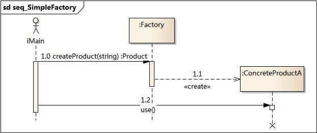

# SimpleFactory. 简单工厂模式

简单工厂模式又叫 **静态方法模式**，因为工厂类中定义了**一个静态方法**用于创建对象。简单工厂让使用者不用知道**具体的产品**就可以创建出所需的 ”产品“ 类，即使用者可以直接消费产品而不需要知**道产品的具体生产细节**。



## 简单工厂模式结构


**工厂 `Factory`：**工厂角色负责实现创建所有实例的内部逻辑。

**抽象产品角色 `Product`：**抽象产品角色是所创建的所有对象的父类，负责描述所有实例所共有的公共接口，这个抽象产品类也可以是一个接口。

**具体产品角色 `ConcreteProduct`：**具体产品角色是创建目标，所有创建的对象都充当这个角色的某个具体类的实例。

## 总结

在以下情况下可以使用简单工厂模式：

+ 工厂类负责创建的对象比较少：由于创建的对象较少，不会造成工厂方法中的业务逻辑太过复杂。
+ 客户端只知道传入工厂类的参数，对于如何创建对象不关心：客户端既不需要关心创建细节，甚至连类名都不需要记住，只需要知道类型所对应的参数。

**优点**

+ 工厂类含有必要的判断逻辑，可以决定在什么时候创建哪一个产品类的实例，客户端可以免除直接创建产品对象的责任，而仅仅“消费”产品；简单工厂模式通过这种做法实现了对责任的分割，它提供了专门的工厂类用于创建对象。
+ 客户端无须知道所创建的具体产品类的类名，只需要知道具体产品类所对应的参数即可，对于一些复杂的类名，通过简单工厂模式可以减少使用者的记忆量。
+ 通过引入配置文件，可以在不修改任何客户端代码的情况下更换和增加新的具体产品类，在一定程度上提高了系统的灵活性。

**缺点**

+ 由于工厂类集中了所有产品创建逻辑，一旦不能正常工作，整个系统都要受到影响。
+ 使用简单工厂模式将会增加系统中类的个数，在一定程序上增加了系统的复杂度和理解难度。
+ 系统扩展困难，一旦添加新产品就不得不修改工厂逻辑，在产品类型较多时，有可能造成工厂逻辑过于复杂，不利于系统的扩展和维护。
+ 简单工厂模式由于使用了静态工厂方法，造成工厂角色无法形成基于继承的等级结构。

## Mini Mode(Object factory)

> **[小贴士：]()**什么是 `Object Mode`？前面的章节我详细探讨了`javascript` 的编程风格，在 `javascript` 中我们可以直接创建对象，所以严格遵循基于类模式下面向对象设计模式会让原本灵活的代码变得很臃肿。
>
> 所以我提供了  `Mini Mode` 来实现符合 `javascript` 语法风格的设计模式。

实际开发中我们通常使用简单函数来代替工厂类：

```ts
function shapeFactory(shapeType: string): Shape {
  if (shapeType === "CIRCLE") {
    return new Circle();
  } else if (shapeType === "RECTANGLE") {
    return new Rectangle();
  } else if (shapeType === "SQUARE") {
    return new Square();
  }
  return null;
}
```

在 `javascript` 中工厂函数也可以直接创建对象：

```ts
function createTalker(name: string) {
    return {
        talk(word: string) {
            console.log(`${name}: ${word}`);
        },
    };
}
```

## Strict Mode(Class Mode)

下面的代码示例就是一个简单工厂，单纯的用于生成 `Shape` 子类，同时 `Shape` 子类也可以在别处单独实例化：

```ts
abstract class Shape {
    public draw() {
      console.log('shape can`t create a instance.')
    }
}

class Circle extends Shape {
    draw() {
        console.log("circle");
    }
}

class Square extends Shape {
    draw() {
        console.log("cquare");
    }
}

class Rectangle extends Shape {
    draw() {
        console.log("cectangle");
    }
}

class AnimalFactory {
    static getShapeInstance(shapeType: string): Shape {
        if (shapeType === "CIRCLE") {
            return new Circle();
        } else if (shapeType === "RECTANGLE") {
            return new Rectangle();
        } else if (shapeType === "SQUARE") {
            return new Square();
        }
        return null;
    }
}
```

