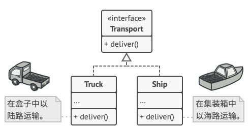

# Factory. 工厂方法模式

**工厂方法模式**`(Factory Method Pattern)`又称为工厂模式，也叫虚拟构造器`(Virtual Constructor)`模式或者**多态工厂`(Polymorphic Factory)`模式**。

在工厂模式中，**工厂父类**(通常是抽象类)负责定义创建产品对象的公共接口，而**工厂子类**则负责生成具体的产品对象，这样做的目的是将产品类的**实例化操作延迟到工厂子类中完成**，即通过**工厂子类来确定究竟应该实例化哪一个具体产品类**。


工厂和产品是抽象出来的两个层，工厂抽象类下可以有多个实际工厂用于生产产品接口下不同的产品！

## 场景模拟

假设你正在开发一款物流管理应用。 最初版本只能处理陆地工具运输(卡车、汽车)，经过上一节的学习你很聪明的构建了一个简单工厂来创建运输工具实例。

```ts
interface Logistics {}
class Car implements Logistic {}
class Trunk implements Logistic {}

class LogisticsFactory {
	static createLogisticInstance(): Logistics {}
}
```

一段时间后， 这款应用变得极受欢迎。 你每天都能收到十几次来自海运公司的请求， 希望应用能够支持海上物流功能。


这可是个好消息。 但是代码问题该如何处理呢？ 目前， 大部分代码都与陆地运输工具有关相关。 在程序中添加 `轮船`类需要在工厂中添加很多代码。更糟糕的是， 如果你以后需要在程序中支持另外一种运输方式， 很可能需要再次对这些代码进行大幅修改。这也有点偏离单一职责原则。

最后， 你将不得不编写繁复的代码， 根据不同的运输对象类， 在应用中进行不同的处理。

## 解决方案

工厂方法模式建议使用特殊的*工厂*方法代替对于对象构造函数的直接调用 （即使用 `new`运算符）。 不用担心， 对象仍将通过 `new`运算符创建， 只是该运算符改在工厂方法中调用罢了。 工厂方法返回的对象通常被称作 “产品”。


乍看之下， 这种更改可能毫无意义： 我们只是改变了程序中调用构造函数的位置而已。 但是， 仔细想一下， 现在你可以在子类中重写工厂方法， 从而改变其创建产品的类型，比如陆地交通工具可以处理汽车和卡车，而海上运输则可以处理轮船和潜艇。。

但有一点需要注意:仅当**这些产品具有共同的基类或者接口时**， **子类才能返回不同类型的产品**， 同时基类中的工厂方法还应将其返回类型声明为这一共有接口。



## 工厂模式结构


**产品 `Product`：**  将会对接口进行声明。 对于所有由创建者及其子类构建的对象， 这些接口都是通用的。

**具体产品 `Concrete Products`：** 是产品接口的不同实现。

**创建者 `Creator`：** 此类声明返回**产品对象的工厂方法**。 **该方法的返回对象**类型必须与产品接口相匹配。

+ 你可以将工厂方法声明为抽象方法， 强制要求每个子类以不同方式实现该方法。 或者， 你也可以在基础工厂方法中返回默认产品类型。

**具体创建者 `Concrete Creators`：** 将会重写基础工厂方法， 使其返回不同类型的产品。

+ 注意， 并不一定每次调用工厂方法都会**创建**新的实例。 工厂方法也可以返回缓存、 对象池或其他来源的已有对象。

## 总结

**1.当你在编写代码的过程中， 如果无法预知对象确切类别及其依赖关系时， 可使用工厂方法。**

工厂方法将创建产品的代码与实际使用产品的代码分离，从而能在不影响其他代码的情况下扩展产品创建部分代码。

例如， 如果需要向应用中添加一种新产品，你只需要开发新的创建者子类， 然后重写其工厂方法即可。

**2.如果你希望复用现有对象来节省系统资源， 而不是每次都重新创建对象， 可使用工厂方法。**

 在处理大型资源密集型对象 （比如数据库连接、 文件系统和网络资源） 时， 你会经常碰到这种资源需求。

让我们思考复用现有对象的方法：

1. 首先， 你需要创建存储空间来存放所有已经创建的对象。
2. 当他人请求一个对象时， 程序将在对象池中搜索可用对象。
3. …然后将其返回给客户端代码。
4. 如果没有可用对象， 程序则创建一个新对象 （并将其添加到对象池中）。

这些代码可不少！ 而且它们必须位于同一处， 这样才能确保重复代码不会污染程序。

-----

**优点**

+ 你可以避免创建者和具体产品之间的紧密耦合。
+ **单一职责原则：**你可以将产品创建代码放在程序的单一位置， 从而使得代码更容易维护。
+  **开闭原则：** 无需更改现有客户端代码， 你就可以在程序中引入新的产品类型。

**缺点**

+  应用工厂方法模式需要引入许多新的子类， 代码可能会因此变得更复杂。 最好的情况是**将该模式引入创建者类的现有层次结构中。(比如将火车引入上面的陆地交通工具类)**

## Mini Mode(Object factory)

> **[小贴士：]()**什么是 `Object Mode`？前面的章节我详细探讨了`javascript` 的编程风格，在 `javascript` 中我们可以直接创建对象，所以严格遵循基于类模式下面向对象设计模式会让原本灵活的代码变得很臃肿。
>
> 所以我提供了  `Mini Mode` 来实现符合 `javascript` 语法风格的设计模式。

其实抽象方法不一定必须返回一个类的实例，也可以直接实现类的方法，方法签名在父类(抽象类)中声明，而父类中的公有方法直接调用抽象方法签名：

```ts
export abstract class DirectoryScraper {
    scanFiles(dirPath: string) {
        return fs
            .readdirSync(dirPath)
            .reduce<Record<string, unknown>>(
                (acc: Record<string, unknown>, fileName: string) => {
                    let filePath = `${dirPath}/${fileName}`;
                    if (this.isJSONFile(filePath)) {
                        acc[fileName] = this.readJSON(filePath);
                    } else {
                        acc[fileName] = this.readText(filePath);
                    }
                    return acc;
                },
                {}
            );
    }
    abstract isJSONFile(path: string): boolean;
    abstract readText(path: string): string;
    abstract readJSON(path: String): unknown;
}
```

子类实现父类抽象方法：

```ts
export class FileReader extends DirectoryScraper {
    public isJSONFile(filePath: string): boolean {
        return filePath.endsWith('.json');
    }
    public readText(filePath: string): string {
        return fs.readFileSync(filePath, 'utf-8').toString();
    }
    public readJSON(filePath: string): unknown {
        return JSON.parse(fs.readFileSync(filePath, 'utf-8').toString());
    }
}

```

### functional type

额使用函数其实是不好实现类之间的继承关系，没办法只能将子类当做参数传递，做一个松耦合：

```ts
export const createScrapeDirectory =
    (fileReader: FileReader) => (dirPath: string) => {
        return fs
            .readdirSync(dirPath)
            .reduce<Record<string, unknown>>(
                (acc: Record<string, unknown>, fileName: string) => {
                    let filePath = `${dirPath}/${fileName}`;
                    if (fileReader.isJSONFile(filePath)) {
                        acc[fileName] = fileReader.readJSON(filePath);
                    } else {
                        acc[fileName] = fileReader.readText(filePath);
                    }
                    return acc;
                },
                {}
            );
    };

export const fileReader: FileReader = {
    isJSONFile(filePath: string): boolean {
        return filePath.endsWith('.json');
    },
    readText(filePath: string): string {
        return fs.readFileSync(filePath, 'utf-8').toString();
    },
    readJSON(filePath: string): unknown {
        return JSON.parse(fs.readFileSync(filePath, 'utf-8').toString());
    },
};
```

## Strict Mode(Class Mode)

工厂方法模式在 `TypeScript` 代码中得到了广泛使用。 当你需要在代码中提供高层次的灵活性时， 该模式会非常实用。工厂方法可通过构建方法来识别， 它会创建具体类的对象， 但以抽象类型或接口的形式返回这些对象。

**Logistics.ts(Creator)**

```ts
abstract class Logistics {
    public abstract createInstance(): Transport;
  
    public logCurLogistics(): string {
        const transport = this.createInstance();
        return `transport: ${transport.deliver()}`;
    }
}

class SeaLogistics extends Logistics {
    public createInstance(): Transport {
        return new Ship();
    }
}

class RoadLogistics extends Transport {
    public createInstance(huge: boolean): Transport {
        return huge ? new Trunk() : new Car();
    }
}
```

**Transport.ts(Product)**

```ts
interface Transport {
    deliver(): string;
}

class Car implements Transport {
    public deliver(): string {
        return '{deliver by Car}';
    }
}

class Trunk implements Transport {
    public deliver(): string {
        return '{deliver by Trunk}';
    }
}

class Ship implements Transport {
    public deliver(): string {
        return '{deliver by ship}';
    }
}
```

**client.ts**

```ts
let logFactory: Logistics = new RoadLogistics();
let trunk: Transport = logFactory.createInstance();
logFactory.logCurLogistics();
```

