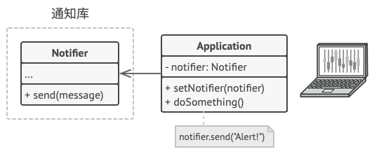
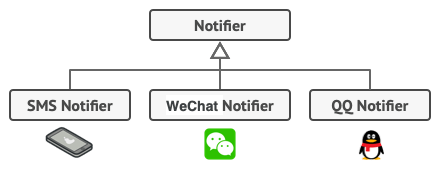
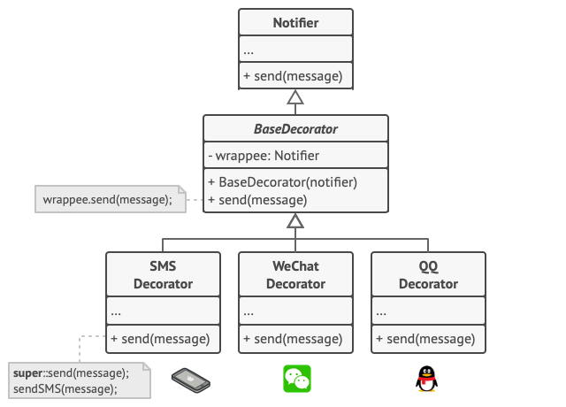
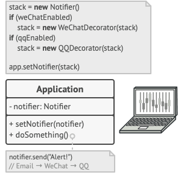

# Decorator. 装饰模式

**装饰模式**是一种结构型设计模式， 允许你通过将对象放入包含行为的特殊封装对象中来为原对象绑定新的行为。


## 场景模拟

假设你正在开发一个提供通知功能的库， 其他程序可使用它向用户发送关于重要事件的通知。

库的最初版本基于 `通知器`Notifier类， 其中只有很少的几个成员变量， 一个构造函数和一个 `send`发送方法。 该方法可以接收来自客户端的消息参数， 并将该消息发送给一系列的邮箱， 邮箱列表则是通过构造函数传递给通知器的。 作为客户端的第三方程序仅会创建和配置通知器对象一次， 然后在有重要事件发生时对其进行调用。



此后某个时刻， 你会发现库的用户希望使用除邮件通知之外的功能。 许多用户会希望接收关于紧急事件的手机短信， 还有些用户希望在微信上接收消息， 而公司用户则希望在 QQ 上接收消息。



这有什么难的呢？ 首先扩展 `通知器`类， 然后在新的子类中加入额外的通知方法。 现在客户端要对所需通知形式的对应类进行初始化， 然后使用该类发送后续所有的通知消息。

但是很快有人会问：  “为什么不同时使用多种通知形式呢？ 如果房子着火了， 你大概会想在所有渠道中都收到相同的消息吧。”

你可以尝试创建一个特殊子类来将多种通知方法组合在一起以解决该问题。 但这种方式会使得代码量迅速膨胀， 不仅仅是程序库代码， 客户端代码也会如此。


子类组合数量爆炸。你必须找到其他方法来规划通知类的结构， 否则它们的数量会在不经意之间打破吉尼斯纪录。

## 解决方案

**封装器**是装饰模式的别称， 这个称谓明确地表达了该模式的主要思想。  

“封装器” 是一个能与其他 “目标” 对象连接的对象。 封装器包含**与目标对象相同的一系列方法**， 它会**将所有接收到的请求委派给目标对象**。但是，封装器可以在将**请求委派给目标前后对其进行处理**，所以可能会改变最终结果。

那么什么时候一个简单的封装器可以被称为是真正的装饰呢？正如之前提到的，**封装器实现了与其封装对象相同的接口。因此从客户端的角度来看，这些对象是完全一样的。**

**封装器中的引用成员变量可以是遵循相同接口的任意对象。**正因为这一点装饰器可以嵌套多层，因为封装器的每一层都与封装对象使用的相同接口。

使得你可以将一个对象放入多个封装器中， 并在对象中添加所有这些封装器的组合行为。



客户端代码必须将基础通知器放入一系列自己所需的装饰中。 因此最后的对象将形成一个栈结构(构造函数嵌套所形成的堆栈)。



实际与客户端进行交互的对象将是最后一个进入栈中的装饰对象。 由于所有的装饰都实现了与通知基类相同的接口， 客户端的其他代码并不在意自己到底是与 “纯粹” 的通知器对象， 还是与装饰后的通知器对象进行交互。

这个通过装饰器不断嵌套包装源对象的行为可以比作给一个人穿衣服，


穿衣服是使用装饰的一个例子。 觉得冷时， 你可以穿一件毛衣。 如果穿毛衣还觉得冷， 你可以再套上一件夹克。 如果遇到下雨， 你还可以再穿一件雨衣。 所有这些衣物都 “扩展” 了你的基本行为， 但它们并不是你的一部分， 如果你不再需要某件衣物， 可以方便地随时脱掉。

## 装饰模式结构


**部件** `Component`： 声明封装器和被封装对象的公用接口，因为封装器和被装饰对象的方法是一模一样的，所以可以共用接口。

**具体部件** `Concrete Component`： 类是被封装对象所属的类。 它定义了基础行为， 但装饰类可以改变这些行为。

**基础装饰** `Base Decorator`：类拥有一个指向被封装对象的引用成员变量。该变量的类型应当被声明为通用部件接口， 这样它就可以引用具体的部件和装饰。 装饰基类会将所有操作委派给被封装的对象。

**具体装饰类**  `Concrete Decorators`  定义了可动态添加到部件的额外行为。 具体装饰类会重写装饰基类的方法，并在调用父类方法之前或之后进行额外的行为。

**客户端** `Client`：可以使用多层装饰来封装部件， 只要它能使用通用接口与所有对象互动即可。

## 总结

**1.如果你希望在无需修改代码的情况下即可使用对象，且希望在`运行时`为对象新增额外的行为，可以使用装饰模式。**

装饰能将业务逻辑组织为层次结构， 你可为各层创建一个装饰， 在运行时将各种不同逻辑组合成对象。 由于这些对象都遵循通用接口， 客户端代码能以相同的方式使用这些对象。

**2.如果用继承来扩展对象行为的方案难以实现或者根本不可行， 你可以使用该模式。**

许多编程语言使用 `final`最终关键字来限制对某个类的进一步扩展。 复用最终类已有行为的唯一方法是使用装饰模式： 用封装器对其进行封装。

----

老生常谈之优缺点：

**优点**

+  你无需创建新子类即可扩展对象的行为。
+  你可以在运行时添加或删除对象的功能。
+  你可以用多个装饰封装对象来组合几种行为。
+  **单一职责原则：** 你可以将实现了许多不同行为的一个大类拆分为多个较小的类。

**缺点**

+  在封装器栈中删除特定封装器比较困难。
+  实现行为不受装饰栈顺序影响的装饰比较困难。
+  各层的初始化配置代码看上去可能会很糟糕。

## Mini Mode(Object factory)

> **[小贴士：]()**什么是 `Object Mode`？前面的章节我详细探讨了`javascript` 的编程风格，在 `javascript` 中我们可以直接创建对象，所以严格遵循基于类模式下面向对象设计模式会让原本灵活的代码变得很臃肿。
>
> 所以我提供了  `Mini Mode` 来实现符合 `javascript` 语法风格的设计模式。

在 **typescript** 中增加小功能使用类，显的有点笨重，`ts` 的优点是灵活，可以使用对象来表示：

```ts
function createGreeter(name: string) {
  return {
    isOnline: false,
    greet() {
        console.log('basic hello, my name is', name);
    },
  }
}

function qqEnhance<T extends Greetable>(createGreeter: (name: string) => T) {
    return (name: string) => {
      	let greeter = createGreeter(name);
      	greeter.isOnline = true; // 属性增强；
        return {
            greet() {
                greeter.greet(); // 方法增强；
                console.log('i am a qq user');
            },
        };
    };
}

let qqGreeter = qqEnhance(createGreeter("bob"));
```

## Strict Mode (Class)

装饰在 `TypeScript` 代码中可谓是标准配置， 尤其是在与流式加载相关的代码中：

**component.ts**

```ts
/**
 * The base Component interface defines operations that can be altered by
 * decorators.
 */
interface Component {
    operation(): string;
}

/**
 * Concrete Components provide default implementations of the operations. There
 * might be several variations of these classes.
 */
class ConcreteComponent implements Component {
    public operation(): string {
        return 'ConcreteComponent';
    }
}
```

**decorator.ts**

```ts
/**
 * The base Decorator class follows the same interface as the other components.
 * The primary purpose of this class is to define the wrapping interface for all
 * concrete decorators. The default implementation of the wrapping code might
 * include a field for storing a wrapped component and the means to initialize
 * it.
 */
class Decorator implements Component {
    protected component: Component;

    constructor(component: Component) {
        this.component = component;
    }

    /**
     * The Decorator delegates all work to the wrapped component.
     */
    public operation(): string {
        return this.component.operation();
    }
}

/**
 * Concrete Decorators call the wrapped object and alter its result in some way.
 */
class ConcreteDecoratorA extends Decorator {
    /**
     * Decorators may call parent implementation of the operation, instead of
     * calling the wrapped object directly. This approach simplifies extension
     * of decorator classes.
     */
    public operation(): string {
        return `ConcreteDecoratorA(${super.operation()})`;
    }
}

/**
 * Decorators can execute their behavior either before or after the call to a
 * wrapped object.
 */
class ConcreteDecoratorB extends Decorator {
    public operation(): string {
        return `ConcreteDecoratorB(${super.operation()})`;
    }
}
```

**client.ts**

```ts
function clientCode(component: Component) {
    // ...

    console.log(`RESULT: ${component.operation()}`);

    // ...
}

/**
 * This way the client code can support both simple components...
 */
const simple = new ConcreteComponent();
const decorator1 = new ConcreteDecoratorA(simple);
const decorator2 = new ConcreteDecoratorB(decorator1);
console.log('Client: Now I\'ve got a decorated component:');
clientCode(decorator2);
```

## @Decorator In Ts

装饰器在 `TS` 中其实是另一种概念，其为类的声明及成员上通过元编程语法添加标注提供了一种方式：

```ts
@QQGreeterDecorator
class Greeter {
    greet() {
        console.log('basic hello');
    }
}
```

来说说 `TS` 装饰器和设计模式中的`Decorator`的区别，首先 `TS` 装饰器并不严格要求装饰表达式实现了被装饰类的接口，而是允许定义新方法或者覆盖原属性，并且提供了多种装饰器类型。其次 `TS` 装饰器虽然省去了嵌套声明装饰的过程，但是却失去了运行时修改类的能力。

所以`TS` 装饰器更倾向于是**为类的声明及成员上通过元编程语法添加标注提供了一种方式**。而不是**在运行时扩展类的功能！！！**

### Example

来看两个类装饰器的使用例子就知道了(`TS`中还有其他的装饰器类型，旨在对类更细粒度的类元编程)，**类装饰器**在类声明之前被声明。类装饰器应用于类构造函数，可以用来**监视，修改或替换**类定义。

类装饰器表达式会在运行时当作函数被调用，**类的构造函数作**为其唯一的参数。如果类装饰器返回一个值，它会**使用提供的构造函数来替换类的声明**。

> [注意：]()如果你要返回一个新的构造函数，你必须注意处理好原来的原型链。 在运行时的装饰器调用逻辑中不会为你做这些。

#### @sealed

先来看一个例子，使用装饰器实现 `Object.seal` 功能(**密封:** 阻止添加新属性并将所有现有属性标记为不可配置)，下面是使用类装饰器(`@sealed`)的例子，应用在`Greeter`类：

```ts
@sealed
class Greeter {
    greeting: string;
    constructor(message: string) {
        this.greeting = message;
    }
    greet() {
        return "Hello, " + this.greeting;
    }
}
```

我们可以这样定义`@sealed`装饰器，当`@sealed`被执行的时候，它将密封此类的构造函数和原型：

```ts
function sealed(constructor: Function) {
    Object.seal(constructor);
    Object.seal(constructor.prototype);
}
```

#### @QQGreeterDecorator

再来看一个重写构造函数返回值的例子：

```ts
interface Greetable {
    greet(): void;
}

function QQGreeterDecorator<T extends new (...args: any[]) => Greetable>(
    SuperClass: T
) {
    return class extends SuperClass {
        greet() {
            super.greet();
            console.log('qq hello');
        }
    };
}

@QQGreeterDecorator
class Greeter {
    greet() {
        console.log('basic hello');
    }
}
```

### 总结

使用 `TS Decorator`  结合装饰器模式可以写出很优雅的**伪装饰器代码**，为什么是 '伪'？因为这种写法将装饰器锁死在类上，即改变了类本身，又没有运行时扩展的能力。可以说是很僵硬的装饰器构造语法糖：

```ts
const simple = new ConcreteComponent();
const decorator1 = new ConcreteDecoratorA(simple);
const decorator2 = new ConcreteDecoratorB(decorator1);
=====
@ConcreteDecoratorB
@ConcreteDecoratorA
class ConcreteComponent{}
```

