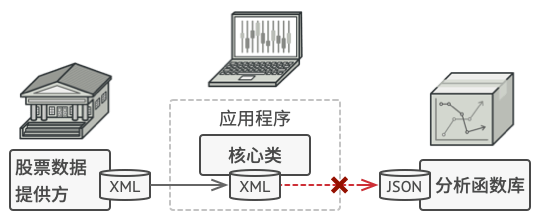
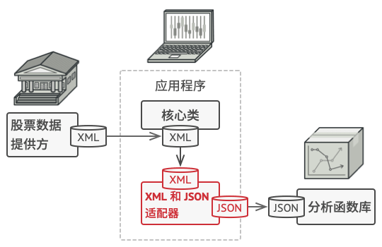

# Adaptor. 适配器模式

**适配器模式**是一种结构型设计模式， 它能使接口不兼容的对象能够相互合作。这里的接口不必是`OOP`中的接口，你可以理解为广义的接口 即 暴露给外部调用的 `API` 协议。


## 场景模拟

假如你正在开发一款股票市场监测程序， 它会从不同来源下载 `XML` 格式的股票数据， 然后向用户呈现出美观的图表。

在开发过程中， 你决定在程序中整合一个第三方智能分析函数库。 但是遇到了一个问题， 那就是分析函数库只兼容 `JSON` 格式的数据。



你可以修改程序库来支持 `XML`。 但是， 这可能需要修改部分依赖该程序库的现有代码。 甚至还有更糟糕的情况， 你可能根本没有程序库的源代码， 从而无法对其进行修改。

## 解决方案

你可以创建一个适配器。 这是一个特殊的对象， 能够转换对象接口， 使其能与其他对象进行交互。

适配器模式通过封装对象将复杂的转换过程隐藏于幕后。 被封装的对象甚至察觉不到适配器的存在。 例如， 你可以使用一个将所有数据转换为英制单位 （如英尺和英里） 的适配器封装运行于米和千米单位制中的对象。

适配器不仅可以转换不同格式的数据， 其还有助于采用不同接口的对象之间的合作。 它的运作方式如下：

1. 适配器实现与其中一个现有对象兼容的接口。
2. 现有对象可以使用该接口安全地调用适配器方法。
3. 适配器方法被调用后将以另一个对象兼容的格式和顺序将请求传递给该对象。

有时你甚至可以创建一个双向适配器来实现双向转换调用。



让我们回到股票市场程序。 为了解决数据格式不兼容的问题， 你可以为分析函数库中的每个类创建将 XML 转换为 JSON 格式的适配器， 然后让客户端仅通过这些适配器来与函数库进行交流。 当某个适配器被调用时， 它会将传入的 XML 数据转换为 JSON 结构， 并将其传递给被封装分析对象的相应方法。

## 适配器模式结构


客户端代码需要适配器来给 `service`提供兼容的数据结构，于是就给 `Adapter` 提供了转换接口，而 `Adapter` 则具体实现数据转换逻辑，内部将数据交给 `service`；

**客户端接口** `Client Interface` 描述了其他类(适配器)与客户端代码合作时必须遵循的协议。

**服务** `Service` 中有一些功能类 （通常来自第三方或遗留系统）。 客户端与其接口不兼容， 因此无法直接调用其功能。

**适配器** `Adapter` 是一个可以同时与客户端和服务交互的类： 它在实现客户端接口的同时封装了服务对象。适配器接受客户端通过适配器接口发起的调用， 并将其转换为适用于被封装服务对象的调用。

> 客户端代码只需通过接口与适配器交互即可， 无需与具体的适配器类耦合。 因此， 你可以向程序中添加新类型的适配器而无需修改已有代码。 这在服务类的接口被更改或替换时很有用： 你无需修改客户端代码就可以创建新的适配器类。

## 总结

还是先来看看应用场景：

**1.当你希望使用某个类， 但是其接口与其他代码不兼容时， 可以使用适配器类。**

适配器模式允许你创建一个中间层类，其可作为代码与遗留类、第三方类或提供怪异接口的类之间的转换器。

-----

再来看看优缺点：

**优点**

+ **单一职责原则：**你可以将接口或数据转换代码从程序主要业务逻辑中分离。
+ **开闭原则：**只要客户端代码通过客户端接口与适配器进行交互， 你就能在不修改现有客户端代码的情况(对修改关闭)下在程序中添加新类型的适配器。

**缺点**

+ 代码整体复杂度增加， 因为你需要新增一系列接口和类。 有时直接更改服务类使其与其他代码兼容会更简单。

## Mini Mode(Object factory)

> **[小贴士：]()**什么是 `Object Mode`？前面的章节我详细探讨了`javascript` 的编程风格，在 `javascript` 中我们可以直接创建对象，所以严格遵循基于类模式下面向对象设计模式会让原本灵活的代码变得很臃肿。
>
> 所以我提供了  `Mini Mode` 来实现符合 `javascript` 语法风格的设计模式。

适配器的核心在于：

+ 定义一个统一的接口；
+ 写一层额外的代码调用、封装下层的 `API` ，让这层代码暴露出定义好的接口。

而且很重要的是适配器不只局限于数据适配，也可以拿来实现环境适配：

### 数据适配器

举个简单的例子，现在有一个记录文件以 `[name, attack, defense]` 的格式存储着数据(宝可梦)，我们的需求是将数据读取并写入数据库，数据库的格式是 `{name, attack, defense}`。

所以我们先声明了一个统一最外层的接口，用于给客户端(`jsonLoader`)和适配器使用：

```ts
export type PokemonTuple = [string, number, number];

export interface RecordHandler<T> {
    addRecord(record: T): void;
}

export function jsonLoader<T>(path: string, handler: RecordHandler<T>) {
    const data: T[] = JSON.parse(fs.readFileSync(path).toString());
    data.forEach((record) => handler.addRecord(record));
}
```

适配器的代码很简单，就是接收被适配者然后添加一层方法调用：

**class type**

```ts
export default class PokemonDBAdapter implements RecordHandler<PokemonTuple> {
    constructor(private adaptee: DataBase<Pokemon>) {}
    addRecord(record: PokemonTuple): void {
        this.adaptee.set(new Pokemon(...record));
    }
}

jsonLoader('/path/to/file', new PokemonDBAdapter(dbInstance));
```

**functional type**

```ts
export default function pokemonDBAdapter(adaptee: DataBase<Pokemon>): RecordHandler<PokemonTuple> {
    return {
        addRecord(record: PokemonTuple): void {
            adaptee.set({
                id: record[0],
                attack: record[1],
                defense: record[2],
            });
        },
    };
}

jsonLoader('/path/to/file', pokemonDBAdapter(dbInstance));
```

### 环境适配

让我们看看鼎鼎大名的`JavaScript http` 客户端库 `axios` 的源代码里如何使用 适配器模式的，`axios` 即可以在前端开发中使用，也可以在 `Node` 环境下使用 —— 它是怎么做到的呢？

```ts
// adapter/http.js  给 Node 环境使用的适配器
module.exports = function httpAdapter(config) { 
  return new Promise(function dispatchHttpRequest(resolve, reject) {
    // ...
  });
}

// adapter/xhr.js  给 浏览器环境使用的适配器
module.exports = function xhrAdapter(config) {
  return new Promise(function dispatchXhrRequest(resolve, reject) {
     // ...
  });
}

// default.js
function getDefaultAdapter() {
  var adapter;  // 判断环境，选择合适的适配器
  if (typeof XMLHttpRequest !== 'undefined') {
    // For browsers use XHR adapter  
    adapter = require('./adapters/xhr');
  } else if (typeof process !== 'undefined') {
    // For node use HTTP adapter
    adapter = require('./adapters/http');
  }
  return adapter;
}

// axios.js  直接使用适配器开始工作
adapter(config).then(function onAdapterResolution(response) {
  // ...
});
```

## Strict Mode

在以上代码中，因为 `Logger` 和 `CloudLogger` 这两个接口不匹配，所以我们引入了 `CloudLoggerAdapter` 适配器来解决兼容性问题。

**main.ts**

```ts
interface Logger {
  info(message: string): Promise<void>;
}

class ClientNotificationService {
  protected logger: Logger;
  
  constructor (logger: Logger) {    
    this.logger = logger;
  }

  public async send(message: string): Promise<void> {
    await this.logger.info(`Notification sended: ${message}`);
  }
}
```

**service.ts**

```ts
interface CloudLogger {
  sendToServer(message: string, type: string): Promise<void>;
}

class AliLogger implements CloudLogger {
  public async sendToServer(message: string, type: string): Promise<void> {
    console.info(message);
    console.info('This Message was saved with AliLogger');
  }
}
```

**adapter.ts**

````ts
class CloudLoggerAdapter implements Logger {
  protected cloudLoggerAdaptee: CloudLogger;

  constructor (cloudLogger: CloudLogger) {
    this.cloudLoggerAdaptee = cloudLogger;
  }

  public async info(message: string): Promise<void> {
    await this.cloudLoggerAdaptee.sendToServer(message, 'info');
  }
}
````

