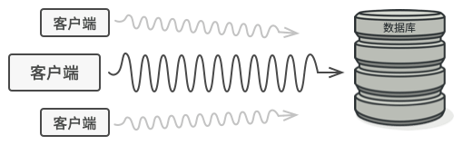

# Proxy. 代理模式

**代理模式**是一种结构型设计模式，让你能够提供对象的替代品。代理控制着对于原对象的访问，并允许在将请求提交给对象前后进行一些处理。

代理模式跟装饰者模式实现上有几分相像，但是目的有些差异，给目标(对象、`function`)创建一个代理，而**代理内部通常有额外的逻辑(与原目标无关的逻辑)。**

我举个例子，比如你给打招呼这个方法创建一个增强器，让它能使用多国语言，这就是一个装饰器，因为最后做的事还是打招呼。如果想给打招呼之前添加一个好友校验，那这就是一个代理，因为校验与原本的功能(打招呼)无关。


## 场景模拟

为什么要控制对于某个对象的访问呢？ 举个例子： 有这样一个消耗大量系统资源的巨型对象， 你只是偶尔需要使用它， 并非总是需要。



你可以实现延迟初始化： 在实际有需要时再创建该对象。 对象的所有客户端都要执行延迟初始代码。 不幸的是， 这很可能会带来很多重复代码。

在理想情况下， 我们希望将代码直接放入对象的类中， 但这并非总是能实现： 比如类可能是第三方封闭库的一部分。

## 解决方案

代理模式建议新建一个与原服务对象接口相同的代理类， 然后更新应用以将代理对象传递给所有原始对象客户端。 代理类接收到客户端请求后会创建实际的服务对象， 并将所有工作委派给它。


## 代理模式结构


**服务接口** `Service Interface`：声明了服务接口。 代理必须遵循该接口才能伪装成服务对象。

**服务** `Service`：类提供了一些实用的业务逻辑。

**代理** `Proxy`： 类包含一个指向服务对象的引用成员变量。 代理完成其任务 （例如延迟初始化、 记录日志、 访问控制和缓存等） 后会将请求传递给服务对象。 通常情况下， 代理会对其服务对象的整个生命周期进行管理。

**客户端** `Client`：能通过同一接口与服务或代理进行交互， 所以你可在一切需要服务对象的代码中使用代理。

## 总结

使用代理模式的方式多种多样， 我们来看看最常见的几种：

**1. 延迟初始化 (虚拟代理)：如果你有一个偶尔使用的重量级服务对象， 一直保持该对象运行会消耗系统资源，可使用代理模式。**

你无需在程序启动时就创建该对象， 可将对象的初始化延迟到真正有需要的时候。

**2.本地执行远程服务 (远程代理)：适用于服务对象位于远程服务器上的情形。**

在这种情形中，代理通过网络传递客户端请求，负责处理所有与网络相关的复杂细节。

**3.记录日志请求 (日志记录代理)：适用于当你需要保存对于服务对象的请求历史记录时。 代理可以在向服务传递请求前进行记录。**

**4.缓存请求结果 (缓存代理)：适用于需要缓存客户请求结果并对缓存生命周期进行管理时， 特别是当返回结果的体积非常大时。**

代理可对重复请求所需的相同结果进行缓存， 还可使用请求参数作为索引缓存的键值。

----

**优点**

+ 你可以在客户端毫无察觉的情况下控制服务对象。
+  如果客户端对服务对象的生命周期没有特殊要求， 你可以对生命周期进行管理。
+  即使服务对象还未准备好或不存在， 代理也可以正常工作。
+  开闭原则：你可以在不对服务或客户端做出修改的情况下创建新代理。

**缺点**

+  代码可能会变得复杂， 因为需要新建许多类。
+  服务响应可能会延迟。

----

**与其他模式的关系**

+ [适配器模式](https://refactoringguru.cn/design-patterns/adapter)能为被封装对象提供不同的接口， [代理模式](https://refactoringguru.cn/design-patterns/proxy)能为对象提供相同的接口， [装饰模式](https://refactoringguru.cn/design-patterns/decorator)则能为对象提供加强的接口。
+ [装饰](https://refactoringguru.cn/design-patterns/decorator)和[代理](https://refactoringguru.cn/design-patterns/proxy)有着相似的结构， 但是其意图却非常不同。 这两个模式的构建都基于组合原则， 也就是说一个对象应该将部分工作委派给另一个对象。 两者之间的不同之处在于*代理*通常自行管理其服务对象的生命周期， 而*装饰*的生成则总是由客户端进行控制。

## Mini Mode(Object factory)

> **[小贴士：]()**什么是 `Object Mode`？前面的章节我详细探讨了`javascript` 的编程风格，在 `javascript` 中我们可以直接创建对象，所以严格遵循基于类模式下面向对象设计模式会让原本灵活的代码变得很臃肿。
>
> 所以我提供了  `Mini Mode` 来实现符合 `javascript` 语法风格的设计模式。

一个给图片加载器添加缓存的例子，属于对一个函数的代理：

```ts
function loadImage(path: string) {
    console.log('loading image from path : ' + path);
    return {
        path: path,
        image: new Image(/* fake image from path */),
    };
}

function createMementoLoader(loader: (path: string) => any) {
    const map: Record<string, any> = {};
    return function (path: string) {
        if (path in map) {
            console.log('No need to load from fs for : ' + path);
            return map[path];
        }

        const image = loader(path);
        map[path] = image;
        return image;
    };
}

let loadImageWithMem = createMementoLoader(loadImage);
loadImageWithMem('1.jpg');
```

## Strict Mode

尽管代理模式在绝大多数 `TypeScript` 程序中并不常见， 但它在一些特殊情况下仍然非常方便。 当你希望在无需修改客户代码的前提下于已有类的对象上增加额外行为时， 该模式是无可替代的。

```ts
/**
 * The Subject interface declares common operations for both RealSubject and the
 * Proxy. As long as the client works with RealSubject using this interface,
 * you'll be able to pass it a proxy instead of a real subject.
 */
interface Subject {
    request(): void;
}

/**
 * The RealSubject contains some core business logic. Usually, RealSubjects are
 * capable of doing some useful work which may also be very slow or sensitive -
 * e.g. correcting input data. A Proxy can solve these issues without any
 * changes to the RealSubject's code.
 */
class RealSubject implements Subject {
    public request(): void {
        console.log('RealSubject: Handling request.');
    }
}

/**
 * The Proxy has an interface identical to the RealSubject.
 */
class Proxy implements Subject {
    private realSubject: RealSubject;

    /**
     * The Proxy maintains a reference to an object of the RealSubject class. It
     * can be either lazy-loaded or passed to the Proxy by the client.
     */
    constructor(realSubject: RealSubject) {
        this.realSubject = realSubject;
    }

    /**
     * The most common applications of the Proxy pattern are lazy loading,
     * caching, controlling the access, logging, etc. A Proxy can perform one of
     * these things and then, depending on the result, pass the execution to the
     * same method in a linked RealSubject object.
     */
    public request(): void {
        if (this.checkAccess()) {
            this.realSubject.request();
            this.logAccess();
        }
    }

    private checkAccess(): boolean {
        // Some real checks should go here.
        console.log('Proxy: Checking access prior to firing a real request.');

        return true;
    }

    private logAccess(): void {
        console.log('Proxy: Logging the time of request.');
    }
}

/**
 * The client code is supposed to work with all objects (both subjects and
 * proxies) via the Subject interface in order to support both real subjects and
 * proxies. In real life, however, clients mostly work with their real subjects
 * directly. In this case, to implement the pattern more easily, you can extend
 * your proxy from the real subject's class.
 */
function clientCode(subject: Subject) {
    // ...

    subject.request();

    // ...
}
```

```ts
let greeter = {
    greet() {
        console.log('basic hello');
    },
};

function qqDecoratorSimple<T extends Greetable>(greeter: T) {
    return {
        greet() {
            greeter.greet();
            console.log('qq hello');
        },
    };
}

let qqGreeter = qqDecoratorSimple(greeter);

```

