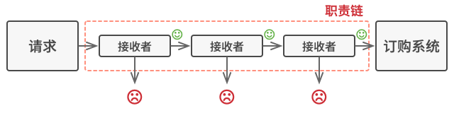

# Chain of Responsibility. 责任链模式

**责任链模式**是一种行为设计模式， 允许你将请求沿着处理者链进行发送。 收到请求后，每个处理者均可对请求进行处理，或将其传递给链上的下个处理者。


## 场景模拟

假如你正在开发一个在线订购系统。你希望对系统访问进行限制，允许认证用户创建订单。 此外， 拥有管理权限的用户也拥有所有订单的完全访问权限。

简单规划后， 你会意识到这些检查必须依次进行。只要接收到**包含用户凭据的请求**，应用程序就可尝试对进入系统的用户进行认证。但如果由于用户凭据不正确而导致认证失败，那就没有必要进行后续检查了。


在接下来的几个月里， 你完善了后续的几个检查步骤：

+ 一位同事认为直接将原始数据传递给订购系统存在安全隐患。 因此你新增了额外的验证步骤来加解密请求中的数据。
+ 过了一段时间， 有人注意到系统无法抵御暴力密码破解方式的攻击。 为了防范这种情况，你立刻添加了一个检查步骤来过滤来自同一 `IP` 地址的重复错误请求。
+ 又有人提议你可以对包含同样数据的重复请求返回缓存中的结果， 从而提高系统响应速度。 因此， 你新增了一个检查步骤， 确保只有没有满足条件的缓存结果时请求才能通过并被发送给系统。


如果我们不采用特定的某种模式来扩展我们的访问校验代码，将代码都写在一个模块中，每次新增功能都会使其更加臃肿。修改某个检查步骤有时会影响其他的检查步骤。

最糟糕的是，当你希望复用其中的部分校验过程来保护其他系统组件时，你只能复制部分代码， 因为这些组件只需部分而非全部的校验步骤。

系统会变得让人非常费解， 而且其维护成本也会激增。 你在艰难地和这些代码共处一段时间后， 有一天终于决定对整个系统进行重构。

## 解决方案

与许多其他行为设计模式一样，**责任链**会将特定行为转换为被称作*处理者(`handler`)*的独立对象/函数。在上述示例中， 每个检查步骤都可被抽取为仅有单个方法的类， 并执行检查操作。 请求及其数据则会被作为参数传递给该方法。

责任链模式建议你将这些处理者连成一条链。 链上的每个处理者都有一个成员变量来保存对于下一处理者的引用。 除了处理请求外， 处理者还负责沿着链传递请求。 请求会在链上移动， 直至所有处理者都有机会对其进行处理。

此外处理者可以决定不再沿着链传递请求， 这可高效地取消所有后续处理步骤。



不过还有一种稍微不同的方式 （也是更经典一种）， 那就是处理者接收到请求后自行决定是否能够对其进行处理。 如果自己能够处理， 处理者就不再继续传递请求。 因此在这种情况下， 每个请求要么最多有一个处理者对其进行处理， 要么没有任何处理者对其进行处理。 在处理图形用户界面元素栈中的事件时， 这种方式非常常见。

例如， 当用户点击按钮时， 按钮产生的事件将沿着 GUI 元素链进行传递， 最开始是按钮的容器 （如窗体或面板）， 直至应用程序主窗口。 链上第一个能处理该事件的元素会对其进行处理。 此外， 该例还有另一个值得我们关注的地方： 它表明我们总能从对象树中抽取出链来。


## 责任链模式结构


#### Handler 处理者

声明了所有具体处理者的通用接口。 该接口通常仅包含单个请求处理方法签名，以及一个在链条上设置下个处理者的方法。

```ts
interface Request {}

interface Handler {
    setNext(h: Handler): void;
    handle(request: Request): void;
}
```

#### Base Handler 基础处理者

处理者是一个可选的类， 你可以将所有处理者共用的样本代码放置在其中。

通常情况下， 该类中定义了一个保存对于下个处理者引用的成员变量。 客户端可通过将处理者传递给上个处理者的构造函数或设定方法来创建链。 **该类还可以实现默认的处理行为： 确定下个处理者存在后再将请求传递给它**。

```ts
abstract class BaseHandler {
    next: Handler | null;
		constructor() {
        this.next = null;
    }
    setNext(next: Handler) {
        this.next = next;
    }
    handle(request: Request) {
        if (this.next) {
            this.next.handle(request);
        }
    }
}
```

#### Concrete Handlers 具体处理者

包含处理请求的实际代码。 每个处理者接收到请求后， 都必须决定是否进行处理， 以及是否沿着链传递请求。注意如果不能处理其实调用的是 `BaseHandler` 的代码。

处理者通常是独立且不可变的， 需要通过构造函数一次性地获得所有必要地数据。

```ts
class ConcreteHandler extends BaseHandler {
    handle(request: Request) {
        if (canHandle(request)) {
						// do something with this request;
        } else {
          	super.handle(request);
        }
    }
}
```

## 总结

现在我们知道责任链模式的大概了，让我们看看责任链模式适合的应用场景：

**1. 当程序需要使用不同方式处理不同种类请求， 而且请求类型和顺序预先未知时， 可以使用责任链模式。**

 该模式能将多个处理者连接成一条链。 接收到请求后， 它会 “询问” 每个处理者是否能够对其进行处理。 这样所有处理者都有机会来处理请求。

比如说服务端处理 `http` 请求通常采用的就是这种形式，多个处理者也被称为中间件。

**2.当必须按顺序执行多个处理者时， 可以使用该模式。**

 无论你以何种顺序将处理者连接成一条链， 所有请求都会严格按照顺序通过链上的处理者。

**3. 如果所需处理者及其顺序必须在运行时进行改变， 可以使用责任链模式。**

 如果在处理者类中有对引用成员变量的设定方法， 你将能动态地插入和移除处理者， 或者改变其顺序。

----

再来看看该模式的优缺点：

**优点**

+ 你可以控制请求处理的顺序。
+ **单一职责原则：**你可对发起操作和执行操作的类进行解耦。
+ **开闭原则：**你可以在不更改现有代码的情况下在程序中新增处理者。

**缺点**

+ 部分请求可能未被处理。

## Mini Mode(Object factory)

> **[小贴士：]()**什么是 `Object Mode`？前面的章节我详细探讨了`javascript` 的编程风格，在 `javascript` 中我们可以直接创建对象，所以严格遵循基于类模式下面向对象设计模式会让原本灵活的代码变得很臃肿。
>
> 所以我提供了  `Mini Mode` 来实现符合 `javascript` 语法风格的设计模式。

```ts
// type Context = Record<string, any>;

function JwtHandler(ctx: Context) {
    ctx.uid = 1;
    console.log('jwt authorization success');
    ctx.next();
}

function PassiveHandler(ctx: Context) {
    if (!ctx.uid) {
        return;
    }
    console.log('passive success');
    ctx.next();
}

class App {
    private ctx: Context = new Context();
    use(handler: Handler) {
        this.ctx.use(handler);
        return this;
    }

    init() {
        this.ctx.next();
    }
}

type Handler = (ctx: Context) => void;

class Context {
    private _id = 0;
    private handlers: Handler[] = [];
    [propName: string]: any;
    next() {
        if (this._id < this.handlers.length) {
            this.handlers[this._id](this);
            this._id++;
        }
    }
    use(handler: Handler) {
        this.handlers.push(handler);
    }
}

let app = new App();

app.use(JwtHandler).use(PassiveHandler);
app.init();

```

## In Go

`Golang` 这种后台语言中，责任链模式真的是再常见不过了，一个 `http` 请求的处理可能包含多个中间件函数以及多个处理函数，这就是一种责任链模式比如说下文的路由组中我们添加了 `tls` 和 `jwt` 两个处理器。

下文中实现模式和标准实现的区别可能只在于 `go` 中间件手动调用 `next` 函数(因为 `golang` 中没有很明确的类模式) 和 责任链是通过路由组来维护的这两点上。

```ts
// main.go
func Routers() *gin.Engine {
	var Router = gin.Default()
	PrivateGroup := Router.Group("")
	PrivateGroup.Use(middleware.JWTAuth()).Use(middleware.LoadTLS())
}

// middleware.go
func LoadTls() gin.HandlerFunc {
	return func(c *gin.Context) {
		middleware := secure.New(secure.Options{
			SSLRedirect: true,
			SSLHost:     "localhost:443",
		})
		err := middleware.Process(c.Writer, c.Request)
		if err != nil {
			// 如果出现错误，请不要继续
			fmt.Println(err)
			return
		}
		// 继续往下处理
		c.Next()
	}
}

func JWTAuth() gin.HandlerFunc {
	return func(c *gin.Context) {
    // do jwt token authorization!
    c.Next()
  }
}
```

我们直接看一下 `gin Context` 的实现，其中 `Next()` 方法就是主要的执行方法，这里其实就是我们最上面说到的职责链模式的变体，因为它会在每一个处理函数中进行处理，而不是第一个接收到就停止了

```go
type Context struct {
    // ...

    // handlers 是一个包含执行函数的数组
    // type HandlersChain []HandlerFunc
	handlers HandlersChain
    // index 表示当前执行到哪个位置了
	index    int8

    // ...
}

// Next 会按照顺序将一个个中间件执行完毕
// 并且 Next 也可以在中间件中进行调用，达到请求前以及请求后的处理
// Next should be used only inside middleware.
// It executes the pending handlers in the chain inside the calling handler.
// See example in GitHub.
func (c *Context) Next() {
	c.index++
	for c.index < int8(len(c.handlers)) {
		c.handlers[c.index](c)
		c.index++
	}
}
```

## In Typescript

**使用示例：** 责任链模式在 `TypeScript` 程序中并不常见， 因为它仅在代码与对象链打交道时才能发挥作用。

**识别方法：** 该模式可通过一组对象的行为方法间接调用其他对象的相同方法来识别， 而且所有对象都会遵循相同的接口。

```ts
/**
 * The Handler interface declares a method for building the chain of handlers.
 * It also declares a method for executing a request.
 */
interface Handler {
    setNext(handler: Handler): Handler;

    handle(request: string): string;
}

/**
 * The default chaining behavior can be implemented inside a base handler class.
 */
abstract class AbstractHandler implements Handler
{
    private nextHandler: Handler;

    public setNext(handler: Handler): Handler {
        this.nextHandler = handler;
        // Returning a handler from here will let us link handlers in a
        // convenient way like this:
        // monkey.setNext(squirrel).setNext(dog);
        return handler;
    }

    public handle(request: string): string {
        if (this.nextHandler) {
            return this.nextHandler.handle(request);
        }

        return null;
    }
}

/**
 * All Concrete Handlers either handle a request or pass it to the next handler
 * in the chain.
 */
class MonkeyHandler extends AbstractHandler {
    public handle(request: string): string {
        if (request === 'Banana') {
            return `Monkey: I'll eat the ${request}.`;
        }
        return super.handle(request);

    }
}

class SquirrelHandler extends AbstractHandler {
    public handle(request: string): string {
        if (request === 'Nut') {
            return `Squirrel: I'll eat the ${request}.`;
        }
        return super.handle(request);
    }
}

class DogHandler extends AbstractHandler {
    public handle(request: string): string {
        if (request === 'MeatBall') {
            return `Dog: I'll eat the ${request}.`;
        }
        return super.handle(request);
    }
}

/**
 * The client code is usually suited to work with a single handler. In most
 * cases, it is not even aware that the handler is part of a chain.
 */
function clientCode(handler: Handler) {
    const foods = ['Nut', 'Banana', 'Cup of coffee'];

    for (const food of foods) {
        console.log(`Client: Who wants a ${food}?`);

        const result = handler.handle(food);
        if (result) {
            console.log(`  ${result}`);
        } else {
            console.log(`  ${food} was left untouched.`);
        }
    }
}

/**
 * The other part of the client code constructs the actual chain.
 */
const monkey = new MonkeyHandler();
const squirrel = new SquirrelHandler();
const dog = new DogHandler();

monkey.setNext(squirrel).setNext(dog);

/**
 * The client should be able to send a request to any handler, not just the
 * first one in the chain.
 */
console.log('Chain: Monkey > Squirrel > Dog\n');
clientCode(monkey);
console.log('');

console.log('Subchain: Squirrel > Dog\n');
clientCode(squirrel);
```

