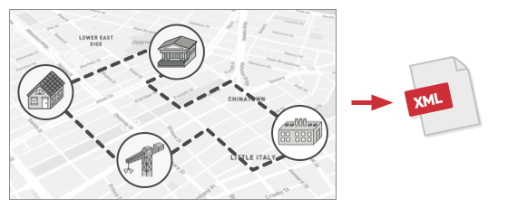
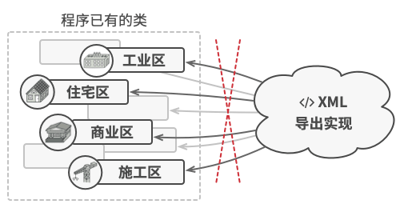

# Visitor. 访问者模式

**访问者**是一种行为设计模式， 允许你在**不修改类已有代码**的情况下**向已有类层次结构中增加新的行为**。

## 场景模拟

假如你的团队开发了一款地图应用程序。 地图中的每个节点既能代表大型对象实体(例如一个国家、一座城市)，也能代表更精细的对象(例如工业区和旅游景点等)，这就形成了一个典型的树形结构。

如果节点代表的真实对象之间存在路径，那么这些节点就会相互连接。 

在程序内部，每个节点的类型都由其所属的类来表示，每个特定的节点则是一个对象。



一段时间后，将地图信息导出为 `xml` 的任务(前面说了这是一个典型的树结构)。这个工作最初看上去非常简单。你计划为每个节点类添加导出函数， 然后递归执行图像中每个节点的导出函数。

但你不太走运， 系统架构师拒绝批准对已有节点类进行修改。 他认为这些代码已经是产品了， 不想冒险对其进行修改， 因为修改可能会引入潜在的缺陷。



此外， 他还质疑在节点类中包含导出 XML 文件的代码是否有意义。 这些类的主要工作是处理地理数据。 导出 XML 文件的代码放在这里并不合适。

## 解决方案

访问者模式建议将**新行为(导出xml)**放入一个名为**访问者(ConcreteVisitor)**的独立类中， 而不是试图将其整合到已有类中。 现在， 需要执行**操作的原始对象**将**作为参数被传递给访问者中的方法**， 让方法能访问对象所包含的一切必要数据。

```ts
class ExportVisitor implements Visitor is
    method doForCity(City c) { ... }
    method doForIndustry(Industry f) { ... }
    method doForSightSeeing(SightSeeing ss) { ... }
    // ...
```

然后我们使用独立的访问引擎遍历复杂对象结构来调用这些方法，问题就在于引擎如何调用这些方法，这些方法的签名各不相同。第一种解决方案就是对节点所属类进行类型检查：

为了可以挑选出能够处理特定对象的访问者方法， 我们需要对它的类进行检查。这种代码写起来其实有些麻烦：

```ts
// Visitor Engine
foreach (Node node in graph)
    if (node instanceof City)
        exportVisitor.doForCity((City) node)
    if (node instanceof Industry)
        exportVisitor.doForIndustry((Industry) node)
    // ...
}
```

所以访问者模式为了解决这个问题，使用了一种名为[双分派](https://refactoringguru.cn/design-patterns/visitor-double-dispatch)的技巧，不使用累赘的条件语句也可下执行正确的方法。与其让客户端来选择调用正确版本的方法， 不如将选择权委派给作为参数传递给访问者的对象。

```ts
// Visitor Engine
foreach (Node node in graph)
    node.accept(exportVisitor)

// 城市
class City
    method accept(Visitor v) is
        v.doForCity(this)
    // ...

// 工业区
class Industry
    method accept(Visitor v) is
        v.doForIndustry(this)
    // ...
```

我承认最终还是修改了节点类， 但毕竟改动很小， 且使得我们能够在后续进一步添加行为时无需再次修改代码。

## 访问者模式结构


#### Visitor 访问者

接口声明了一系列以对象结构的具体元素为参数的访问者方法。如果编程语言支持重载，这些方法的名称可以是相同的，但是其参数一定是不同的。

#### Concrete Visitor 具体访问者

会为不同的具体元素类实现相同行为的几个不同版本。

#### Element 元素

 元素接口声明了一个方法来 “接收” 访问者。 该方法必须有一个参数被声明为访问者接口类型。

#### Concrete Element 具体元素

具体元素必须实现接收方法。 该方法的目的是根据当前元素类将其调用重定向到相应访问者的方法。 请注意， 即使元素基类实现了该方法， 所有子类都必须对其进行重写并调用访问者对象中的合适方法。

#### VisitorEngine 访问引擎 | Client 客户端

通常会作为集合或其他复杂对象 （例如一个[组合](https://refactoringguru.cn/design-patterns/composite)树） 的代表。客户端通常不知晓所有的具体元素类，因为它们会通过抽象接口(`Node`)与集合中的对象进行交互。

`Client` 是我们使用 `visitor` 主动复杂对象访问结构的地方，有的时候 `Client`也被称为 `VisitorEngine`。

## 总结

现在我们知道访问者模式的大概了，让我们看看访问者模式适合的应用场景：

**1.如果你需要对一个复杂对象结构 （例如对象树） 中的所有元素执行某些操作，可使用访问者模式。**

访问者模式通过在访问者对象中为多个目标类提供相同操作的变体， 让你能在属于不同类的一组对象上执行同一操作。

> 遍历对象的过程是迭代器模式，不暴露对象内部的具体结构。

**2.当某个行为仅在类层次结构中的一些类中有意义， 而在其他类中没有意义时， 可使用该模式。**

你可将该行为抽取到单独的访问者类中， 只需实现接收相关类的对象作为参数的访问者方法并将其他方法留空即可。

----

再来看看该模式的优缺点：

+ **开闭原则：**你可以引入在不同类对象上执行的新行为， 且无需对这些类做出修改。
+ **单一职责原则：**可将同一行为的不同版本移到同一个类中。
+  访问者对象可以在与各种对象交互时收集一些有用的信息。 当你想要遍历一些复杂的对象结构 （例如对象树）， 并在结构中的每个对象上应用访问者时， 这些信息可能会有所帮助。

缺点：

+ 每次在元素层次结构中添加或移除一个类时， 你都要更新所有的访问者。
+  在访问者同某个元素进行交互时， 它们可能没有访问元素私有成员变量和方法的必要权限。

## Mini Mode(Object factory)

> **[小贴士：]()**什么是 `Object Mode`？前面的章节我详细探讨了`javascript` 的编程风格，在 `javascript` 中我们可以直接创建对象，所以严格遵循基于类模式下面向对象设计模式会让原本灵活的代码变得很臃肿。
>
> 所以我提供了  `Mini Mode` 来实现符合 `javascript` 语法风格的设计模式。

如果说访问的数据结构比较单一，我们可能就不需要双分派这个技巧，`Visitor`类也可以缩小成一个函数：

```ts
interface Pokemon {
  id: string;
  attack: number;
  defense: number;
}
function createInMemoryPokemonDatebase() {
    let pokemons: Record<string, Pokemon> = {};

    return {
      visit(visitor: (item: Pokemon) => void): void {
        Object.values(pokemons).forEach((item) => visitor(item));
      },
    }
}


```

## In Typescript

`typescript` 用到访问者模式的地方其实不多，不过比较著名的编译库 `babel` 在插件对 `AST` 树的访问过程中就使用了访问者模式：

```ts
/**
 * The Component interface declares an `accept` method that should take the base
 * visitor interface as an argument.
 */
interface Component {
    accept(visitor: Visitor): void;
}

/**
 * Each Concrete Component must implement the `accept` method in such a way that
 * it calls the visitor's method corresponding to the component's class.
 */
class ConcreteComponent implements Component {
    /**
     * Note that we're calling `visitConcreteComponentA`, which matches the
     * current class name. This way we let the visitor know the class of the
     * component it works with.
     */
    public accept(visitor: Visitor): void {
        visitor.visitConcreteComponentA(this);
    }

    /**
     * Concrete Components may have special methods that don't exist in their
     * base class or interface. The Visitor is still able to use these methods
     * since it's aware of the component's concrete class.
     */
    public exclusiveMethodOfConcreteComponentA(): string {
        return 'A';
    }
}

/**
 * The Visitor Interface declares a set of visiting methods that correspond to
 * component classes. The signature of a visiting method allows the visitor to
 * identify the exact class of the component that it's dealing with.
 */
interface Visitor {
    visitConcreteComponentA(element: ConcreteComponentA): void;

    visitConcreteComponentB(element: ConcreteComponentB): void;
}

/**
 * Concrete Visitors implement several versions of the same algorithm, which can
 * work with all concrete component classes.
 *
 * You can experience the biggest benefit of the Visitor pattern when using it
 * with a complex object structure, such as a Composite tree. In this case, it
 * might be helpful to store some intermediate state of the algorithm while
 * executing visitor's methods over various objects of the structure.
 */
class ConcreteVisitor1 implements Visitor {
    public visitConcreteComponentA(element: ConcreteComponentA): void {
        console.log(`${element.exclusiveMethodOfConcreteComponentA()} + ConcreteVisitor1`);
    }

    public visitConcreteComponentB(element: ConcreteComponentB): void {
        console.log(`${element.specialMethodOfConcreteComponentB()} + ConcreteVisitor1`);
    }
}

class ConcreteVisitor2 implements Visitor {
    public visitConcreteComponentA(element: ConcreteComponentA): void {
        console.log(`${element.exclusiveMethodOfConcreteComponentA()} + ConcreteVisitor2`);
    }

    public visitConcreteComponentB(element: ConcreteComponentB): void {
        console.log(`${element.specialMethodOfConcreteComponentB()} + ConcreteVisitor2`);
    }
}

/**
 * The client code can run visitor operations over any set of elements without
 * figuring out their concrete classes. The accept operation directs a call to
 * the appropriate operation in the visitor object.
 */
function visitAllComponent(components: Component[], visitor: Visitor) {
    // ...
    for (const component of components) {
        component.accept(visitor);
    }
    // ...
}

const components = [new ConcreteComponentA(), new ConcreteComponentB(),];

console.log('The client code works with all visitors via the base Visitor interface:');
const visitor1 = new ConcreteVisitor1();
visitAllComponent(components, visitor1);
```

