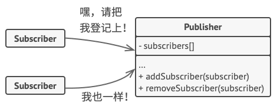

# Observer. 观察者模式

**亦称：** 事件订阅者、监听者、Event-Subscriber、Listener、Observer

**观察者模式**是一种行为设计模式， 允许你定义一种订阅机制， 可在对象事件发生时通知多个 “观察” 该对象的其他对象。


## 场景模拟

假如你有两种类型的对象：  `顾客`和 `商店` 。 顾客对某个特定品牌的产品非常感兴趣 （例如最新型号的 iPhone 手机）， 而该产品很快将会在商店里出售。

顾客可以每天来商店看看产品是否到货。 但如果商品尚未到货时， 绝大多数来到商店的顾客都会空手而归。


另一方面， 每次新产品到货时， 商店可以向所有顾客发送邮件 （可能会被视为垃圾邮件）。 这样， 部分顾客就无需反复前往商店了， 但也可能会惹恼对新产品没有兴趣的其他顾客。

我们似乎遇到了一个矛盾： 要么让顾客浪费时间检查产品是否到货， 要么让商店浪费资源去通知没有需求的顾客。)

## 解决方案

拥有一些值得关注的状态的对象通常被称为目标， 由于它要将自身的状态改变通知给其他对象， 我们也将其称为发布者 （`publisher`）。 所有希望关注发布者状态变化的其他对象被称为订阅者 （`subscribers`）。

观察者模式建议你为发布者类添加订阅机制， 让每个对象都能订阅或取消订阅发布者事件流。



所有订阅者都必须实现同样的接口， 发布者仅通过该接口与订阅者交互。 接口中必须声明通知方法及其参数， 这样发布者在发出通知时还能传递一些上下文数据。


## 观察者模式结构


**发布者 `Publisher`：**  会向其他对象发送值得关注的事件。事件会在发布者自身状态改变或执行特定行为后发生。发布者中包含一个允许新订阅者加入和当前订阅者离开列表的订阅构架。

+ 当新事件发生时， 发送者会遍历订阅列表并调用每个订阅者对象的通知方法。 该方法是在订阅者接口中声明的。

**订阅者 `Subscriber`：**  接口声明了通知接口。 在绝大多数情况下， 该接口仅包含一个 `update`更新方法。 该方法可以拥有多个参数， 使发布者能在更新时传递事件的详细信息。

**具体订阅者 `Concrete Subscribers`：**  可以执行一些操作来回应发布者的通知。 所有具体订阅者类都实现了同样的接口， 因此发布者不需要与具体类相耦合。

+ 订阅者通常需要一些上下文信息来正确地处理更新。 因此， 发布者通常会将一些上下文数据作为通知方法的参数进行传递。 发布者也可将自身作为参数进行传递c， 使订阅者直接获取所需的数据。

## 总结

**1.当一个对象状态的改变需要改变其他对象，可使用观察者模式。**

当你使用图形用户界面类时通常会遇到一个问题。 比如， 你创建了自定义按钮类并允许客户端在按钮中注入自定义代码， 这样当用户按下按钮时就会触发这些代码。

观察者模式允许任何实现了订阅者接口的对象订阅发布者对象的事件通知。 你可在按钮中添加订阅机制， 允许客户端通过自定义订阅类注入自定义代码。

**2.当应用中的一些对象必须观察其他对象时， 可使用该模式。**

------

**优点**

+ **开闭原则**，你无需修改发布者代码就能引入新的订阅者类 （如果是发布者接口则可轻松引入发布者类）。
+ 你可以在运行时建立对象之间的联系。

**缺点**

+ 订阅者的通知顺序是随机的。

## Mini Mode(Object factory)

> **[小贴士：]()**什么是 `Object Mode`？前面的章节我详细探讨了`javascript` 的编程风格，在 `javascript` 中我们可以直接创建对象，所以严格遵循基于类模式下面向对象设计模式会让原本灵活的代码变得很臃肿。
>
> 所以我提供了  `Mini Mode` 来实现符合 `javascript` 语法风格的设计模式。

观察者的代码其实可以写的很性感，首先将观察者的代码独立出来：

```ts
export interface Observer<E> {
    publish(e: E): void;
    subscribe(listener: Listener<E>): () => void;
}

export type Listener<EventType> = (e: EventType) => void;
export default function createObserver<EventType>(): Observer<EventType> {
    let listeners: Listener<EventType>[] = [];
    return {
        publish(e: EventType) {
            for (let listener of listeners) {
                listener(e);
            }
        },
        subscribe(listener: Listener<EventType>): () => void {
            listeners.push(listener);
            return () => listeners.filter((ls) => ls === listener);
        },
    };
}
```

之后通过组合的形式使用观察者的功能：

```ts
function createInMemoryPokemonDatebase(): DataBase<Pokemon> {
  const pokemons: Record<string, Pokemon> = {};
  const preUpdateObserver: Observer<BeforeUpdateEvent<Pokemon>> =
        createObserver();

  return {
    set(record: Pokemon): void {
      preUpdateObserver.publish({
        oldValue: pokemons[record.id],
        newValue: record,
      });
      pokemons[record.id] = record;
    },
    onBeforeUpdate(listener: Listener<BeforeUpdateEvent<Pokemon>>): () => void {
      return preUpdateObserver.subscribe(listener);
    },
  };
}
```

### redux

回忆一下 `redux` 中，我们如何订阅和发布 `store` 更新，首先我们通过 `store.subscribe` 订阅 `store` 内的状态变化，通过回调函数的形式在订阅更新的时候拉取 `state`。而发布订阅则是通过 `store.dispatch` 注入设置的 `action`。

```ts
class TodoController extends React.Component {
    constructor(props) {
        super(props);
        this.state = store.getState();
        store.subscribe(() => this.setState(store.getState()));
    }
    handleAdd(e) {
        e.preventDefault();
        const action = addTodoItemAction();
        store.dispatch(action);
    }
}
```

那么 `redux` 内部是怎么实现这个过程的呢？

首先 `dispatch` 函数很简单，就是在更新触发之后调用所有的 `listener`：

```ts
export default function createStore(reducer, preloadedState, enhancer) {
  let isDispatching = false
  let currentReducer = reducer
  let currentState = preloadedState as S
  let currentListeners: (() => void)[] | null = []
  let nextListeners = currentListeners
  
  function dispatch(action: A) {
    // ...
		if (isDispatching) {
      throw new Error('Reducers may not dispatch actions.')
    }

    try {
      isDispatching = true
      currentState = currentReducer(currentState, action)
    } finally {
      isDispatching = false
    }

    const listeners = (currentListeners = nextListeners)
    for (let i = 0; i < listeners.length; i++) {
      const listener = listeners[i]
      listener()
    }

    return action
  }
}
```

而 `subscribe` 则是通过闭包来操作一个订阅数组，在 `javascript` 里抛开笨重的类可以使用闭包这种轻巧性感的实现：

```ts
export default function createStore(reducer, preloadedState, enhancer) {
  let currentListeners: (() => void)[] | null = []
  let nextListeners = currentListeners
  let isDispatching = false
  
	function subscribe(listener: () => void) {
    // 参数判断
    if (typeof listener !== 'function') {
      throw new Error('Expected the listener to be a function.')
    }
		// 检测 dispatch 状态，如果正在 dispatch 的状态中则不能添加订阅
    if (isDispatching) {
      throw new Error(/** long error msg */)
    }
    ensureCanMutateNextListeners()
    // 两个队列
    nextListeners.push(listener)
		// 开启订阅
    let isSubscribed = true
    return function unsubscribe() {
      if (!isSubscribed) return
      if (isDispatching) throw new Error(/** long error msg */)

      isSubscribed = false
      ensureCanMutateNextListeners()
      const index = nextListeners.indexOf(listener)
      nextListeners.splice(index, 1)
      currentListeners = null
    }
  }
}
```

## In Typescript

观察者模式在 `TypeScript` 代码中很常见， 特别是在 `GUI` 组件中。 它提供了在不与其他对象所属类耦合的情况下对其事件做出反应的方式。

**Subject.ts**

```ts
/**
 * The Subject interface declares a set of methods for managing subscribers.
 */
interface Subject {
    // Attach an observer to the subject.
    attach(observer: Observer): void;

    // Detach an observer from the subject.
    detach(observer: Observer): void;

    // Notify all observers about an event.
    notify(): void;
}

class ConcreteSubject implements Subject {
    /**
     * @type {number} For the sake of simplicity, the Subject's state, essential
     * to all subscribers, is stored in this variable.
     */
    public state: number;

    /**
     * @type {Observer[]} List of subscribers. In real life, the list of
     * subscribers can be stored more comprehensively (categorized by event
     * type, etc.).
     */
    private observers: Observer[] = [];

    /**
     * The subscription management methods.
     */
    public attach(observer: Observer): void {
        const isExist = this.observers.includes(observer);
        if (isExist) {
            return console.log('Subject: Observer has been attached already.');
        }

        console.log('Subject: Attached an observer.');
        this.observers.push(observer);
    }

    public detach(observer: Observer): void {
        const observerIndex = this.observers.indexOf(observer);
        if (observerIndex === -1) {
            return console.log('Subject: Nonexistent observer.');
        }

        this.observers.splice(observerIndex, 1);
        console.log('Subject: Detached an observer.');
    }

    /**
     * Trigger an update in each subscriber.
     */
    public notify(): void {
        console.log('Subject: Notifying observers...');
        for (const observer of this.observers) {
            observer.update(this);
        }
    }

    /**
     * Usually, the subscription logic is only a fraction of what a Subject can
     * really do. Subjects commonly hold some important business logic, that
     * triggers a notification method whenever something important is about to
     * happen (or after it).
     */
    public someBusinessLogic(): void {
        console.log('\nSubject: I\'m doing something important.');
        this.state = Math.floor(Math.random() * (10 + 1));

        console.log(`Subject: My state has just changed to: ${this.state}`);
        this.notify();
    }
}
```

**Observer.ts**

```ts
interface Observer {
    // Receive update from subject.
    update(subject: Subject): void;
}

/**
 * Concrete Observers react to the updates issued by the Subject they had been
 * attached to.
 */
class ConcreteObserverA implements Observer {
    public update(subject: Subject): void {
        if (subject instanceof ConcreteSubject && subject.state < 3) {
            console.log('ConcreteObserverA: Reacted to the event.');
        }
    }
}

class ConcreteObserverB implements Observer {
    public update(subject: Subject): void {
        if (subject instanceof ConcreteSubject && (subject.state === 0 || subject.state >= 2)) {
            console.log('ConcreteObserverB: Reacted to the event.');
        }
    }
}
```
