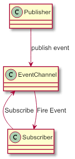
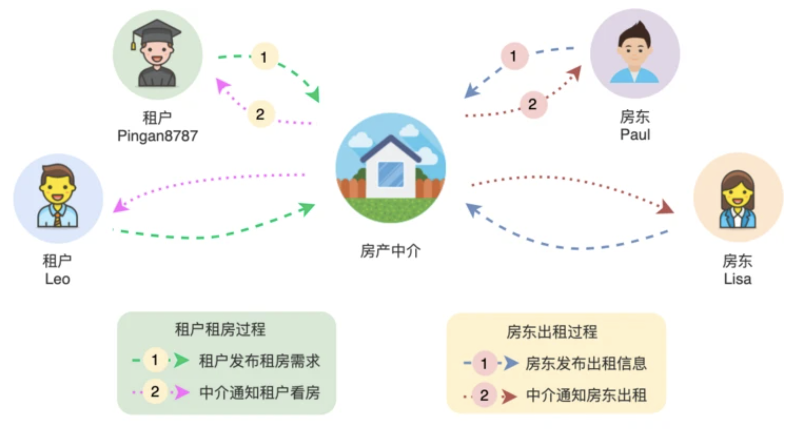
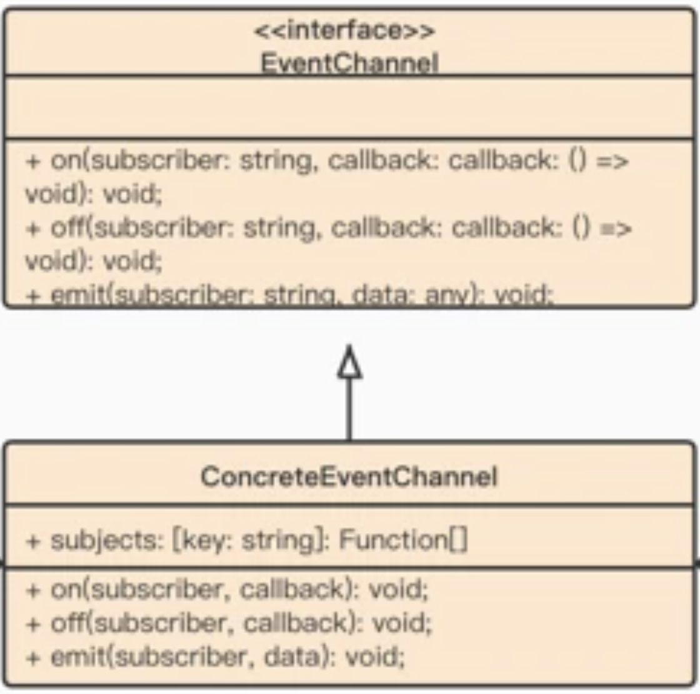
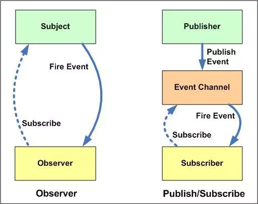

# Publisher - Subscriber. 发布-订阅模式

发布订阅模式相当于是观察者模式的变体，发布订阅模式和观察者模式类似是一种对象间一对多的依赖关系，当一个对象的状态改变时，所有依赖于它的对象都将得到状态改变的通知。



订阅者`Subscriber`把自己想订阅的事件注册`Subscribe`到调度中心`Event Channel`，当发布者`Publisher`发布该事件`Publish Event`到调度中心，也就是该事件触发时，调度中心统一调度（Fire Event）订阅者注册到调度中心的处理代码。

## 场景模拟

最近刚毕业的学生 `Leo` 准备开始租房了，他来到房产中介，跟中介描述了自己的租房需求，开开心心回家了。第二天，中介的小哥哥小姐姐为 `Leo` 列出符他需求的房间，并打电话约他一起看房了，最后 `Leo` 选中一套满意的房间，高高兴兴过去签合同，准备开始新生活 ~

还有个大佬 `Paul`，准备将手中 `10` 套房出租出去，于是他来到房产中介，在中介那边提供了自己要出租的房间信息，沟通好手续费，开开心心回家了。第二天，`Paul` 接到中介的好消息，房子租出去了，于是他高高兴兴过去签合同，开始收房租了 ~



上面场景有个需要特别注意的地方：

+ 租户在租房过程中，不知道房间具体房东是谁，到后面签合同才知道；
+ 房东在出租过程中，不知道房间具体租户是谁，到后面签合同才知道；

这两点其实就是后面要介绍的 **发布-订阅模式** 的一个核心特点。

## 发布-订阅模式结构图



**事件通道接口 `EventChannel`：**通常就三个内容，添加/删除/触发事件回调。

**事件通道实现者 `ConcreteEventChannel`：**这确实没什么好说的。

你可能会问为什么没有发布者和订阅者，这是因为在订阅发布模型里，发布者或者订阅者的身份已经被弱化。发布者可以在任何时候发布事件，而订阅者可能只是一个回调函数。而最关键的事件总线部分，则是发布订阅模型的核心。

我们通常通过组合的方式让事件通道的实例成为类的一个成员，或者全局共享一个事件通道实例。

## Mini Mode(Object factory)

> **[小贴士：]()**什么是 `Object Mode`？前面的章节我详细探讨了`javascript` 的编程风格，在 `javascript` 中我们可以直接创建对象，所以严格遵循基于类模式下面向对象设计模式会让原本灵活的代码变得很臃肿。
>
> 所以我提供了  `Mini Mode` 来实现符合 `javascript` 语法风格的设计模式。

注意我在最后暴露了一个实例，我们在项目里不同的地方`import`它，都会指向同一个`Event Channel`实例，这样的话就可以起到一个事件总线的作用了。它不在乎谁来监听，谁来发布。只要有人监听了，就把它放进监听队列中。只要有人发布了事件，就从相应的监听队列中触发回调。

```ts
type EventHandler = (...args: any[]) => void;
interface EventChannel {
    on(event: string, callback: EventHandler): void;
    once(event: string, callback: EventHandler): void;
    off(event: string, callback: EventHandler): void;
    emit(event: string, ...args: any[]): void;
}

class ConcreteEventChannel implements EventChannel {
    private subjects: Record<string, EventHandler[]>;
    constructor() {
        this.subjects = {};
    }

    on(event: string, callback: EventHandler) {
        (this.subjects[event] || (this.subjects[event] = [])).push(callback);
    }

    once(event: string, callback: EventHandler) {
        let onceHandler = (...args: any[]) => {
            this.off(event, onceHandler);
            callback(...args);
        };
        this.on(event, onceHandler);
    }

    emit(event: string, ...args: any[]) {
        let cbs = this.subjects[event];
        if (!cbs) {
            return;
        }
        for (let cb of cbs) {
            cb(...args);
        }
    }

    off(event: string, callback?: EventHandler) {
        let cbs = this.subjects[event];
        if (!cbs) {
            return false;
        }
        if (!callback) {
            cbs.length = 0;
        } else {
            for (let i = 0; i < cbs.length; i++) {
                if (cbs[i] === callback) {
                    cbs.splice(i, 1);
                    break;
                }
            }
        }
    }
}

export new ConcreteEventChannel();
```

## 发布-订阅模式与观察者模式的区别

很多地方都说发布-订阅模式是观察者模式的别名，但是他们真的一样吗？是不一样的。直接上图：



**观察者模式：**观察者（`Observer`）直接订阅（`Subscribe`）主题（`Subject`），而当主题被激活的时候，会触发（`Fire Event`）观察者里的事件。

**发布订阅模式：**订阅者（`Subscriber`）把自己想订阅的事件注册（`Subscribe`）到调度中心（`Event Channel`），当发布者（`Publisher`）发布该事件（`Publish Event`）到调度中心，也就是该事件触发时，由调度中心统一调度（`Fire Event`）订阅者注册到调度中心的处理代码。

#### 差异：

- 在观察者模式中，观察者是知道 `Subject` 的，`Subject` 一直保持对观察者进行记录。然而，在发布订阅模式中，发布者和订阅者不知道对方的存在。它们只有通过消息代理进行通信。
- 在发布订阅模式中，组件是松散耦合的，正好和观察者模式相反。
- 观察者模式大多数时候是同步的，比如当事件触发，`Subject` 就会去调用观察者的方法。而发布-订阅模式大多数时候是异步的（使用消息队列）。
- 观察者模式需要在单个应用程序地址空间中实现，而发布-订阅更像交叉应用模式。

## 总结

在以下情况下可以考虑使用此模式：

**1.应用程序需要向大量消费者广播信息。例如微信订阅号就是一个消费者量庞大的广播平台。**

**2.应用程序需要与一个或多个独立开发的应用程序或服务通信，这些应用程序或服务可能使用不同的平台、编程语言和通信协议。**

**3.应用程序可以向消费者发送信息，而不需要消费者的实时响应。**

----

**优点**

+ **松耦合 `Independence`：**

  发布-订阅模式可以将众多需要通信的子系统(`Subsystem`)解耦，每个子系统独立管理。而且即使部分子系统取消订阅，也不会影响事件总线的整体管理。

  发布-订阅模式中每个应用程序都可以专注于其核心功能，而事件总线负责将消息路由到每个订阅者手里。

+ **灵活性 `Flexibility`：**

  你不需要关心不同的组件是如何组合在一起的，只要他们共同遵守一份协议即可。

**缺点**

+ 在创建订阅者本身会消耗内存，但当订阅消息后，没有进行发布，而订阅者会一直保存在内存中，占用内存；
+ 创建订阅者需要消耗一定的时间和内存。如果过度使用的话，反而使代码不好理解及代码不好维护。

